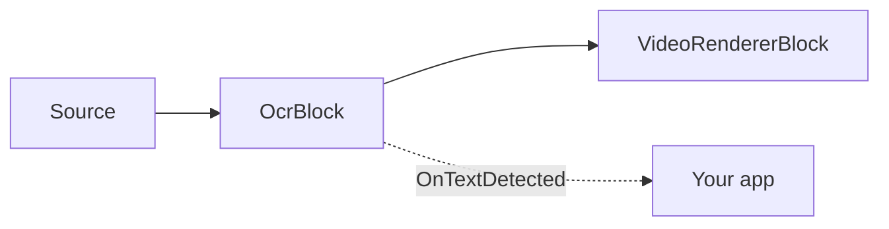

# OCR Text Recognition — OcrBlock

`OcrBlock` recognizes text in any video or image source. Internally it runs the multi-stage PP-OCR
pipeline — text detection (DBNet) → optional 0°/180° angle classification → text-line recognition
(CRNN/SVTR + CTC decoding) — on each processed frame, raises the recognized regions, and optionally
draws them into the video. The block lives in `VisioForge.Core.AI` (`VisioForge.DotNet.Core.AI`),
implements `IVideoProcessingBlock`, and has one video `Input` and one video `Output`.



## Usage

```csharp
using VisioForge.Core.MediaBlocks;
using VisioForge.Core.MediaBlocks.AI;
using VisioForge.Core.Types.X.AI;

var ocrSettings = new OcrSettings(
    detectionModelPath: "ch_PP-OCRv5_mobile_det.onnx",
    recognitionModelPath: "latin_PP-OCRv5_rec_mobile_infer.onnx",
    characterDictionaryPath: "ppocrv5_latin_dict.txt",
    classificationModelPath: "ch_ppocr_mobile_v2.0_cls_infer.onnx")
{
    Provider = OnnxExecutionProvider.Auto, // CPU / CUDA / DirectML / CoreML
    FramesToSkip = 3,                      // run OCR every 4th frame on live video
    DrawResults = true,                    // burn boxes + text into the frame
};

var ocr = new OcrBlock(ocrSettings);
ocr.OnTextDetected += (sender, e) =>
{
    foreach (var region in e.Regions)
    {
        Console.WriteLine($"{region.Text} ({region.Confidence:P0}) at {region.BoundingBox}");
    }
};

pipeline.Connect(source.Output, ocr.Input);
pipeline.Connect(ocr.Output, videoRenderer.Input);

await pipeline.StartAsync();
```

Each `OcrTextRegion` carries the recognized `Text`, an average `Confidence` (0..1), an axis-aligned
`BoundingBox` (`Rect`), and the detection `Polygon` — the detector's four `OcrPoint` vertices
(top-left, top-right, bottom-right, bottom-left, in source-frame pixels), which may be rotated for
slanted text.

## Key settings

`OcrSettings(detectionModelPath, recognitionModelPath, characterDictionaryPath,
classificationModelPath = null)` sets `UseAngleClassifier` from whether a classification model path
was supplied.

| Property | Default | Description |
| --- | --- | --- |
| `DetectionModelPath` | — | Text-detection (DBNet) ONNX model. Required. |
| `RecognitionModelPath` | — | Text-recognition (CRNN/SVTR) ONNX model. Required. |
| `CharacterDictionaryPath` | — | Recognizer character dictionary; must match the recognition model's language. Required. |
| `ClassificationModelPath` | `null` | Optional 0°/180° angle classifier. |
| `UseAngleClassifier` | `true` | Apply the angle classifier (needs `ClassificationModelPath`). |
| `Provider` | `Auto` | ONNX execution provider. |
| `DeviceId` | `0` | Device index for hardware execution providers. |
| `FramesToSkip` | `0` | Frames skipped between OCR runs. Use a non-zero value for live video. |
| `MaxSideLength` | `1024` | Detector input's longer side is resized to this value. `0` or negative uses the adaptive PP-OCRv5 resize path instead. |
| `BoxThreshold` | `0.3` | Binarization threshold applied to the detector probability map. |
| `BoxScoreThreshold` | `0.5` | Minimum mean probability a detected region must reach to be kept. |
| `UnclipRatio` | `1.6` | Expansion ratio used to grow detected text polygons. |
| `TextScoreThreshold` | `0.5` | Minimum average per-character recognition score for a line to be reported. |
| `DrawResults` | `true` | Draw boxes + text into the frame. |
| `BoxColor` | Lime | Region box/text color when `DrawResults` is enabled. |
| `BoxThickness` | `2` | Region box stroke thickness, in pixels. |
| `LabelFontSize` | `0` | Label font size in pixels; `0` auto-scales to frame height. |

## Models and licensing

`OcrBlock` runs third-party ONNX models; the SDK does not ship weights in the NuGet package. The
demos ship the Apache-2.0 **PP-OCRv5 mobile** models (detection, angle classification, Latin
recognition) and a Latin dictionary next to the sample executables. PP-OCR supports 100+ languages —
download the matching recognition model and dictionary for other languages.

!!! note "Model licenses"
    A model's license is set by its origin (training code + published weights), not by the ONNX
    format. Verify the license of any model — code, weights, and dataset — before shipping it. The
    bundled PP-OCR models are Apache-2.0.

## Use with VideoCaptureCoreX and MediaPlayerCoreX

`OcrBlock` implements `IVideoProcessingBlock`, so it can be registered directly on `VideoCaptureCoreX`
or `MediaPlayerCoreX` instead of building a manual Media Blocks pipeline:

```csharp
var ocr = new OcrBlock(ocrSettings);
ocr.OnTextDetected += Ocr_OnTextDetected;

core.Video_Processing_AddBlock(ocr); // before StartAsync (VideoCaptureCoreX)
// player.Video_Processing_AddBlock(ocr); // before OpenAsync/PlayAsync (MediaPlayerCoreX)

await core.StartAsync();
```

See [Using AI blocks with VideoCaptureCoreX and MediaPlayerCoreX](x-engines.md) for the full
processing-block API, insertion order, and lifecycle rules shared by every video AI block.

## Use cases

- **Document and screen capture** — recognize text from scanned documents, ID cards, forms, or shared
  screens in a video conferencing pipeline.
- **Retail and warehouse automation** — read product labels, barcodes' printed text, or shelf tags from
  a fixed overhead or handheld camera.
- **Industrial inspection** — read serial numbers, batch codes, or printed labels on a production line.
- **Signage and broadcast monitoring** — verify that on-screen text (lower thirds, tickers, digital
  signage) matches expected content.
- **Accessibility tooling** — extract on-screen text for text-to-speech or translation pipelines.

For a specific, narrower case — reading vehicle license plates — use the purpose-built
[License plate recognition (ANPR)](license-plate-recognition.md) block instead of general OCR; it is
both more accurate and faster because it runs a plate-specific detector and OCR head rather than
scanning the whole frame for any text.

## Troubleshooting

| Symptom | Likely cause | Fix |
| --- | --- | --- |
| `OnTextDetected` never fires | No handler subscribed, or `FramesToSkip` combined with a very short clip | Subscribe before `StartAsync`/`OpenAsync`; lower `FramesToSkip`. |
| Recognized text is empty or garbled | `CharacterDictionaryPath` doesn't match `RecognitionModelPath`'s language | Use the dictionary shipped with that specific recognition model. |
| Slanted or rotated text is missed | `UseAngleClassifier` is `false`, or `ClassificationModelPath` wasn't supplied | Provide `ClassificationModelPath` and leave `UseAngleClassifier` at its default `true`. |
| Small text is missed on a large frame | `MaxSideLength` too low for the source resolution | Raise `MaxSideLength`, or set it to `0` to use the adaptive PP-OCRv5 resize path. |
| High CPU usage on live video | OCR running on every frame | Set `FramesToSkip` to a non-zero value; OCR is heavier per frame than a single-model detector. |
| `Provider = CUDA`/`DirectML` silently falls back to CPU | The corresponding native ONNX Runtime execution-provider package isn't referenced, or no compatible GPU is present | Add the matching native runtime package for your platform, or use `Auto` and let the block pick what's actually available. |

## Frequently Asked Questions

### What's the difference between OcrBlock and LicensePlateRecognizerBlock?

`OcrBlock` reads arbitrary text anywhere in the frame. `LicensePlateRecognizerBlock` is a dedicated
two-stage pipeline (a plate detector plus a plate-specific OCR head) tuned only for vehicle plates —
use it instead of `OcrBlock` for ANPR/LPR scenarios.

### Does OcrBlock support languages other than English?

Yes. PP-OCR supports 100+ languages. Point `RecognitionModelPath` and `CharacterDictionaryPath` at
the recognition model and dictionary for your target language; both must match.

### Can I run OCR on a still image instead of a live video stream?

Yes — connect a file/image source to `OcrBlock.Input` in a `MediaBlocksPipeline`, or feed a single
frame through the pipeline; the block processes whatever frames reach its input pad, live or file-based.

### Does OcrBlock need a GPU to run in real time?

No, but a GPU execution provider (`CUDA`, `DirectML`, or `CoreML`) reduces per-frame latency compared
to CPU. For live video, combining `FramesToSkip` with CPU inference is also a common, GPU-free way to
keep OCR from becoming the pipeline bottleneck.

## Demos

- **[OCR Text Recognition Demo](https://github.com/visioforge/.Net-SDK-s-samples/tree/master/Media%20Blocks%20SDK/WPF/CSharp/OCR%20Text%20Recognition%20Demo)** — WPF Media Blocks pipeline demo.
- **[OCR Text Recognition MB](https://github.com/visioforge/.Net-SDK-s-samples/tree/master/Media%20Blocks%20SDK/MAUI/OCR%20Text%20Recognition%20MB)** — the same Media Blocks demo for MAUI.

Dedicated `VideoCaptureCoreX`/`MediaPlayerCoreX` OCR demos (`Capture OCR X`, `Capture OCR X WPF`,
`Player OCR X`, `Player OCR X WPF`) are in the SDK's demo set and will be linked here once published
to the public samples repository.
