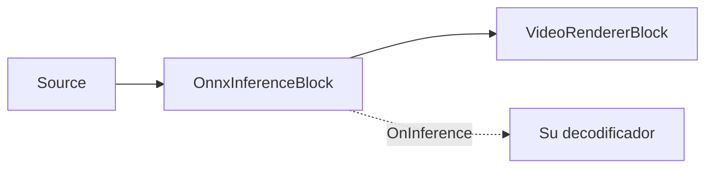

# Inferencia ONNX genérica — OnnxInferenceBlock

`OnnxInferenceBlock` es el bloque de IA de video de nivel más bajo en `VisioForge.Core.AI`
(`VisioForge.DotNet.Core.AI`). Captura fotogramas de video RGBA, los preprocesa en un tensor de
entrada de ONNX Runtime, ejecuta su modelo y lanza `OnInference` con las salidas float en bruto. El
fotograma de video pasa sin modificarse; el bloque no dibuja superposiciones ni interpreta tensores
específicos del modelo.

Use este bloque cuando tenga un modelo ONNX personalizado y quiera controlar usted mismo la lógica de
decodificación/post-procesamiento en su aplicación. Use [`YOLOObjectDetectorBlock`](object-detection.md)
en su lugar cuando el modelo pertenezca a una familia de detectores de objetos admitida, porque el
bloque YOLO ya mapea las cajas de vuelta al fotograma de origen y aplica el decodificador correcto.



## Ejemplo de pipeline

```csharp
using VisioForge.Core.AI;
using VisioForge.Core.MediaBlocks;
using VisioForge.Core.MediaBlocks.AI;
using VisioForge.Core.MediaBlocks.VideoRendering;
using VisioForge.Core.Types.X.AI;

var settings = new OnnxInferenceSettings(modelPath)
{
    InputWidth = 224,
    InputHeight = 224,
    NormalizeTo01 = true,
    Provider = OnnxExecutionProvider.Auto,
    FramesToSkip = 2,
};

var inference = new OnnxInferenceBlock(settings);
inference.OnInference += (sender, e) =>
{
    foreach (var output in e.Outputs)
    {
        var name = output.Key;
        var values = output.Value;
        var shape = e.Shapes[name];

        Console.WriteLine($"{name} shape [{string.Join(",", shape)}], {values.Length} values");
    }
};

var videoRenderer = new VideoRendererBlock(pipeline, videoView) { IsSync = false };

pipeline.Connect(source.Output, inference.Input);
pipeline.Connect(inference.Output, videoRenderer.Input);

await pipeline.StartAsync();
```

!!! note "La inferencia se ejecuta bajo demanda"
    Si no hay ningún controlador conectado a `OnInference`, el bloque omite la inferencia porque el
    fotograma pasa sin modificarse y la salida sería inobservable.

## Cómo funciona el preprocesamiento

El bloque usa `OnnxInferenceEngine` internamente:

- El archivo del modelo se carga en una `InferenceSession` de ONNX Runtime.
- `Provider = Auto` elige CUDA, luego DirectML, luego CoreML y finalmente CPU, entre los proveedores
  presentes en la compilación nativa de ONNX Runtime cargada.
- Si el modelo declara un tamaño de tensor de entrada fijo, ese tamaño sobrescribe `InputWidth` e
  `InputHeight`.
- Los fotogramas de origen RGBA se redimensionan con un letterbox centrado al tamaño de entrada del
  modelo.
- Los píxeles se convierten a un tensor float RGB `NCHW`.
- `NormalizeTo01 = true` divide los valores de píxel entre 255; de lo contrario, los valores
  permanecen en el rango 0..255.

La carga útil del evento mantiene el trabajo específico del modelo en su código.
`OnnxInferenceEventArgs.Outputs` mapea cada nombre de tensor de salida a un `float[]` aplanado en
orden de fila, y `Shapes` mapea ese mismo nombre a las dimensiones del tensor. El significado de esas
dimensiones depende por completo de su modelo.

## Configuración clave

| Propiedad | Valor por defecto | Descripción |
| --- | --- | --- |
| `ModelPath` | — | Ruta absoluta al archivo `.onnx`. Obligatorio. |
| `InputWidth` / `InputHeight` | `640` / `640` | Se usan en modelos de entrada dinámica. Los modelos de tamaño fijo declaran su propio tamaño de entrada. |
| `NormalizeTo01` | `true` | Divide los valores RGB entre 255 durante el preprocesamiento. |
| `Provider` | `Auto` | Proveedor de ejecución de ONNX. `Auto` prueba los proveedores por hardware antes que la CPU. |
| `DeviceId` | `0` | Índice del dispositivo de hardware para CUDA/DirectML. |
| `FramesToSkip` | `0` | Ejecuta la inferencia cada `FramesToSkip + 1` fotogramas. |

`OnnxInferenceBlock.ActiveProvider` informa el proveedor realmente utilizado una vez construido el
bloque. `OnnxInferenceEngine.GetAvailableProviders()` puede llamarse antes de construir un pipeline
para inspeccionar los proveedores de ONNX Runtime disponibles en el proceso actual.

## API directa del motor

Las integraciones avanzadas pueden usar `OnnxInferenceEngine` directamente fuera de un pipeline de
Media Blocks. Expone `Initialize()`, `Preprocess(...)`, `Run(...)`, `OutputNames`, `InputWidth`,
`InputHeight` y `ActiveProvider`. `YoloDetector` es un ayudante directo público sobre el mismo motor
para las familias de detectores admitidas. La mayoría de las aplicaciones deberían preferir los
envoltorios de MediaBlocks porque gestionan los pads del pipeline, la captura de fotogramas y el
ciclo de vida.

## Uso con VideoCaptureCoreX y MediaPlayerCoreX

```csharp
var inference = new OnnxInferenceBlock(settings);
inference.OnInference += Inference_OnInference;

core.Video_Processing_AddBlock(inference); // antes de StartAsync (VideoCaptureCoreX)
// player.Video_Processing_AddBlock(inference); // antes de OpenAsync/PlayAsync (MediaPlayerCoreX)

await core.StartAsync();
```

Consulte [Uso de bloques de IA con VideoCaptureCoreX y MediaPlayerCoreX](x-engines.md) para conocer la
API completa de bloques de procesamiento, el orden de inserción y las reglas del ciclo de vida
compartidas por todos los bloques de IA de video.

## Casos de uso

- **Modelos de clasificación personalizados** — clasificadores de imágenes, modelos de aprobado/
  rechazado para control de calidad, o clasificadores de escenas exportados a ONNX desde PyTorch/
  TensorFlow/scikit-learn.
- **Familias de detectores que el SDK aún no decodifica** — ejecute los tensores en bruto de su modelo
  a través de `OnnxInferenceBlock` y escriba el decodificador en su propio código, exactamente como
  [`YOLOObjectDetectorBlock`](object-detection.md) hace internamente para sus tres familias admitidas.
- **Modelos de segmentación, profundidad o pose** — cualquier modelo ONNX de una sola entrada y salida
  de tensores puede conectarse, siempre que usted se encargue de interpretar la forma de su salida.
- **Prototipado** — valide un modelo ONNX recién exportado con video en vivo o de archivo antes de
  comprometerse a construir un decodificador dedicado.

## Solución de problemas

| Síntoma | Causa probable | Solución |
| --- | --- | --- |
| `OnInference` nunca se dispara | No hay ningún controlador suscrito | El bloque omite la inferencia por completo cuando nada observa el evento; suscríbase antes de `StartAsync`/`OpenAsync`. |
| Los valores de salida parecen incorrectos/saturados | `NormalizeTo01` no coincide con cómo se entrenó el modelo | Alterne `NormalizeTo01`; algunos modelos esperan valores de píxel en bruto 0..255 en lugar de 0..1. |
| El modelo se carga pero cada salida tiene una forma distinta a la esperada | El modelo tiene un tamaño de entrada fijo que sobrescribe `InputWidth`/`InputHeight` | Compruebe la forma de entrada declarada por el modelo; un modelo de tamaño fijo informa y usa su propio tamaño sin importar su configuración. |
| `Provider = CUDA`/`DirectML` no parece activarse | Falta el paquete nativo del proveedor de ejecución, o no hay una GPU compatible | Compruebe `OnnxInferenceBlock.ActiveProvider` después de `StartAsync`, o llame a `OnnxInferenceEngine.GetAvailableProviders()` de antemano para ver qué hay realmente disponible en el proceso. |
| Las cajas/puntos clave parecen desplazados respecto al fotograma de origen | El fotograma se redimensiona con letterbox al tamaño de entrada del modelo antes de la inferencia | Mapee las coordenadas de salida normalizadas/en espacio del modelo de vuelta a través de la misma transformación de letterbox antes de dibujar sobre el fotograma de origen. |

## Preguntas frecuentes

### ¿Puedo usar OnnxInferenceBlock para un modelo que no sea un detector YOLO?

Sí — para eso está exactamente diseñado. A diferencia de `YOLOObjectDetectorBlock`,
`OnnxInferenceBlock` no asume ningún diseño de salida concreto; le entrega los tensores de salida
con nombre y sus formas en bruto para cualquier modelo de una sola entrada.

### ¿OnnxInferenceBlock dibuja algo sobre el fotograma?

No. Deja pasar el fotograma sin modificarlo y nunca dibuja superposiciones; su aplicación interpreta
`OnnxInferenceEventArgs.Outputs`/`Shapes` y dibuja lo que necesite más adelante en el pipeline.

### ¿Cómo sé qué proveedores de ejecución de ONNX Runtime están disponibles?

Llame al método estático `OnnxInferenceEngine.GetAvailableProviders()` antes de construir un
pipeline, o lea `OnnxInferenceBlock.ActiveProvider` después de construir el bloque para ver qué
proveedor se utilizó realmente.

### Mi modelo tiene varias entradas — ¿lo admite OnnxInferenceBlock?

`OnnxInferenceSettings`/`OnnxInferenceBlock` están diseñados en torno a un único tensor de entrada de
fotograma de video RGBA. Para un modelo con múltiples entradas, use `OnnxInferenceEngine` directamente
fuera del pipeline de Media Blocks, donde controla la llamada completa a `Run(...)`.

## Demos

`OnnxInferenceBlock` todavía no tiene un ejemplo dedicado; se ejerce indirectamente a través del
`OnnxInferenceEngine` usado internamente por [`YOLOObjectDetectorBlock`](object-detection.md) y
[`ObjectAnalyticsBlock`](object-analytics.md). Si está prototipando un modelo personalizado, adapte
el "Ejemplo de pipeline" anterior con la ruta de su propio modelo y su propio decodificador de salida.
