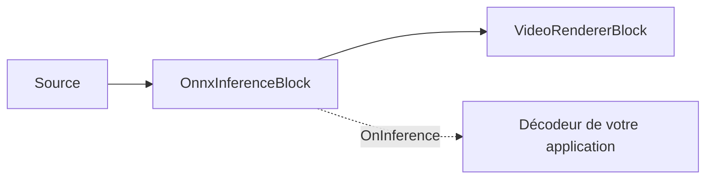

# Inférence ONNX générique — OnnxInferenceBlock

`OnnxInferenceBlock` est le bloc d'IA vidéo de plus bas niveau de `VisioForge.Core.AI`
(`VisioForge.DotNet.Core.AI`). Il capte les images vidéo RGBA, les prétraite en un tenseur d'entrée
ONNX Runtime, exécute votre modèle, puis déclenche `OnInference` avec les sorties brutes en virgule
flottante. L'image vidéo passe telle quelle ; le bloc ne dessine aucune superposition et n'interprète
aucun tenseur spécifique au modèle.

Utilisez ce bloc lorsque vous disposez d'un modèle ONNX personnalisé et souhaitez conserver la
logique de décodage/post-traitement dans votre application. Utilisez plutôt
[`YOLOObjectDetectorBlock`](object-detection.md) lorsque le modèle appartient à une famille de
détecteurs d'objets prise en charge, car le bloc YOLO mappe déjà les boîtes vers l'image source et
applique le bon décodeur.



## Exemple de pipeline

```csharp
using VisioForge.Core.AI;
using VisioForge.Core.MediaBlocks;
using VisioForge.Core.MediaBlocks.AI;
using VisioForge.Core.MediaBlocks.VideoRendering;
using VisioForge.Core.Types.X.AI;

var settings = new OnnxInferenceSettings(modelPath)
{
    InputWidth = 224,
    InputHeight = 224,
    NormalizeTo01 = true,
    Provider = OnnxExecutionProvider.Auto,
    FramesToSkip = 2,
};

var inference = new OnnxInferenceBlock(settings);
inference.OnInference += (sender, e) =>
{
    foreach (var output in e.Outputs)
    {
        var name = output.Key;
        var values = output.Value;
        var shape = e.Shapes[name];

        Console.WriteLine($"{name} shape [{string.Join(",", shape)}], {values.Length} values");
    }
};

var videoRenderer = new VideoRendererBlock(pipeline, videoView) { IsSync = false };

pipeline.Connect(source.Output, inference.Input);
pipeline.Connect(inference.Output, videoRenderer.Input);

await pipeline.StartAsync();
```

!!! note "L'inférence est pilotée par la demande"
    Si aucun gestionnaire n'est rattaché à `OnInference`, le bloc ignore l'inférence, car l'image
    passe telle quelle et la sortie serait inobservable.

## Fonctionnement du prétraitement

Le bloc utilise `OnnxInferenceEngine` en interne :

- Le fichier du modèle est chargé dans une `InferenceSession` ONNX Runtime.
- `Provider = Auto` choisit CUDA, puis DirectML, puis CoreML, puis CPU, parmi les fournisseurs
  présents dans la build native ONNX Runtime chargée.
- Si le modèle déclare une taille de tenseur d'entrée fixe, cette taille remplace `InputWidth` et
  `InputHeight`.
- Les images source RGBA sont redimensionnées avec un letterbox centré à la taille d'entrée du
  modèle.
- Les pixels sont convertis en un tenseur flottant RGB au format `NCHW`.
- `NormalizeTo01 = true` divise les valeurs des pixels par 255 ; sinon, les valeurs restent dans la
  plage 0..255.

La charge utile de l'événement laisse le travail spécifique au modèle dans votre code.
`OnnxInferenceEventArgs.Outputs` associe le nom de chaque tenseur de sortie à un `float[]` aplati en
ordre ligne-majeur, et `Shapes` associe ce même nom aux dimensions du tenseur. La signification de
ces dimensions dépend entièrement de votre modèle.

## Paramètres clés

| Propriété | Par défaut | Description |
| --- | --- | --- |
| `ModelPath` | — | Chemin absolu vers le fichier `.onnx`. Obligatoire. |
| `InputWidth` / `InputHeight` | `640` / `640` | Utilisés pour les modèles à entrée dynamique. Les modèles à taille fixe indiquent leur propre taille d'entrée. |
| `NormalizeTo01` | `true` | Divise les valeurs RVB par 255 pendant le prétraitement. |
| `Provider` | `Auto` | Fournisseur d'exécution ONNX. `Auto` essaie les fournisseurs matériels avant le CPU. |
| `DeviceId` | `0` | Index du périphérique matériel pour CUDA/DirectML. |
| `FramesToSkip` | `0` | Exécute l'inférence toutes les `FramesToSkip + 1` images. |

`OnnxInferenceBlock.ActiveProvider` indique le fournisseur réellement engagé une fois le bloc
construit. `OnnxInferenceEngine.GetAvailableProviders()` peut être appelé avant la construction d'un
pipeline pour inspecter les fournisseurs ONNX Runtime disponibles dans le processus en cours.

## API directe du moteur

Les intégrations avancées peuvent utiliser `OnnxInferenceEngine` directement en dehors d'un pipeline
Media Blocks. Il expose `Initialize()`, `Preprocess(...)`, `Run(...)`, `OutputNames`, `InputWidth`,
`InputHeight` et `ActiveProvider`. `YoloDetector` est un assistant direct public s'appuyant sur le
même moteur pour les familles de détecteurs prises en charge. La plupart des applications devraient
préférer les wrappers MediaBlocks, car ils gèrent les pads du pipeline, la capture d'images et la
gestion du cycle de vie.

## Utilisation avec VideoCaptureCoreX et MediaPlayerCoreX

```csharp
var inference = new OnnxInferenceBlock(settings);
inference.OnInference += Inference_OnInference;

core.Video_Processing_AddBlock(inference); // avant StartAsync (VideoCaptureCoreX)
// player.Video_Processing_AddBlock(inference); // avant OpenAsync/PlayAsync (MediaPlayerCoreX)

await core.StartAsync();
```

Consultez [Utilisation des blocs d'IA avec VideoCaptureCoreX et MediaPlayerCoreX](x-engines.md) pour
l'API complète des blocs de traitement, l'ordre d'insertion et les règles de cycle de vie partagées
par tous les blocs d'IA vidéo.

## Cas d'usage

- **Modèles de classification personnalisés** — classificateurs d'images, modèles de contrôle
  qualité pass/fail, ou classificateurs de scènes exportés en ONNX depuis PyTorch/TensorFlow/
  scikit-learn.
- **Familles de détecteurs que le SDK ne décode pas encore** — faites passer les tenseurs bruts de
  votre modèle par `OnnxInferenceBlock` et écrivez le décodeur dans votre propre code, exactement
  comme [`YOLOObjectDetectorBlock`](object-detection.md) le fait en interne pour ses trois familles
  prises en charge.
- **Modèles de segmentation, de profondeur ou de pose** — tout modèle ONNX à entrée unique et sortie
  tensorielle peut être connecté, à condition que vous interprétiez vous-même la forme de sa sortie.
- **Prototypage** — validez un modèle ONNX nouvellement exporté sur de la vidéo en direct ou en
  fichier avant de vous engager dans un décodeur dédié.

## Dépannage

| Symptôme | Cause probable | Correction |
| --- | --- | --- |
| `OnInference` ne se déclenche jamais | Aucun gestionnaire abonné | Le bloc ignore totalement l'inférence si rien n'observe l'événement — abonnez-vous avant `StartAsync`/`OpenAsync`. |
| Les valeurs de sortie semblent incorrectes/saturées | `NormalizeTo01` ne correspond pas à la façon dont le modèle a été entraîné | Basculez `NormalizeTo01` ; certains modèles attendent des valeurs de pixels brutes 0..255 au lieu de 0..1. |
| Le modèle se charge, mais chaque sortie a une forme identique et inattendue | Le modèle a une taille d'entrée fixe qui remplace `InputWidth`/`InputHeight` | Vérifiez la forme d'entrée déclarée du modèle — un modèle à taille fixe indique et utilise sa propre taille, quels que soient vos paramètres. |
| `Provider = CUDA`/`DirectML` ne semble pas s'activer | Package natif du fournisseur d'exécution manquant, ou aucun GPU compatible | Vérifiez `OnnxInferenceBlock.ActiveProvider` après `StartAsync`, ou appelez `OnnxInferenceEngine.GetAvailableProviders()` au préalable pour voir ce qui est réellement disponible dans le processus. |
| Les boîtes/points clés semblent décalés par rapport à l'image source | L'image est redimensionnée en letterbox à la taille d'entrée du modèle avant l'inférence | Ramenez les coordonnées de sortie normalisées/espace-modèle de votre modèle à travers la même transformation letterbox avant de dessiner sur l'image source. |

## Foire aux questions

### Puis-je utiliser OnnxInferenceBlock pour un modèle qui n'est pas un détecteur YOLO ?

Oui — c'est exactement à cela qu'il sert. Contrairement à `YOLOObjectDetectorBlock`,
`OnnxInferenceBlock` ne présuppose aucune disposition de sortie ; il vous fournit les tenseurs de
sortie nommés bruts et leurs formes pour tout modèle à entrée unique.

### OnnxInferenceBlock dessine-t-il quelque chose sur l'image ?

Non. Il fait passer l'image telle quelle et ne dessine jamais de superposition — votre application
interprète `OnnxInferenceEventArgs.Outputs`/`Shapes` et dessine ce dont elle a besoin en aval.

### Comment savoir quels fournisseurs d'exécution ONNX Runtime sont disponibles ?

Appelez la méthode statique `OnnxInferenceEngine.GetAvailableProviders()` avant de construire un
pipeline, ou lisez `OnnxInferenceBlock.ActiveProvider` après la construction du bloc pour voir quel
fournisseur a réellement été engagé.

### Mon modèle a plusieurs entrées — OnnxInferenceBlock le prend-il en charge ?

`OnnxInferenceSettings`/`OnnxInferenceBlock` sont conçus autour d'un tenseur d'entrée unique
constitué d'une image vidéo RGBA. Pour un modèle à entrées multiples, utilisez `OnnxInferenceEngine`
directement en dehors du pipeline Media Blocks, où vous contrôlez entièrement l'appel `Run(...)`.

## Démos

`OnnxInferenceBlock` n'a pas encore d'exemple dédié — il est exercé indirectement via
`OnnxInferenceEngine`, utilisé en interne par [`YOLOObjectDetectorBlock`](object-detection.md) et
[`ObjectAnalyticsBlock`](object-analytics.md). Si vous prototypez un modèle personnalisé, adaptez
l'« Exemple de pipeline » ci-dessus avec votre propre chemin de modèle et votre propre décodeur de
sortie.
