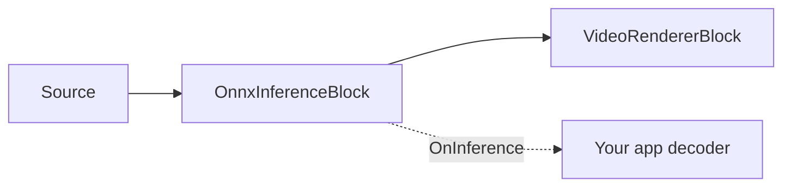

# Generic ONNX Inference — OnnxInferenceBlock

`OnnxInferenceBlock` is the lowest-level video AI block in `VisioForge.Core.AI`
(`VisioForge.DotNet.Core.AI`). It taps RGBA video frames, preprocesses them into an ONNX Runtime
input tensor, runs your model, and raises `OnInference` with the raw float outputs. The video frame
passes through unchanged; the block does not draw overlays or interpret model-specific tensors.

Use this block when you have a custom ONNX model and want to own the decoder/post-processing logic in
your application. Use [`YOLOObjectDetectorBlock`](object-detection.md) instead when the model is a
supported object detector family, because the YOLO block already maps boxes back to the source frame
and applies the correct decoder.



## Pipeline example

```csharp
using VisioForge.Core.AI;
using VisioForge.Core.MediaBlocks;
using VisioForge.Core.MediaBlocks.AI;
using VisioForge.Core.MediaBlocks.VideoRendering;
using VisioForge.Core.Types.X.AI;

var settings = new OnnxInferenceSettings(modelPath)
{
    InputWidth = 224,
    InputHeight = 224,
    NormalizeTo01 = true,
    Provider = OnnxExecutionProvider.Auto,
    FramesToSkip = 2,
};

var inference = new OnnxInferenceBlock(settings);
inference.OnInference += (sender, e) =>
{
    foreach (var output in e.Outputs)
    {
        var name = output.Key;
        var values = output.Value;
        var shape = e.Shapes[name];

        Console.WriteLine($"{name} shape [{string.Join(",", shape)}], {values.Length} values");
    }
};

var videoRenderer = new VideoRendererBlock(pipeline, videoView) { IsSync = false };

pipeline.Connect(source.Output, inference.Input);
pipeline.Connect(inference.Output, videoRenderer.Input);

await pipeline.StartAsync();
```

!!! note "Inference is demand-driven"
    If no handler is attached to `OnInference`, the block skips inference because the frame is passed
    through unmodified and the output would be unobservable.

## How preprocessing works

The block uses `OnnxInferenceEngine` internally:

- The model file is loaded into an ONNX Runtime `InferenceSession`.
- `Provider = Auto` chooses CUDA, then DirectML, then CoreML, then CPU, from whichever providers are
  present in the loaded ONNX Runtime native build.
- If the model declares a fixed input tensor size, that size overrides `InputWidth` and `InputHeight`.
- RGBA source frames are resized with a centered letterbox into the model input size.
- Pixels are converted to an RGB `NCHW` float tensor.
- `NormalizeTo01 = true` divides pixel values by 255; otherwise values stay in the 0..255 range.

The event payload keeps the model-specific work in your code. `OnnxInferenceEventArgs.Outputs` maps
each output tensor name to a flattened row-major `float[]`, and `Shapes` maps the same name to the
tensor dimensions. The meaning of those dimensions depends entirely on your model.

## Key settings

| Property | Default | Description |
| --- | --- | --- |
| `ModelPath` | — | Absolute path to the `.onnx` file. Required. |
| `InputWidth` / `InputHeight` | `640` / `640` | Used for dynamic-input models. Fixed-size models report their own input size. |
| `NormalizeTo01` | `true` | Divide RGB values by 255 during preprocessing. |
| `Provider` | `Auto` | ONNX execution provider. `Auto` tries hardware providers before CPU. |
| `DeviceId` | `0` | Hardware device index for CUDA/DirectML. |
| `FramesToSkip` | `0` | Run inference every `FramesToSkip + 1` frames. |

`OnnxInferenceBlock.ActiveProvider` reports the provider actually engaged after the block is built.
`OnnxInferenceEngine.GetAvailableProviders()` can be called before building a pipeline to inspect the
ONNX Runtime providers available in the current process.

## Direct engine API

Advanced integrations can use `OnnxInferenceEngine` directly outside a Media Blocks pipeline. It
exposes `Initialize()`, `Preprocess(...)`, `Run(...)`, `OutputNames`, `InputWidth`, `InputHeight`, and
`ActiveProvider`. `YoloDetector` is a public direct helper over the same engine for the supported
detector families. Most applications should prefer the MediaBlocks wrappers because they handle
pipeline pads, frame grabbing, and lifetime management.

## Use with VideoCaptureCoreX and MediaPlayerCoreX

```csharp
var inference = new OnnxInferenceBlock(settings);
inference.OnInference += Inference_OnInference;

core.Video_Processing_AddBlock(inference); // before StartAsync (VideoCaptureCoreX)
// player.Video_Processing_AddBlock(inference); // before OpenAsync/PlayAsync (MediaPlayerCoreX)

await core.StartAsync();
```

See [Using AI blocks with VideoCaptureCoreX and MediaPlayerCoreX](x-engines.md) for the full
processing-block API, insertion order, and lifecycle rules shared by every video AI block.

## Use cases

- **Custom classification models** — image classifiers, quality-control pass/fail models, or scene
  classifiers exported to ONNX from PyTorch/TensorFlow/scikit-learn.
- **Detector families the SDK doesn't decode yet** — run your model's raw tensors through
  `OnnxInferenceBlock` and write the decoder in your own code, exactly as
  [`YOLOObjectDetectorBlock`](object-detection.md) does internally for its three supported families.
- **Segmentation, depth, or pose models** — any single-input, tensor-output ONNX model can be wired up,
  as long as you own interpreting its output shape.
- **Prototyping** — validate a newly exported ONNX model against live or file video before committing
  to a purpose-built decoder.

## Troubleshooting

| Symptom | Likely cause | Fix |
| --- | --- | --- |
| `OnInference` never fires | No handler subscribed | The block skips inference entirely when nothing observes the event — subscribe before `StartAsync`/`OpenAsync`. |
| Output values look wrong/saturated | `NormalizeTo01` doesn't match how the model was trained | Toggle `NormalizeTo01`; some models expect raw 0..255 pixel values instead of 0..1. |
| Model loads but every output is the same shape you didn't expect | The model has a fixed input size that overrides `InputWidth`/`InputHeight` | Check the model's declared input shape — a fixed-size model reports and uses its own size regardless of your settings. |
| `Provider = CUDA`/`DirectML` doesn't seem to engage | Missing native execution-provider package, or no compatible GPU | Check `OnnxInferenceBlock.ActiveProvider` after `StartAsync`, or call `OnnxInferenceEngine.GetAvailableProviders()` beforehand to see what's actually available in-process. |
| Boxes/keypoints look shifted from the source frame | Frame is letterbox-resized into the model's input size before inference | Map your model's normalized/model-space output coordinates back through the same letterbox transform before drawing on the source frame. |

## Frequently Asked Questions

### Can I use OnnxInferenceBlock for a model that isn't a YOLO detector?

Yes — that's exactly what it's for. Unlike `YOLOObjectDetectorBlock`, `OnnxInferenceBlock` doesn't
assume any output layout; it hands you the raw named output tensors and shapes for any single-input
model.

### Does OnnxInferenceBlock draw anything on the frame?

No. It passes the frame through unchanged and never draws overlays — your application interprets
`OnnxInferenceEventArgs.Outputs`/`Shapes` and draws whatever it needs downstream.

### How do I know which ONNX Runtime execution providers are available?

Call the static `OnnxInferenceEngine.GetAvailableProviders()` before building a pipeline, or read
`OnnxInferenceBlock.ActiveProvider` after the block is built to see which provider was actually
engaged.

### My model has multiple inputs — does OnnxInferenceBlock support that?

`OnnxInferenceSettings`/`OnnxInferenceBlock` are built around a single RGBA video-frame input tensor.
For a multi-input model, use `OnnxInferenceEngine` directly outside the Media Blocks pipeline, where
you control the full `Run(...)` call.

## Demos

`OnnxInferenceBlock` doesn't have a dedicated sample yet — it's exercised indirectly through the
`OnnxInferenceEngine` used internally by [`YOLOObjectDetectorBlock`](object-detection.md) and
[`ObjectAnalyticsBlock`](object-analytics.md). If you're prototyping a custom model, adapt the
"Pipeline example" above with your own model path and output decoder.
