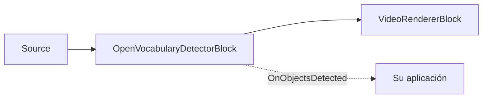

# Detección de vocabulario abierto — OpenVocabularyDetectorBlock

Necesita detectar un objeto para el que ningún modelo estándar fue entrenado — una herramienta,
producto o uniforme concretos — pero no tiene un conjunto de datos etiquetado ni tiempo para entrenar
y desplegar un detector personalizado. La **detección de vocabulario abierto** resuelve esto: nombre
en texto plano lo que busca y el modelo lo encuentra, sin entrenamiento y sin una lista fija de clases.
Se ejecuta en el dispositivo mediante ONNX (OWLv2 o Grounding DINO), y puede cambiar lo que detecta en
cualquier momento editando los prompts de texto.

`OpenVocabularyDetectorBlock` detecta objetos descritos mediante **prompts de texto libre** en lugar
de una lista fija de clases. Le proporciona frases como `"a person"`, `"a red backpack"` o
`"a forklift"`, y las encuentra en el flujo de vídeo — sin reentrenamiento, sin un conjunto fijo de
etiquetas. Captura fotogramas RGBA, ejecuta un modelo ONNX de vocabulario abierto (OWLv2 o Grounding
DINO), opcionalmente dibuja cuadros y etiquetas en el fotograma, y genera el evento
`OnObjectsDetected` para los fotogramas que contienen detecciones.

Dado que los modelos de vocabulario abierto son más pesados que un detector de clases fijas, la
inferencia se ejecuta en un proceso de trabajo en segundo plano de tipo «el último gana»
(latest-wins): el hilo de streaming envía una copia del fotograma y solo redibuja las detecciones más
recientes almacenadas en caché, de modo que la canalización nunca se bloquea. El `Label` de cada
detección es la cadena del prompt coincidente y su `ClassId` es el índice de base cero de ese prompt.



¿Necesita un conjunto fijo de clases a máxima velocidad (COCO-80 o sus propias etiquetas entrenadas)?
Utilice [`YOLOObjectDetectorBlock`](object-detection.md) en su lugar — es mucho más rápido, pero no
puede detectar una clase para la que no fue entrenado. La detección de vocabulario abierto sacrifica
rendimiento a cambio de la capacidad de detectar cualquier cosa que pueda nombrar.

## Cómo funciona la detección de vocabulario abierto

La detección de vocabulario abierto es una forma de **detección de disparo cero (zero-shot)**: el
modelo detecta clases para las que nunca fue entrenado explícitamente, especificadas en tiempo de
ejecución como texto. Cada fotograma pasa por cuatro pasos:

1. **Codificar los prompts.** Cada cadena de prompt se tokeniza y se convierte en una incrustación de
   texto (embedding). Esto es económico y se almacena en caché hasta que llama a `SetPrompts`, por lo
   que no se repite en cada fotograma.
2. **Codificar el fotograma.** El fotograma se preprocesa según la convención del modelo (OWLv2 rellena
   hasta un cuadrado y redimensiona a 960x960; Grounding DINO redimensiona a su tamaño fijo) y se
   codifica en características de imagen por región.
3. **Puntuar las regiones frente a los prompts.** Cada región candidata se puntúa frente a cada
   incrustación de prompt; las regiones que superan `ConfidenceThreshold` se convierten en detecciones,
   etiquetadas con el prompt coincidente (`Label`) y su índice (`ClassId`).
4. **Suprimir solapamientos.** La supresión de no-máximos por clase (`IoUThreshold`) elimina los cuadros
   duplicados, y se devuelven los mejores `MaxDetections` resultados.

Los pasos 2–4 se ejecutan en un proceso de trabajo en segundo plano de tipo «el último gana», de modo
que el vídeo nunca se bloquea — el hilo de streaming dibuja el resultado completado más reciente
mientras la siguiente inferencia todavía se está ejecutando.

## Familias de modelos admitidas

Configure `OpenVocabularyDetectorSettings.Model` para que coincida con el formato del modelo ONNX. Cada
familia utiliza un tokenizador y una convención de preprocesamiento diferentes.

| Modelo | Tokenizador y preprocesamiento | Notas |
| --- | --- | --- |
| `OpenVocabularyModel.OWLv2` (predeterminado) | Tokenizador BPE a nivel de byte de CLIP (`vocab.json` + `merges.txt`). El fotograma se rellena hasta un cuadrado (esquina superior izquierda) y se redimensiona a 960x960; logits sigmoide por consulta sobre una cuadrícula de parches fija. | Requiere tanto `VocabFilePath` como `MergesFilePath`. Ignora `TextThreshold`. |
| `OpenVocabularyModel.GroundingDINO` | Tokenizador WordPiece BERT (`vocab.txt` únicamente). Los prompts se unen en un pie de texto (caption) `prompt1 . prompt2 .`, en minúsculas; el fotograma se redimensiona al tamaño de entrada fijo del modelo; puntuaciones de tramo de tokens (token-span) por consulta sobre 900 consultas. | `MergesFilePath` no se utiliza. `TextThreshold` filtra las contribuciones débiles por token. |

El SDK no incluye los pesos del detector en el paquete NuGet — proporcione el modelo `.onnx` y sus
archivos de tokenizador como rutas locales (consulte [Modelos](#modelos)). Los `InputWidth`/`InputHeight`
heredados se **ignoran**: OWLv2 siempre se ejecuta a 960x960 y Grounding DINO utiliza el tamaño fijo
incorporado en su modelo ONNX.

## Uso

```csharp
using VisioForge.Core.MediaBlocks;
using VisioForge.Core.MediaBlocks.AI;
using VisioForge.Core.MediaBlocks.VideoRendering;
using VisioForge.Core.Types.Events;
using VisioForge.Core.Types.VideoProcessing;
using VisioForge.Core.Types.X.AI;

var settings = new OpenVocabularyDetectorSettings(
    "owlv2-base-ensemble.onnx",
    "owlv2-vocab.json",
    "owlv2-merges.txt",
    new[] { "a person", "a car", "a red backpack" })
{
    Model = OpenVocabularyModel.OWLv2,
    ConfidenceThreshold = 0.25f,
    IoUThreshold = 0.5f,
    DrawDetections = true,
    Provider = OnnxExecutionProvider.Auto,
};

var detector = new OpenVocabularyDetectorBlock(settings);
detector.OnObjectsDetected += (sender, e) =>
{
    foreach (OnnxDetection obj in e.Objects)
    {
        // obj.Label es el prompt coincidente; obj.ClassId es su índice en el arreglo de prompts.
        Console.WriteLine($"{obj.Label} {obj.Confidence:P0} at {obj.Box}");
    }
};

var videoRenderer = new VideoRendererBlock(pipeline, videoView) { IsSync = false };

pipeline.Connect(source.Output, detector.Input);
pipeline.Connect(detector.Output, videoRenderer.Input);

await pipeline.StartAsync();

Console.WriteLine($"Active provider: {detector.ActiveProvider}");
```

Cada `OnObjectsDetected` se dispara únicamente cuando el fotograma tiene detecciones.
`ObjectsDetectedEventArgs` transporta `Objects` (un `OnnxDetection[]`) y el `Timestamp` del fotograma.
Cada `OnnxDetection` tiene el `Box` delimitador en coordenadas de píxeles del fotograma de origen,
`ClassId` (el índice del prompt), `Label` (el prompt coincidente) y `Confidence`. `TrackerId` siempre
es `-1` — este bloque no rastrea objetos entre fotogramas.

### Cambio de prompts y umbrales en tiempo de ejecución

Los prompts y los umbrales se pueden actualizar en vivo sin reconstruir la canalización — el cambio se
aplica en el siguiente fotograma procesado:

```csharp
detector.SetPrompts(new[] { "a delivery truck", "a bicycle" });
detector.SetConfidenceThreshold(0.30f);
detector.SetIoUThreshold(0.45f);
```

## Configuración clave

`OpenVocabularyDetectorSettings` extiende `OnnxInferenceSettings`.

| Propiedad | Predeterminado | Descripción |
| --- | --- | --- |
| `ModelPath` | — | Ruta absoluta al archivo `.onnx` de vocabulario abierto. Obligatorio. |
| `Prompts` | `null` | Prompts de detección de texto libre. Cada uno se convierte en una clase detectable; `Label` = prompt, `ClassId` = su índice. |
| `VocabFilePath` | `null` | Vocabulario del tokenizador: `vocab.json` (OWLv2) o `vocab.txt` (Grounding DINO). Obligatorio. |
| `MergesFilePath` | `null` | `merges.txt` BPE a nivel de byte. Obligatorio para OWLv2; deje `null` para Grounding DINO. |
| `Model` | `OpenVocabularyModel.OWLv2` | Selecciona el tokenizador, el preprocesamiento y el decodificador de salida. |
| `ConfidenceThreshold` | `0.25` | Confianza mínima (0..1) para una detección reportada. |
| `TextThreshold` | `0.25` | Umbral de puntuación de texto por token para Grounding DINO. Ignorado por OWLv2. |
| `IoUThreshold` | `0.5` | Umbral de supresión de no-máximos para la NMS por clase. |
| `MaxDetections` | `100` | Máximo de detecciones devueltas por fotograma, primero las de mayor confianza. |
| `DrawDetections` | `true` | Dibuja los cuadros de detección en el fotograma de vídeo. |
| `DrawLabels` | `true` | Dibuja la etiqueta del prompt y la confianza junto a cada cuadro. |
| `BoxColor` / `BoxThickness` | Lima / `2` | Estilo de superposición de los cuadros. |
| `LabelFontSize` | `0` | Tamaño del texto de la etiqueta en px. `0` escala automáticamente según la altura del fotograma. |
| `Provider` / `DeviceId` | `Auto` / `0` | Proveedor de ejecución ONNX e índice del dispositivo de hardware. |
| `FramesToSkip` | `0` | Omite fotogramas entre ejecuciones de inferencia para reducir la carga. |

`InputWidth`/`InputHeight` y `NormalizeTo01` se heredan de `OnnxInferenceSettings`, pero el tamaño de
entrada se ignora (cada familia fija el suyo propio). `OpenVocabularyDetectorBlock.ActiveProvider`
reporta el proveedor realmente utilizado una vez que el bloque se ha construido; `LastInferenceTimeMs`
y `DroppedFrameCount` exponen el coste de inferencia en vivo.

## Modelos

Los pesos de los modelos no se incluyen con el SDK. Las demos los descargan en la primera ejecución
desde GitHub Releases y los almacenan en caché en `%USERPROFILE%\VisioForge\models\openvocab`.

| Modelo | Archivos |
| --- | --- |
| OWLv2 | `owlv2-base-ensemble.onnx`, `owlv2-vocab.json`, `owlv2-merges.txt` |
| Grounding DINO | `grounding-dino-tiny.onnx`, `bert-vocab.txt` (sin archivo de merges) |

La licencia de un modelo la determina su origen (código de entrenamiento y pesos publicados), no el
formato ONNX ni la propia licencia del SDK. Confirme la licencia de los pesos específicos que despliegue
antes de comercializar un producto de código cerrado.

## Escritura de prompts eficaces

La formulación del prompt afecta directamente a la exhaustividad (recall) y la precisión. Algunas
reglas prácticas:

- **Utilice frases nominales cortas** — `"a person"`, `"a delivery truck"`, `"a cardboard box"`. Las
  oraciones completas y los calificadores largos reducen la exhaustividad.
- **Un concepto por prompt.** Cada prompt es una clase separada; no los combine («a person or a bag»).
- **Empiece de forma amplia y luego acote.** `"a car"` detecta más que `"a red sports car"`. Añada
  descriptores solo cuando necesite filtrar.
- **Grounding DINO convierte los prompts a minúsculas** y los une en un único pie de texto (caption)
  separado por `.` — mantenga las frases distintas e inequívocas.
- **Cada prompt añade un coste de codificación de texto** en el momento de cambiar los prompts (no en
  cada fotograma), por lo que un vocabulario en vivo enorme se puede indexar sin problemas, pero
  recórtelo si las llamadas a `SetPrompts` resultan lentas.

## Rendimiento y ajuste

Los modelos de vocabulario abierto son más pesados que un detector de clases fijas, por lo que el
rendimiento es menor — planifíquelo en lugar de combatirlo:

- **La canalización nunca se bloquea.** La inferencia es asíncrona y de tipo «el último gana», de modo
  que el vídeo en vivo sigue reproduciéndose; los cuadros reflejan la inferencia completada más reciente.
- **Reduzca la tasa de inferencia** con `FramesToSkip` cuando no necesite un resultado en cada fotograma
  — el bloque sigue pasando todos los fotogramas.
- **Utilice un proveedor de GPU** (`CUDA`, `DirectML` o `CoreML`) mediante `Provider`/`DeviceId` para una
  gran reducción de latencia frente a la CPU.
- **El tamaño de entrada es fijo por familia** (OWLv2 960x960; Grounding DINO su tamaño incorporado) y
  no se puede reducir para sacrificar precisión a cambio de velocidad — elija el modelo más ligero si
  necesita más margen.
- **Vigile el coste en vivo** con `LastInferenceTimeMs` y `DroppedFrameCount`, y lea el proveedor
  utilizado desde `ActiveProvider` una vez que el bloque se ha construido.

## Uso con VideoCaptureCoreX y MediaPlayerCoreX

La misma instancia del bloque se integra en cualquiera de los dos motores de alto nivel. Regístrela
antes de que comience la sesión:

```csharp
var detector = new OpenVocabularyDetectorBlock(settings);
detector.OnObjectsDetected += Detector_OnObjectsDetected;

core.Video_Processing_AddBlock(detector);   // VideoCaptureCoreX — antes de StartAsync
// player.Video_Processing_AddBlock(detector); // MediaPlayerCoreX — antes de OpenAsync/PlayAsync

await core.StartAsync();

// Los prompts y umbrales siguen siendo actualizables en vivo mientras la sesión se ejecuta:
detector.SetPrompts(new[] { "a person wearing a hard hat" });
```

`SetPrompts` hace que la detección de vocabulario abierto sea especialmente útil en una transmisión de
cámara en vivo: un operador puede cambiar qué buscar sobre la marcha. Consulte
[Uso de bloques de IA con VideoCaptureCoreX y MediaPlayerCoreX](x-engines.md) para conocer la API
completa de bloques de procesamiento, el orden de inserción y las reglas de ciclo de vida compartidas
por todos los bloques de IA de vídeo.

## Detección de vocabulario abierto frente a entrenar su propio modelo

La elección se reduce a si dispone de datos etiquetados y a cuánto cambian las clases objetivo.

| Situación | Mejor opción |
| --- | --- |
| Sin datos etiquetados, y necesita resultados ya | **Vocabulario abierto** — describa la clase en texto, cero entrenamiento. |
| Las clases objetivo cambian a menudo, o el usuario las elige en tiempo de ejecución | **Vocabulario abierto** — intercambie prompts en vivo con `SetPrompts`, sin redespliegue. |
| Un gran conjunto de datos etiquetado y necesidad de máxima precisión en clases fijas | **Entrene un modelo** — YOLO / RT-DETR; consulte [detección de objetos](object-detection.md). |
| La mayor tasa de fotogramas posible en unas pocas clases bien conocidas | **Detector de clases fijas entrenado** — es más rápido; el vocabulario abierto sacrifica velocidad por flexibilidad. |

Un patrón común es prototipar con detección de vocabulario abierto para confirmar que una clase es
siquiera detectable en su material, y luego entrenar un modelo de clases fijas más adelante solo si
necesita la velocidad adicional.

## Casos de uso

- **Consultas de vigilancia ad-hoc** — busque en una transmisión de cámara «a person carrying a bag» o
  «a white van» sin entrenar un modelo personalizado.
- **Comercio minorista e inventario** — detecte un producto arbitrario descrito en palabras, o espacio
  de estantería vacío, para una capa de negocio posterior.
- **Prototipado y triaje** — valide que una clase es detectable en su material antes de invertir en un
  modelo YOLO entrenado de clases fijas para velocidad de producción.
- **Clases raras y de cola larga** — detecte objetos que no tienen un detector entrenado disponible
  simplemente nombrándolos.
- **Herramientas interactivas** — permita que un usuario final escriba qué encontrar y actualice
  `SetPrompts` desde la interfaz.

## Solución de problemas

| Síntoma | Causa probable | Solución |
| --- | --- | --- |
| No hay detecciones en absoluto | `ConfidenceThreshold` demasiado alto, prompts demasiado específicos, o la familia `Model` incorrecta para el archivo ONNX | Reduzca `ConfidenceThreshold`; use prompts más simples («a car» antes que «a red sports car»); confirme que `Model` coincide con el modelo exportado. |
| Error de tokenizador / de inicio | Archivos de tokenizador ausentes o no coincidentes | OWLv2 necesita `VocabFilePath` **y** `MergesFilePath`; Grounding DINO solo necesita `VocabFilePath` (`vocab.txt`). |
| Cuadros duplicados o solapados | `IoUThreshold` demasiado alto (supresión débil) | Reduzca `IoUThreshold` (o llame a `SetIoUThreshold`). |
| Grounding DINO devuelve tokens ruidosos | `TextThreshold` demasiado bajo | Aumente `TextThreshold` — OWLv2 ignora este ajuste. |
| Uso elevado de CPU/GPU en vídeo en vivo | La inferencia se ejecuta en cada fotograma | Aumente `FramesToSkip`; el bloque sigue pasando todos los fotogramas, simplemente infiere con menor frecuencia. |
| Los cuadros aparecen solo tras un retardo | Esperado — la inferencia es asíncrona y de tipo «el último gana» | El fotograma nunca se bloquea; los cuadros reflejan la inferencia completada más reciente. |

## Preguntas frecuentes

### ¿Cómo detecto un objeto personalizado sin un conjunto de datos?

Nómbrelo en un prompt de texto — por ejemplo
`new OpenVocabularyDetectorSettings(modelPath, vocabPath, mergesPath, new[] { "a forklift", "a safety vest" })`.
No hay imágenes que recopilar, ni etiquetado, ni una ejecución de entrenamiento. Si una frase nominal
simple detecta poco, hágala algo más específica (`"an orange safety vest"`). Consulte
[Escritura de prompts eficaces](#escritura-de-prompts-eficaces).

### ¿Necesito entrenar o hacer fine-tuning de algo?

No. Los modelos de vocabulario abierto están preentrenados para detectar clases arbitrarias descritas
en texto, por lo que solo proporciona el texto del prompt más el modelo ONNX y los archivos de
tokenizador — no hay paso de entrenamiento ni de fine-tuning.

### ¿Con qué modelo debería empezar?

`OWLv2` (el predeterminado) ofrece una sólida precisión de vocabulario abierto y toma tanto un archivo
de vocabulario como uno de merges. `GroundingDINO` (tiny) es una alternativa más ligera que utiliza solo
un `vocab.txt` y realiza phrase-grounding sobre un pie de texto separado por `.`. Pruebe OWLv2 primero;
cambie a Grounding DINO si necesita un modelo más pequeño.

### ¿En qué se diferencia de YOLOObjectDetectorBlock?

[`YOLOObjectDetectorBlock`](object-detection.md) detecta un conjunto **fijo** de clases para las que fue
entrenado, muy rápido. La detección de vocabulario abierto detecta **cualquier cosa que describa en
texto**, con un coste por fotograma mayor. Use YOLO para clases conocidas a tasas de fotogramas altas;
use el vocabulario abierto para consultas flexibles o raras.

### ¿Puedo cambiar lo que busca mientras se está ejecutando?

Sí — llame a `SetPrompts` en cualquier momento. Los nuevos prompts se aplican en el siguiente fotograma
procesado, sin reconstruir la canalización. `SetConfidenceThreshold` y `SetIoUThreshold` también son en
vivo.

### ¿Rastrea objetos entre fotogramas?

No — cada detección es independiente por fotograma y `TrackerId` siempre es `-1`. Para identidades
persistentes, líneas de disparo (tripwires) o conteo de zonas, consulte
[Analítica de objetos](object-analytics.md).

### ¿Se requiere una GPU?

No. `Provider` toma como valor predeterminado `Auto`, que se ejecuta en la CPU cuando no hay un
proveedor de GPU presente. Un proveedor `CUDA`, `DirectML` o `CoreML` reduce la latencia por fotograma,
lo cual importa más en estos modelos más pesados.

### ¿Es la detección de vocabulario abierto lo mismo que la detección de objetos de disparo cero (zero-shot)?

Sí. «Vocabulario abierto» y «disparo cero (zero-shot)» describen aquí la misma capacidad: detectar
clases de objetos para las que el modelo no fue entrenado explícitamente, elegidas en tiempo de
ejecución mediante un prompt de texto en lugar de mediante un conjunto fijo de etiquetas. OWLv2 y
Grounding DINO son dos familias de detectores de vocabulario abierto (zero-shot) muy conocidas.

### ¿Cuántos prompts puedo detectar a la vez?

No hay un límite estricto en el número de prompts — cada uno se convierte en su propia clase.
`MaxDetections` (predeterminado `100`) limita cuántos cuadros se devuelven por fotograma, no cuántos
prompts proporciona. Más prompts añaden coste de codificación de texto cuando los configura, no en cada
fotograma.

### ¿Puede ejecutarse completamente sin conexión?

Sí. La inferencia es completamente ONNX local — sin llamadas a la nube en tiempo de ejecución. Solo la
descarga inicial del modelo necesita red, y puede distribuir los archivos `.onnx` y de tokenizador con
su aplicación para evitar incluso eso.

### ¿Por qué las detecciones se etiquetan con el texto de mi prompt?

Por diseño. A diferencia de un detector de clases fijas que emite identificadores de clase numéricos, el
`Label` de cada detección de vocabulario abierto es el prompt exacto con el que coincidió y su `ClassId`
es el índice de base cero de ese prompt en el arreglo que proporcionó — de modo que siempre sabe qué
consulta produjo cada cuadro.

### ¿Puedo usar mi propio modelo ONNX de vocabulario abierto?

Sí, siempre que coincida con uno de los formatos admitidos (`OWLv2` o `GroundingDINO`) y apunte
`VocabFilePath`/`MergesFilePath` a los archivos de tokenizador correspondientes y configure `Model` en
consecuencia.

## Demos

Las demos dedicadas construidas sobre Media Blocks, `VideoCaptureCoreX` y `MediaPlayerCoreX`
(`Open Vocabulary Detection Demo`, `Open Vocabulary Detection MB`,
`Capture Open Vocabulary Detection X`, `Capture Open Vocabulary Detection X WPF`,
`Player Open Vocabulary Detection X`, `Player Open Vocabulary Detection X WPF`) forman parte del
conjunto de demos del SDK y se enlazarán aquí una vez publicadas en el repositorio público de muestras.
