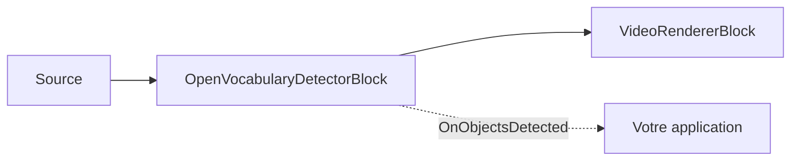

# Détection à vocabulaire ouvert — OpenVocabularyDetectorBlock

Vous devez détecter un objet sur lequel aucun modèle prêt à l'emploi n'a été entraîné — un outil
particulier, un produit ou un uniforme — mais vous n'avez ni jeu de données étiqueté ni le temps
d'entraîner et de déployer un détecteur personnalisé. La **détection à vocabulaire ouvert** résout ce
problème : nommez ce que vous cherchez en texte clair et le modèle le trouve, sans entraînement ni
liste de classes figée. Elle s'exécute sur l'appareil via ONNX (OWLv2 ou Grounding DINO), et vous
pouvez changer ce qu'elle détecte à tout moment en modifiant les prompts texte.

`OpenVocabularyDetectorBlock` détecte les objets décrits par des **prompts en texte libre** au lieu
d'une liste de classes fixe. Vous lui fournissez des phrases comme `"a person"`, `"a red backpack"`
ou `"a forklift"`, et il les trouve dans le flux vidéo — sans réentraînement, sans ensemble
d'étiquettes fixe. Il capte les images RGBA, exécute un modèle ONNX à vocabulaire ouvert (OWLv2 ou
Grounding DINO), dessine éventuellement des boîtes et des étiquettes dans l'image, et déclenche
`OnObjectsDetected` pour les images contenant des détections.

Comme les modèles à vocabulaire ouvert sont plus lourds qu'un détecteur à classes fixes, l'inférence
s'exécute sur un worker d'arrière-plan de type « dernier gagne » : le thread de streaming soumet une
copie de l'image et ne redessine que les détections les plus récentes mises en cache, de sorte que le
pipeline ne se bloque jamais. Le `Label` de chaque détection est la chaîne de prompt correspondante et
son `ClassId` est l'index (base zéro) de ce prompt.



Besoin d'un ensemble fixe de classes à vitesse maximale (COCO-80, ou vos propres étiquettes
entraînées) ? Utilisez plutôt [`YOLOObjectDetectorBlock`](object-detection.md) — il est bien plus
rapide mais ne peut pas détecter une classe pour laquelle il n'a pas été entraîné. La détection à
vocabulaire ouvert échange le débit contre la capacité de détecter tout ce que vous pouvez nommer.

## Comment fonctionne la détection à vocabulaire ouvert

La détection à vocabulaire ouvert est une forme de **détection zero-shot** : le modèle détecte des
classes pour lesquelles il n'a jamais été explicitement entraîné, spécifiées à l'exécution sous forme
de texte. Chaque image passe par quatre étapes :

1. **Encoder les prompts.** Chaque chaîne de prompt est tokenisée et transformée en une représentation
   vectorielle de texte (embedding). C'est peu coûteux et mis en cache jusqu'à ce que vous appeliez
   `SetPrompts`, donc ce n'est pas répété à chaque image.
2. **Encoder l'image.** L'image est prétraitée selon la convention du modèle (OWLv2 complète en carré
   et redimensionne à 960x960 ; Grounding DINO redimensionne à sa taille fixe) et encodée en
   caractéristiques d'image par région.
3. **Évaluer les régions par rapport aux prompts.** Chaque région candidate est évaluée par rapport à
   chaque embedding de prompt ; les régions dont le score dépasse `ConfidenceThreshold` deviennent des
   détections, étiquetées avec le prompt correspondant (`Label`) et son index (`ClassId`).
4. **Supprimer les chevauchements.** La suppression non maximale par classe (`IoUThreshold`) élimine
   les boîtes en double, et les `MaxDetections` meilleurs résultats sont renvoyés.

Les étapes 2 à 4 s'exécutent sur un worker d'arrière-plan de type « dernier gagne » afin que la vidéo
ne se bloque jamais — le thread de streaming dessine le résultat terminé le plus récent pendant que
l'inférence suivante est encore en cours.

## Familles de modèles prises en charge

Définissez `OpenVocabularyDetectorSettings.Model` pour correspondre à la structure du modèle ONNX.
Chaque famille utilise un tokeniseur et une convention de prétraitement différents.

| Modèle | Tokeniseur et prétraitement | Remarques |
| --- | --- | --- |
| `OpenVocabularyModel.OWLv2` (par défaut) | Tokeniseur BPE au niveau octet de CLIP (`vocab.json` + `merges.txt`). Image complétée en carré (en haut à gauche) et redimensionnée à 960x960 ; logits sigmoïdes par requête sur une grille de patchs fixe. | Nécessite à la fois `VocabFilePath` et `MergesFilePath`. Ignore `TextThreshold`. |
| `OpenVocabularyModel.GroundingDINO` | Tokeniseur WordPiece de BERT (`vocab.txt` uniquement). Prompts assemblés en une légende `prompt1 . prompt2 .`, en minuscules ; image redimensionnée à la taille d'entrée fixe du modèle ; scores de plage de tokens par requête sur 900 requêtes. | `MergesFilePath` n'est pas utilisé. `TextThreshold` filtre les contributions faibles par token. |

Le SDK ne fournit pas les poids du détecteur dans le paquet NuGet — fournissez le modèle `.onnx` et
ses fichiers de tokeniseur sous forme de chemins locaux (voir [Modèles](#modeles)). Les propriétés
héritées `InputWidth`/`InputHeight` sont **ignorées** : OWLv2 s'exécute toujours en 960x960 et
Grounding DINO utilise la taille fixe intégrée dans son modèle ONNX.

## Utilisation

```csharp
using VisioForge.Core.MediaBlocks;
using VisioForge.Core.MediaBlocks.AI;
using VisioForge.Core.MediaBlocks.VideoRendering;
using VisioForge.Core.Types.Events;
using VisioForge.Core.Types.VideoProcessing;
using VisioForge.Core.Types.X.AI;

var settings = new OpenVocabularyDetectorSettings(
    "owlv2-base-ensemble.onnx",
    "owlv2-vocab.json",
    "owlv2-merges.txt",
    new[] { "a person", "a car", "a red backpack" })
{
    Model = OpenVocabularyModel.OWLv2,
    ConfidenceThreshold = 0.25f,
    IoUThreshold = 0.5f,
    DrawDetections = true,
    Provider = OnnxExecutionProvider.Auto,
};

var detector = new OpenVocabularyDetectorBlock(settings);
detector.OnObjectsDetected += (sender, e) =>
{
    foreach (OnnxDetection obj in e.Objects)
    {
        // obj.Label est le prompt correspondant ; obj.ClassId est son index dans le tableau de prompts.
        Console.WriteLine($"{obj.Label} {obj.Confidence:P0} at {obj.Box}");
    }
};

var videoRenderer = new VideoRendererBlock(pipeline, videoView) { IsSync = false };

pipeline.Connect(source.Output, detector.Input);
pipeline.Connect(detector.Output, videoRenderer.Input);

await pipeline.StartAsync();

Console.WriteLine($"Active provider: {detector.ActiveProvider}");
```

Chaque `OnObjectsDetected` ne se déclenche que lorsque l'image contient des détections.
`ObjectsDetectedEventArgs` transporte `Objects` (un `OnnxDetection[]`) et le `Timestamp` de l'image.
Chaque `OnnxDetection` possède la boîte englobante `Box` en coordonnées de pixels de l'image source,
`ClassId` (l'index du prompt), `Label` (le prompt correspondant) et `Confidence`. `TrackerId` vaut
toujours `-1` — ce bloc ne suit pas les objets d'une image à l'autre.

### Modifier les prompts et les seuils à l'exécution

Les prompts et les seuils peuvent être mis à jour en direct sans reconstruire le pipeline — le
changement s'applique à l'image traitée suivante :

```csharp
detector.SetPrompts(new[] { "a delivery truck", "a bicycle" });
detector.SetConfidenceThreshold(0.30f);
detector.SetIoUThreshold(0.45f);
```

## Paramètres clés

`OpenVocabularyDetectorSettings` étend `OnnxInferenceSettings`.

| Propriété | Par défaut | Description |
| --- | --- | --- |
| `ModelPath` | — | Chemin absolu vers le fichier `.onnx` à vocabulaire ouvert. Obligatoire. |
| `Prompts` | `null` | Prompts de détection en texte libre. Chacun devient une classe détectable ; `Label` = prompt, `ClassId` = son index. |
| `VocabFilePath` | `null` | Vocabulaire du tokeniseur : `vocab.json` (OWLv2) ou `vocab.txt` (Grounding DINO). Obligatoire. |
| `MergesFilePath` | `null` | `merges.txt` BPE au niveau octet. Obligatoire pour OWLv2 ; laissez `null` pour Grounding DINO. |
| `Model` | `OpenVocabularyModel.OWLv2` | Sélectionne le tokeniseur, le prétraitement et le décodeur de sortie. |
| `ConfidenceThreshold` | `0.25` | Confiance minimale (0..1) pour qu'une détection soit signalée. |
| `TextThreshold` | `0.25` | Seuil de score de texte par token pour Grounding DINO. Ignoré par OWLv2. |
| `IoUThreshold` | `0.5` | Seuil de suppression non maximale pour la NMS par classe. |
| `MaxDetections` | `100` | Nombre maximal de détections renvoyées par image, par ordre de confiance décroissant. |
| `DrawDetections` | `true` | Dessine les boîtes de détection dans l'image vidéo. |
| `DrawLabels` | `true` | Dessine l'étiquette du prompt et la confiance à côté de chaque boîte. |
| `BoxColor` / `BoxThickness` | Vert citron / `2` | Style de superposition des boîtes. |
| `LabelFontSize` | `0` | Taille du texte de l'étiquette en px. `0` adapte automatiquement à la hauteur de l'image. |
| `Provider` / `DeviceId` | `Auto` / `0` | Fournisseur d'exécution ONNX et index du périphérique matériel. |
| `FramesToSkip` | `0` | Ignore des images entre les exécutions d'inférence pour réduire la charge. |

`InputWidth`/`InputHeight` et `NormalizeTo01` sont hérités de `OnnxInferenceSettings`, mais la taille
d'entrée est ignorée (chaque famille fixe la sienne). `OpenVocabularyDetectorBlock.ActiveProvider`
indique le fournisseur réellement utilisé une fois le bloc construit ; `LastInferenceTimeMs` et
`DroppedFrameCount` exposent le coût d'inférence en direct.

## Modèles

Les poids des modèles ne sont pas fournis avec le SDK. Les démos les téléchargent au premier lancement
depuis GitHub Releases et les mettent en cache dans `%USERPROFILE%\VisioForge\models\openvocab`.

| Modèle | Fichiers |
| --- | --- |
| OWLv2 | `owlv2-base-ensemble.onnx`, `owlv2-vocab.json`, `owlv2-merges.txt` |
| Grounding DINO | `grounding-dino-tiny.onnx`, `bert-vocab.txt` (aucun fichier merges) |

La licence d'un modèle est déterminée par son origine (code d'entraînement et poids publiés), et non
par le format ONNX ni par la licence du SDK lui-même. Vérifiez la licence des poids spécifiques que
vous déployez avant de livrer un produit à code source fermé.

## Rédiger des prompts efficaces

La formulation des prompts influe directement sur le rappel et la précision. Quelques règles
pratiques :

- **Utilisez des groupes nominaux courts** — `"a person"`, `"a delivery truck"`, `"a cardboard box"`.
  Les phrases complètes et les qualificatifs longs réduisent le rappel.
- **Un concept par prompt.** Chaque prompt est une classe distincte ; ne les combinez pas
  (« a person or a bag »).
- **Commencez large, puis affinez.** `"a car"` détecte plus que `"a red sports car"`. Ajoutez des
  descripteurs uniquement lorsque vous avez besoin de filtrer.
- **Grounding DINO met les prompts en minuscules** et les assemble en une seule légende séparée par
  des `.` — gardez des phrases distinctes et non ambiguës.
- **Chaque prompt ajoute un coût d'encodage du texte** au moment du changement de prompts (pas à chaque
  image), donc un vocabulaire en direct très volumineux peut être indexé sans souci, mais réduisez-le
  si les appels à `SetPrompts` vous semblent lents.

## Performances et réglage

Les modèles à vocabulaire ouvert sont plus lourds qu'un détecteur à classes fixes, le débit est donc
plus faible — anticipez-le plutôt que de lutter contre :

- **Le pipeline ne se bloque jamais.** L'inférence est asynchrone et de type « dernier gagne », donc
  la vidéo en direct continue de jouer ; les boîtes reflètent l'inférence terminée la plus récente.
- **Réduisez la fréquence d'inférence** avec `FramesToSkip` lorsque vous n'avez pas besoin d'un
  résultat à chaque image — le bloc continue de transmettre chaque image.
- **Utilisez un fournisseur GPU** (`CUDA`, `DirectML` ou `CoreML`) via `Provider`/`DeviceId` pour une
  forte baisse de latence par rapport au CPU.
- **La taille d'entrée est fixe par famille** (OWLv2 960x960 ; Grounding DINO sa taille intégrée) et ne
  peut pas être réduite pour échanger la précision contre la vitesse — choisissez plutôt le modèle le
  plus léger si vous avez besoin de plus de marge.
- **Surveillez le coût en direct** avec `LastInferenceTimeMs` et `DroppedFrameCount`, et lisez le
  fournisseur utilisé depuis `ActiveProvider` une fois le bloc construit.

## Utilisation avec VideoCaptureCoreX et MediaPlayerCoreX

La même instance de bloc s'insère dans l'un ou l'autre moteur de haut niveau. Enregistrez-la avant le
démarrage de la session :

```csharp
var detector = new OpenVocabularyDetectorBlock(settings);
detector.OnObjectsDetected += Detector_OnObjectsDetected;

core.Video_Processing_AddBlock(detector);   // VideoCaptureCoreX — avant StartAsync
// player.Video_Processing_AddBlock(detector); // MediaPlayerCoreX — avant OpenAsync/PlayAsync

await core.StartAsync();

// Les prompts et les seuils restent modifiables en direct pendant que la session s'exécute :
detector.SetPrompts(new[] { "a person wearing a hard hat" });
```

`SetPrompts` rend la détection à vocabulaire ouvert particulièrement utile sur un flux de caméra en
direct : un opérateur peut changer ce qu'il recherche à la volée. Consultez
[Utiliser les blocs IA avec VideoCaptureCoreX et MediaPlayerCoreX](x-engines.md) pour l'API complète
des blocs de traitement, l'ordre d'insertion et les règles de cycle de vie communes à chaque bloc IA
vidéo.

## Détection à vocabulaire ouvert ou entraînement de votre propre modèle

Le choix dépend de la disponibilité de données étiquetées et de la fréquence à laquelle les classes
cibles changent.

| Situation | Meilleur choix |
| --- | --- |
| Aucune donnée étiquetée, et vous avez besoin de résultats maintenant | **Vocabulaire ouvert** — décrivez la classe en texte, zéro entraînement. |
| Les classes cibles changent souvent, ou l'utilisateur les choisit à l'exécution | **Vocabulaire ouvert** — permutez les prompts en direct avec `SetPrompts`, sans redéploiement. |
| Un grand jeu de données étiqueté et un besoin de précision maximale sur des classes fixes | **Entraîner un modèle** — YOLO / RT-DETR ; voir [détection d'objets](object-detection.md). |
| La fréquence d'images la plus élevée possible sur quelques classes bien connues | **Détecteur à classes fixes entraîné** — il est plus rapide ; le vocabulaire ouvert échange la vitesse contre la flexibilité. |

Un schéma courant consiste à prototyper avec la détection à vocabulaire ouvert pour confirmer qu'une
classe est même détectable dans vos séquences, puis à entraîner un modèle à classes fixes plus tard,
uniquement si vous avez besoin de la vitesse supplémentaire.

## Cas d'usage

- **Requêtes de surveillance ponctuelles** — recherchez dans un flux de caméra « a person carrying a
  bag » ou « a white van » sans entraîner de modèle personnalisé.
- **Commerce de détail et inventaire** — détectez un produit quelconque décrit avec des mots, ou un
  espace d'étagère vide, pour une couche de logique métier en aval.
- **Prototypage et tri** — validez qu'une classe est détectable dans vos séquences avant d'investir
  dans un modèle YOLO entraîné à classes fixes pour la vitesse en production.
- **Classes rares et de longue traîne** — détectez des objets qui n'ont aucun détecteur entraîné prêt
  à l'emploi en les nommant simplement.
- **Outils interactifs** — laissez un utilisateur final saisir ce qu'il cherche, et mettez à jour
  `SetPrompts` depuis l'interface.

## Dépannage

| Symptôme | Cause probable | Solution |
| --- | --- | --- |
| Aucune détection | `ConfidenceThreshold` trop élevé, prompts trop spécifiques, ou mauvaise famille `Model` pour le fichier ONNX | Réduisez `ConfidenceThreshold` ; utilisez des prompts plus simples (« a car » avant « a red sports car ») ; vérifiez que `Model` correspond au modèle exporté. |
| Erreur de tokeniseur / au démarrage | Fichiers de tokeniseur manquants ou incompatibles | OWLv2 nécessite `VocabFilePath` **et** `MergesFilePath` ; Grounding DINO ne nécessite que `VocabFilePath` (`vocab.txt`). |
| Boîtes en double ou qui se chevauchent | `IoUThreshold` trop élevé (suppression faible) | Réduisez `IoUThreshold` (ou appelez `SetIoUThreshold`). |
| Grounding DINO renvoie des tokens parasites | `TextThreshold` trop bas | Augmentez `TextThreshold` — OWLv2 ignore ce paramètre. |
| Utilisation CPU/GPU élevée en vidéo en direct | L'inférence s'exécute sur chaque image | Augmentez `FramesToSkip` ; le bloc continue de transmettre chaque image, il infère simplement moins souvent. |
| Les boîtes n'apparaissent qu'après un délai | Comportement attendu — l'inférence est asynchrone et de type « dernier gagne » | L'image n'est jamais bloquée ; les boîtes reflètent l'inférence terminée la plus récente. |

## Foire aux questions

### Comment détecter un objet personnalisé sans jeu de données ?

Nommez-le dans un prompt texte — par exemple
`new OpenVocabularyDetectorSettings(modelPath, vocabPath, mergesPath, new[] { "a forklift", "a safety vest" })`.
Il n'y a aucune image à collecter, aucun étiquetage et aucune exécution d'entraînement. Si un groupe
nominal simple sous-détecte, rendez-le légèrement plus spécifique (`"an orange safety vest"`). Consultez
[Rédiger des prompts efficaces](#rediger-des-prompts-efficaces).

### Dois-je entraîner ou affiner quoi que ce soit ?

Non. Les modèles à vocabulaire ouvert sont pré-entraînés pour détecter des classes arbitraires décrites
en texte, vous ne fournissez donc que le texte du prompt plus le modèle ONNX et les fichiers de
tokeniseur — il n'y a aucune étape d'entraînement ou d'affinage.

### Par quel modèle devrais-je commencer ?

`OWLv2` (la valeur par défaut) offre une bonne précision en vocabulaire ouvert et prend à la fois un
fichier vocab et un fichier merges. `GroundingDINO` (tiny) est une alternative plus légère qui
n'utilise qu'un `vocab.txt` et ancre les phrases sur une légende séparée par des `.`. Essayez d'abord
OWLv2 ; passez à Grounding DINO si vous avez besoin d'un modèle plus petit.

### En quoi cela diffère-t-il de YOLOObjectDetectorBlock ?

[`YOLOObjectDetectorBlock`](object-detection.md) détecte un ensemble **fixe** de classes pour
lesquelles il a été entraîné, très rapidement. La détection à vocabulaire ouvert détecte **tout ce que
vous décrivez en texte**, à un coût par image plus élevé. Utilisez YOLO pour des classes connues à
fréquence d'images élevée ; utilisez le vocabulaire ouvert pour des requêtes flexibles ou rares.

### Puis-je changer ce qu'il recherche pendant son exécution ?

Oui — appelez `SetPrompts` à tout moment. Les nouveaux prompts s'appliquent à l'image traitée suivante,
sans reconstruction du pipeline. `SetConfidenceThreshold` et `SetIoUThreshold` sont également
modifiables en direct.

### Suit-il les objets d'une image à l'autre ?

Non — chaque détection est indépendante par image et `TrackerId` vaut toujours `-1`. Pour des identités
persistantes, des lignes de franchissement ou du comptage par zone, consultez
[Analytique d'objets](object-analytics.md).

### Un GPU est-il nécessaire ?

Non. `Provider` vaut `Auto` par défaut, ce qui s'exécute sur le CPU lorsqu'aucun fournisseur GPU n'est
présent. Un fournisseur `CUDA`, `DirectML` ou `CoreML` réduit la latence par image, ce qui compte le
plus pour ces modèles plus lourds.

### La détection à vocabulaire ouvert est-elle identique à la détection d'objets zero-shot ?

Oui. « Vocabulaire ouvert » et « zero-shot » décrivent ici la même capacité : détecter des classes
d'objets pour lesquelles le modèle n'a pas été explicitement entraîné, choisies à l'exécution par
prompt texte plutôt que par un ensemble d'étiquettes fixe. OWLv2 et Grounding DINO sont deux familles
de détecteurs à vocabulaire ouvert (zero-shot) bien connues.

### Combien de prompts puis-je détecter à la fois ?

Il n'y a pas de limite stricte au nombre de prompts — chacun devient sa propre classe. `MaxDetections`
(par défaut `100`) limite le nombre de boîtes renvoyées par image, pas le nombre de prompts que vous
fournissez. Un plus grand nombre de prompts ajoute un coût d'encodage du texte lorsque vous les
définissez, pas à chaque image.

### Peut-il fonctionner entièrement hors ligne ?

Oui. L'inférence est entièrement locale en ONNX — aucun appel au cloud à l'exécution. Seul le
téléchargement initial du modèle nécessite un réseau, et vous pouvez livrer les fichiers `.onnx` et de
tokeniseur avec votre application pour éviter même cela.

### Pourquoi les détections sont-elles étiquetées avec le texte de mon prompt ?

C'est voulu. Contrairement à un détecteur à classes fixes qui émet des identifiants de classe
numériques, le `Label` de chaque détection à vocabulaire ouvert est le prompt exact qu'elle a mis en
correspondance et son `ClassId` est l'index (base zéro) de ce prompt dans le tableau que vous avez
fourni — vous savez donc toujours quelle requête a produit chaque boîte.

### Puis-je utiliser mon propre modèle ONNX à vocabulaire ouvert ?

Oui, tant qu'il correspond à l'une des structures prises en charge (`OWLv2` ou `GroundingDINO`) et que
vous faites pointer `VocabFilePath`/`MergesFilePath` vers les fichiers de tokeniseur correspondants et
définissez `Model` en conséquence.

## Démos

Des démos dédiées construites sur Media Blocks, `VideoCaptureCoreX` et `MediaPlayerCoreX`
(`Open Vocabulary Detection Demo`, `Open Vocabulary Detection MB`,
`Capture Open Vocabulary Detection X`, `Capture Open Vocabulary Detection X WPF`,
`Player Open Vocabulary Detection X`, `Player Open Vocabulary Detection X WPF`) figurent dans
l'ensemble de démos du SDK et seront liées ici une fois publiées dans le dépôt d'échantillons public.
