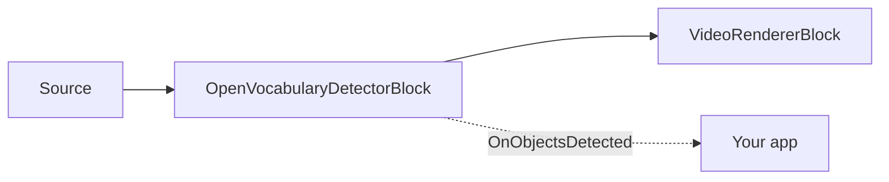

# Open Vocabulary Detection — OpenVocabularyDetectorBlock

You need to detect an object that no off-the-shelf model was trained on — a specific tool, product, or
uniform — but you have no labeled dataset and no time to train and deploy a custom detector.
**Open-vocabulary detection** solves this: name what you're looking for in plain text and the model
finds it, with no training and no fixed class list. It runs on-device via ONNX (OWLv2 or Grounding
DINO), and you can change what it detects at any time by editing the text prompts.

`OpenVocabularyDetectorBlock` detects objects described by **free-text prompts** instead of a fixed
class list. You give it phrases like `"a person"`, `"a red backpack"`, or `"a forklift"`, and it
finds them in the video stream — no retraining, no fixed label set. It taps RGBA frames, runs an
open-vocabulary ONNX model (OWLv2 or Grounding DINO), optionally draws boxes and labels into the
frame, and raises `OnObjectsDetected` for frames that contain detections.

Because open-vocabulary models are heavier than a fixed-class detector, inference runs on a
background, latest-wins worker: the streaming thread submits a frame copy and only redraws the most
recent cached detections, so the pipeline never stalls. Each detection's `Label` is the matched
prompt string and its `ClassId` is that prompt's zero-based index.



Need a fixed set of classes at maximum speed (COCO-80, or your own trained labels)? Use
[`YOLOObjectDetectorBlock`](object-detection.md) instead — it is far faster but cannot detect a class
it was not trained on. Open-vocabulary detection trades throughput for the ability to detect anything
you can name.

## How open-vocabulary detection works

Open-vocabulary detection is a form of **zero-shot detection**: the model detects classes it was
never explicitly trained on, specified at run time as text. Each frame goes through four steps:

1. **Encode the prompts.** Every prompt string is tokenized and turned into a text embedding. This is
   cheap and cached until you call `SetPrompts`, so it is not repeated per frame.
2. **Encode the frame.** The frame is preprocessed to the model's convention (OWLv2 pads to a square
   and resizes to 960x960; Grounding DINO resizes to its fixed size) and encoded into per-region image
   features.
3. **Score regions against prompts.** Each candidate region is scored against each prompt embedding;
   regions scoring above `ConfidenceThreshold` become detections, labeled with the matched prompt
   (`Label`) and its index (`ClassId`).
4. **Suppress overlaps.** Class-wise non-maximum suppression (`IoUThreshold`) removes duplicate boxes,
   and the top `MaxDetections` results are returned.

Steps 2–4 run on a background, latest-wins worker so the video never stalls — the streaming thread
draws the most recent completed result while the next inference is still running.

## Supported model families

Set `OpenVocabularyDetectorSettings.Model` to match the ONNX model layout. Each family uses a
different tokenizer and preprocessing convention.

| Model | Tokenizer and preprocessing | Notes |
| --- | --- | --- |
| `OpenVocabularyModel.OWLv2` (default) | CLIP byte-level BPE tokenizer (`vocab.json` + `merges.txt`). Frame padded to a square (top-left) and resized to 960x960; per-query sigmoid logits over a fixed patch grid. | Requires both `VocabFilePath` and `MergesFilePath`. Ignores `TextThreshold`. |
| `OpenVocabularyModel.GroundingDINO` | BERT WordPiece tokenizer (`vocab.txt` only). Prompts joined into a `prompt1 . prompt2 .` caption, lowercased; frame resized to the model's fixed input size; per-query token-span scores over 900 queries. | `MergesFilePath` is not used. `TextThreshold` filters weak per-token contributions. |

The SDK does not ship detector weights in the NuGet package — supply the `.onnx` model and its
tokenizer files as local paths (see [Models](#models)). The inherited `InputWidth`/`InputHeight` are
**ignored**: OWLv2 always runs at 960x960 and Grounding DINO uses the fixed size baked into its ONNX
model.

## Usage

```csharp
using VisioForge.Core.MediaBlocks;
using VisioForge.Core.MediaBlocks.AI;
using VisioForge.Core.MediaBlocks.VideoRendering;
using VisioForge.Core.Types.Events;
using VisioForge.Core.Types.VideoProcessing;
using VisioForge.Core.Types.X.AI;

var settings = new OpenVocabularyDetectorSettings(
    "owlv2-base-ensemble.onnx",
    "owlv2-vocab.json",
    "owlv2-merges.txt",
    new[] { "a person", "a car", "a red backpack" })
{
    Model = OpenVocabularyModel.OWLv2,
    ConfidenceThreshold = 0.25f,
    IoUThreshold = 0.5f,
    DrawDetections = true,
    Provider = OnnxExecutionProvider.Auto,
};

var detector = new OpenVocabularyDetectorBlock(settings);
detector.OnObjectsDetected += (sender, e) =>
{
    foreach (OnnxDetection obj in e.Objects)
    {
        // obj.Label is the matched prompt; obj.ClassId is its index in the prompt array.
        Console.WriteLine($"{obj.Label} {obj.Confidence:P0} at {obj.Box}");
    }
};

var videoRenderer = new VideoRendererBlock(pipeline, videoView) { IsSync = false };

pipeline.Connect(source.Output, detector.Input);
pipeline.Connect(detector.Output, videoRenderer.Input);

await pipeline.StartAsync();

Console.WriteLine($"Active provider: {detector.ActiveProvider}");
```

Each `OnObjectsDetected` fires only when the frame has detections. `ObjectsDetectedEventArgs` carries
`Objects` (an `OnnxDetection[]`) and the frame `Timestamp`. Each `OnnxDetection` has the bounding
`Box` in source-frame pixel coordinates, `ClassId` (the prompt index), `Label` (the matched prompt),
and `Confidence`. `TrackerId` is always `-1` — this block does not track objects across frames.

### Changing prompts and thresholds at runtime

Prompts and thresholds can be updated live without rebuilding the pipeline — the change applies on
the next processed frame:

```csharp
detector.SetPrompts(new[] { "a delivery truck", "a bicycle" });
detector.SetConfidenceThreshold(0.30f);
detector.SetIoUThreshold(0.45f);
```

## Key settings

`OpenVocabularyDetectorSettings` extends `OnnxInferenceSettings`.

| Property | Default | Description |
| --- | --- | --- |
| `ModelPath` | — | Absolute path to the open-vocabulary `.onnx` file. Required. |
| `Prompts` | `null` | Free-text detection prompts. Each becomes a detectable class; `Label` = prompt, `ClassId` = its index. |
| `VocabFilePath` | `null` | Tokenizer vocab: `vocab.json` (OWLv2) or `vocab.txt` (Grounding DINO). Required. |
| `MergesFilePath` | `null` | Byte-level BPE `merges.txt`. Required for OWLv2; leave `null` for Grounding DINO. |
| `Model` | `OpenVocabularyModel.OWLv2` | Selects the tokenizer, preprocessing, and output decoder. |
| `ConfidenceThreshold` | `0.25` | Minimum confidence (0..1) for a reported detection. |
| `TextThreshold` | `0.25` | Per-token text-score threshold for Grounding DINO. Ignored by OWLv2. |
| `IoUThreshold` | `0.5` | Non-maximum-suppression threshold for class-wise NMS. |
| `MaxDetections` | `100` | Maximum detections returned per frame, highest confidence first. |
| `DrawDetections` | `true` | Draw detection boxes into the video frame. |
| `DrawLabels` | `true` | Draw the prompt label and confidence next to each box. |
| `BoxColor` / `BoxThickness` | Lime / `2` | Box overlay styling. |
| `LabelFontSize` | `0` | Label text size in px. `0` auto-scales to frame height. |
| `Provider` / `DeviceId` | `Auto` / `0` | ONNX execution provider and hardware device index. |
| `FramesToSkip` | `0` | Skip frames between inference runs to reduce load. |

`InputWidth`/`InputHeight` and `NormalizeTo01` are inherited from `OnnxInferenceSettings` but the
input size is ignored (each family fixes its own). `OpenVocabularyDetectorBlock.ActiveProvider`
reports the provider actually engaged after the block is built; `LastInferenceTimeMs` and
`DroppedFrameCount` expose live inference cost.

## Models

Model weights are not bundled with the SDK. The demos download them on first run from GitHub Releases
and cache them under `%USERPROFILE%\VisioForge\models\openvocab`.

| Model | Files |
| --- | --- |
| OWLv2 | `owlv2-base-ensemble.onnx`, `owlv2-vocab.json`, `owlv2-merges.txt` |
| Grounding DINO | `grounding-dino-tiny.onnx`, `bert-vocab.txt` (no merges file) |

A model's license is set by its origin (training code and published weights), not by the ONNX format
or the SDK's own license. Confirm the license of the specific weights you deploy before shipping a
closed-source product.

## Writing effective prompts

Prompt phrasing directly affects recall and precision. A few practical rules:

- **Use short noun phrases** — `"a person"`, `"a delivery truck"`, `"a cardboard box"`. Full sentences
  and long qualifiers narrow recall.
- **One concept per prompt.** Each prompt is a separate class; don't combine ("a person or a bag").
- **Start broad, then narrow.** `"a car"` detects more than `"a red sports car"`. Add descriptors only
  when you need to filter.
- **Grounding DINO lowercases prompts** and joins them into a single `.`-separated caption — keep
  phrases distinct and unambiguous.
- **Each prompt adds text-encoding cost** at prompt-change time (not per frame), so a huge live
  vocabulary is fine to index but trim it if `SetPrompts` calls feel slow.

## Performance and tuning

Open-vocabulary models are heavier than a fixed-class detector, so throughput is lower — plan for it
rather than fighting it:

- **The pipeline never stalls.** Inference is asynchronous and latest-wins, so live video keeps
  playing; boxes reflect the most recent completed inference.
- **Lower the inference rate** with `FramesToSkip` when you don't need a result on every frame — the
  block still passes every frame through.
- **Use a GPU provider** (`CUDA` or `DirectML`) via `Provider`/`DeviceId` for a large latency drop
  over CPU. **Do not set `CoreML` for these models on Apple hardware** — see the note below.
- **Input size is fixed per family** (OWLv2 960x960; Grounding DINO its baked-in size) and cannot be
  lowered to trade accuracy for speed — pick the lighter model instead if you need more headroom.
- **Watch live cost** with `LastInferenceTimeMs` and `DroppedFrameCount`, and read the engaged provider
  from `ActiveProvider` after the block is built.

## Use with VideoCaptureCoreX and MediaPlayerCoreX

The same block instance drops into either high-level engine. Register it before the session starts:

```csharp
var detector = new OpenVocabularyDetectorBlock(settings);
detector.OnObjectsDetected += Detector_OnObjectsDetected;

core.Video_Processing_AddBlock(detector);   // VideoCaptureCoreX — before StartAsync
// player.Video_Processing_AddBlock(detector); // MediaPlayerCoreX — before OpenAsync/PlayAsync

await core.StartAsync();

// Prompts and thresholds are still live-updatable while the session runs:
detector.SetPrompts(new[] { "a person wearing a hard hat" });
```

`SetPrompts` makes open-vocabulary detection especially useful on a live camera feed: an operator can
change what to look for on the fly. See
[Using AI blocks with VideoCaptureCoreX and MediaPlayerCoreX](x-engines.md) for the full
processing-block API, insertion order, and lifecycle rules shared by every video AI block.

## Open-vocabulary detection vs training your own model

The choice comes down to whether you have labeled data and how much the target classes change.

| Situation | Best choice |
| --- | --- |
| No labeled data, and you need results now | **Open-vocabulary** — describe the class in text, zero training. |
| The target classes change often, or the user picks them at run time | **Open-vocabulary** — swap prompts live with `SetPrompts`, no redeploy. |
| A large labeled dataset and a need for maximum accuracy on fixed classes | **Train a model** — YOLO / RT-DETR; see [object detection](object-detection.md). |
| The highest possible frame rate on a few well-known classes | **Trained fixed-class detector** — it's faster; open-vocabulary trades speed for flexibility. |

A common pattern is to prototype with open-vocabulary detection to confirm a class is even detectable
in your footage, then train a fixed-class model later only if you need the extra speed.

## Use cases

- **Ad-hoc surveillance queries** — search a camera feed for "a person carrying a bag" or "a white
  van" without training a custom model.
- **Retail and inventory** — detect an arbitrary product described in words, or empty shelf space, for
  a downstream business layer.
- **Prototyping and triage** — validate that a class is detectable in your footage before investing in
  a trained, fixed-class YOLO model for production speed.
- **Long-tail and rare classes** — detect objects that have no off-the-shelf trained detector by
  simply naming them.
- **Interactive tools** — let an end user type what to find, and update `SetPrompts` from the UI.

## Troubleshooting

| Symptom | Likely cause | Fix |
| --- | --- | --- |
| No detections at all | `ConfidenceThreshold` too high, prompts too specific, or the wrong `Model` family for the ONNX file | Lower `ConfidenceThreshold`; use simpler prompts ("a car" before "a red sports car"); confirm `Model` matches the exported model. |
| Tokenizer / startup error | Missing or mismatched tokenizer files | OWLv2 needs `VocabFilePath` **and** `MergesFilePath`; Grounding DINO needs only `VocabFilePath` (`vocab.txt`). |
| Duplicate or overlapping boxes | `IoUThreshold` too high (weak suppression) | Lower `IoUThreshold` (or call `SetIoUThreshold`). |
| Grounding DINO returns noisy tokens | `TextThreshold` too low | Raise `TextThreshold` — OWLv2 ignores this setting. |
| High CPU/GPU usage on live video | Inference running on every frame | Raise `FramesToSkip`; the block still passes every frame through, it just infers less often. |
| Boxes appear only after a delay | Expected — inference is asynchronous and latest-wins | The frame is never stalled; boxes reflect the most recent completed inference. |

## Frequently Asked Questions

### How do I detect a custom object without a dataset?

Name it in a text prompt — for example
`new OpenVocabularyDetectorSettings(modelPath, vocabPath, mergesPath, new[] { "a forklift", "a safety vest" })`.
There are no images to collect, no labeling, and no training run. If a plain noun phrase under-detects,
make it slightly more specific (`"an orange safety vest"`). See
[Writing effective prompts](#writing-effective-prompts).

### Do I need to train or fine-tune anything?

No. Open-vocabulary models are pre-trained to detect arbitrary text-described classes, so you supply
only the prompt text plus the ONNX model and tokenizer files — there is no training or fine-tuning step.

### Which model should I start with?

`OWLv2` (the default) gives strong open-vocabulary accuracy and takes both a vocab and a merges file.
`GroundingDINO` (tiny) is a lighter alternative that uses only a `vocab.txt` and phrase-grounds a
`.`-separated caption. Try OWLv2 first; switch to Grounding DINO if you need a smaller model.

### How is this different from YOLOObjectDetectorBlock?

[`YOLOObjectDetectorBlock`](object-detection.md) detects a **fixed** set of classes it was trained on,
very fast. Open-vocabulary detection detects **anything you describe in text**, at a higher per-frame
cost. Use YOLO for known classes at high frame rates; use open-vocabulary for flexible or rare
queries.

### Can I change what it looks for while it's running?

Yes — call `SetPrompts` at any time. The new prompts apply on the next processed frame, with no
pipeline rebuild. `SetConfidenceThreshold` and `SetIoUThreshold` are also live.

### Does it track objects across frames?

No — each detection is independent per frame and `TrackerId` is always `-1`. For persistent identities,
tripwires, or zone counting, see [Object analytics](object-analytics.md).

### Is a GPU required?

No. `Provider` defaults to `Auto`, which runs on the CPU when no GPU provider is present. A `CUDA` or
`DirectML` provider lowers per-frame latency, which matters most for these heavier models.

### Why does `Auto` not use CoreML for this block?

On Apple hardware `Auto` picks CPU for open-vocabulary detection even though CoreML is available, and
that is deliberate. ONNX Runtime cannot map these graphs to CoreML in one piece: it splits OWLv2 into
126 partitions and Grounding DINO into 255, each compiled and held as a separate CoreML model. The
result is not slow, it is unusable — measured on a 24 GB Mac, the session grew past 5.8 GB resident
plus several GB of swap and never settled, while the same model on CPU peaks at about 4 GB and
returns a frame in roughly 1.3 s.

Only the `Auto` default is redirected. Setting `Provider = OnnxExecutionProvider.CoreML` explicitly
still does exactly what you ask, and it is not recommended for these two model families. Other AI
blocks are unaffected — models that CoreML maps in a handful of partitions still use it.

### Is open-vocabulary detection the same as zero-shot object detection?

Yes. "Open-vocabulary" and "zero-shot" describe the same capability here: detecting object classes the
model was not explicitly trained on, chosen at run time by text prompt rather than by a fixed label
set. OWLv2 and Grounding DINO are two well-known open-vocabulary (zero-shot) detector families.

### How many prompts can I detect at once?

There is no hard limit on the number of prompts — each becomes its own class. `MaxDetections` (default
`100`) caps how many boxes are returned per frame, not how many prompts you supply. More prompts add
text-encoding cost when you set them, not on every frame.

### Can it run completely offline?

Yes. Inference is entirely local ONNX — no cloud call at run time. Only the initial model download
needs a network, and you can ship the `.onnx` and tokenizer files with your app to avoid even that.

### Why are detections labeled with my prompt text?

By design. Unlike a fixed-class detector that emits numeric class ids, each open-vocabulary detection's
`Label` is the exact prompt it matched and its `ClassId` is that prompt's zero-based index in the
array you supplied — so you always know which query produced each box.

### Can I use my own open-vocabulary ONNX model?

Yes, as long as it matches one of the supported layouts (`OWLv2` or `GroundingDINO`) and you point
`VocabFilePath`/`MergesFilePath` at the matching tokenizer files and set `Model` accordingly.

## Demos

Dedicated demos built on Media Blocks, `VideoCaptureCoreX`, and `MediaPlayerCoreX`
(`Open Vocabulary Detection Demo`, `Open Vocabulary Detection MB`,
`Capture Open Vocabulary Detection X`, `Capture Open Vocabulary Detection X WPF`,
`Player Open Vocabulary Detection X`, `Player Open Vocabulary Detection X WPF`) are in the SDK's demo
set and will be linked here once published to the public samples repository.
