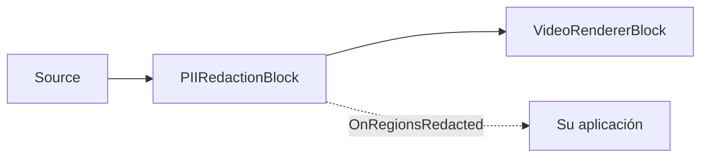

# Redacción de PII — Difuminar rostros, matrículas y texto en pantalla

`PIIRedactionBlock` oculta automáticamente la información de identificación personal en un flujo de vídeo:
detecta **rostros** (YuNet), **matrículas de vehículos** (FastALPR) y **texto en pantalla** (PaddleOCR), y luego
difumina, pixela o rellena cada región en el sitio, antes de que el fotograma llegue a un renderizador, a un
codificador o a un archivo. Cada modelo se ejecuta localmente sobre ONNX Runtime, por lo que no hay llamada a
una API en la nube, ni facturación por fotograma, ni ningún vídeo sale nunca del dispositivo. El bloque solo
*elimina* PII: nunca identifica a una persona ni emite los caracteres de una matrícula, y el contenido
reconocido nunca se exporta: los rostros y las matrículas se localizan únicamente mediante detección, mientras
que el texto en pantalla ejecuta OCR internamente solo para confirmar (y opcionalmente filtrar) qué redactar.
Cualquiera de las tres categorías puede habilitarse de forma independiente, y el estilo de redacción, la
intensidad del difuminado y las categorías habilitadas pueden cambiarse mientras la canalización está en
ejecución.



## Uso

El bloque se sitúa en medio de una canalización de Media Blocks: toma el vídeo de una fuente, lo redacta y pasa
los fotogramas limpios al siguiente bloque —un renderizador, un codificador o un sumidero de archivo—. El
ejemplo completo a continuación lee un archivo, difumina las tres categorías de PII, previsualiza el resultado e
informa de lo que se cubrió en cada fotograma.

```csharp
using System;
using VisioForge.Core.MediaBlocks;
using VisioForge.Core.MediaBlocks.AI;
using VisioForge.Core.MediaBlocks.Sources;
using VisioForge.Core.MediaBlocks.VideoRendering;
using VisioForge.Core.Types.X.AI;
using VisioForge.Core.Types.X.Sources;

// 1. Cree la canalización y una fuente. Aquí se usa un archivo; una webcam (SystemVideoSourceBlock) o una
//    cámara IP (RTSPSourceBlock) se conecta exactamente igual — solo cambia el bloque de fuente.
var pipeline = new MediaBlocksPipeline();

var sourceSettings = await UniversalSourceSettings.CreateAsync(
    "input.mp4", renderVideo: true, renderAudio: false);
var source = new UniversalSourceBlock(sourceSettings);

// 2. Configure qué categorías de PII redactar y cómo se ocultan.
var settings = new PIIRedactionSettings
{
    Style = PIIRedactionStyle.GaussianBlur,   // GaussianBlur (predeterminado), Pixelate o SolidFill
    BlurRadius = 20f,                         // intensidad del difuminado para GaussianBlur
};

// Rostros — detector YuNet (solo detección, sin reconocimiento de identidad).
settings.Faces.ModelPath = "face_detection_yunet_2023mar.onnx";

// Matrículas — detector FastALPR YOLOv9-T (solo detección, los caracteres de la matrícula nunca se leen).
settings.LicensePlates.ModelPath = "yolo-v9-t-640-license-plates-end2end.onnx";

// Texto en pantalla — PaddleOCR PP-OCR (detección + reconocimiento). Necesita tres archivos.
settings.Text.DetectionModelPath = "ch_PP-OCRv5_mobile_det.onnx";
settings.Text.RecognitionModelPath = "latin_PP-OCRv5_rec_mobile_infer.onnx";
settings.Text.CharacterDictionaryPath = "ppocrv5_latin_dict.txt";

// Desactive cualquier categoría que no necesite — una categoría deshabilitada no necesita modelo:
// settings.Text.Enabled = false;

var redaction = new PIIRedactionBlock(settings);

// 3. Opcional: informe de lo que se cubrió. El evento se dispara en un hilo de detección en segundo plano, así
//    que ordene el trabajo hacia el hilo de UI antes de tocar la interfaz. Solo se informan la categoría y el
//    cuadro — nunca el contenido reconocido.
redaction.OnRegionsRedacted += (sender, e) =>
{
    int faces = 0, plates = 0, text = 0;
    foreach (var region in e.Regions)
    {
        switch (region.Category)
        {
            case PIICategory.Face: faces++; break;
            case PIICategory.LicensePlate: plates++; break;
            case PIICategory.Text: text++; break;
        }
    }

    Console.WriteLine($"[{e.Timestamp:hh\\:mm\\:ss}] redacted {faces} face(s), {plates} plate(s), {text} text region(s)");
};

// 4. Conecte source -> redaction -> renderer e inicie. VideoView1 es su control VideoView (WPF/WinForms/etc.).
var videoRenderer = new VideoRendererBlock(pipeline, VideoView1);
pipeline.Connect(source.Output, redaction.Input);
pipeline.Connect(redaction.Output, videoRenderer.Input);

await pipeline.StartAsync();

// 5. Cuando las sesiones ONNX estén activas, confirme qué backend de hardware se activó.
Console.WriteLine($"PII redaction running on: {redaction.ActiveProvider}");

// ... más tarde, al cerrar:
// await pipeline.StopAsync();
// await pipeline.DisposeAsync();
```

Puntos clave sobre el comportamiento del bloque:

- **La redacción siempre se ejecuta**, incluso sin ningún suscriptor de `OnRegionsRedacted` — cubrir los píxeles
  *es* la salida del bloque, por lo que el evento sirve puramente para informe/telemetría.
- **Al menos una categoría debe estar habilitada con una ruta de modelo válida**, o `Build` falla y la
  canalización no arranca. Habilite solo las categorías que necesite; una categoría deshabilitada no carga
  ningún modelo y no cuesta nada.
- **Cada `PIIRegion`** del evento lleva únicamente su `Category` (`Face`, `LicensePlate` o `Text`), el
  `BoundingBox` con relleno en píxeles del fotograma de origen y la `Score` de detección (0..1) — nunca el
  contenido reconocido.
- **La detección se ejecuta en un trabajador en segundo plano**, no en el hilo de streaming, por lo que el vídeo
  en directo nunca se detiene; cada fotograma se redacta con las regiones más recientes mientras el detector se
  pone al día (véase [Privacidad y cumplimiento](#privacidad-y-cumplimiento) para la implicación de latencia en
  directo).
- **Para redactar directamente a un archivo** en lugar de previsualizar, reemplace `VideoRendererBlock` por un
  codificador + sumidero (por ejemplo, un `MP4OutputBlock`); el cableado source → redaction → sink es idéntico.

## Categorías de redacción y modelos

| Categoría | Detector | Modelo (licencia) | Notas |
| --- | --- | --- | --- |
| `Faces` | YuNet | `face_detection_yunet_2023mar.onnx` (MIT) | Solo detección — ningún rostro se identifica ni se compara. |
| `LicensePlates` | FastALPR YOLOv9-T | `yolo-v9-t-640-license-plates-end2end.onnx` (MIT) | Solo detección — los caracteres de la matrícula nunca se leen. |
| `Text` | PaddleOCR PP-OCR | detección + reconocimiento + diccionario (Apache-2.0) | El reconocimiento se ejecuta solo para filtrar los falsos positivos del detector; de forma predeterminada, se redacta cada región de texto reconocida. |

El SDK no distribuye los pesos del modelo en el paquete NuGet — véase [Obtención de los modelos](#obtencion-de-los-modelos).

La redacción de texto necesita tres archivos (modelo de detección, modelo de reconocimiento y diccionario de
caracteres) siempre que la categoría esté habilitada. El reconocimiento es necesario porque un *detector* de
texto por sí solo se dispara con texturas y bordes, de modo que la detección sin reconocimiento redactaría la
mayor parte de una escena real; el reconocimiento confirma qué cuadros son realmente texto. Una
`ClassificationModelPath` opcional corrige el texto rotado 180°.

## Estilos de redacción

`PIIRedactionSettings.Style` selecciona cómo se oculta cada región detectada:

| `PIIRedactionStyle` | Efecto | Ajuste relacionado |
| --- | --- | --- |
| `GaussianBlur` (predeterminado) | La región se reemplaza por una copia difuminada con desenfoque gaussiano de sí misma. | `BlurRadius` (sigma, predeterminado 20). |
| `Pixelate` | La región se reemplaza por un mosaico grueso. | `PixelateBlockSize` (tamaño de celda en px, predeterminado 16). |
| `SolidFill` | La región se pinta con un color sólido. | `FillColor` (predeterminado negro). |

`Style`, `BlurRadius`, `PixelateBlockSize` y `FillColor` pueden cambiarse mientras la canalización está en
ejecución.

## Configuración clave

`PIIRedactionSettings`:

| Propiedad | Valor por defecto | Descripción |
| --- | --- | --- |
| `Faces` / `LicensePlates` / `Text` | habilitado | Los tres objetos de subconfiguración por categoría (véase abajo). |
| `Style` | `GaussianBlur` | Estilo de redacción aplicado a cada región. |
| `BlurRadius` | `20` | Sigma del desenfoque gaussiano para `GaussianBlur`. |
| `PixelateBlockSize` | `16` | Tamaño de celda del mosaico, en píxeles, para `Pixelate`. |
| `FillColor` | Negro | Color de relleno para `SolidFill`. |
| `RegionPaddingPercent` | `0.15` | Expande cada cuadro detectado por lado (0.15 = 15%) para cubrir el movimiento entre ciclos de detección. |
| `RegionHoldTimeMs` | `700` | Mantiene una región cubierta durante este tiempo después de que el detector deja de reportarla, para que el parpadeo del detector nunca deje ver PII. |
| `FramesToSkip` | `0` | Fotogramas a omitir entre detecciones en vídeo en directo (`0` envía cada fotograma). La detección siempre se ejecuta en un trabajador en segundo plano. |
| `Provider` / `DeviceId` | `Auto` / `0` | Proveedor de ejecución ONNX e índice del dispositivo de hardware. |

Cada categoría expone su propio ajuste del detector.

Rostros (`PIIFaceRedactionSettings`):

| Propiedad | Valor por defecto |
| --- | --- |
| `Enabled` | `true` |
| `ModelPath` | — |
| `DetectionInputSize` | `320` |
| `ConfidenceThreshold` | `0.5` |
| `NmsThreshold` | `0.3` |
| `MaxFaces` | `50` |

Matrículas (`PIIPlateRedactionSettings`):

| Propiedad | Valor por defecto |
| --- | --- |
| `Enabled` | `true` |
| `ModelPath` | — |
| `DetectionInputSize` | `640` |
| `ConfidenceThreshold` | `0.3` |
| `MaxDetections` | `20` |

`Text` (`PIITextRedactionSettings`): `Enabled` (`true`), `DetectionModelPath`, `RecognitionModelPath`,
`CharacterDictionaryPath`, `ClassificationModelPath` opcional, `TextFilterRegex` (véase abajo), `MaxSideLength`
(`1024`), `BoxThreshold` (`0.3`), `BoxScoreThreshold` (`0.5`), `UnclipRatio` (`1.6`).

El bloque también expone diagnósticos de solo lectura una vez construido: `ActiveProvider` (el proveedor de
ejecución que realmente se activó), `LastInferenceTimeMs` (tiempo de reloj del ciclo de detección más reciente) y
`DroppedFrameCount` (fotogramas que llegaron mientras el detector estaba ocupado — igualmente redactados, solo
que no vueltos a detectar).

## Redactar solo texto específico

De forma predeterminada, se redacta cada región de texto reconocida. Establezca `Text.TextFilterRegex` para
redactar solo las regiones cuyo texto reconocido coincida con un patrón — por ejemplo, difuminar direcciones de
correo electrónico y números de teléfono dejando visibles los rótulos y los subtítulos:

```csharp
settings.Text.TextFilterRegex =
    @"(\b[\w.%+-]+@[\w.-]+\.[A-Za-z]{2,}\b)|(\+?\d[\d\s().-]{7,}\d)";
```

El reconocimiento se sigue ejecutando de todos modos (es lo que filtra las detecciones que no son texto); la
expresión regular solo limita qué regiones reconocidas se cubren.

## Obtención de los modelos

El SDK no incluye los pesos del modelo. Proporcione sus propios archivos `.onnx`, o reutilice los que los demos
descargan en la primera ejecución desde la versión de muestras hacia `%UserProfile%/VisioForge/models`:

| Archivo | Categoría | Licencia |
| --- | --- | --- |
| `face_detection_yunet_2023mar.onnx` | Rostros | MIT |
| `yolo-v9-t-640-license-plates-end2end.onnx` | Matrículas | MIT |
| `ch_PP-OCRv5_mobile_det.onnx` | Texto (detección) | Apache-2.0 |
| `latin_PP-OCRv5_rec_mobile_infer.onnx` | Texto (reconocimiento) | Apache-2.0 |
| `ppocrv5_latin_dict.txt` | Texto (diccionario) | Apache-2.0 |

Estos se descargan desde la versión `onnx-models-v1` del
[repositorio de muestras](https://github.com/visioforge/.Net-SDK-s-samples/releases/tag/onnx-models-v1). Para leer
el proveedor que ONNX Runtime seleccionó realmente, consulte `redaction.ActiveProvider` después de que arranque
la canalización.

## Uso con VideoCaptureCoreX y MediaPlayerCoreX

`PIIRedactionBlock` es un bloque de procesamiento de vídeo, por lo que se conecta directamente a los motores de
captura y reproducción — sin necesidad de una `MediaBlocksPipeline` manual. Añádalo antes de iniciar:

```csharp
var redaction = new PIIRedactionBlock(settings);
redaction.OnRegionsRedacted += Redaction_OnRegionsRedacted;

core.Video_Processing_AddBlock(redaction);       // VideoCaptureCoreX — antes de StartAsync
// player.Video_Processing_AddBlock(redaction);  // MediaPlayerCoreX — antes de OpenAsync/PlayAsync

await core.StartAsync();
```

Con VideoCaptureCoreX esto anonimiza una webcam, una cámara IP o una señal de tarjeta capturadora mientras se
previsualiza, se graba o se transmite. Véase [Uso de bloques de IA con VideoCaptureCoreX y MediaPlayerCoreX](x-engines.md)
para conocer la API compartida de bloques de procesamiento, el orden de inserción y las reglas de ciclo de vida.

## Privacidad y cumplimiento

Como cada detector se ejecuta localmente sobre ONNX Runtime, los fotogramas de vídeo y audio nunca salen del
dispositivo, lo que simplifica las revisiones de RGPD / CCPA / BIPA para aplicaciones con cámara. La redacción es
destructiva — los píxeles de cada región se sobrescriben en el fotograma, por lo que no hay ninguna
correspondencia reversible para recuperar el original. El evento `OnRegionsRedacted` lleva únicamente categorías
y cuadros; el contenido reconocido de una región (un número de matrícula, una cadena de texto) se omite
intencionadamente y nunca se incluye.

Una salvedad importa en las canalizaciones en directo: la detección se ejecuta en un trabajador en segundo plano
para mantener el flujo, por lo que **los fotogramas que llegan antes de que se complete el primer ciclo de
detección pasan sin redactar**, y si la resolución de la fuente cambia de golpe a mitad del flujo (por ejemplo,
HLS/RTSP adaptativo), un área recién expuesta puede filtrarse brevemente hasta el siguiente ciclo de detección.
Para una anonimización **sin fugas**, procese el archivo sin conexión a velocidad reducida en lugar de en
directo, de modo que cada fotograma se detecte antes de escribirse.

## Casos de uso

- **Grabaciones de cámara de salpicadero / cámara corporal** — difumine rostros y matrículas de transeúntes antes de publicar o compartir un clip de un incidente.
- **Exportaciones de CCTV y videovigilancia** — anonimice el vídeo grabado antes de entregarlo a un tercero.
- **Videoconferencia y uso compartido de pantalla** — pixele el texto en pantalla (documentos, credenciales) en una señal compartida.
- **Divulgación FOIA / judicial / de seguros** — redacte identidades en el vídeo publicado para cumplir las normas de privacidad.
- **Contenido generado por el usuario** — oculte automáticamente rostros y matrículas en los vídeos subidos.
- **Cartografía a nivel de calle y analítica** — anonimice rostros y matrículas en las grabaciones de conducción capturadas.

## Solución de problemas

| Síntoma | Causa probable | Solución |
| --- | --- | --- |
| Los primeros fotogramas muestran PII antes de que se active la redacción | La detección es asíncrona; los fotogramas anteriores al primer ciclo pasan sin filtrar | Esperado en fuentes en directo. Para evitar fugas, procese los archivos sin conexión a velocidad reducida. |
| Se difumina demasiado del fotograma (texto) | Falsos positivos del detector, o se está redactando cada región de texto | Aumente `Text.BoxScoreThreshold`; establezca `Text.TextFilterRegex` para redactar solo los patrones que le interesan. |
| Se pierde un rostro o una matrícula | `ConfidenceThreshold` demasiado alto, o el objeto es demasiado pequeño para `DetectionInputSize` | Reduzca el `ConfidenceThreshold` de la categoría; aumente `DetectionInputSize` para objetos pequeños o distantes. |
| Una región aparece y desaparece intermitentemente | Cadencia de detección demasiado escasa o tiempo de retención demasiado corto | Reduzca `FramesToSkip`; aumente `RegionHoldTimeMs`; aumente `RegionPaddingPercent` para movimiento rápido. |
| Se ejecuta en la CPU cuando hay una GPU presente | El proveedor solicitado no está disponible en la compilación de ONNX Runtime cargada | Compruebe `redaction.ActiveProvider`; instale el paquete de GPU de ONNX Runtime correspondiente; establezca `Provider`/`DeviceId`. |
| El vídeo en directo se entrecorta | La detección es demasiado lenta para la tasa de fotogramas en este hardware | Aumente `FramesToSkip`; observe `LastInferenceTimeMs` y `DroppedFrameCount` mientras ajusta. |

## Preguntas frecuentes

### ¿PIIRedactionBlock identifica personas o lee matrículas?

No. El bloque nunca ejecuta reconocimiento facial y nunca emite los caracteres de una matrícula — los rostros y
las matrículas se localizan únicamente mediante detección. El texto en pantalla se reconoce internamente solo
para decidir qué redactar (y para aplicar `TextFilterRegex`), y ese texto reconocido nunca se emite: el evento
`OnRegionsRedacted` lleva únicamente categorías y cuadros.

### ¿Cumple con RGPD / CCPA / BIPA?

La inferencia se ejecuta enteramente en el dispositivo, por lo que los fotogramas nunca salen de la máquina —que
es la parte difícil de las revisiones de privacidad de cámara y micrófono—. Para una salida garantizada sin
fugas, procese los archivos sin conexión a velocidad reducida de modo que cada fotograma se detecte antes de
escribirse; en flujos en directo, los primeros fotogramas anteriores al primer ciclo de detección pueden pasar
sin redactar. El cumplimiento también depende de su gestión general de los datos — revise las regulaciones
aplicables a su jurisdicción.

### ¿Qué modelos necesito y de dónde los obtengo?

Los rostros necesitan un modelo YuNet; las matrículas necesitan un modelo FastALPR; el texto en pantalla
necesita un modelo de detección PaddleOCR, un modelo de reconocimiento y un diccionario de caracteres. Los pesos
no se distribuyen en el paquete NuGet — véase [Obtención de los modelos](#obtencion-de-los-modelos).

### ¿Puedo redactar solo direcciones de correo electrónico y números de teléfono, no todo el texto?

Sí. Establezca `Text.TextFilterRegex` con un patrón; solo se redactan las regiones cuyo texto reconocido
coincide, y todo el demás texto en pantalla permanece visible.

### ¿Puedo activar o desactivar una categoría mientras el vídeo está en ejecución?

Puede desactivar una categoría (y volver a activarla) en directo **si estaba habilitada cuando se construyó el
bloque** — el detector de una categoría se crea solo cuando esa categoría está habilitada en el momento de la
construcción. Para añadir una categoría que estaba deshabilitada al inicio, reconstruya el bloque. El estilo, el
radio de difuminado y el color de relleno son todos ajustables en directo.

### ¿Puedo ejecutar la redacción en la GPU?

Sí. Establezca `Provider` en `CUDA`, `DirectML` o `CoreML` (o déjelo en `Auto`), con `DeviceId` para el índice
de la GPU. Si el proveedor solicitado no está disponible, ONNX Runtime recurre a la CPU; consulte
`ActiveProvider` para confirmar qué se activó.

### ¿Es reversible la redacción?

No. La redacción sobrescribe los píxeles de cada región directamente en el fotograma, por lo que el contenido
original no puede recuperarse a partir de la salida.

## Demos

- **[PII Redaction Demo](https://github.com/visioforge/.Net-SDK-s-samples/tree/master/Media%20Blocks%20SDK/WPF/CSharp/PII%20Redaction%20Demo)** — demo de canalización Media Blocks en WPF (fuente webcam, archivo o RTSP).
- **[Player PII Redaction X](https://github.com/visioforge/.Net-SDK-s-samples/tree/master/Media%20Player%20SDK%20X/WPF/Player%20PII%20Redaction%20X%20WPF)** — redacción con MediaPlayerCoreX en reproducción de archivos (WPF).
- **[Capture PII Redaction X](https://github.com/visioforge/.Net-SDK-s-samples/tree/master/Video%20Capture%20SDK%20X/WPF/CSharp/Capture%20PII%20Redaction%20X%20WPF)** — redacción con VideoCaptureCoreX en una cámara en directo (WPF).
