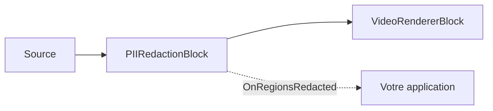

# Masquage des données personnelles — flouter les visages, les plaques et le texte à l'écran

`PIIRedactionBlock` masque automatiquement les données personnelles identifiables dans un flux vidéo : il détecte
les **visages** (YuNet), les **plaques d'immatriculation** (FastALPR) et le **texte à l'écran** (PaddleOCR), puis
floute, pixellise ou remplit chaque région sur place — avant que l'image n'atteigne un moteur de rendu, un encodeur
ou un fichier. Chaque modèle s'exécute localement via ONNX Runtime, si bien qu'il n'y a aucun appel d'API cloud,
aucune facturation à l'image et aucune vidéo ne quitte jamais l'appareil. Le bloc se contente de *supprimer* les
données personnelles — il n'identifie jamais une personne et ne restitue jamais les caractères d'une plaque, et le
contenu reconnu n'est jamais exporté : les visages et les plaques sont localisés par simple détection, tandis que le
texte à l'écran passe par un OCR en interne uniquement pour confirmer (et éventuellement filtrer) ce qui doit être
masqué. Chacune des trois catégories peut être activée indépendamment, et le style de masquage, l'intensité du flou
et les catégories activées peuvent tous être modifiés pendant que le pipeline est en cours d'exécution.



## Utilisation

Le bloc se place au milieu d'un pipeline Media Blocks : il reçoit la vidéo d'une source, la masque, puis transmet
les images nettoyées au bloc suivant — un moteur de rendu, un encodeur ou un sink de fichier. L'exemple complet
ci-dessous lit un fichier, floute les trois catégories de données personnelles, prévisualise le résultat et signale
ce qui a été couvert sur chaque image.

```csharp
using System;
using VisioForge.Core.MediaBlocks;
using VisioForge.Core.MediaBlocks.AI;
using VisioForge.Core.MediaBlocks.Sources;
using VisioForge.Core.MediaBlocks.VideoRendering;
using VisioForge.Core.Types.X.AI;
using VisioForge.Core.Types.X.Sources;

// 1. Créez le pipeline et une source. Un fichier est utilisé ici ; une webcam (SystemVideoSourceBlock) ou une
//    caméra IP (RTSPSourceBlock) se branche exactement de la même manière — seul le bloc source change.
var pipeline = new MediaBlocksPipeline();

var sourceSettings = await UniversalSourceSettings.CreateAsync(
    "input.mp4", renderVideo: true, renderAudio: false);
var source = new UniversalSourceBlock(sourceSettings);

// 2. Configurez les catégories de données personnelles à masquer et la façon de les occulter.
var settings = new PIIRedactionSettings
{
    Style = PIIRedactionStyle.GaussianBlur,   // GaussianBlur (par défaut), Pixelate ou SolidFill
    BlurRadius = 20f,                         // intensité du flou pour GaussianBlur
};

// Visages — détecteur YuNet (détection uniquement, aucune reconnaissance d'identité).
settings.Faces.ModelPath = "face_detection_yunet_2023mar.onnx";

// Plaques d'immatriculation — détecteur FastALPR YOLOv9-T (détection uniquement, les caractères de la plaque ne sont jamais lus).
settings.LicensePlates.ModelPath = "yolo-v9-t-640-license-plates-end2end.onnx";

// Texte à l'écran — PaddleOCR PP-OCR (détection + reconnaissance). Nécessite trois fichiers.
settings.Text.DetectionModelPath = "ch_PP-OCRv5_mobile_det.onnx";
settings.Text.RecognitionModelPath = "latin_PP-OCRv5_rec_mobile_infer.onnx";
settings.Text.CharacterDictionaryPath = "ppocrv5_latin_dict.txt";

// Désactivez toute catégorie dont vous n'avez pas besoin — une catégorie désactivée n'a besoin d'aucun modèle :
// settings.Text.Enabled = false;

var redaction = new PIIRedactionBlock(settings);

// 3. Facultatif : signalez ce qui a été couvert. L'événement se déclenche sur un thread de détection en arrière-plan ;
//    rebasculez donc vers le thread d'interface avant de toucher à l'interface. Seuls la catégorie et le cadre sont signalés — jamais le contenu reconnu.
redaction.OnRegionsRedacted += (sender, e) =>
{
    int faces = 0, plates = 0, text = 0;
    foreach (var region in e.Regions)
    {
        switch (region.Category)
        {
            case PIICategory.Face: faces++; break;
            case PIICategory.LicensePlate: plates++; break;
            case PIICategory.Text: text++; break;
        }
    }

    Console.WriteLine($"[{e.Timestamp:hh\\:mm\\:ss}] redacted {faces} face(s), {plates} plate(s), {text} text region(s)");
};

// 4. Reliez source -> masquage -> moteur de rendu et démarrez. VideoView1 est votre contrôle VideoView (WPF/WinForms/etc.).
var videoRenderer = new VideoRendererBlock(pipeline, VideoView1);
pipeline.Connect(source.Output, redaction.Input);
pipeline.Connect(redaction.Output, videoRenderer.Input);

await pipeline.StartAsync();

// 5. Une fois les sessions ONNX actives, vérifiez quel backend matériel a été engagé.
Console.WriteLine($"PII redaction running on: {redaction.ActiveProvider}");

// ... plus tard, à l'arrêt :
// await pipeline.StopAsync();
// await pipeline.DisposeAsync();
```

Points clés sur le comportement du bloc :

- **Le masquage s'exécute toujours**, même sans abonné à `OnRegionsRedacted` — couvrir les pixels *constitue* la
  sortie du bloc, si bien que l'événement sert uniquement au rapport/à la télémétrie.
- **Au moins une catégorie doit être activée avec un chemin de modèle valide**, sinon `Build` échoue et le pipeline
  ne démarre pas. N'activez que les catégories dont vous avez besoin ; une catégorie désactivée ne charge aucun
  modèle et ne coûte rien.
- **Chaque `PIIRegion`** de l'événement ne transporte que sa `Category` (`Face`, `LicensePlate` ou `Text`), le
  `BoundingBox` élargi exprimé en pixels de l'image source et le `Score` de détection (0..1) — jamais le contenu
  reconnu.
- **La détection s'exécute sur un thread d'arrière-plan**, et non sur le thread de diffusion, si bien que la vidéo
  en direct ne se bloque jamais ; chaque image est masquée avec les régions les plus récentes pendant que le
  détecteur rattrape son retard (voir [Confidentialité et conformité](#confidentialite-et-conformite) pour les
  conséquences en matière de latence en direct).
- **Pour masquer directement vers un fichier** au lieu de prévisualiser, remplacez `VideoRendererBlock` par un
  encodeur + sink (par exemple un `MP4OutputBlock`) ; le câblage source → masquage → sink est identique.

## Catégories de masquage et modèles

| Catégorie | Détecteur | Modèle (licence) | Notes |
| --- | --- | --- | --- |
| `Faces` | YuNet | `face_detection_yunet_2023mar.onnx` (MIT) | Détection uniquement — aucun visage n'est identifié ni mis en correspondance. |
| `LicensePlates` | FastALPR YOLOv9-T | `yolo-v9-t-640-license-plates-end2end.onnx` (MIT) | Détection uniquement — les caractères de la plaque ne sont jamais lus. |
| `Text` | PaddleOCR PP-OCR | détection + reconnaissance + dictionnaire (Apache-2.0) | La reconnaissance ne sert qu'à filtrer les faux positifs du détecteur ; par défaut, chaque région de texte reconnue est masquée. |

Le SDK ne fournit pas les poids des modèles dans le paquet NuGet — voir [Obtenir les modèles](#obtenir-les-modeles).

Le masquage du texte nécessite trois fichiers (modèle de détection, modèle de reconnaissance et dictionnaire de
caractères) dès que la catégorie est activée. La reconnaissance est indispensable car un *détecteur* de texte seul
se déclenche sur les textures et les contours, si bien qu'une détection sans reconnaissance masquerait la majeure
partie d'une scène réelle ; la reconnaissance confirme quelles boîtes sont réellement du texte. Un
`ClassificationModelPath` facultatif corrige le texte pivoté de 180°.

## Styles de masquage

`PIIRedactionSettings.Style` sélectionne la façon dont chaque région détectée est occultée :

| `PIIRedactionStyle` | Effet | Paramètre associé |
| --- | --- | --- |
| `GaussianBlur` (par défaut) | La région est remplacée par une copie floutée en gaussien d'elle-même. | `BlurRadius` (sigma, 20 par défaut). |
| `Pixelate` | La région est remplacée par une mosaïque grossière. | `PixelateBlockSize` (taille de cellule en px, 16 par défaut). |
| `SolidFill` | La région est recouverte d'une couleur unie. | `FillColor` (noir par défaut). |

`Style`, `BlurRadius`, `PixelateBlockSize` et `FillColor` peuvent tous être modifiés pendant l'exécution du pipeline.

## Paramètres clés

`PIIRedactionSettings` :

| Propriété | Valeur par défaut | Description |
| --- | --- | --- |
| `Faces` / `LicensePlates` / `Text` | activé | Les trois objets de sous-paramètres par catégorie (voir ci-dessous). |
| `Style` | `GaussianBlur` | Style de masquage appliqué à chaque région. |
| `BlurRadius` | `20` | Sigma du flou gaussien pour `GaussianBlur`. |
| `PixelateBlockSize` | `16` | Taille de cellule de la mosaïque, en pixels, pour `Pixelate`. |
| `FillColor` | Noir | Couleur de remplissage pour `SolidFill`. |
| `RegionPaddingPercent` | `0.15` | Élargit chaque boîte détectée de chaque côté (0,15 = 15 %) pour couvrir les mouvements entre deux cycles de détection. |
| `RegionHoldTimeMs` | `700` | Maintient une région couverte pendant cette durée après que le détecteur cesse de la signaler, afin que le scintillement du détecteur ne laisse jamais apparaître de données personnelles. |
| `FramesToSkip` | `0` | Nombre d'images à ignorer entre deux détections sur une vidéo en direct (`0` soumet chaque image). La détection s'exécute toujours sur un thread d'arrière-plan. |
| `Provider` / `DeviceId` | `Auto` / `0` | Fournisseur d'exécution ONNX et index du périphérique matériel. |

Chaque catégorie expose ses propres réglages de détecteur.

Visages (`PIIFaceRedactionSettings`) :

| Propriété | Valeur par défaut |
| --- | --- |
| `Enabled` | `true` |
| `ModelPath` | — |
| `DetectionInputSize` | `320` |
| `ConfidenceThreshold` | `0.5` |
| `NmsThreshold` | `0.3` |
| `MaxFaces` | `50` |

Plaques d'immatriculation (`PIIPlateRedactionSettings`) :

| Propriété | Valeur par défaut |
| --- | --- |
| `Enabled` | `true` |
| `ModelPath` | — |
| `DetectionInputSize` | `640` |
| `ConfidenceThreshold` | `0.3` |
| `MaxDetections` | `20` |

`Text` (`PIITextRedactionSettings`) : `Enabled` (`true`), `DetectionModelPath`, `RecognitionModelPath`,
`CharacterDictionaryPath`, `ClassificationModelPath` facultatif, `TextFilterRegex` (voir ci-dessous), `MaxSideLength`
(`1024`), `BoxThreshold` (`0.3`), `BoxScoreThreshold` (`0.5`), `UnclipRatio` (`1.6`).

Le bloc expose également des diagnostics en lecture seule une fois construit : `ActiveProvider` (le fournisseur
d'exécution réellement engagé), `LastInferenceTimeMs` (durée réelle du cycle de détection le plus récent) et
`DroppedFrameCount` (images arrivées pendant que le détecteur était occupé — toujours masquées, simplement pas
redétectées).

## Masquer uniquement certains textes

Par défaut, chaque région de texte reconnue est masquée. Définissez `Text.TextFilterRegex` pour ne masquer que les
régions dont le texte reconnu correspond à un motif — par exemple, floutez les adresses e-mail et les numéros de
téléphone tout en laissant visibles la signalétique et les sous-titres :

```csharp
settings.Text.TextFilterRegex =
    @"(\b[\w.%+-]+@[\w.-]+\.[A-Za-z]{2,}\b)|(\+?\d[\d\s().-]{7,}\d)";
```

La reconnaissance s'exécute quand même dans tous les cas (c'est elle qui filtre les détections non textuelles) ;
l'expression régulière ne fait que restreindre les régions reconnues qui sont couvertes.

## Obtenir les modèles

Le SDK ne fournit pas les poids des modèles. Fournissez vos propres fichiers `.onnx`, ou réutilisez ceux que les
démos téléchargent au premier lancement depuis la version d'exemples vers `%UserProfile%/VisioForge/models` :

| Fichier | Catégorie | Licence |
| --- | --- | --- |
| `face_detection_yunet_2023mar.onnx` | Visages | MIT |
| `yolo-v9-t-640-license-plates-end2end.onnx` | Plaques d'immatriculation | MIT |
| `ch_PP-OCRv5_mobile_det.onnx` | Texte (détection) | Apache-2.0 |
| `latin_PP-OCRv5_rec_mobile_infer.onnx` | Texte (reconnaissance) | Apache-2.0 |
| `ppocrv5_latin_dict.txt` | Texte (dictionnaire) | Apache-2.0 |

Ils sont téléchargés depuis la version `onnx-models-v1` du
[dépôt d'exemples](https://github.com/visioforge/.Net-SDK-s-samples/releases/tag/onnx-models-v1). Pour connaître le
fournisseur que ONNX Runtime a réellement sélectionné, consultez `redaction.ActiveProvider` après le démarrage du
pipeline.

## Utilisation avec VideoCaptureCoreX et MediaPlayerCoreX

`PIIRedactionBlock` est un bloc de traitement vidéo, il se branche donc directement dans les moteurs de capture et
de lecture — aucun `MediaBlocksPipeline` manuel n'est nécessaire. Ajoutez-le avant de démarrer :

```csharp
var redaction = new PIIRedactionBlock(settings);
redaction.OnRegionsRedacted += Redaction_OnRegionsRedacted;

core.Video_Processing_AddBlock(redaction);       // VideoCaptureCoreX — avant StartAsync
// player.Video_Processing_AddBlock(redaction);  // MediaPlayerCoreX — avant OpenAsync/PlayAsync

await core.StartAsync();
```

Avec VideoCaptureCoreX, cela anonymise le flux d'une webcam, d'une caméra IP ou d'une carte d'acquisition au moment
où il est prévisualisé, enregistré ou diffusé. Consultez [Utiliser les blocs IA avec VideoCaptureCoreX et
MediaPlayerCoreX](x-engines.md) pour l'API commune des blocs de traitement, l'ordre d'insertion et les règles de
cycle de vie.

## Confidentialité et conformité

Comme chaque détecteur s'exécute localement via ONNX Runtime, les images vidéo et audio ne quittent jamais
l'appareil, ce qui simplifie les examens de conformité RGPD / CCPA / BIPA pour les applications de caméra. Le
masquage est destructif — les pixels de chaque région sont écrasés dans l'image, il n'existe donc aucune
correspondance réversible permettant de récupérer l'original. L'événement `OnRegionsRedacted` ne transporte que des
catégories et des cadres ; le contenu reconnu d'une région (un numéro de plaque, une chaîne de texte) n'est
intentionnellement jamais inclus.

Une réserve importante concerne les pipelines en direct : la détection s'exécute sur un thread d'arrière-plan pour
maintenir le flux fluide, si bien que **les images qui arrivent avant la fin du premier cycle de détection passent
sans être masquées**, et si la résolution de la source change en cours de flux (par exemple en HLS/RTSP adaptatif),
une zone nouvellement exposée peut brièvement fuiter jusqu'au cycle de détection suivant. Pour une anonymisation
**sans aucune fuite**, traitez le fichier hors ligne à vitesse réduite plutôt qu'en direct, de sorte que chaque
image soit détectée avant d'être écrite.

## Cas d'usage

- **Séquences de dashcam / bodycam** — floutez les visages des passants et les plaques avant de publier ou de
  partager un clip d'incident.
- **Exports de vidéosurveillance (CCTV)** — anonymisez la vidéo enregistrée avant de la remettre à un tiers.
- **Visioconférence et partage d'écran** — pixellisez le texte à l'écran (documents, badges) dans un flux partagé.
- **Divulgation FOIA / judiciaire / d'assurance** — masquez les identités dans les vidéos diffusées pour respecter
  les règles de confidentialité.
- **Contenu généré par les utilisateurs** — occultez automatiquement les visages et les plaques dans les vidéos
  téléversées.
- **Cartographie et analyse au niveau de la rue** — anonymisez les visages et les plaques dans les séquences de
  conduite capturées.

## Dépannage

| Symptôme | Cause probable | Solution |
| --- | --- | --- |
| Les premières images affichent des données personnelles avant que le masquage n'entre en action | La détection est asynchrone ; les images précédant le premier cycle passent sans traitement | Comportement attendu sur les sources en direct. Pour une absence totale de fuite, traitez les fichiers hors ligne à vitesse réduite. |
| Une trop grande partie de l'image est floutée (texte) | Faux positifs du détecteur, ou chaque région de texte est masquée | Augmentez `Text.BoxScoreThreshold` ; définissez `Text.TextFilterRegex` pour ne masquer que les motifs qui vous intéressent. |
| Un visage ou une plaque est manqué | `ConfidenceThreshold` trop élevé, ou l'objet est trop petit pour `DetectionInputSize` | Abaissez le `ConfidenceThreshold` de la catégorie ; augmentez `DetectionInputSize` pour les objets petits/éloignés. |
| Une région clignote (apparaît et disparaît) | Cadence de détection trop espacée ou temps de maintien trop court | Abaissez `FramesToSkip` ; augmentez `RegionHoldTimeMs` ; augmentez `RegionPaddingPercent` pour les mouvements rapides. |
| S'exécute sur le CPU alors qu'un GPU est présent | Le fournisseur demandé est indisponible dans la version d'ONNX Runtime chargée | Vérifiez `redaction.ActiveProvider` ; installez le paquet GPU d'ONNX Runtime correspondant ; définissez `Provider`/`DeviceId`. |
| La vidéo en direct saccade | Détection trop lente pour la fréquence d'images sur ce matériel | Augmentez `FramesToSkip` ; surveillez `LastInferenceTimeMs` et `DroppedFrameCount` pendant le réglage. |

## Foire aux questions

### PIIRedactionBlock identifie-t-il les personnes ou lit-il les plaques d'immatriculation ?

Non. Le bloc n'exécute jamais de reconnaissance faciale et ne restitue jamais les caractères d'une plaque
d'immatriculation — les visages et les plaques sont localisés par simple détection. Le texte à l'écran est reconnu
en interne uniquement pour décider de ce qui doit être masqué (et pour appliquer `TextFilterRegex`), et ce texte
reconnu n'est jamais émis : l'événement `OnRegionsRedacted` ne transporte que des catégories et des cadres.

### Est-ce conforme au RGPD / CCPA / BIPA ?

L'inférence s'exécute entièrement sur l'appareil, si bien que les images ne quittent jamais la machine — c'est la
partie la plus délicate des examens de confidentialité liés aux caméras et aux microphones. Pour une sortie garantie
sans aucune fuite, traitez les fichiers hors ligne à vitesse réduite afin que chaque image soit détectée avant
d'être écrite ; sur les flux en direct, les premières images précédant le premier cycle de détection peuvent passer
sans être masquées. La conformité dépend également de votre gestion globale des données — examinez les
réglementations applicables à votre juridiction.

### De quels modèles ai-je besoin, et où les obtenir ?

Les visages nécessitent un modèle YuNet ; les plaques d'immatriculation nécessitent un modèle FastALPR ; le texte à
l'écran nécessite un modèle de détection PaddleOCR, un modèle de reconnaissance et un dictionnaire de caractères. Les
poids ne sont pas fournis dans le paquet NuGet — voir [Obtenir les modèles](#obtenir-les-modeles).

### Puis-je masquer uniquement les adresses e-mail et les numéros de téléphone, pas tout le texte ?

Oui. Définissez `Text.TextFilterRegex` sur un motif ; seules les régions dont le texte reconnu correspond sont
masquées, et tout le reste du texte à l'écran demeure visible.

### Puis-je activer ou désactiver une catégorie pendant la lecture de la vidéo ?

Vous pouvez désactiver (puis réactiver) une catégorie à chaud **si elle était activée lors de la construction du
bloc** — le détecteur d'une catégorie n'est créé que lorsque cette catégorie est activée au moment de la
construction. Pour ajouter une catégorie qui était désactivée au démarrage, reconstruisez le bloc. Le style, le
rayon du flou et la couleur de remplissage sont tous ajustables en direct.

### Puis-je exécuter le masquage sur le GPU ?

Oui. Définissez `Provider` sur `CUDA`, `DirectML` ou `CoreML` (ou laissez-le sur `Auto`), avec `DeviceId` pour
l'index du GPU. Si le fournisseur demandé est indisponible, ONNX Runtime bascule sur le CPU ; consultez
`ActiveProvider` pour confirmer ce qui a été engagé.

### Le masquage est-il réversible ?

Non. Le masquage écrase les pixels de chaque région directement dans l'image, si bien que le contenu original ne peut
pas être récupéré à partir de la sortie.

## Démos

- **[Démo de masquage des données personnelles](https://github.com/visioforge/.Net-SDK-s-samples/tree/master/Media%20Blocks%20SDK/WPF/CSharp/PII%20Redaction%20Demo)** — démo de pipeline Media Blocks en WPF (source webcam, fichier ou RTSP).
- **[Player PII Redaction X](https://github.com/visioforge/.Net-SDK-s-samples/tree/master/Media%20Player%20SDK%20X/WPF/Player%20PII%20Redaction%20X%20WPF)** — masquage MediaPlayerCoreX en lecture de fichier (WPF).
- **[Capture PII Redaction X](https://github.com/visioforge/.Net-SDK-s-samples/tree/master/Video%20Capture%20SDK%20X/WPF/CSharp/Capture%20PII%20Redaction%20X%20WPF)** — masquage VideoCaptureCoreX sur une caméra en direct (WPF).
