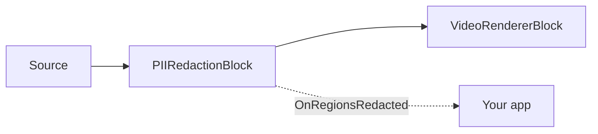

# PII Redaction — Blur Faces, License Plates, and On-Screen Text

`PIIRedactionBlock` automatically obscures personally identifiable information in a video stream: it detects
**faces** (YuNet), **vehicle license plates** (FastALPR), and **on-screen text** (PaddleOCR), then blurs,
pixelates, or fills each region in-place — before the frame reaches a renderer, an encoder, or a file. Every
model runs locally on ONNX Runtime, so there is no cloud API call, no per-frame billing, and no video ever
leaves the device. The block only *removes* PII — it never identifies a person or outputs a plate's characters,
and recognized content is never exported: faces and plates are located by detection alone, while on-screen text
runs OCR internally only to confirm (and optionally filter) what to redact. Any of the three categories can be
enabled independently, and the redaction
style, blur strength, and enabled categories can all be changed while the pipeline is running.



## Usage

The block sits in the middle of a Media Blocks pipeline: it takes video from a source, redacts it, and passes
the cleaned frames on to the next block — a renderer, an encoder, or a file sink. The full example below reads
a file, blurs all three PII categories, previews the result, and reports what was covered on each frame.

```csharp
using System;
using VisioForge.Core.MediaBlocks;
using VisioForge.Core.MediaBlocks.AI;
using VisioForge.Core.MediaBlocks.Sources;
using VisioForge.Core.MediaBlocks.VideoRendering;
using VisioForge.Core.Types.X.AI;
using VisioForge.Core.Types.X.Sources;

// 1. Create the pipeline and a source. A file is used here; a webcam (SystemVideoSourceBlock) or an
//    IP camera (RTSPSourceBlock) plugs in exactly the same way — only the source block changes.
var pipeline = new MediaBlocksPipeline();

var sourceSettings = await UniversalSourceSettings.CreateAsync(
    "input.mp4", renderVideo: true, renderAudio: false);
var source = new UniversalSourceBlock(sourceSettings);

// 2. Configure which PII categories to redact and how they are obscured.
var settings = new PIIRedactionSettings
{
    Style = PIIRedactionStyle.GaussianBlur,   // GaussianBlur (default), Pixelate, or SolidFill
    BlurRadius = 20f,                         // blur strength for GaussianBlur
};

// Faces — YuNet detector (detection only, no identity recognition).
settings.Faces.ModelPath = "face_detection_yunet_2023mar.onnx";

// License plates — FastALPR YOLOv9-T detector (detection only, plate characters are never read).
settings.LicensePlates.ModelPath = "yolo-v9-t-640-license-plates-end2end.onnx";

// On-screen text — PaddleOCR PP-OCR (detection + recognition). Needs three files.
settings.Text.DetectionModelPath = "ch_PP-OCRv5_mobile_det.onnx";
settings.Text.RecognitionModelPath = "latin_PP-OCRv5_rec_mobile_infer.onnx";
settings.Text.CharacterDictionaryPath = "ppocrv5_latin_dict.txt";

// Turn off any category you don't need — a disabled category needs no model:
// settings.Text.Enabled = false;

var redaction = new PIIRedactionBlock(settings);

// 3. Optional: report what was covered. The event fires on a background detection thread, so marshal to the
//    UI thread before touching UI. Only the category and box are reported — never the recognized content.
redaction.OnRegionsRedacted += (sender, e) =>
{
    int faces = 0, plates = 0, text = 0;
    foreach (var region in e.Regions)
    {
        switch (region.Category)
        {
            case PIICategory.Face: faces++; break;
            case PIICategory.LicensePlate: plates++; break;
            case PIICategory.Text: text++; break;
        }
    }

    Console.WriteLine($"[{e.Timestamp:hh\\:mm\\:ss}] redacted {faces} face(s), {plates} plate(s), {text} text region(s)");
};

// 4. Wire source -> redaction -> renderer and start. VideoView1 is your VideoView control (WPF/WinForms/etc.).
var videoRenderer = new VideoRendererBlock(pipeline, VideoView1);
pipeline.Connect(source.Output, redaction.Input);
pipeline.Connect(redaction.Output, videoRenderer.Input);

await pipeline.StartAsync();

// 5. When the ONNX sessions are up, confirm which hardware backend engaged.
Console.WriteLine($"PII redaction running on: {redaction.ActiveProvider}");

// ... later, on shutdown:
// await pipeline.StopAsync();
// await pipeline.DisposeAsync();
```

Key points about how the block behaves:

- **Redaction always runs**, even with no `OnRegionsRedacted` subscriber — covering the pixels *is* the block's
  output, so the event is purely for reporting/telemetry.
- **At least one category must be enabled with a valid model path**, or `Build` fails and the pipeline does not
  start. Enable only the categories you need; a disabled category loads no model and costs nothing.
- **Each `PIIRegion`** in the event carries only its `Category` (`Face`, `LicensePlate`, or `Text`), the padded
  `BoundingBox` in source-frame pixels, and the detection `Score` (0..1) — never the recognized content.
- **Detection runs on a background worker**, not the streaming thread, so live video never stalls; every frame
  is redacted with the most recent regions while the detector catches up (see
  [Privacy and compliance](#privacy-and-compliance) for the live-latency implication).
- **To redact straight to a file** instead of previewing, replace `VideoRendererBlock` with an encoder + sink
  (for example an `MP4OutputBlock`); the source → redaction → sink wiring is identical.

## Redaction categories and models

| Category | Detector | Model (license) | Notes |
| --- | --- | --- | --- |
| `Faces` | YuNet | `face_detection_yunet_2023mar.onnx` (MIT) | Detection only — no face is identified or matched. |
| `LicensePlates` | FastALPR YOLOv9-T | `yolo-v9-t-640-license-plates-end2end.onnx` (MIT) | Detection only — the plate characters are never read. |
| `Text` | PaddleOCR PP-OCR | detection + recognition + dictionary (Apache-2.0) | Recognition runs only to filter the detector's false positives; by default every recognized text region is redacted. |

The SDK does not ship model weights in the NuGet package — see [Getting the models](#getting-the-models).

Text redaction needs three files (detection model, recognition model, and character dictionary) whenever the
category is enabled. Recognition is required because a text *detector* alone fires on textures and edges, so
detection without recognition would redact most of a real scene; recognition confirms which boxes are actually
text. An optional `ClassificationModelPath` corrects 180°-rotated text.

## Redaction styles

`PIIRedactionSettings.Style` selects how each detected region is obscured:

| `PIIRedactionStyle` | Effect | Related setting |
| --- | --- | --- |
| `GaussianBlur` (default) | Region is replaced with a Gaussian-blurred copy of itself. | `BlurRadius` (sigma, default 20). |
| `Pixelate` | Region is replaced with a coarse mosaic. | `PixelateBlockSize` (cell size in px, default 16). |
| `SolidFill` | Region is painted over with a solid color. | `FillColor` (default black). |

`Style`, `BlurRadius`, `PixelateBlockSize`, and `FillColor` can all be changed while the pipeline runs.

## Key settings

`PIIRedactionSettings`:

| Property | Default | Description |
| --- | --- | --- |
| `Faces` / `LicensePlates` / `Text` | enabled | The three per-category sub-settings objects (see below). |
| `Style` | `GaussianBlur` | Redaction style applied to every region. |
| `BlurRadius` | `20` | Gaussian blur sigma for `GaussianBlur`. |
| `PixelateBlockSize` | `16` | Mosaic cell size, in pixels, for `Pixelate`. |
| `FillColor` | Black | Fill color for `SolidFill`. |
| `RegionPaddingPercent` | `0.15` | Expands each detected box per side (0.15 = 15%) to cover motion between detection cycles. |
| `RegionHoldTimeMs` | `700` | Keeps a region covered this long after the detector stops reporting it, so detector flicker never flashes PII through. |
| `FramesToSkip` | `0` | Frames to skip between detections on live video (`0` submits every frame). Detection always runs on a background worker. |
| `Provider` / `DeviceId` | `Auto` / `0` | ONNX execution provider and hardware device index. |

Each category exposes its own detector tuning.

Faces (`PIIFaceRedactionSettings`):

| Property | Default |
| --- | --- |
| `Enabled` | `true` |
| `ModelPath` | — |
| `DetectionInputSize` | `320` |
| `ConfidenceThreshold` | `0.5` |
| `NmsThreshold` | `0.3` |
| `MaxFaces` | `50` |

License plates (`PIIPlateRedactionSettings`):

| Property | Default |
| --- | --- |
| `Enabled` | `true` |
| `ModelPath` | — |
| `DetectionInputSize` | `640` |
| `ConfidenceThreshold` | `0.3` |
| `MaxDetections` | `20` |

`Text` (`PIITextRedactionSettings`): `Enabled` (`true`), `DetectionModelPath`, `RecognitionModelPath`,
`CharacterDictionaryPath`, optional `ClassificationModelPath`, `TextFilterRegex` (see below), `MaxSideLength`
(`1024`), `BoxThreshold` (`0.3`), `BoxScoreThreshold` (`0.5`), `UnclipRatio` (`1.6`).

The block also exposes read-only diagnostics after it is built: `ActiveProvider` (the execution provider that
actually engaged), `LastInferenceTimeMs` (wall-clock of the most recent detection cycle), and
`DroppedFrameCount` (frames that arrived while the detector was busy — still redacted, just not re-detected).

## Redact only specific text

By default every recognized text region is redacted. Set `Text.TextFilterRegex` to redact only the regions
whose recognized text matches a pattern — for example, blur e-mail addresses and phone numbers while leaving
signage and captions visible:

```csharp
settings.Text.TextFilterRegex =
    @"(\b[\w.%+-]+@[\w.-]+\.[A-Za-z]{2,}\b)|(\+?\d[\d\s().-]{7,}\d)";
```

Recognition still runs regardless (it is what filters non-text detections); the regex only narrows which
recognized regions are covered.

## Getting the models

The SDK does not bundle model weights. Supply your own `.onnx` files, or reuse the ones the demos download on
first run from the samples release into `%UserProfile%/VisioForge/models`:

| File | Category | License |
| --- | --- | --- |
| `face_detection_yunet_2023mar.onnx` | Faces | MIT |
| `yolo-v9-t-640-license-plates-end2end.onnx` | License plates | MIT |
| `ch_PP-OCRv5_mobile_det.onnx` | Text (detection) | Apache-2.0 |
| `latin_PP-OCRv5_rec_mobile_infer.onnx` | Text (recognition) | Apache-2.0 |
| `ppocrv5_latin_dict.txt` | Text (dictionary) | Apache-2.0 |

These are downloaded from the `onnx-models-v1` release on the
[samples repository](https://github.com/visioforge/.Net-SDK-s-samples/releases/tag/onnx-models-v1). To read the
provider that ONNX Runtime actually selected, check `redaction.ActiveProvider` after the pipeline starts.

## Use with VideoCaptureCoreX and MediaPlayerCoreX

`PIIRedactionBlock` is a video processing block, so it plugs directly into the capture and playback engines —
no manual `MediaBlocksPipeline` required. Add it before you start:

```csharp
var redaction = new PIIRedactionBlock(settings);
redaction.OnRegionsRedacted += Redaction_OnRegionsRedacted;

core.Video_Processing_AddBlock(redaction);       // VideoCaptureCoreX — before StartAsync
// player.Video_Processing_AddBlock(redaction);  // MediaPlayerCoreX — before OpenAsync/PlayAsync

await core.StartAsync();
```

With VideoCaptureCoreX this anonymizes a webcam, IP camera, or capture-card feed as it is previewed, recorded,
or streamed. See [Using AI blocks with VideoCaptureCoreX and MediaPlayerCoreX](x-engines.md) for the shared
processing-block API, insertion order, and lifecycle rules.

## Privacy and compliance

Because every detector runs locally on ONNX Runtime, video and audio frames never leave the device, which
simplifies GDPR / CCPA / BIPA reviews for camera applications. Redaction is destructive — pixels in each region
are overwritten in the frame, so there is no reversible mapping to recover the original. The
`OnRegionsRedacted` event carries only categories and boxes; the recognized content of a region (a plate
number, a text string) is intentionally never included.

One caveat matters for live pipelines: detection runs on a background worker to keep the stream flowing, so
**frames that arrive before the first detection cycle completes pass through unredacted**, and if the source
resolution jumps mid-stream (for example adaptive HLS/RTSP), a newly exposed area can briefly leak until the
next detection cycle. For **zero-leak** anonymization, process the file offline at reduced speed rather than
live, so every frame is detected before it is written.

## Use cases

- **Dashcam / bodycam footage** — blur bystander faces and plates before publishing or sharing an incident clip.
- **CCTV and surveillance exports** — anonymize recorded video before handing it to a third party.
- **Video conferencing and screen sharing** — pixelate on-screen text (documents, badges) in a shared feed.
- **FOIA / court / insurance disclosure** — redact identities in released video to satisfy privacy rules.
- **User-generated content** — automatically obscure faces and plates in uploaded videos.
- **Street-level mapping and analytics** — anonymize faces and plates in captured drive footage.

## Troubleshooting

| Symptom | Likely cause | Fix |
| --- | --- | --- |
| First frames show PII before redaction kicks in | Detection is asynchronous; frames before the first cycle pass through | Expected on live sources. For zero-leak, process files offline at reduced speed. |
| Too much of the frame is blurred (text) | Detector false positives, or every text region is being redacted | Raise `Text.BoxScoreThreshold`; set `Text.TextFilterRegex` to redact only the patterns you care about. |
| A face or plate is missed | `ConfidenceThreshold` too high, or the object is too small for `DetectionInputSize` | Lower the category's `ConfidenceThreshold`; raise `DetectionInputSize` for small/distant objects. |
| A region flickers in and out | Detection cadence too sparse or hold time too short | Lower `FramesToSkip`; raise `RegionHoldTimeMs`; raise `RegionPaddingPercent` for fast motion. |
| Runs on CPU when a GPU is present | Requested provider unavailable in the loaded ONNX Runtime build | Check `redaction.ActiveProvider`; install the matching ONNX Runtime GPU package; set `Provider`/`DeviceId`. |
| Live video stutters | Detection too slow for the frame rate on this hardware | Raise `FramesToSkip`; watch `LastInferenceTimeMs` and `DroppedFrameCount` while tuning. |

## Frequently Asked Questions

### Does PIIRedactionBlock identify people or read license plates?

No. The block never runs face recognition and never outputs a license plate's characters — faces and plates
are located by detection alone. On-screen text is recognized internally only to decide what to redact (and to
apply `TextFilterRegex`), and that recognized text is never emitted: the `OnRegionsRedacted` event carries only
categories and boxes.

### Is this GDPR / CCPA / BIPA compliant?

Inference runs entirely on-device, so frames never leave the machine — which is the hard part for camera and
microphone privacy reviews. For guaranteed zero-leak output, process files offline at reduced speed so every
frame is detected before it is written; on live streams the first frames before the first detection cycle can
pass through unredacted. Compliance also depends on your overall data handling — review the applicable
regulations for your jurisdiction.

### Which models do I need, and where do I get them?

Faces need one YuNet model; license plates need one FastALPR model; on-screen text needs a PaddleOCR detection
model, a recognition model, and a character dictionary. Weights are not shipped in the NuGet package — see
[Getting the models](#getting-the-models).

### Can I redact only e-mail addresses and phone numbers, not all text?

Yes. Set `Text.TextFilterRegex` to a pattern; only regions whose recognized text matches are redacted, and all
other on-screen text stays visible.

### Can I turn a category on or off while the video is running?

You can toggle a category off (and back on) live **if it was enabled when the block was built** — the detector
for a category is created only when that category is enabled at build time. To add a category that was disabled
at start, rebuild the block. Style, blur radius, and fill color are all live-adjustable.

### Can I run redaction on the GPU?

Yes. Set `Provider` to `CUDA`, `DirectML`, or `CoreML` (or leave it `Auto`), with `DeviceId` for the GPU index.
If the requested provider is unavailable, ONNX Runtime falls back to CPU; check `ActiveProvider` to confirm
what engaged.

### Is the redaction reversible?

No. Redaction overwrites the pixels in each region directly in the frame, so the original content cannot be
recovered from the output.

## Demos

- **[PII Redaction Demo](https://github.com/visioforge/.Net-SDK-s-samples/tree/master/Media%20Blocks%20SDK/WPF/CSharp/PII%20Redaction%20Demo)** — WPF Media Blocks pipeline demo (webcam, file, or RTSP source).
- **[Player PII Redaction X](https://github.com/visioforge/.Net-SDK-s-samples/tree/master/Media%20Player%20SDK%20X/WPF/Player%20PII%20Redaction%20X%20WPF)** — MediaPlayerCoreX redaction on file playback (WPF).
- **[Capture PII Redaction X](https://github.com/visioforge/.Net-SDK-s-samples/tree/master/Video%20Capture%20SDK%20X/WPF/CSharp/Capture%20PII%20Redaction%20X%20WPF)** — VideoCaptureCoreX redaction on a live camera (WPF).
