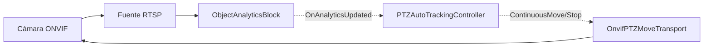

# Auto-seguimiento PTZ — sigue un objeto detectado con una cámara ONVIF

`PTZAutoTrackingController` convierte las detecciones de objetos en comandos continuos de velocidad
PTZ, de modo que una cámara PTZ ONVIF sigue automáticamente a un objeto rastreado. Se conecta a las
detecciones generadas por [`ObjectAnalyticsBlock`](object-analytics.md) (seguimiento multiobjeto,
IDs de seguimiento estables) o por [`YOLOObjectDetectorBlock`](object-detection.md), y dirige la
cámara mediante ONVIF a través de `OnvifPTZMoveTransport`.

La ley de control es un controlador proporcional (P) simple: el error es el centro de la caja del
objetivo respecto al centro del cuadro; dentro de una zona muerta configurable la cámara se mantiene,
y fuera de ella la cámara panea/inclina (y opcionalmente hace zoom) a una velocidad proporcional a
cuán descentrado está el objetivo.



## Requisitos

- Una **cámara PTZ ONVIF** (el dispositivo debe anunciar el servicio PTZ — verifíquelo con
  `OnvifPTZMoveTransport.IsPTZSupportedAsync(onvif)`, que recurre a una sonda de `PTZConfiguration` del
  perfil multimedia cuando la caché de servicios ONVIF de la cámara está vacía). Una cámara fija no se
  puede dirigir.
- Un modelo de detección de objetos ONNX (YOLOv8 / YOLOX / RT-DETR) para el detector.

## Uso

```csharp
using System.Drawing;
using VisioForge.Core;
using VisioForge.Core.AI.PTZ;
using VisioForge.Core.MediaBlocks.AI;
using VisioForge.Core.ONVIFX;
using VisioForge.Core.Types.X.AI;

// 0. Inicialice el SDK una vez, antes de crear cualquier objeto del motor.
await VisioForgeX.InitSDKAsync();

// 1. Conéctese a la cámara ONVIF y construya el transporte PTZ.
var onvif = new ONVIFClientX();
if (!await onvif.ConnectAsync("http://192.168.1.22/onvif/device_service", "admin", "password"))
{
    // La conexión falló — verifique la dirección/credenciales antes de continuar.
    return;
}

if (!await OnvifPTZMoveTransport.IsPTZSupportedAsync(onvif))
{
    // La cámara no tiene servicio PTZ: el auto-seguimiento no es posible.
    return;
}

var transport = await OnvifPTZMoveTransport.CreateAsync(onvif); // resuelve un perfil multimedia compatible con PTZ
if (transport == null)
{
    // No hay ningún perfil multimedia utilizable en el dispositivo: el auto-seguimiento no es posible.
    return;
}

// 2. Configure el detector + analítica (ObjectAnalyticsBlock proporciona IDs de seguimiento estables).
var detector = new YoloDetectorSettings("yolox_nano.onnx")
{
    Model = ObjectDetectorModel.YOLOX,
    ConfidenceThreshold = 0.4f,
};
var analyticsBlock = new ObjectAnalyticsBlock(new ObjectAnalyticsSettings(detector));

// 3. Cree el controlador y conéctelo al bloque de analítica.
// El tamaño del cuadro es la resolución de origen (cámara) en la que se expresan las cajas de detección.
var settings = new PTZAutoTrackingSettings
{
    TargetSelection = PTZTargetSelection.ByClassLabel,
    ClassLabelFilter = "person",
    MaxSpeed = 0.5f,
    Gain = 1.2f,
    DeadZone = 0.1f,
};

var controller = new PTZAutoTrackingController(settings, transport);
controller.OnTargetAcquired += (s, det) => Console.WriteLine($"Following {det.Label} #{det.TrackerId}");
controller.OnTargetLost += (s, e) => Console.WriteLine("Target lost.");
controller.OnMoveCommand += (s, cmd) =>
    Console.WriteLine(cmd.IsStop ? "PTZ: stop" : $"PTZ: pan={cmd.Pan} tilt={cmd.Tilt} zoom={cmd.Zoom}");

controller.AttachTo(analyticsBlock, new Size(1920, 1080));
controller.Start();

// 4. El bloque de analítica solo surte efecto una vez que se añade a su motor de captura. Insértelo en su
//    VideoCaptureCoreX configurado (un MediaBlocksPipeline funciona igual) e inicie la transmisión.
core.Video_Processing_AddBlock(analyticsBlock);
await core.StartAsync();

// Al cerrar: detenga el controlador (detiene la cámara) y luego elimínelo.
await controller.StopAsync();
controller.Dispose();
```

`AttachTo` también tiene una sobrecarga para `YOLOObjectDetectorBlock`. Como un detector simple no
lleva IDs de seguimiento, el seguimiento fijo solo está disponible con `ObjectAnalyticsBlock`; con un
detector simple el controlador vuelve a adquirir un objetivo en cada cuadro según la política de
selección.

### Uso en un pipeline de Media Blocks

El controlador es independiente del motor: `AttachTo` se suscribe al evento de detección del bloque de
analítica, que se dispara igual tanto si el bloque se ejecuta dentro de `VideoCaptureCoreX` como en un
`MediaBlocksPipeline` construido a mano. Para integrarlo en un pipeline, conecte el bloque de analítica
entre su fuente y el renderizador y conecte el controlador a él exactamente como arriba:

```csharp
using System.Drawing;
using VisioForge.Core.AI.PTZ;
using VisioForge.Core.MediaBlocks;
using VisioForge.Core.MediaBlocks.AI;
using VisioForge.Core.MediaBlocks.Sources;
using VisioForge.Core.MediaBlocks.VideoRendering;
using VisioForge.Core.Types.X.AI;
using VisioForge.Core.Types.X.Sources;

var pipeline = new MediaBlocksPipeline();

var source = new RTSPSourceBlock(
    await RTSPSourceSettings.CreateAsync(new Uri("rtsp://192.168.1.22/..."), "admin", "password", audioEnabled: false));

// Detector + bloque de analítica (misma configuración que el ejemplo de Uso anterior).
var analyticsBlock = new ObjectAnalyticsBlock(
    new ObjectAnalyticsSettings(new YoloDetectorSettings("yolox_nano.onnx")));

var renderer = new VideoRendererBlock(pipeline, VideoView1) { IsSync = false }; // VideoView1 = su VideoView de WPF

// fuente -> analítica (detección + seguimiento) -> renderizador
pipeline.Connect(source.VideoOutput, analyticsBlock.Input);
pipeline.Connect(analyticsBlock.Output, renderer.Input);

// El controlador se conecta al mismo bloque de analítica y dirige la cámara como componente auxiliar.
// (transport es el OnvifPTZMoveTransport creado en el ejemplo de Uso anterior.)
var controller = new PTZAutoTrackingController(new PTZAutoTrackingSettings(), transport);
controller.AttachTo(analyticsBlock, new Size(1920, 1080));
controller.Start();

await pipeline.StartAsync();
```

## Cómo funciona la ley de control

Para cada cuadro procesado, el controlador:

1. **Selecciona un objetivo** según `TargetSelection` (ver más abajo). Una vez fijado un objetivo con
   un ID de seguimiento válido, permanece fijo en ese ID e ignora los demás objetos.
2. **Calcula el error**: el centro de la caja del objetivo menos el centro del cuadro, normalizado a
   `[-1, 1]` en cada eje.
3. **Aplica la zona muerta**: si el error de un eje está dentro de `DeadZone`, ese eje no se mueve.
4. **Calcula la velocidad**: `clamp(Gain * error, -MaxSpeed, MaxSpeed)` por eje. El paneo positivo es
   a la derecha, la inclinación positiva es hacia arriba.
5. **Controla el zoom** (cuando `ZoomEnabled`): acerca cuando la altura de la caja del objetivo está
   por debajo de `TargetBoxHeightRatio` y aleja cuando está por encima.
6. **Limita la frecuencia**: como máximo un comando de movimiento por `CommandInterval`; se emite un
   único comando de parada (sin repeticiones) cuando la cámara entra en la zona muerta o el objetivo
   desaparece.

Si el objetivo está ausente, la cámara se detiene de inmediato. Si permanece ausente más tiempo que
`LostTargetTimeout`, se genera `OnTargetLost`, la cámara vuelve opcionalmente a `HomePresetToken`, y
la siguiente detección que coincida vuelve a adquirir un objetivo.

Los comandos de la cámara se ejecutan en un hilo de trabajo en segundo plano dedicado, de modo que el
hilo de detección nunca se bloquea por la E/S de red.

## Modos de selección de objetivo

| `PTZTargetSelection` | Comportamiento |
|----------------------|----------------|
| `Largest`            | Sigue el objeto con el área de caja delimitadora más grande (por defecto). |
| `FirstDetected`      | Sigue el primer objeto del arreglo de detecciones. |
| `ByTrackerId`        | Sigue solo el objeto cuyo ID de seguimiento sea igual a `ManualTrackerId`. |
| `ByClassLabel`       | Sigue el objeto más grande cuya etiqueta coincida con `ClassLabelFilter` (sin distinguir mayúsculas). |

## Configuración

| Propiedad | Predeterminado | Descripción |
|-----------|----------------|-------------|
| `TargetSelection` | `Largest` | Estrategia para elegir un objetivo cuando no hay ninguno fijado. |
| `ClassLabelFilter` | `null` | Etiqueta a seguir para `ByClassLabel` (por ejemplo, `"person"`). |
| `ManualTrackerId` | `-1` | ID de seguimiento a seguir para `ByTrackerId`. |
| `DeadZone` | `0.1` | Mitad del ancho de la zona muerta centrada, como fracción de la mitad del cuadro (0..1). |
| `MaxSpeed` | `0.5` | Velocidad máxima absoluta en cualquier eje (0..1). |
| `Gain` | `1.2` | Ganancia proporcional aplicada al error normalizado. |
| `ZoomEnabled` | `false` | Controla el zoom para mantener la altura del objetivo cerca de `TargetBoxHeightRatio`. |
| `TargetBoxHeightRatio` | `0.5` | Altura deseada de la caja del objetivo como fracción de la altura del cuadro (0..1). |
| `ZoomDeadZone` | `0.05` | Zona muerta de zoom sobre la diferencia de relación de altura (0..1). |
| `LostTargetTimeout` | `2 s` | Cuánto tiempo puede estar ausente el objetivo antes de declararlo perdido. |
| `HomePresetToken` | `null` | Preajuste ONVIF opcional al que volver cuando se pierde el objetivo. |
| `CommandInterval` | `200 ms` | Intervalo mínimo entre comandos de movimiento (las paradas no se limitan). |
| `PatrolPresetTokens` | `null` | Tokens de preajuste ONVIF ordenados para recorrer como patrulla en reposo. La patrulla se activa solo cuando no está vacío. |
| `PatrolStartDelay` | `30 s` | Cuánto esperar tras perder el objetivo, sin que aparezca uno nuevo, antes de iniciar la patrulla. |
| `PatrolDwellTime` | `10 s` | Cuánto permanecer en cada preajuste de patrulla antes de avanzar al siguiente. |

## Patrulla en reposo

Cuando la cámara quedaría inactiva, puede recorrer automáticamente un conjunto de preajustes ONVIF
hasta que aparezca un nuevo objetivo. Asigne a `PatrolPresetTokens` los tokens de preajuste ordenados
que quiera visitar (la patrulla se activa solo cuando este arreglo no está vacío):

```csharp
var settings = new PTZAutoTrackingSettings
{
    TargetSelection = PTZTargetSelection.ByClassLabel,
    ClassLabelFilter = "person",
    HomePresetToken = "1",                              // vuelve primero a casa al perder el objetivo
    PatrolPresetTokens = new[] { "1", "2", "3" },       // luego patrulla estos preajustes en orden
    PatrolStartDelay = TimeSpan.FromSeconds(30),        // ... tras 30 s sin un nuevo objetivo
    PatrolDwellTime = TimeSpan.FromSeconds(10),         // permanece 10 s en cada preajuste
};

controller.OnPatrolPreset += (s, token) => Console.WriteLine($"Patrol: preset {token}");
```

Secuencia de eventos cuando el objetivo desaparece:

1. La cámara se detiene de inmediato y, tras `LostTargetTimeout`, el objetivo se declara perdido
   (`OnTargetLost`) y —si `HomePresetToken` está definido— la cámara vuelve a casa.
2. Si no reaparece ningún objetivo durante `PatrolStartDelay`, comienza la patrulla: la cámara recorre
   cada token de `PatrolPresetTokens` en orden, permaneciendo `PatrolDwellTime` en cada uno y volviendo
   al principio de la lista.
3. En cuanto se adquiere un nuevo objetivo, la patrulla se aborta de inmediato y se reanuda el
   seguimiento normal. La siguiente patrulla reinicia desde el primer preajuste.

El tiempo de patrulla se mide contra las marcas de tiempo de los fotogramas entregadas al controlador,
por lo que se mantiene sincronizado con el reloj de vídeo. Obtenga los tokens de preajuste de su
dispositivo con `ONVIFClientX.GetPresetsAsync`.

## Eventos

- `OnTargetAcquired(OnnxDetection)` — se fijó un nuevo objetivo.
- `OnTargetLost()` — el objetivo actual estuvo ausente más tiempo que `LostTargetTimeout`.
- `OnMoveCommand(PTZMoveCommandEventArgs)` — cada comando enviado a la cámara (`Pan`, `Tilt`, `Zoom`,
  `IsStop`); útil para una barra de estado o diagnósticos.
- `OnPatrolPreset(string)` — la patrulla en reposo se movió al token de preajuste indicado.

## Transporte personalizado

`OnvifPTZMoveTransport` es la implementación ONVIF integrada. Para dirigir un dispositivo PTZ que no
sea ONVIF, implemente `IPTZMoveTransport` (`ContinuousMoveAsync`, `StopAsync`, `GoToPresetAsync`) y
pase su implementación al controlador.

## Demostración

Hay ejemplos completos de WPF en las muestras del SDK:

- **[PTZ Auto Tracking (Video Capture SDK X)](https://github.com/visioforge/.Net-SDK-s-samples/tree/master/Video%20Capture%20SDK%20X/WPF/CSharp/PTZ%20Auto%20Tracking)** — auto-seguimiento con el motor `VideoCaptureCoreX`.
- **[PTZ Auto Tracking (Media Blocks SDK)](https://github.com/visioforge/.Net-SDK-s-samples/tree/master/Media%20Blocks%20SDK/WPF/CSharp/PTZ%20Auto%20Tracking%20MB)** — la misma función construida sobre un `MediaBlocksPipeline` de bajo nivel.
