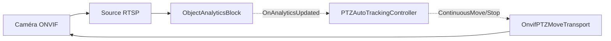

# Suivi automatique PTZ — suivez un objet détecté avec une caméra ONVIF

`PTZAutoTrackingController` transforme les détections d'objets en commandes continues de vitesse PTZ,
afin qu'une caméra PTZ ONVIF suive automatiquement un objet suivi. Il se branche sur les détections
émises par [`ObjectAnalyticsBlock`](object-analytics.md) (suivi multi-objets, identifiants de suivi
stables) ou par [`YOLOObjectDetectorBlock`](object-detection.md), et pilote la caméra via ONVIF au
moyen de `OnvifPTZMoveTransport`.

La loi de commande est un simple contrôleur proportionnel (P) : l'erreur correspond au centre de la
boîte de la cible par rapport au centre de l'image ; à l'intérieur d'une zone morte configurable la
caméra reste immobile, et au-delà la caméra effectue un panoramique/une inclinaison (et éventuellement
un zoom) à une vitesse proportionnelle à l'éloignement de la cible par rapport au centre.



## Prérequis

- Une **caméra PTZ ONVIF** (l'appareil doit annoncer le service PTZ — vérifiez-le avec
  `OnvifPTZMoveTransport.IsPTZSupportedAsync(onvif)`, qui recourt à une sonde de `PTZConfiguration` du
  profil multimédia lorsque le cache des services ONVIF de la caméra est vide). Une caméra fixe ne peut
  pas être pilotée.
- Un modèle de détection d'objets ONNX (YOLOv8 / YOLOX / RT-DETR) pour le détecteur.

## Utilisation

```csharp
using System.Drawing;
using VisioForge.Core;
using VisioForge.Core.AI.PTZ;
using VisioForge.Core.MediaBlocks.AI;
using VisioForge.Core.ONVIFX;
using VisioForge.Core.Types.X.AI;

// 0. Initialisez le SDK une fois, avant de créer tout objet de moteur.
await VisioForgeX.InitSDKAsync();

// 1. Connectez-vous à la caméra ONVIF et construisez le transport PTZ.
var onvif = new ONVIFClientX();
if (!await onvif.ConnectAsync("http://192.168.1.22/onvif/device_service", "admin", "password"))
{
    // La connexion a échoué — vérifiez l'adresse/les identifiants avant de continuer.
    return;
}

if (!await OnvifPTZMoveTransport.IsPTZSupportedAsync(onvif))
{
    // La caméra n'a pas de service PTZ : le suivi automatique n'est pas possible.
    return;
}

var transport = await OnvifPTZMoveTransport.CreateAsync(onvif); // résout un profil multimédia compatible PTZ
if (transport == null)
{
    // Aucun profil multimédia utilisable sur l'appareil : le suivi automatique n'est pas possible.
    return;
}

// 2. Configurez le détecteur + l'analytique (ObjectAnalyticsBlock fournit des IDs de suivi stables).
var detector = new YoloDetectorSettings("yolox_nano.onnx")
{
    Model = ObjectDetectorModel.YOLOX,
    ConfidenceThreshold = 0.4f,
};
var analyticsBlock = new ObjectAnalyticsBlock(new ObjectAnalyticsSettings(detector));

// 3. Créez le contrôleur et attachez-le au bloc d'analytique.
// La taille de l'image est la résolution source (caméra) dans laquelle les boîtes de détection sont exprimées.
var settings = new PTZAutoTrackingSettings
{
    TargetSelection = PTZTargetSelection.ByClassLabel,
    ClassLabelFilter = "person",
    MaxSpeed = 0.5f,
    Gain = 1.2f,
    DeadZone = 0.1f,
};

var controller = new PTZAutoTrackingController(settings, transport);
controller.OnTargetAcquired += (s, det) => Console.WriteLine($"Following {det.Label} #{det.TrackerId}");
controller.OnTargetLost += (s, e) => Console.WriteLine("Target lost.");
controller.OnMoveCommand += (s, cmd) =>
    Console.WriteLine(cmd.IsStop ? "PTZ: stop" : $"PTZ: pan={cmd.Pan} tilt={cmd.Tilt} zoom={cmd.Zoom}");

controller.AttachTo(analyticsBlock, new Size(1920, 1080));
controller.Start();

// 4. Le bloc d'analytique ne prend effet qu'une fois ajouté à votre moteur de capture. Insérez-le dans votre
//    VideoCaptureCoreX configuré (un MediaBlocksPipeline fonctionne de la même manière) et démarrez le flux.
core.Video_Processing_AddBlock(analyticsBlock);
await core.StartAsync();

// À l'arrêt : arrêtez le contrôleur (arrête la caméra), puis supprimez-le.
await controller.StopAsync();
controller.Dispose();
```

`AttachTo` propose également une surcharge pour `YOLOObjectDetectorBlock`. Comme un détecteur simple
ne porte pas d'identifiants de suivi, le suivi verrouillé n'est disponible qu'avec
`ObjectAnalyticsBlock` ; avec un détecteur simple, le contrôleur réacquiert une cible à chaque image
selon la politique de sélection.

### Utilisation dans un pipeline Media Blocks

Le contrôleur est indépendant du moteur : `AttachTo` s'abonne à l'événement de détection du bloc
d'analytique, qui se déclenche de la même manière que le bloc s'exécute dans `VideoCaptureCoreX` ou dans
un `MediaBlocksPipeline` construit à la main. Pour l'intégrer dans un pipeline, connectez le bloc
d'analytique entre votre source et le rendu, puis attachez-lui le contrôleur exactement comme ci-dessus :

```csharp
using System.Drawing;
using VisioForge.Core.AI.PTZ;
using VisioForge.Core.MediaBlocks;
using VisioForge.Core.MediaBlocks.AI;
using VisioForge.Core.MediaBlocks.Sources;
using VisioForge.Core.MediaBlocks.VideoRendering;
using VisioForge.Core.Types.X.AI;
using VisioForge.Core.Types.X.Sources;

var pipeline = new MediaBlocksPipeline();

var source = new RTSPSourceBlock(
    await RTSPSourceSettings.CreateAsync(new Uri("rtsp://192.168.1.22/..."), "admin", "password", audioEnabled: false));

// Détecteur + bloc d'analytique (même configuration que l'exemple d'Utilisation ci-dessus).
var analyticsBlock = new ObjectAnalyticsBlock(
    new ObjectAnalyticsSettings(new YoloDetectorSettings("yolox_nano.onnx")));

var renderer = new VideoRendererBlock(pipeline, VideoView1) { IsSync = false }; // VideoView1 = votre VideoView WPF

// source -> analytique (détection + suivi) -> rendu
pipeline.Connect(source.VideoOutput, analyticsBlock.Input);
pipeline.Connect(analyticsBlock.Output, renderer.Input);

// Le contrôleur s'attache au même bloc d'analytique et pilote la caméra comme composant auxiliaire.
// (transport est le OnvifPTZMoveTransport créé dans l'exemple d'Utilisation ci-dessus.)
var controller = new PTZAutoTrackingController(new PTZAutoTrackingSettings(), transport);
controller.AttachTo(analyticsBlock, new Size(1920, 1080));
controller.Start();

await pipeline.StartAsync();
```

## Fonctionnement de la loi de commande

Pour chaque image traitée, le contrôleur :

1. **Sélectionne une cible** selon `TargetSelection` (voir ci-dessous). Une fois une cible verrouillée
   avec un identifiant de suivi valide, il reste verrouillé sur cet identifiant et ignore les autres
   objets.
2. **Calcule l'erreur** : le centre de la boîte de la cible moins le centre de l'image, normalisé à
   `[-1, 1]` sur chaque axe.
3. **Applique la zone morte** : si l'erreur d'un axe est dans `DeadZone`, cet axe n'est pas piloté.
4. **Calcule la vitesse** : `clamp(Gain * error, -MaxSpeed, MaxSpeed)` par axe. Un panoramique positif
   va vers la droite, une inclinaison positive va vers le haut.
5. **Pilote le zoom** (lorsque `ZoomEnabled`) : zoome lorsque la hauteur de la boîte de la cible est
   inférieure à `TargetBoxHeightRatio` et dézoome lorsqu'elle est supérieure.
6. **Limite la fréquence** : au plus une commande de mouvement par `CommandInterval` ; une unique
   commande d'arrêt est émise (sans répétition) lorsque la caméra entre dans la zone morte ou que la
   cible disparaît.

Si la cible est absente, la caméra est arrêtée immédiatement. Si elle reste absente plus longtemps que
`LostTargetTimeout`, `OnTargetLost` est déclenché, la caméra revient éventuellement à
`HomePresetToken`, et la prochaine détection correspondante réacquiert une cible.

Les commandes de la caméra sont exécutées sur un thread de travail d'arrière-plan dédié, de sorte que
le thread de détection n'est jamais bloqué par les E/S réseau.

## Modes de sélection de cible

| `PTZTargetSelection` | Comportement |
|----------------------|--------------|
| `Largest`            | Suit l'objet dont la boîte englobante a la plus grande surface (par défaut). |
| `FirstDetected`      | Suit le premier objet du tableau de détections. |
| `ByTrackerId`        | Suit uniquement l'objet dont l'identifiant de suivi est égal à `ManualTrackerId`. |
| `ByClassLabel`       | Suit le plus grand objet dont l'étiquette correspond à `ClassLabelFilter` (insensible à la casse). |

## Paramètres

| Propriété | Par défaut | Description |
|-----------|-----------|-------------|
| `TargetSelection` | `Largest` | Stratégie de choix d'une cible quand aucune n'est verrouillée. |
| `ClassLabelFilter` | `null` | Étiquette à suivre pour `ByClassLabel` (par exemple `"person"`). |
| `ManualTrackerId` | `-1` | Identifiant de suivi à suivre pour `ByTrackerId`. |
| `DeadZone` | `0.1` | Demi-largeur de la zone morte centrée, en fraction de la demi-taille de l'image (0..1). |
| `MaxSpeed` | `0.5` | Vitesse absolue maximale sur un axe (0..1). |
| `Gain` | `1.2` | Gain proportionnel appliqué à l'erreur normalisée. |
| `ZoomEnabled` | `false` | Pilote le zoom pour maintenir la hauteur de la cible proche de `TargetBoxHeightRatio`. |
| `TargetBoxHeightRatio` | `0.5` | Hauteur souhaitée de la boîte de la cible en fraction de la hauteur de l'image (0..1). |
| `ZoomDeadZone` | `0.05` | Zone morte du zoom sur la différence de rapport de hauteur (0..1). |
| `LostTargetTimeout` | `2 s` | Durée pendant laquelle la cible peut être absente avant d'être déclarée perdue. |
| `HomePresetToken` | `null` | Préréglage ONVIF optionnel vers lequel revenir en cas de perte de la cible. |
| `CommandInterval` | `200 ms` | Intervalle minimal entre les commandes de mouvement (les arrêts ne sont pas limités). |
| `PatrolPresetTokens` | `null` | Jetons de préréglage ONVIF ordonnés à parcourir comme patrouille au repos. La patrouille est activée uniquement lorsque ce tableau n'est pas vide. |
| `PatrolStartDelay` | `30 s` | Temps d'attente après la perte de la cible, sans qu'une nouvelle apparaisse, avant de démarrer la patrouille. |
| `PatrolDwellTime` | `10 s` | Temps de maintien sur chaque préréglage de patrouille avant de passer au suivant. |

## Patrouille au repos

Lorsque la caméra resterait inactive, elle peut parcourir automatiquement un ensemble de préréglages
ONVIF jusqu'à ce qu'une nouvelle cible apparaisse. Renseignez `PatrolPresetTokens` avec les jetons de
préréglage ordonnés à visiter (la patrouille n'est activée que lorsque ce tableau n'est pas vide) :

```csharp
var settings = new PTZAutoTrackingSettings
{
    TargetSelection = PTZTargetSelection.ByClassLabel,
    ClassLabelFilter = "person",
    HomePresetToken = "1",                              // revient d'abord à la position d'origine à la perte de la cible
    PatrolPresetTokens = new[] { "1", "2", "3" },       // puis patrouille ces préréglages dans l'ordre
    PatrolStartDelay = TimeSpan.FromSeconds(30),        // ... après 30 s sans nouvelle cible
    PatrolDwellTime = TimeSpan.FromSeconds(10),         // maintient 10 s sur chaque préréglage
};

controller.OnPatrolPreset += (s, token) => Console.WriteLine($"Patrol: preset {token}");
```

Séquence des événements lorsque la cible disparaît :

1. La caméra s'arrête immédiatement et, après `LostTargetTimeout`, la cible est déclarée perdue
   (`OnTargetLost`) et — si `HomePresetToken` est défini — la caméra revient à sa position d'origine.
2. Si aucune nouvelle cible ne réapparaît pendant `PatrolStartDelay`, la patrouille commence : la caméra
   rappelle chaque jeton de `PatrolPresetTokens` dans l'ordre, en restant `PatrolDwellTime` sur chacun,
   puis reboucle sur la liste.
3. Dès qu'une nouvelle cible est acquise, la patrouille est immédiatement interrompue et le suivi normal
   reprend. La patrouille suivante repart du premier préréglage.

Le minutage de la patrouille est mesuré par rapport aux horodatages des images fournis au contrôleur ;
il reste donc synchronisé avec l'horloge vidéo. Récupérez les jetons de préréglage de votre appareil
avec `ONVIFClientX.GetPresetsAsync`.

## Événements

- `OnTargetAcquired(OnnxDetection)` — une nouvelle cible a été verrouillée.
- `OnTargetLost()` — la cible actuelle a été absente plus longtemps que `LostTargetTimeout`.
- `OnMoveCommand(PTZMoveCommandEventArgs)` — chaque commande envoyée à la caméra (`Pan`, `Tilt`,
  `Zoom`, `IsStop`) ; utile pour une barre d'état ou le diagnostic.
- `OnPatrolPreset(string)` — la patrouille au repos s'est déplacée vers le jeton de préréglage indiqué.

## Transport personnalisé

`OnvifPTZMoveTransport` est l'implémentation ONVIF intégrée. Pour piloter un appareil PTZ non ONVIF,
implémentez `IPTZMoveTransport` (`ContinuousMoveAsync`, `StopAsync`, `GoToPresetAsync`) et passez
votre implémentation au contrôleur.

## Démonstration

Des exemples WPF complets sont disponibles dans les échantillons du SDK :

- **[PTZ Auto Tracking (Video Capture SDK X)](https://github.com/visioforge/.Net-SDK-s-samples/tree/master/Video%20Capture%20SDK%20X/WPF/CSharp/PTZ%20Auto%20Tracking)** — suivi automatique avec le moteur `VideoCaptureCoreX`.
- **[PTZ Auto Tracking (Media Blocks SDK)](https://github.com/visioforge/.Net-SDK-s-samples/tree/master/Media%20Blocks%20SDK/WPF/CSharp/PTZ%20Auto%20Tracking%20MB)** — la même fonctionnalité construite sur un `MediaBlocksPipeline` de bas niveau.
