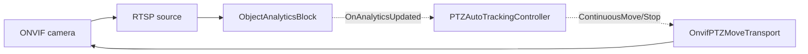

# PTZ Auto-Tracking — Follow a Detected Object with an ONVIF Camera

`PTZAutoTrackingController` turns object detections into continuous PTZ velocity commands, so an
ONVIF PTZ camera automatically follows a tracked object. It plugs into the detections raised by
[`ObjectAnalyticsBlock`](object-analytics.md) (multi-object tracking, stable tracker IDs) or the
[`YOLOObjectDetectorBlock`](object-detection.md), and drives the camera over ONVIF through
`OnvifPTZMoveTransport`.

The control law is a simple proportional (P) controller: the error is the target box center relative
to the frame center; inside a configurable dead zone the camera holds, and outside it the camera
pans/tilts (and optionally zooms) at a speed proportional to how far off-center the target is.



## Requirements

- An **ONVIF PTZ camera** (the device must advertise the PTZ service — verify with
  `OnvifPTZMoveTransport.IsPTZSupportedAsync(onvif)`, which falls back to a media-profile
  `PTZConfiguration` probe when the camera's ONVIF service cache is empty). A fixed camera cannot be driven.
- An ONNX object-detection model (YOLOv8 / YOLOX / RT-DETR) for the detector.

## Usage

```csharp
using System.Drawing;
using VisioForge.Core;
using VisioForge.Core.AI.PTZ;
using VisioForge.Core.MediaBlocks.AI;
using VisioForge.Core.ONVIFX;
using VisioForge.Core.Types.X.AI;

// 0. Initialize the SDK once, before creating any engine object.
await VisioForgeX.InitSDKAsync();

// 1. Connect to the ONVIF camera and build the PTZ transport.
var onvif = new ONVIFClientX();
if (!await onvif.ConnectAsync("http://192.168.1.22/onvif/device_service", "admin", "password"))
{
    // Connection failed — check the address/credentials before proceeding.
    return;
}

if (!await OnvifPTZMoveTransport.IsPTZSupportedAsync(onvif))
{
    // The camera has no PTZ service — auto-tracking is not possible.
    return;
}

var transport = await OnvifPTZMoveTransport.CreateAsync(onvif); // resolves a PTZ-capable media profile
if (transport == null)
{
    // No usable media profile on the device — auto-tracking is not possible.
    return;
}

// 2. Configure the detector + analytics (ObjectAnalyticsBlock gives stable tracker IDs).
var detector = new YoloDetectorSettings("yolox_nano.onnx")
{
    Model = ObjectDetectorModel.YOLOX,
    ConfidenceThreshold = 0.4f,
};
var analyticsBlock = new ObjectAnalyticsBlock(new ObjectAnalyticsSettings(detector));

// 3. Create the controller and attach it to the analytics block.
// The frame size is the source (camera) resolution the detection boxes are expressed in.
var settings = new PTZAutoTrackingSettings
{
    TargetSelection = PTZTargetSelection.ByClassLabel,
    ClassLabelFilter = "person",
    MaxSpeed = 0.5f,
    Gain = 1.2f,
    DeadZone = 0.1f,
};

var controller = new PTZAutoTrackingController(settings, transport);
controller.OnTargetAcquired += (s, det) => Console.WriteLine($"Following {det.Label} #{det.TrackerId}");
controller.OnTargetLost += (s, e) => Console.WriteLine("Target lost.");
controller.OnMoveCommand += (s, cmd) =>
    Console.WriteLine(cmd.IsStop ? "PTZ: stop" : $"PTZ: pan={cmd.Pan} tilt={cmd.Tilt} zoom={cmd.Zoom}");

controller.AttachTo(analyticsBlock, new Size(1920, 1080));
controller.Start();

// 4. The analytics block only takes effect once it is added to your capture engine. Insert it into your
//    configured VideoCaptureCoreX (a MediaBlocksPipeline works the same way) and start streaming.
core.Video_Processing_AddBlock(analyticsBlock);
await core.StartAsync();

// On shutdown: stop the controller (halts the camera), then dispose.
await controller.StopAsync();
controller.Dispose();
```

`AttachTo` also has an overload for `YOLOObjectDetectorBlock`. Because a plain detector carries no
tracker IDs, sticky tracking is only available with `ObjectAnalyticsBlock`; with a plain detector the
controller reacquires a target every frame per the selection policy.

### Using it in a Media Blocks pipeline

The controller is engine-agnostic: `AttachTo` subscribes to the analytics block's detection event,
which fires the same way whether the block runs inside `VideoCaptureCoreX` or a hand-built
`MediaBlocksPipeline`. To wire it into a pipeline, connect the analytics block between your source and
renderer and attach the controller to it exactly as above:

```csharp
using System.Drawing;
using VisioForge.Core.AI.PTZ;
using VisioForge.Core.MediaBlocks;
using VisioForge.Core.MediaBlocks.AI;
using VisioForge.Core.MediaBlocks.Sources;
using VisioForge.Core.MediaBlocks.VideoRendering;
using VisioForge.Core.Types.X.AI;
using VisioForge.Core.Types.X.Sources;

var pipeline = new MediaBlocksPipeline();

var source = new RTSPSourceBlock(
    await RTSPSourceSettings.CreateAsync(new Uri("rtsp://192.168.1.22/..."), "admin", "password", audioEnabled: false));

// Detector + analytics block (same configuration as the Usage example above).
var analyticsBlock = new ObjectAnalyticsBlock(
    new ObjectAnalyticsSettings(new YoloDetectorSettings("yolox_nano.onnx")));

var renderer = new VideoRendererBlock(pipeline, VideoView1) { IsSync = false }; // VideoView1 = your WPF VideoView

// source -> analytics (detection + tracking) -> renderer
pipeline.Connect(source.VideoOutput, analyticsBlock.Input);
pipeline.Connect(analyticsBlock.Output, renderer.Input);

// The controller attaches to the same analytics block and drives the camera as a side-car.
// (transport is the OnvifPTZMoveTransport built in the Usage example above.)
var controller = new PTZAutoTrackingController(new PTZAutoTrackingSettings(), transport);
controller.AttachTo(analyticsBlock, new Size(1920, 1080));
controller.Start();

await pipeline.StartAsync();
```

## How the control law works

For each processed frame the controller:

1. **Selects a target** per `TargetSelection` (see below). Once a target with a valid tracker ID is
   locked, it stays sticky on that ID and ignores other objects.
2. **Computes the error**: the target box center minus the frame center, normalized to `[-1, 1]` on
   each axis.
3. **Applies the dead zone**: if an axis error is within `DeadZone`, that axis is not driven.
4. **Computes the speed**: `clamp(Gain * error, -MaxSpeed, MaxSpeed)` per axis. Positive pan is right,
   positive tilt is up.
5. **Drives zoom** (when `ZoomEnabled`): zooms in when the target box height is below
   `TargetBoxHeightRatio` and out when it is above.
6. **Rate limits**: at most one move command per `CommandInterval`; a single stop is emitted (no
   spam) when the camera enters the dead zone or the target disappears.

If the target is absent, the camera is stopped immediately. If it stays absent for longer than
`LostTargetTimeout`, `OnTargetLost` fires, the camera optionally returns to `HomePresetToken`, and the
next matching detection reacquires a target.

Camera commands are actuated on a dedicated background worker, so the detection thread is never
blocked by network I/O.

## Target selection modes

| `PTZTargetSelection` | Behavior |
|----------------------|----------|
| `Largest`            | Follow the object with the largest bounding-box area (default). |
| `FirstDetected`      | Follow the first object in the detection array. |
| `ByTrackerId`        | Follow only the object whose tracker ID equals `ManualTrackerId`. |
| `ByClassLabel`       | Follow the largest object whose label matches `ClassLabelFilter` (case-insensitive). |

## Settings

| Property | Default | Description |
|----------|---------|-------------|
| `TargetSelection` | `Largest` | Strategy used to pick a target when none is locked. |
| `ClassLabelFilter` | `null` | Label to follow for `ByClassLabel` (e.g. `"person"`). |
| `ManualTrackerId` | `-1` | Tracker ID to follow for `ByTrackerId`. |
| `DeadZone` | `0.1` | Centered dead-zone half-width, as a fraction of the frame half-size (0..1). |
| `MaxSpeed` | `0.5` | Maximum absolute speed on any axis (0..1). |
| `Gain` | `1.2` | Proportional gain applied to the normalized error. |
| `ZoomEnabled` | `false` | Drive zoom to keep the target height near `TargetBoxHeightRatio`. |
| `TargetBoxHeightRatio` | `0.5` | Desired target box height as a fraction of the frame height (0..1). |
| `ZoomDeadZone` | `0.05` | Zoom dead zone on the height-ratio difference (0..1). |
| `LostTargetTimeout` | `2 s` | How long the target may be absent before it is declared lost. |
| `HomePresetToken` | `null` | Optional ONVIF preset to return to when the target is lost. |
| `CommandInterval` | `200 ms` | Minimum interval between move commands (stops are not rate limited). |
| `PatrolPresetTokens` | `null` | Ordered ONVIF preset tokens to cycle as an idle patrol. Patrol is enabled only when this is non-empty. |
| `PatrolStartDelay` | `30 s` | How long to wait after the target is lost, with none reappearing, before starting the patrol. |
| `PatrolDwellTime` | `10 s` | How long to dwell at each patrol preset before advancing to the next. |

## Idle patrol

When the camera would otherwise sit idle, it can automatically cycle through a set of ONVIF presets
until a new target appears. Set `PatrolPresetTokens` to the ordered preset tokens you want to visit
(patrol is enabled only when this array is non-empty):

```csharp
var settings = new PTZAutoTrackingSettings
{
    TargetSelection = PTZTargetSelection.ByClassLabel,
    ClassLabelFilter = "person",
    HomePresetToken = "1",                              // return home first when the target is lost
    PatrolPresetTokens = new[] { "1", "2", "3" },       // then patrol these presets in order
    PatrolStartDelay = TimeSpan.FromSeconds(30),        // ... after 30 s with no new target
    PatrolDwellTime = TimeSpan.FromSeconds(10),         // dwell 10 s at each preset
};

controller.OnPatrolPreset += (s, token) => Console.WriteLine($"Patrol: preset {token}");
```

Sequence of events once the target disappears:

1. The camera stops immediately, and after `LostTargetTimeout` the target is declared lost
   (`OnTargetLost`) and — if `HomePresetToken` is set — the camera returns home.
2. If no new target reappears for `PatrolStartDelay`, the patrol begins: the camera recalls each token
   in `PatrolPresetTokens` in order, dwelling `PatrolDwellTime` at each, wrapping around the list.
3. The moment a new target is acquired, the patrol is aborted immediately and normal tracking resumes.
   The next patrol restarts from the first preset.

Patrol timing is measured against the frame timestamps supplied to the controller, so it stays in step
with the video clock. Get the preset tokens for your device with `ONVIFClientX.GetPresetsAsync`.

## Events

- `OnTargetAcquired(OnnxDetection)` — a new target was locked.
- `OnTargetLost()` — the current target was absent longer than `LostTargetTimeout`.
- `OnMoveCommand(PTZMoveCommandEventArgs)` — every command sent to the camera (`Pan`, `Tilt`, `Zoom`,
  `IsStop`); useful for a status bar or diagnostics.
- `OnPatrolPreset(string)` — the idle patrol moved to the given preset token.

## Custom transport

`OnvifPTZMoveTransport` is the built-in ONVIF implementation. To drive a non-ONVIF PTZ device,
implement `IPTZMoveTransport` (`ContinuousMoveAsync`, `StopAsync`, `GoToPresetAsync`) and pass your
implementation to the controller.

## Demo

Complete WPF samples are available in the SDK samples:

- **[PTZ Auto Tracking (Video Capture SDK X)](https://github.com/visioforge/.Net-SDK-s-samples/tree/master/Video%20Capture%20SDK%20X/WPF/CSharp/PTZ%20Auto%20Tracking)** — auto-tracking with the `VideoCaptureCoreX` engine.
- **[PTZ Auto Tracking (Media Blocks SDK)](https://github.com/visioforge/.Net-SDK-s-samples/tree/master/Media%20Blocks%20SDK/WPF/CSharp/PTZ%20Auto%20Tracking%20MB)** — the same feature built on a low-level `MediaBlocksPipeline`.
