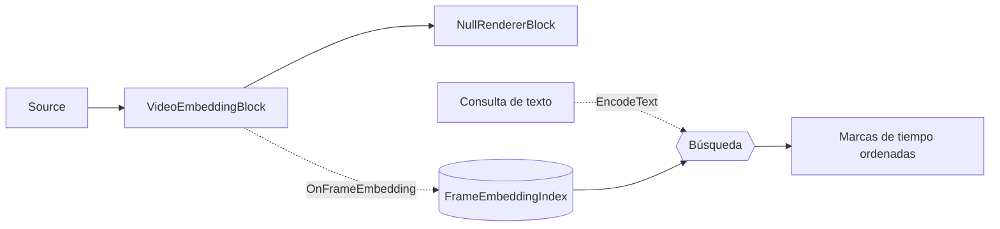

# Búsqueda semántica de vídeo — VideoEmbeddingBlock

Tiene horas de vídeo grabado y necesita saltar a un solo momento — *«alguien entrando en el
vestíbulo»*, *«un camión rojo en la entrada»* — sin recorrer el material ni etiquetarlo primero. La
**búsqueda semántica de vídeo** resuelve esto: indexe el vídeo una vez y luego encuentre los momentos
coincidentes describiéndolos en texto plano. Se ejecuta en el dispositivo con el modelo CLIP de
OpenAI, sin metadatos manuales, sin servicio en la nube y sin un detector por objeto que entrenar.

`VideoEmbeddingBlock` convierte los fotogramas de vídeo en **embeddings CLIP** para que pueda buscar
un vídeo por significado: indexe un archivo una vez y luego encuentre los momentos que coinciden con
una consulta en lenguaje natural como `"a person riding a bicycle"` — sin etiquetas fijas, sin un
detector por objeto. Muestrea fotogramas a un intervalo configurable, codifica cada uno con la torre
de visión de CLIP, genera `OnFrameEmbedding` y (cuando hay un índice adjunto) almacena cada embedding
con su marca de tiempo. La búsqueda codifica el texto de la consulta con la misma torre de texto de
CLIP y clasifica los fotogramas por similitud.

Esta función tiene dos partes:

- **Indexación** — ejecute `VideoEmbeddingBlock` sobre un archivo (o una fuente en vivo) para llenar
  un `FrameEmbeddingIndex` con un embedding por cada fotograma muestreado.
- **Búsqueda** — codifique una consulta de texto (`ClipEmbeddingEngine.EncodeText` o
  `VideoEmbeddingBlock.EncodeText`) y llame a `FrameEmbeddingIndex.Search` para obtener las marcas de
  tiempo que mejor coinciden.



Como la indexación solo necesita los embeddings, el vídeo se decodifica a máxima velocidad hacia un
sumidero sin sincronización (sin reproducción en tiempo real) — consulte
[Indexación offline rápida](#indexacion-offline-rapida-en-mediaplayercorex).

## Cómo funciona la búsqueda semántica de vídeo

La búsqueda semántica coincide por **significado**, no por palabras clave ni metadatos — así que
"alguien montando en bici" encuentra ciclistas en material que nunca se etiquetó. Funciona porque
CLIP tiene dos codificadores que asignan imágenes y texto a un mismo espacio vectorial compartido:

1. **Indexe los fotogramas.** La torre de visión de CLIP codifica cada fotograma muestreado en un
   embedding (un vector de longitud fija, ~512 números) almacenado con su marca de tiempo en un
   `FrameEmbeddingIndex`.
2. **Codifique la consulta.** La torre de texto de CLIP codifica la cadena de su consulta en un
   embedding en el *mismo* espacio, de modo que imágenes y texto son directamente comparables.
3. **Clasifique por similitud.** La similitud del coseno puntúa cada fotograma indexado frente a la
   consulta; las puntuaciones más altas son los momentos que mejor coinciden.
4. **Afine con un margen contrastivo.** Los fotogramas genéricos puntúan moderadamente frente a casi
   cualquier consulta, por lo que las demos restan la mejor puntuación de referencia genérica de cada
   fotograma — consulte [Margen contrastivo](#margen-contrastivo-clasificacion-recomendada).

### Conceptos clave

| Término | Significado |
| --- | --- |
| **Embedding** | Un vector de longitud fija que captura el significado de un fotograma o una frase. |
| **Espacio de embeddings compartido** | CLIP asigna imágenes y texto al mismo espacio, de modo que un vector de texto puede compararse directamente con un vector de imagen. |
| **Similitud del coseno** | Una similitud basada en el ángulo entre dos vectores; a mayor valor, más cercanos en significado. |
| **Margen contrastivo** | La puntuación de la consulta menos la mejor puntuación de referencia genérica para un fotograma — elimina un sesgo independiente de la escena en el coseno bruto y hace que las coincidencias reales destaquen. |

## Construir una función de búsqueda de vídeo

Convertir las dos partes en una función operativa de «buscar en mi material» son cuatro pasos — cada
uno se corresponde con una sección más abajo, así que esto es la receta, no código nuevo:

1. **Obtenga el modelo CLIP** — los archivos de la torre de visión, la torre de texto y el
   tokenizador. Consulte [Modelo](#modelo).
2. **Indexe el vídeo** en un `FrameEmbeddingIndex`, decodificando a máxima velocidad para que un
   archivo largo se indexe en una fracción de su duración. Consulte [Indexación](#indexacion) e
   [Indexación offline rápida en MediaPlayerCoreX](#indexacion-offline-rapida-en-mediaplayercorex).
3. **Persista el índice** en un archivo `.vfei` para indexar una vez y buscar entre sesiones.
   Consulte [Persistir el índice](#persistir-el-indice).
4. **Busque por texto** — incruste la consulta del usuario y clasifique el índice, idealmente con el
   [margen contrastivo](#margen-contrastivo-clasificacion-recomendada). Consulte [Búsqueda](#busqueda).
   Use el `Timestamp` de cada resultado para posicionar el reproductor o renderizar una miniatura.

Una aplicación típica indexa los vídeos nuevos en segundo plano a medida que llegan, mantiene un
`.vfei` por vídeo (o un índice compartido etiquetado por `SourceTag`) y ejecuta la búsqueda de forma
interactiva contra el índice cargado.

## Indexación

Adjunte un `FrameEmbeddingIndex` a los ajustes y el bloque agrega automáticamente cada fotograma
muestreado. `SourceTag` registra de qué archivo procede el fotograma (se usa más tarde para las
miniaturas y la agrupación de resultados).

```csharp
using VisioForge.Core.MediaBlocks;
using VisioForge.Core.MediaBlocks.AI;
using VisioForge.Core.MediaBlocks.Sources;
using VisioForge.Core.MediaBlocks.Special;
using VisioForge.Core.Types.Events;
using VisioForge.Core.Types.X;
using VisioForge.Core.Types.X.AI;

var index = new FrameEmbeddingIndex();

var settings = new VideoEmbeddingSettings(
    "clip-vitb32-vision.onnx",
    "clip-vitb32-text.onnx",
    "clip-vocab.json",
    "clip-merges.txt")
{
    Index = index,
    SourceTag = filePath,
    SampleInterval = TimeSpan.FromSeconds(1),   // un embedding por segundo de vídeo
    BackpressureNoDrop = true,                  // captura cada fotograma muestreado (indexación de archivo offline)
    Provider = OnnxExecutionProvider.Auto,
};

var embedding = new VideoEmbeddingBlock(settings);

var indexSource = new UniversalSourceBlock(
    await UniversalSourceSettings.CreateAsync(filePath, renderVideo: true, renderAudio: false));
var nullRenderer = new NullRendererBlock(MediaBlockPadMediaType.Video) { IsSync = false };

pipeline.Connect(indexSource.Output, embedding.Input);
pipeline.Connect(embedding.Output, nullRenderer.Input);

pipeline.OnStop += (s, e) => Console.WriteLine($"Indexed {index.Count} frames.");
await pipeline.StartAsync();
```

`OnFrameEmbedding` genera un `FrameEmbeddingEventArgs { Timestamp, Embedding }` por cada fotograma
muestreado (el `Embedding` está normalizado con L2). Normalmente no necesita el evento cuando hay un
`Index` adjunto — es útil para un contador de progreso en vivo o para almacenar los embeddings usted
mismo.

!!! tip "Las fuentes en vivo descartan en lugar de aplicar contrapresión"
    Establezca `BackpressureNoDrop = true` solo para la indexación de archivos offline, donde el
    objetivo es bloquear el decodificador para capturar cada intervalo. Para una **cámara en vivo**,
    déjelo en `false` — una cámara no puede recibir contrapresión sin detener la captura, por lo que
    un fotograma muestreado se descarta cuando el codificador está ocupado.

## Búsqueda

Codifique el texto de la consulta en el mismo espacio y clasifique el índice por similitud del coseno:

```csharp
using VisioForge.Core.AI.Clip;

using var engine = new ClipEmbeddingEngine(settings);
engine.Init();

float[] queryVector = engine.EncodeText("a person riding a bicycle");
FrameEmbeddingSearchResult[] hits = index.Search(queryVector, topK: 10);

foreach (var hit in hits)
    Console.WriteLine($"{hit.Timestamp:hh\\:mm\\:ss}  score {hit.Score:F3}  ({hit.SourceTag})");
```

Cada `FrameEmbeddingSearchResult` tiene `Timestamp`, `SourceTag` y `Score` (similitud del coseno,
aproximadamente entre −1 y 1; a mayor valor, más similar). También puede llamar a
`VideoEmbeddingBlock.EncodeText` en un bloque ya construido para codificar una consulta con la misma
sesión — pero un `ClipEmbeddingEngine` independiente le permite buscar después de que la canalización
de indexación se haya detenido y liberado.

### Margen contrastivo (clasificación recomendada)

La similitud del coseno en bruto tiene un sesgo independiente de la escena: los fotogramas genéricos
puntúan moderadamente frente a casi cualquier consulta. En su lugar, las demos clasifican por un
**margen contrastivo** — la puntuación de la consulta menos la mejor puntuación de un conjunto de
indicaciones (prompts) de referencia genéricas — lo que separa nítidamente las coincidencias reales
de los fotogramas de fondo:

```csharp
static readonly string[] BaselinePrompts =
{
    "a photo", "a picture", "an image", "a screenshot", "a random background",
};

float[] queryVec = engine.EncodeText(query);
var queryHits = index.Search(queryVec, index.Count);

// Mejor coseno de referencia por fotograma.
var baseline = new Dictionary<(string, TimeSpan), float>();
foreach (var neg in BaselinePrompts)
    foreach (var h in index.Search(engine.EncodeText(neg), index.Count))
    {
        var key = (h.SourceTag, h.Timestamp);
        if (!baseline.TryGetValue(key, out var cur) || h.Score > cur) baseline[key] = h.Score;
    }

var ranked = queryHits
    .Select(h => { baseline.TryGetValue((h.SourceTag, h.Timestamp), out var nb); return (hit: h, margin: h.Score - nb); })
    .Where(r => r.margin >= minMargin)     // minMargin es un umbral de la interfaz
    .OrderByDescending(r => r.margin)
    .Take(24);
```

### Persistir el índice

`FrameEmbeddingIndex` guarda y carga en un archivo binario compacto `.vfei`, de modo que indexa una
vez y busca entre sesiones:

```csharp
index.Save("frames.vfei");
// más tarde, o en otro proceso:
var loaded = new FrameEmbeddingIndex();
loaded.Load("frames.vfei");
index.Clear(); // vacía el índice y restablece su dimensión
```

## Ajustes clave

`VideoEmbeddingSettings` es una clase de ajustes independiente.

| Propiedad | Predeterminado | Descripción |
| --- | --- | --- |
| `ImageEncoderPath` | `null` | ONNX de la torre de visión de CLIP (con cabeza de proyección). Obligatorio para la indexación. |
| `TextEncoderPath` | `null` | ONNX de la torre de texto de CLIP (con cabeza de proyección). Obligatorio para `EncodeText`. |
| `VocabFilePath` / `MergesFilePath` | `null` | Archivos del tokenizador de CLIP. Obligatorios para `EncodeText`. |
| `SampleInterval` | `1 second` | Tiempo mínimo entre dos fotogramas codificados. |
| `Index` | `null` | El `FrameEmbeddingIndex` al que se agrega automáticamente cada embedding muestreado. Cuando es `null`, los fotogramas solo se generan mediante `OnFrameEmbedding`. |
| `SourceTag` | `null` | Identificador de la fuente almacenado con cada fotograma indexado (nombre de archivo o id de cámara). |
| `BackpressureNoDrop` | `false` | `true` bloquea el decodificador para capturar cada intervalo (indexación de archivo offline); `false` descarta cuando el codificador está ocupado (fuentes en vivo). |
| `Provider` / `DeviceId` | `Auto` / `0` | Proveedor de ejecución ONNX e índice del dispositivo de hardware. |

`VideoEmbeddingBlock.ActiveProvider` reporta el proveedor utilizado, `Dimension` el tamaño del
embedding de CLIP (normalmente 512) y `LastInferenceTimeMs` el coste de codificación por fotograma.

## Tamaño del índice y elección de SampleInterval

`SampleInterval` decide cuántos fotogramas incrusta, lo que determina tanto el tamaño del índice como
el tiempo de indexación. Cada fotograma almacenado es aproximadamente el vector de embedding (~512
floats × 4 bytes ≈ 2 KB) más su marca de tiempo y su etiqueta de origen — así que la aritmética es
predecible:

| Contenido | `SampleInterval` | Fotogramas por hora | Tamaño aprox. del índice / hora |
| --- | --- | --- | --- |
| Material estático o lento | 2 s | 1.800 | ~3,5 MB |
| Material general (predeterminado) | 1 s | 3.600 | ~7 MB |
| Cortes rápidos / momentos breves | 0,5 s | 7.200 | ~14 MB |

Elija el intervalo según lo cortos que sean los momentos que necesita encontrar: 1 segundo capta la
mayoría de las escenas; use 0,5 segundos o menos para cortes rápidos, y un intervalo más grueso para
grabaciones largas y estáticas a fin de mantener el índice pequeño y la indexación rápida. El índice
está en memoria durante una sesión y se persiste en un archivo compacto `.vfei` con `Save`, así que
el tamaño importa sobre todo para bibliotecas muy largas.

## Modelo

La indexación y la búsqueda usan el modelo de doble torre **CLIP ViT-B/32** de OpenAI — una torre de
visión y una torre de texto que asignan imágenes y texto al mismo espacio de embeddings. Ambas
incluyen la cabeza de proyección, por lo que sus salidas comparten la misma dimensión y pueden
compararse directamente por similitud del coseno. Los pesos del modelo no se incluyen en el SDK; las
demos los descargan en la primera ejecución y los almacenan en caché en
`%USERPROFILE%\VisioForge\models\clip`:

| Función | Archivo |
| --- | --- |
| Torre de visión | `clip-vitb32-vision.onnx` |
| Torre de texto | `clip-vitb32-text.onnx` |
| Tokenizador | `clip-vocab.json`, `clip-merges.txt` |

La licencia de un modelo la determina su origen, con independencia de la propia licencia del SDK —
confirme la licencia de los pesos que despliegue.

## Indexación offline rápida en MediaPlayerCoreX

Para indexar un archivo con `MediaPlayerCoreX`, registre el bloque y desactive la sincronización de
reloj del renderizador de vídeo para que el archivo se decodifique **a máxima velocidad en lugar de
en tiempo real**. Combinado con `BackpressureNoDrop = true`, cada intervalo muestreado se captura sin
fotogramas descartados:

```csharp
player.Video_Renderer_IsSync = false;   // decodifica a máxima velocidad, no en tiempo real — establézcalo ANTES de OpenAsync
player.Video_Play = true;
player.Audio_Play = false;

var source = await UniversalSourceSettings.CreateAsync(filePath, renderVideo: true, renderAudio: false);

var settings = new VideoEmbeddingSettings(visionPath, textPath, vocabPath, mergesPath)
{
    Index = index,
    SourceTag = filePath,
    SampleInterval = TimeSpan.FromSeconds(1),
    BackpressureNoDrop = true,
};

var embedding = new VideoEmbeddingBlock(settings);
embedding.OnFrameEmbedding += (s, e) => UpdateProgress(index.Count);
player.Video_Processing_AddBlock(embedding);   // antes de OpenAsync / PlayAsync

player.OnStop += (s, e) => FinalizeIndexing();  // el fin del archivo finaliza el índice

await player.OpenAsync(source);
await player.PlayAsync();
```

`Video_Renderer_IsSync` es una anulación anulable en `MediaPlayerCoreX`: `null` (predeterminado)
sincroniza con el reloj para la reproducción normal, `false` decodifica lo más rápido posible para el
análisis offline y `true` fuerza el tiempo real. Cuando el archivo llega a EOS, se genera `OnStop`; el
motor ya ha desmontado y liberado el bloque insertado para entonces, así que finalice el índice ahí.
La búsqueda sigue funcionando después de que la canalización se detenga porque se ejecuta sobre un
`ClipEmbeddingEngine` independiente, no sobre el bloque ya liberado.

!!! note "La indexación es solo Media Player / Media Blocks"
    La búsqueda semántica de vídeo indexa un **archivo** (o una fuente de Media Blocks). No existe una
    variante de captura con `VideoCaptureCoreX` — indexe material grabado con `MediaPlayerCoreX` o una
    canalización manual de Media Blocks. (Una cámara en vivo todavía puede incrustarse con
    `BackpressureNoDrop = false`, pero la función está diseñada en torno a la búsqueda de vídeo
    almacenado.)

Consulte [Uso de bloques de IA con VideoCaptureCoreX y MediaPlayerCoreX](x-engines.md) para conocer la
API compartida de bloques de procesamiento y las reglas de ciclo de vida.

## Búsqueda semántica frente a etiquetado manual y búsqueda por palabras clave

Los equipos suelen recurrir a una de tres formas de hacer que el vídeo sea localizable. La búsqueda
semántica gana cuando los momentos que necesita no se conocen de antemano y el material no está ya
etiquetado.

| Enfoque | Cómo encuentra un momento | Falla cuando |
| --- | --- | --- |
| **Etiquetado manual / metadatos** | Alguien etiqueta los clips o las marcas de tiempo de antemano; usted busca en las etiquetas. | Nadie etiquetó lo que ahora busca, o la biblioteca es demasiado grande para etiquetarla a mano. |
| **Búsqueda por palabras clave** (nombres de archivo, subtítulos, transcripciones ASR) | Coincide con texto que ya tiene. | Lo que quiere no se dice ni está escrito — es *visual* ("una persona con una chaqueta roja"). |
| **Búsqueda semántica** (esta función) | Describa el momento en texto plano; CLIP clasifica los fotogramas por significado visual. | Necesita recuentos exactos de objetos o cuadros delimitadores — combínela con [detección de objetos](object-detection.md) o un [VLM](vlm-captioning.md). |

Las tres son complementarias, no excluyentes: indexe una vez y luego combine una consulta de texto
con sus filtros existentes (fecha, cámara, etiqueta) para acotar los resultados.

## Casos de uso

- **Buscar material grabado por descripción** — salte a "una persona entrando en el vestíbulo" a lo
  largo de horas de vídeo sin tener que verlo.
- **Gestión de activos multimedia** — construya un índice de embeddings buscable para una biblioteca
  de vídeo y consúltela con lenguaje sencillo.
- **Descubrimiento de momentos destacados y clips** — encuentre momentos candidatos que coincidan con
  una escena descrita para edición o revisión.
- **Deduplicación y similitud** — compare fotogramas o clips por distancia de embedding.
- **Prefiltrado para IA más pesada** — localice fotogramas candidatos semánticamente y luego ejecute
  un detector o un VLM solo sobre ellos.

## Solución de problemas

| Síntoma | Causa probable | Solución |
| --- | --- | --- |
| La indexación se ejecuta a velocidad en tiempo real | `Video_Renderer_IsSync` dejado en el valor predeterminado (`null`) en `MediaPlayerCoreX`, o un renderizador sincronizado en Media Blocks | Establezca `player.Video_Renderer_IsSync = false` antes de `OpenAsync`, o use un `NullRendererBlock { IsSync = false }` en Media Blocks. |
| Faltan algunos fotogramas en el índice | El codificador no pudo seguir el ritmo y descartó fotogramas | Establezca `BackpressureNoDrop = true` para la indexación de archivo offline. |
| La búsqueda devuelve coincidencias débiles o genéricas | Clasificación por coseno bruto | Use el [margen contrastivo](#margen-contrastivo-clasificacion-recomendada) con indicaciones de referencia. |
| `EncodeText` lanza una excepción | No se proporcionaron los archivos de la torre de texto o del tokenizador | Establezca `TextEncoderPath`, `VocabFilePath` y `MergesFilePath`. |
| `Search` devuelve vacío | Índice vacío, o desajuste de dimensión entre la consulta y el índice | Confirme que la indexación terminó (`index.Count > 0`) y que se usa el mismo modelo CLIP para ambos. |
| Menos resultados de los esperados | Intervalo de muestreo demasiado grueso | Reduzca `SampleInterval` para incrustar más fotogramas (a mayor coste de índice y de cómputo). |

## Preguntas frecuentes

### ¿Cómo encuentro una escena concreta en un vídeo largo?

Indexe el vídeo una vez con `VideoEmbeddingBlock` y luego llame a `FrameEmbeddingIndex.Search` con su
escena descrita en texto plano (por ejemplo `"a car pulling into the driveway"`). Cada resultado
incluye un `Timestamp` al que puede posicionarse — así salta directamente a la escena en lugar de
recorrerla. Clasificar con el [margen contrastivo](#margen-contrastivo-clasificacion-recomendada)
hace que el mejor resultado sea mucho más fiable que la similitud en bruto.

### ¿Puedo construir un motor de búsqueda de vídeo en .NET con esto?

Sí, ese es el uso previsto. Indexe su biblioteca en uno o varios archivos `FrameEmbeddingIndex`
(`.vfei`), etiquete cada fotograma con su `SourceTag` y consulte el índice cargado con texto en tiempo
de ejecución. Se ejecuta enteramente en el dispositivo (CLIP de OpenAI mediante ONNX), por lo que no
hay servicio en la nube ni coste por consulta. Consulte
[Construir una función de búsqueda de vídeo](#construir-una-funcion-de-busqueda-de-video) para la
receta de principio a fin.

### ¿Cómo indexo más rápido que en tiempo real?

En `MediaPlayerCoreX`, establezca `Video_Renderer_IsSync = false` antes de `OpenAsync`; en una
canalización manual de Media Blocks, envíe la salida del bloque a un
`NullRendererBlock { IsSync = false }`. Ambos decodifican el archivo tan rápido como lo permita la
CPU/GPU. Mantenga `BackpressureNoDrop = true` para que no se descarte ningún fotograma muestreado.

### ¿Puedo buscar en una cámara en vivo?

La función está orientada al vídeo almacenado. Puede incrustar una cámara en vivo
(`BackpressureNoDrop = false` para que no se detenga), pero no hay una demo de búsqueda dedicada de
`VideoCaptureCoreX` — la indexación y la búsqueda están construidas en torno a archivos.

### ¿Cómo se almacena el índice?

`FrameEmbeddingIndex.Save` escribe un archivo binario compacto `.vfei` (con la firma mágica `VFEI`,
marcas de tiempo + etiquetas de origen + embeddings float). `Load` lo restaura, de modo que puede
indexar una vez y buscar más tarde o en otro proceso.

### ¿Qué hace el margen contrastivo?

Resta de la puntuación de la consulta la mejor puntuación de referencia genérica de cada fotograma, lo
que elimina un sesgo independiente de la escena en la similitud del coseno bruto y hace que las
coincidencias reales destaquen. Es la clasificación que usan las demos — consulte la sección de
[búsqueda](#margen-contrastivo-clasificacion-recomendada).

### ¿Necesito una GPU?

No. `Provider` toma el valor predeterminado `Auto` y se ejecuta en CPU cuando no hay GPU presente. Un
proveedor de GPU acelera la codificación por fotograma, lo que importa más al indexar archivos largos
con un `SampleInterval` fino.

### ¿Puedo buscar en varios vídeos a la vez?

Sí. Indexe varios archivos en el mismo `FrameEmbeddingIndex` (dé a cada uno su propio `SourceTag`); un
único `Search` clasifica entonces los fotogramas de todos ellos — cada `FrameEmbeddingSearchResult`
reporta el `SourceTag`, de modo que sabe de qué archivo (y marca de tiempo) procede una coincidencia.

### ¿En qué se diferencia esto de la detección de objetos o de un VLM?

La detección de objetos y los VLM responden a "qué hay en este fotograma" (cuadros, etiquetas,
descripciones). La búsqueda semántica responde a "qué fotogramas coinciden con esta descripción"
clasificando fotogramas completos frente a una consulta de texto. Encuentra momentos; no dibuja
cuadros. Úsela para localizar fotogramas candidatos y luego ejecute un detector o un
[`VLMBlock`](vlm-captioning.md) sobre ellos si necesita detalle por objeto.

### ¿Es una búsqueda por palabras clave sobre los metadatos del vídeo?

No. Compara el *significado* de los fotogramas y de su consulta en el espacio de embeddings de CLIP,
así que funciona sin etiquetas, nombres de archivo ni transcripciones — "una persona con una chaqueta
roja" coincide por apariencia, no por metadatos de texto que podrían no existir.

### ¿El índice funciona en otro proceso o sesión?

Sí. `Save` escribe un archivo `.vfei` y `Load` lo restaura, de modo que puede indexar una vez y buscar
más tarde, en otra ejecución, o distribuir un índice prediseñado con su aplicación.

### ¿Tengo que conservar el vídeo para buscarlo?

No — una vez que los fotogramas están indexados, la búsqueda se ejecuta enteramente sobre el
`FrameEmbeddingIndex` y la torre de texto de CLIP. Solo necesita de nuevo el archivo original para
mostrar miniaturas o para saltar a una marca de tiempo coincidente.

## Demos

Las demos dedicadas construidas sobre Media Blocks y `MediaPlayerCoreX`
(`Semantic Video Search Demo`, `Semantic Video Search MB`, `Player Semantic Video Search X`,
`Player Semantic Video Search X WPF`) forman parte del conjunto de demos del SDK y se enlazarán aquí
una vez publicadas en el repositorio público de muestras.
