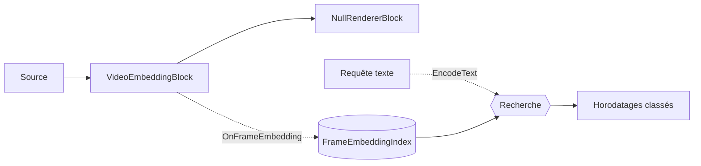

# Recherche vidéo sémantique — VideoEmbeddingBlock

Vous avez des heures de vidéo enregistrée et devez sauter à un moment précis — *« quelqu'un entrant
dans le hall »*, *« un camion rouge au portail »* — sans parcourir les séquences ni les étiqueter au
préalable. La **recherche vidéo sémantique** résout ce problème : indexez la vidéo une fois, puis
trouvez les moments correspondants en les décrivant en texte simple. Elle s'exécute localement avec le
modèle CLIP d'OpenAI — sans métadonnées manuelles, sans service cloud, sans détecteur par objet à
entraîner.

`VideoEmbeddingBlock` transforme les images vidéo en **embeddings CLIP** pour vous permettre de
rechercher une vidéo par le sens : indexez un fichier une fois, puis trouvez les moments qui
correspondent à une requête en langage naturel comme `"a person riding a bicycle"` — sans étiquettes
fixes, sans détecteur par objet. Il échantillonne les images à un intervalle configurable, encode
chacune avec la tour vision de CLIP, déclenche `OnFrameEmbedding` et (lorsqu'un index est attaché)
stocke chaque embedding avec son horodatage. La recherche encode le texte de la requête avec la même
tour texte de CLIP et classe les images par similarité.

Cette fonctionnalité comporte deux volets :

- **Indexation** — exécutez `VideoEmbeddingBlock` sur un fichier (ou une source en direct) pour
  remplir un `FrameEmbeddingIndex` avec un embedding par image échantillonnée.
- **Recherche** — encodez une requête texte (`ClipEmbeddingEngine.EncodeText` ou
  `VideoEmbeddingBlock.EncodeText`) et appelez `FrameEmbeddingIndex.Search` pour obtenir les
  horodatages les mieux correspondants.



Comme l'indexation n'a besoin que des embeddings, la vidéo est décodée à pleine vitesse vers un puits
non synchronisé (pas de lecture en temps réel) — voir
[Indexation hors ligne rapide](#indexation-hors-ligne-rapide-sur-mediaplayercorex).

## Fonctionnement de la recherche vidéo sémantique

La recherche sémantique correspond par le **sens**, et non par mots-clés ou métadonnées — ainsi
« quelqu'un à vélo » trouve des cyclistes dans des séquences qui n'ont jamais été étiquetées. Cela
fonctionne parce que CLIP possède deux encodeurs qui projettent les images et le texte dans un même
espace vectoriel partagé :

1. **Indexer les images.** La tour vision de CLIP encode chaque image échantillonnée en un embedding
   (un vecteur de longueur fixe, ~512 nombres) stocké avec son horodatage dans un
   `FrameEmbeddingIndex`.
2. **Encoder la requête.** La tour texte de CLIP encode votre chaîne de requête en un embedding dans
   le *même* espace, de sorte que les images et le texte sont directement comparables.
3. **Classer par similarité.** La similarité cosinus note chaque image indexée par rapport à la
   requête ; les scores les plus élevés sont les moments les mieux correspondants.
4. **Affiner avec une marge contrastive.** Les images génériques obtiennent un score modéré face à
   presque n'importe quelle requête, donc les démos soustraient le meilleur score de référence
   générique de chaque image — voir
   [Marge contrastive](#marge-contrastive-classement-recommande).

### Concepts clés

| Terme | Signification |
| --- | --- |
| **Embedding** | Un vecteur de longueur fixe qui capture le sens d'une image ou d'une phrase. |
| **Espace d'embedding partagé** | CLIP projette les images et le texte dans le même espace, de sorte qu'un vecteur texte peut être comparé directement à un vecteur image. |
| **Similarité cosinus** | Une similarité basée sur l'angle entre deux vecteurs ; plus elle est élevée, plus le sens est proche. |
| **Marge contrastive** | Le score de la requête moins le meilleur score de référence générique pour une image — supprime un biais indépendant de la scène présent dans le cosinus brut et fait ressortir les vraies correspondances. |

## Construire une fonctionnalité de recherche vidéo

Transformer ces deux volets en une véritable fonctionnalité « rechercher dans mes séquences » se fait
en quatre étapes — chacune correspond à une section ci-dessous, il s'agit donc de la recette, pas de
nouveau code :

1. **Obtenez le modèle CLIP** — les fichiers de la tour vision, de la tour texte et du tokenizer. Voir
   [Modèle](#modele).
2. **Indexez la vidéo** dans un `FrameEmbeddingIndex`, en décodant à pleine vitesse pour qu'un long
   fichier s'indexe en une fraction de sa durée. Voir [Indexation](#indexation) et
   [Indexation hors ligne rapide sur MediaPlayerCoreX](#indexation-hors-ligne-rapide-sur-mediaplayercorex).
3. **Persistez l'index** dans un fichier `.vfei` afin d'indexer une fois et de rechercher à travers
   plusieurs sessions. Voir [Persistance de l'index](#persistance-de-lindex).
4. **Recherchez par texte** — encodez la requête de l'utilisateur et classez l'index, idéalement avec
   la [marge contrastive](#marge-contrastive-classement-recommande). Voir [Recherche](#recherche).
   Utilisez le `Timestamp` de chaque résultat pour positionner le lecteur ou afficher une vignette.

Une application typique indexe les nouvelles vidéos en arrière-plan à mesure qu'elles arrivent,
conserve un `.vfei` par vidéo (ou un index partagé étiqueté par `SourceTag`) et exécute la recherche
de manière interactive sur l'index chargé.

## Indexation

Attachez un `FrameEmbeddingIndex` aux paramètres et le bloc y ajoute automatiquement chaque image
échantillonnée. `SourceTag` enregistre de quel fichier provient l'image (utilisé plus tard pour les
vignettes et le regroupement des résultats).

```csharp
using VisioForge.Core.MediaBlocks;
using VisioForge.Core.MediaBlocks.AI;
using VisioForge.Core.MediaBlocks.Sources;
using VisioForge.Core.MediaBlocks.Special;
using VisioForge.Core.Types.Events;
using VisioForge.Core.Types.X;
using VisioForge.Core.Types.X.AI;

var index = new FrameEmbeddingIndex();

var settings = new VideoEmbeddingSettings(
    "clip-vitb32-vision.onnx",
    "clip-vitb32-text.onnx",
    "clip-vocab.json",
    "clip-merges.txt")
{
    Index = index,
    SourceTag = filePath,
    SampleInterval = TimeSpan.FromSeconds(1),   // un embedding par seconde de vidéo
    BackpressureNoDrop = true,                  // capturer chaque image échantillonnée (indexation de fichier hors ligne)
    Provider = OnnxExecutionProvider.Auto,
};

var embedding = new VideoEmbeddingBlock(settings);

var indexSource = new UniversalSourceBlock(
    await UniversalSourceSettings.CreateAsync(filePath, renderVideo: true, renderAudio: false));
var nullRenderer = new NullRendererBlock(MediaBlockPadMediaType.Video) { IsSync = false };

pipeline.Connect(indexSource.Output, embedding.Input);
pipeline.Connect(embedding.Output, nullRenderer.Input);

pipeline.OnStop += (s, e) => Console.WriteLine($"Indexed {index.Count} frames.");
await pipeline.StartAsync();
```

`OnFrameEmbedding` déclenche un `FrameEmbeddingEventArgs { Timestamp, Embedding }` par image
échantillonnée (l'`Embedding` est normalisé L2). Vous n'avez généralement pas besoin de l'événement
lorsqu'un `Index` est attaché — il est utile pour un compteur de progression en direct ou pour stocker
les embeddings vous-même.

!!! tip "Les sources en direct abandonnent au lieu d'appliquer une contre-pression"
    Ne définissez `BackpressureNoDrop = true` que pour l'indexation de fichier hors ligne, où le but
    est de bloquer le décodeur pour capturer chaque intervalle. Pour une **caméra en direct**, laissez
    la valeur `false` — une caméra ne peut pas subir de contre-pression sans bloquer la capture, donc
    une image échantillonnée est abandonnée lorsque l'encodeur est occupé.

## Recherche

Encodez le texte de la requête dans le même espace et classez l'index par similarité cosinus :

```csharp
using VisioForge.Core.AI.Clip;

using var engine = new ClipEmbeddingEngine(settings);
engine.Init();

float[] queryVector = engine.EncodeText("a person riding a bicycle");
FrameEmbeddingSearchResult[] hits = index.Search(queryVector, topK: 10);

foreach (var hit in hits)
    Console.WriteLine($"{hit.Timestamp:hh\\:mm\\:ss}  score {hit.Score:F3}  ({hit.SourceTag})");
```

Chaque `FrameEmbeddingSearchResult` possède `Timestamp`, `SourceTag` et `Score` (similarité cosinus,
approximativement −1..1, plus la valeur est élevée, plus l'image est similaire). Vous pouvez aussi
appeler `VideoEmbeddingBlock.EncodeText` sur un bloc construit pour encoder une requête avec la même
session — mais un `ClipEmbeddingEngine` autonome vous permet de rechercher après que le pipeline
d'indexation s'est arrêté et a été libéré.

### Marge contrastive (classement recommandé)

La similarité cosinus brute présente un biais indépendant de la scène : les images génériques
obtiennent un score modéré face à presque n'importe quelle requête. Les démos classent plutôt par une
**marge contrastive** — le score de la requête moins le meilleur score d'un ensemble d'invites de
référence génériques — ce qui sépare nettement les vraies correspondances des images d'arrière-plan :

```csharp
static readonly string[] BaselinePrompts =
{
    "a photo", "a picture", "an image", "a screenshot", "a random background",
};

float[] queryVec = engine.EncodeText(query);
var queryHits = index.Search(queryVec, index.Count);

// Meilleur cosinus de référence par image.
var baseline = new Dictionary<(string, TimeSpan), float>();
foreach (var neg in BaselinePrompts)
    foreach (var h in index.Search(engine.EncodeText(neg), index.Count))
    {
        var key = (h.SourceTag, h.Timestamp);
        if (!baseline.TryGetValue(key, out var cur) || h.Score > cur) baseline[key] = h.Score;
    }

var ranked = queryHits
    .Select(h => { baseline.TryGetValue((h.SourceTag, h.Timestamp), out var nb); return (hit: h, margin: h.Score - nb); })
    .Where(r => r.margin >= minMargin)     // minMargin est un seuil d'interface
    .OrderByDescending(r => r.margin)
    .Take(24);
```

### Persistance de l'index

`FrameEmbeddingIndex` s'enregistre et se charge depuis un fichier binaire compact `.vfei`, de sorte que
vous indexez une fois et recherchez à travers plusieurs sessions :

```csharp
index.Save("frames.vfei");
// plus tard, ou dans un autre processus :
var loaded = new FrameEmbeddingIndex();
loaded.Load("frames.vfei");
index.Clear(); // vider l'index et réinitialiser sa dimension
```

## Paramètres clés

`VideoEmbeddingSettings` est une classe de paramètres autonome.

| Propriété | Par défaut | Description |
| --- | --- | --- |
| `ImageEncoderPath` | `null` | ONNX de la tour vision de CLIP (avec tête de projection). Obligatoire pour l'indexation. |
| `TextEncoderPath` | `null` | ONNX de la tour texte de CLIP (avec tête de projection). Obligatoire pour `EncodeText`. |
| `VocabFilePath` / `MergesFilePath` | `null` | Fichiers du tokenizer CLIP. Obligatoires pour `EncodeText`. |
| `SampleInterval` | `1 seconde` | Temps minimal entre deux images encodées. |
| `Index` | `null` | Le `FrameEmbeddingIndex` auquel chaque embedding échantillonné est ajouté automatiquement. Lorsqu'il est `null`, les images ne sont déclenchées que via `OnFrameEmbedding`. |
| `SourceTag` | `null` | Identifiant de source stocké avec chaque image indexée (nom de fichier ou identifiant de caméra). |
| `BackpressureNoDrop` | `false` | `true` bloque le décodeur pour capturer chaque intervalle (indexation de fichier hors ligne) ; `false` abandonne lorsque l'encodeur est occupé (sources en direct). |
| `Provider` / `DeviceId` | `Auto` / `0` | Fournisseur d'exécution ONNX et index du périphérique matériel. |

`VideoEmbeddingBlock.ActiveProvider` indique le fournisseur réellement utilisé, `Dimension` la taille
de l'embedding CLIP (généralement 512) et `LastInferenceTimeMs` le coût d'encodage par image.

## Taille de l'index et choix de SampleInterval

`SampleInterval` détermine combien d'images vous encodez, ce qui pilote à la fois la taille de l'index
et le temps d'indexation. Chaque image stockée occupe environ le vecteur d'embedding (~512 flottants ×
4 octets ≈ 2 Ko) plus son horodatage et son identifiant de source — donc le calcul est prévisible :

| Contenu | `SampleInterval` | Images par heure | Taille approx. de l'index / heure |
| --- | --- | --- | --- |
| Séquences statiques ou lentes | 2 s | 1 800 | ~3,5 Mo |
| Séquences générales (par défaut) | 1 s | 3 600 | ~7 Mo |
| Coupes rapides / moments brefs | 0,5 s | 7 200 | ~14 Mo |

Choisissez l'intervalle en fonction de la brièveté des moments que vous devez trouver : 1 seconde
capte la plupart des scènes ; utilisez 0,5 seconde ou plus fin pour les coupes rapides, et un
intervalle plus grossier pour les longs enregistrements statiques afin de garder l'index petit et
l'indexation rapide. L'index réside en mémoire pendant une session et est persisté dans un fichier
compact `.vfei` avec `Save`, donc la taille n'importe surtout que pour de très longues bibliothèques.

## Modèle

L'indexation et la recherche utilisent le modèle à double tour OpenAI **CLIP ViT-B/32** — une tour
vision et une tour texte qui projettent les images et le texte dans le même espace d'embedding. Toutes
deux incluent la tête de projection, de sorte que leurs sorties partagent la même dimension et peuvent
être comparées directement par similarité cosinus. Les poids des modèles ne sont pas fournis avec le
SDK ; les démos les téléchargent au premier lancement et les mettent en cache sous
`%USERPROFILE%\VisioForge\models\clip` :

| Rôle | Fichier |
| --- | --- |
| Tour vision | `clip-vitb32-vision.onnx` |
| Tour texte | `clip-vitb32-text.onnx` |
| Tokenizer | `clip-vocab.json`, `clip-merges.txt` |

La licence d'un modèle est déterminée par son origine, indépendamment de la licence propre du SDK —
vérifiez la licence des poids que vous déployez.

## Indexation hors ligne rapide sur MediaPlayerCoreX

Pour indexer un fichier avec `MediaPlayerCoreX`, enregistrez le bloc et désactivez la synchronisation
d'horloge du moteur de rendu vidéo afin que le fichier soit décodé **à pleine vitesse plutôt qu'en
temps réel**. Combiné à `BackpressureNoDrop = true`, chaque intervalle échantillonné est capturé sans
image perdue :

```csharp
player.Video_Renderer_IsSync = false;   // décoder à pleine vitesse, pas en temps réel — à définir AVANT OpenAsync
player.Video_Play = true;
player.Audio_Play = false;

var source = await UniversalSourceSettings.CreateAsync(filePath, renderVideo: true, renderAudio: false);

var settings = new VideoEmbeddingSettings(visionPath, textPath, vocabPath, mergesPath)
{
    Index = index,
    SourceTag = filePath,
    SampleInterval = TimeSpan.FromSeconds(1),
    BackpressureNoDrop = true,
};

var embedding = new VideoEmbeddingBlock(settings);
embedding.OnFrameEmbedding += (s, e) => UpdateProgress(index.Count);
player.Video_Processing_AddBlock(embedding);   // avant OpenAsync / PlayAsync

player.OnStop += (s, e) => FinalizeIndexing();  // la fin de fichier finalise l'index

await player.OpenAsync(source);
await player.PlayAsync();
```

`Video_Renderer_IsSync` est une surcharge nullable sur `MediaPlayerCoreX` : `null` (par défaut) se
synchronise sur l'horloge pour une lecture normale, `false` décode aussi vite que possible pour une
analyse hors ligne, `true` force le temps réel. Lorsque le fichier atteint l'EOS, `OnStop` se
déclenche ; le moteur a déjà démantelé et libéré le bloc inséré à ce moment-là, donc finalisez l'index
à cet endroit. La recherche continue de fonctionner après l'arrêt du pipeline car elle s'exécute sur un
`ClipEmbeddingEngine` autonome, et non sur le bloc libéré.

!!! note "L'indexation est réservée à Media Player / Media Blocks"
    La recherche vidéo sémantique indexe un **fichier** (ou une source Media Blocks). Il n'existe pas
    de variante de capture `VideoCaptureCoreX` — indexez les séquences enregistrées avec
    `MediaPlayerCoreX` ou un pipeline Media Blocks manuel. (Une caméra en direct peut tout de même être
    encodée avec `BackpressureNoDrop = false`, mais la fonctionnalité est conçue autour de la recherche
    de vidéo stockée.)

Consultez [Utiliser les blocs IA avec VideoCaptureCoreX et MediaPlayerCoreX](x-engines.md) pour l'API
partagée des blocs de traitement et les règles de cycle de vie.

## Recherche sémantique vs étiquetage manuel et recherche par mots-clés

Les équipes recourent généralement à l'une des trois façons de rendre une vidéo trouvable. La
recherche sémantique l'emporte lorsque les moments dont vous avez besoin ne sont pas connus à l'avance
et que les séquences ne sont pas déjà étiquetées.

| Approche | Comment vous trouvez un moment | Ses limites |
| --- | --- | --- |
| **Étiquetage manuel / métadonnées** | Quelqu'un étiquette les clips ou les horodatages au préalable ; vous recherchez dans les étiquettes. | Personne n'a étiqueté ce que vous cherchez désormais, ou la bibliothèque est trop volumineuse pour être étiquetée à la main. |
| **Recherche par mots-clés** (noms de fichiers, sous-titres, transcriptions ASR) | Correspondre au texte que vous possédez déjà. | La chose que vous voulez n'est ni prononcée ni écrite — elle est *visuelle* (« une personne en veste rouge »). |
| **Recherche sémantique** (cette fonctionnalité) | Décrivez le moment en texte ; CLIP classe les images par sens visuel. | Vous avez besoin de comptes d'objets exacts ou de boîtes englobantes — associez-la à la [détection d'objets](object-detection.md) ou à un [VLM](vlm-captioning.md). |

Les trois sont complémentaires, non exclusives : indexez une fois, puis combinez une requête texte avec
vos filtres existants (date, caméra, étiquette) pour affiner les résultats.

## Cas d'usage

- **Rechercher des séquences enregistrées par description** — sauter à « une personne entrant dans le
  hall » à travers des heures de vidéo sans la regarder.
- **Gestion des actifs médias** — construire un index d'embeddings interrogeable pour une bibliothèque
  vidéo et l'interroger en langage simple.
- **Découverte de temps forts et de clips** — trouver des moments candidats correspondant à une scène
  décrite pour le montage ou la revue.
- **Déduplication et similarité** — comparer des images ou des clips par distance d'embedding.
- **Pré-filtrage pour une IA plus lourde** — localiser sémantiquement des images candidates, puis
  n'exécuter un détecteur ou un VLM que sur celles-ci.

## Dépannage

| Symptôme | Cause probable | Solution |
| --- | --- | --- |
| L'indexation s'exécute à la vitesse du temps réel | `Video_Renderer_IsSync` laissé à sa valeur par défaut (`null`) sur `MediaPlayerCoreX`, ou un moteur de rendu synchronisé sur Media Blocks | Définissez `player.Video_Renderer_IsSync = false` avant `OpenAsync`, ou utilisez un `NullRendererBlock { IsSync = false }` sur Media Blocks. |
| Certaines images manquent dans l'index | L'encodeur n'a pas pu suivre et a abandonné des images | Définissez `BackpressureNoDrop = true` pour l'indexation de fichier hors ligne. |
| La recherche renvoie des correspondances faibles ou génériques | Classement par cosinus brut | Utilisez la [marge contrastive](#marge-contrastive-classement-recommande) avec des invites de référence. |
| `EncodeText` lève une exception | Fichiers de la tour texte ou du tokenizer non fournis | Définissez `TextEncoderPath`, `VocabFilePath` et `MergesFilePath`. |
| `Search` renvoie un résultat vide | Index vide, ou incompatibilité de dimension entre la requête et l'index | Vérifiez que l'indexation est terminée (`index.Count > 0`) et que le même modèle CLIP est utilisé pour les deux. |
| Moins de résultats que prévu | Intervalle d'échantillonnage trop grossier | Réduisez `SampleInterval` pour encoder davantage d'images (au prix d'un index et d'un calcul plus importants). |

## Foire aux questions

### Comment trouver une scène précise dans une longue vidéo ?

Indexez la vidéo une fois avec `VideoEmbeddingBlock`, puis appelez `FrameEmbeddingIndex.Search` avec
votre scène décrite en texte simple (par exemple `"a car pulling into the driveway"`). Chaque résultat
porte un `Timestamp` sur lequel vous pouvez vous positionner — vous sautez donc directement à la scène
au lieu de la parcourir. Le classement avec la
[marge contrastive](#marge-contrastive-classement-recommande) rend le meilleur résultat bien plus
fiable que la similarité brute.

### Puis-je construire un moteur de recherche vidéo en .NET avec cela ?

Oui — c'est l'usage prévu. Indexez votre bibliothèque dans un ou plusieurs fichiers
`FrameEmbeddingIndex` (`.vfei`), étiquetez chaque image avec son `SourceTag` et interrogez l'index
chargé avec du texte au moment de l'exécution. C'est entièrement local (OpenAI CLIP via ONNX), il n'y a
donc ni service cloud ni coût par requête. Voir
[Construire une fonctionnalité de recherche vidéo](#construire-une-fonctionnalite-de-recherche-video)
pour la recette de bout en bout.

### Comment indexer plus vite que le temps réel ?

Sur `MediaPlayerCoreX`, définissez `Video_Renderer_IsSync = false` avant `OpenAsync` ; sur un pipeline
Media Blocks manuel, envoyez la sortie du bloc vers un `NullRendererBlock { IsSync = false }`. Les deux
décodent le fichier aussi vite que le CPU/GPU le permet. Conservez `BackpressureNoDrop = true` pour
qu'aucune image échantillonnée ne soit abandonnée.

### Puis-je rechercher dans une caméra en direct ?

La fonctionnalité cible la vidéo stockée. Vous pouvez encoder une caméra en direct
(`BackpressureNoDrop = false` pour qu'elle ne se bloque pas), mais il n'existe pas de démo de recherche
`VideoCaptureCoreX` dédiée — l'indexation et la recherche sont conçues autour des fichiers.

### Comment l'index est-il stocké ?

`FrameEmbeddingIndex.Save` écrit un fichier binaire compact `.vfei` (magie `VFEI`, horodatages +
identifiants de source + embeddings flottants). `Load` le restaure, de sorte que vous pouvez indexer
une fois et rechercher plus tard ou dans un autre processus.

### À quoi sert la marge contrastive ?

Elle soustrait le meilleur score de référence générique de chaque image de son score de requête, ce
qui supprime un biais indépendant de la scène présent dans la similarité cosinus brute et fait
ressortir les vraies correspondances. C'est le classement utilisé par les démos — voir la section
[Recherche](#marge-contrastive-classement-recommande).

### Ai-je besoin d'un GPU ?

Non. `Provider` vaut `Auto` par défaut et s'exécute sur CPU en l'absence de GPU. Un fournisseur GPU
accélère l'encodage par image, ce qui compte le plus lors de l'indexation de longs fichiers à un
`SampleInterval` fin.

### Puis-je rechercher dans plusieurs vidéos à la fois ?

Oui. Indexez plusieurs fichiers dans le même `FrameEmbeddingIndex` (donnez à chacun son propre
`SourceTag`), puis une seule `Search` classe les images de tous à la fois — chaque
`FrameEmbeddingSearchResult` indique le `SourceTag` pour que vous sachiez de quel fichier (et de quel
horodatage) provient un résultat.

### En quoi cela diffère-t-il de la détection d'objets ou d'un VLM ?

La détection d'objets et les VLM répondent à « qu'y a-t-il dans cette image » (boîtes, étiquettes,
légendes). La recherche sémantique répond à « quelles images correspondent à cette description » en
classant des images entières par rapport à une requête texte. Elle trouve des moments ; elle ne dessine
pas de boîtes. Utilisez-la pour localiser des images candidates, puis exécutez un détecteur ou un
[`VLMBlock`](vlm-captioning.md) sur celles-ci si vous avez besoin de détails par objet.

### S'agit-il d'une recherche par mot-clé sur les métadonnées vidéo ?

Non. Elle compare le *sens* des images et de votre requête dans l'espace d'embedding de CLIP, donc elle
fonctionne sans étiquettes, noms de fichiers ni transcriptions — « une personne en veste rouge »
correspond à l'apparence, pas à des métadonnées textuelles qui pourraient ne pas exister.

### L'index fonctionne-t-il dans un autre processus ou une autre session ?

Oui. `Save` écrit un fichier `.vfei` et `Load` le restaure, de sorte que vous pouvez indexer une fois
et rechercher plus tard, dans une autre exécution, ou livrer un index préconstruit avec votre
application.

### Dois-je conserver la vidéo pour la rechercher ?

Non — une fois les images indexées, la recherche s'exécute entièrement sur le `FrameEmbeddingIndex` et
la tour texte de CLIP. Vous n'avez besoin du fichier d'origine à nouveau que pour afficher des
vignettes ou pour vous positionner sur un horodatage correspondant.

## Démos

Des démos dédiées construites sur Media Blocks et `MediaPlayerCoreX`
(`Semantic Video Search Demo`, `Semantic Video Search MB`, `Player Semantic Video Search X`,
`Player Semantic Video Search X WPF`) figurent dans l'ensemble de démos du SDK et seront reliées ici
une fois publiées sur le dépôt d'échantillons public.
