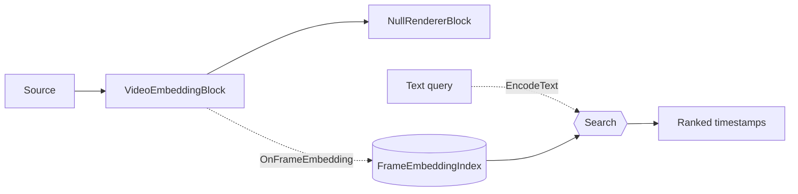

# Semantic Video Search — VideoEmbeddingBlock

You have hours of recorded video and need to jump to one moment — *"someone entering the lobby"*,
*"a red truck at the gate"* — without scrubbing through the footage or tagging it first. **Semantic
video search** solves this: index the video once, then find matching moments by describing them in
plain text. It runs on-device with OpenAI's CLIP model — no manual metadata, no cloud service, no
per-object detector to train.

`VideoEmbeddingBlock` turns video frames into **CLIP embeddings** so you can search a video by
meaning: index a file once, then find the moments that match a natural-language query like
`"a person riding a bicycle"` — no fixed labels, no per-object detector. It samples frames at a
configurable interval, encodes each with the CLIP vision tower, raises `OnFrameEmbedding`, and (when
an index is attached) stores each embedding with its timestamp. Search embeds the query text with the
same CLIP text tower and ranks frames by similarity.

This feature has two halves:

- **Indexing** — run `VideoEmbeddingBlock` over a file (or live source) to fill a
  `FrameEmbeddingIndex` with one embedding per sampled frame.
- **Search** — embed a text query (`ClipEmbeddingEngine.EncodeText` or `VideoEmbeddingBlock.EncodeText`)
  and call `FrameEmbeddingIndex.Search` to get the best-matching timestamps.



Because indexing only needs the embeddings, the video is decoded at full speed to a non-synced sink
(no real-time playback) — see [Fast offline indexing](#fast-offline-indexing-on-mediaplayercorex).

## How semantic video search works

Semantic search matches by **meaning**, not keywords or metadata — so "someone riding a bike" finds
cyclists in footage that was never tagged. It works because CLIP has two encoders that map images and
text into one shared vector space:

1. **Index the frames.** The CLIP vision tower encodes each sampled frame into an embedding (a
   fixed-length vector, ~512 numbers) stored with its timestamp in a `FrameEmbeddingIndex`.
2. **Embed the query.** The CLIP text tower encodes your query string into an embedding in the *same*
   space, so images and text are directly comparable.
3. **Rank by similarity.** Cosine similarity scores every indexed frame against the query; the highest
   scores are the best-matching moments.
4. **Sharpen with a contrastive margin.** Generic frames score moderately against almost any query, so
   the demos subtract each frame's best generic-baseline score — see
   [Contrastive margin](#contrastive-margin-recommended-ranking).

### Key concepts

| Term | Meaning |
| --- | --- |
| **Embedding** | A fixed-length vector that captures the meaning of a frame or a phrase. |
| **Shared embedding space** | CLIP maps images and text into the same space, so a text vector can be compared to an image vector directly. |
| **Cosine similarity** | An angle-based similarity between two vectors; higher means closer in meaning. |
| **Contrastive margin** | The query score minus the best generic-baseline score for a frame — removes a scene-independent bias in raw cosine and makes true matches stand out. |

## Build a video search feature

Turning the two halves into a working "search my footage" feature is four steps — each maps to a
section below, so this is the recipe, not new code:

1. **Get the CLIP model** — the vision tower, text tower, and tokenizer files. See [Model](#model).
2. **Index the video** into a `FrameEmbeddingIndex`, decoding at full speed so a long file indexes in
   a fraction of its runtime. See [Indexing](#indexing) and
   [Fast offline indexing on MediaPlayerCoreX](#fast-offline-indexing-on-mediaplayercorex).
3. **Persist the index** to a `.vfei` file so you index once and search across sessions. See
   [Persisting the index](#persisting-the-index).
4. **Search by text** — embed the user's query and rank the index, ideally with the
   [contrastive margin](#contrastive-margin-recommended-ranking). See [Search](#search). Use each
   hit's `Timestamp` to seek the player or render a thumbnail.

A typical application indexes new videos in the background as they arrive, keeps one `.vfei` per video
(or a shared index tagged by `SourceTag`), and runs search interactively against the loaded index.

## Indexing

Attach a `FrameEmbeddingIndex` to the settings and the block adds every sampled frame to it
automatically. `SourceTag` records which file the frame came from (used later for thumbnails and
result grouping).

```csharp
using VisioForge.Core.MediaBlocks;
using VisioForge.Core.MediaBlocks.AI;
using VisioForge.Core.MediaBlocks.Sources;
using VisioForge.Core.MediaBlocks.Special;
using VisioForge.Core.Types.Events;
using VisioForge.Core.Types.X;
using VisioForge.Core.Types.X.AI;

var index = new FrameEmbeddingIndex();

var settings = new VideoEmbeddingSettings(
    "clip-vitb32-vision.onnx",
    "clip-vitb32-text.onnx",
    "clip-vocab.json",
    "clip-merges.txt")
{
    Index = index,
    SourceTag = filePath,
    SampleInterval = TimeSpan.FromSeconds(1),   // one embedding per second of video
    BackpressureNoDrop = true,                  // capture every sampled frame (offline file indexing)
    Provider = OnnxExecutionProvider.Auto,
};

var embedding = new VideoEmbeddingBlock(settings);

var indexSource = new UniversalSourceBlock(
    await UniversalSourceSettings.CreateAsync(filePath, renderVideo: true, renderAudio: false));
var nullRenderer = new NullRendererBlock(MediaBlockPadMediaType.Video) { IsSync = false };

pipeline.Connect(indexSource.Output, embedding.Input);
pipeline.Connect(embedding.Output, nullRenderer.Input);

pipeline.OnStop += (s, e) => Console.WriteLine($"Indexed {index.Count} frames.");
await pipeline.StartAsync();
```

`OnFrameEmbedding` raises a `FrameEmbeddingEventArgs { Timestamp, Embedding }` per sampled frame (the
`Embedding` is L2-normalized). You usually don't need the event when an `Index` is attached — it is
useful for a live progress counter or to store embeddings yourself.

!!! tip "Live sources drop instead of backpressuring"
    Set `BackpressureNoDrop = true` only for offline file indexing, where blocking the decoder to
    capture every interval is the goal. For a **live camera**, leave it `false` — a camera cannot be
    backpressured without stalling capture, so a sampled frame is dropped when the encoder is busy.

## Search

Embed the query text in the same space and rank the index by cosine similarity:

```csharp
using VisioForge.Core.AI.Clip;

using var engine = new ClipEmbeddingEngine(settings);
engine.Init();

float[] queryVector = engine.EncodeText("a person riding a bicycle");
FrameEmbeddingSearchResult[] hits = index.Search(queryVector, topK: 10);

foreach (var hit in hits)
    Console.WriteLine($"{hit.Timestamp:hh\\:mm\\:ss}  score {hit.Score:F3}  ({hit.SourceTag})");
```

Each `FrameEmbeddingSearchResult` has `Timestamp`, `SourceTag`, and `Score` (cosine similarity,
roughly −1..1, higher is more similar). You can also call `VideoEmbeddingBlock.EncodeText` on a built
block to embed a query with the same session — but a standalone `ClipEmbeddingEngine` lets you search
after the indexing pipeline has stopped and been disposed.

### Contrastive margin (recommended ranking)

Raw cosine similarity has a scene-independent bias: generic frames score moderately against almost any
query. The demos rank by a **contrastive margin** instead — the query score minus the best score from
a set of generic baseline prompts — which sharply separates true matches from background frames:

```csharp
static readonly string[] BaselinePrompts =
{
    "a photo", "a picture", "an image", "a screenshot", "a random background",
};

float[] queryVec = engine.EncodeText(query);
var queryHits = index.Search(queryVec, index.Count);

// Best baseline cosine per frame.
var baseline = new Dictionary<(string, TimeSpan), float>();
foreach (var neg in BaselinePrompts)
    foreach (var h in index.Search(engine.EncodeText(neg), index.Count))
    {
        var key = (h.SourceTag, h.Timestamp);
        if (!baseline.TryGetValue(key, out var cur) || h.Score > cur) baseline[key] = h.Score;
    }

var ranked = queryHits
    .Select(h => { baseline.TryGetValue((h.SourceTag, h.Timestamp), out var nb); return (hit: h, margin: h.Score - nb); })
    .Where(r => r.margin >= minMargin)     // minMargin is a UI threshold
    .OrderByDescending(r => r.margin)
    .Take(24);
```

### Persisting the index

`FrameEmbeddingIndex` saves and loads to a compact binary `.vfei` file, so you index once and search
across sessions:

```csharp
index.Save("frames.vfei");
// later, or in another process:
var loaded = new FrameEmbeddingIndex();
loaded.Load("frames.vfei");
index.Clear(); // empty the index and reset its dimension
```

## Key settings

`VideoEmbeddingSettings` is a standalone settings class.

| Property | Default | Description |
| --- | --- | --- |
| `ImageEncoderPath` | `null` | CLIP vision-tower ONNX (with projection head). Required for indexing. |
| `TextEncoderPath` | `null` | CLIP text-tower ONNX (with projection head). Required for `EncodeText`. |
| `VocabFilePath` / `MergesFilePath` | `null` | CLIP tokenizer files. Required for `EncodeText`. |
| `SampleInterval` | `1 second` | Minimum time between two encoded frames. |
| `Index` | `null` | The `FrameEmbeddingIndex` each sampled embedding is auto-added to. When `null`, frames are only raised via `OnFrameEmbedding`. |
| `SourceTag` | `null` | Source identifier stored with every indexed frame (file name or camera id). |
| `BackpressureNoDrop` | `false` | `true` blocks the decoder to capture every interval (offline file indexing); `false` drops when the encoder is busy (live sources). |
| `Provider` / `DeviceId` | `Auto` / `0` | ONNX execution provider and hardware device index. |

`VideoEmbeddingBlock.ActiveProvider` reports the engaged provider, `Dimension` the CLIP embedding size
(typically 512), and `LastInferenceTimeMs` the per-frame encode cost.

## Index size and choosing SampleInterval

`SampleInterval` decides how many frames you embed, which drives both index size and indexing time.
Each stored frame is roughly the embedding vector (~512 floats × 4 bytes ≈ 2 KB) plus its timestamp
and source tag — so the math is predictable:

| Content | `SampleInterval` | Frames per hour | Approx. index size / hour |
| --- | --- | --- | --- |
| Static or slow footage | 2 s | 1,800 | ~3.5 MB |
| General footage (default) | 1 s | 3,600 | ~7 MB |
| Fast cuts / brief moments | 0.5 s | 7,200 | ~14 MB |

Pick the interval by how short the moments you need to find are: 1 second catches most scenes; use
0.5 second or finer for rapid cuts, and a coarser interval for long, static recordings to keep the
index small and indexing fast. The index is in-memory during a session and persisted to a compact
`.vfei` file with `Save`, so size mostly matters for very long libraries.

## Model

Indexing and search use the OpenAI **CLIP ViT-B/32** dual-tower model — a vision tower and a text
tower that map images and text into the same embedding space. Both include the projection head, so
their outputs share the same dimension and can be compared directly by cosine similarity. Model
weights are not bundled with the SDK; the demos download them on first run and cache them under
`%USERPROFILE%\VisioForge\models\clip`:

| Role | File |
| --- | --- |
| Vision tower | `clip-vitb32-vision.onnx` |
| Text tower | `clip-vitb32-text.onnx` |
| Tokenizer | `clip-vocab.json`, `clip-merges.txt` |

A model's license is set by its origin, independent of the SDK's own license — confirm the license of
the weights you deploy.

## Fast offline indexing on MediaPlayerCoreX

To index a file with `MediaPlayerCoreX`, register the block and turn off video-renderer clock sync so
the file decodes **at full speed instead of real time**. Combined with `BackpressureNoDrop = true`,
every sampled interval is captured with no dropped frames:

```csharp
player.Video_Renderer_IsSync = false;   // decode at full speed, not real time — set BEFORE OpenAsync
player.Video_Play = true;
player.Audio_Play = false;

var source = await UniversalSourceSettings.CreateAsync(filePath, renderVideo: true, renderAudio: false);

var settings = new VideoEmbeddingSettings(visionPath, textPath, vocabPath, mergesPath)
{
    Index = index,
    SourceTag = filePath,
    SampleInterval = TimeSpan.FromSeconds(1),
    BackpressureNoDrop = true,
};

var embedding = new VideoEmbeddingBlock(settings);
embedding.OnFrameEmbedding += (s, e) => UpdateProgress(index.Count);
player.Video_Processing_AddBlock(embedding);   // before OpenAsync / PlayAsync

player.OnStop += (s, e) => FinalizeIndexing();  // end-of-file finalizes the index

await player.OpenAsync(source);
await player.PlayAsync();
```

`Video_Renderer_IsSync` is a nullable override on `MediaPlayerCoreX`: `null` (default) syncs to the
clock for normal playback, `false` decodes as fast as possible for offline analysis, `true` forces
real-time. When the file reaches EOS, `OnStop` fires; the engine has already torn down and disposed
the inserted block by then, so finalize the index there. Search keeps working after the pipeline stops
because it runs on a standalone `ClipEmbeddingEngine`, not the disposed block.

!!! note "Indexing is Media Player / Media Blocks only"
    Semantic video search indexes a **file** (or Media Blocks source). There is no `VideoCaptureCoreX`
    capture variant — index recorded footage with `MediaPlayerCoreX` or a manual Media Blocks
    pipeline. (A live camera can still be embedded with `BackpressureNoDrop = false`, but the feature
    is designed around searching stored video.)

See [Using AI blocks with VideoCaptureCoreX and MediaPlayerCoreX](x-engines.md) for the shared
processing-block API and lifecycle rules.

## Semantic search vs manual tagging and keyword search

Teams usually reach for one of three ways to make video findable. Semantic search wins when the
moments you need aren't known in advance and the footage isn't already labeled.

| Approach | How you find a moment | Breaks down when |
| --- | --- | --- |
| **Manual tagging / metadata** | Someone labels clips or timestamps up front; you search the labels. | Nobody tagged what you're now looking for, or the library is too large to tag by hand. |
| **Keyword search** (file names, subtitles, ASR transcripts) | Match text you already have. | The thing you want isn't spoken or written down — it's *visual* ("a person in a red jacket"). |
| **Semantic search** (this feature) | Describe the moment in plain text; CLIP ranks frames by visual meaning. | You need exact object counts or bounding boxes — pair it with [object detection](object-detection.md) or a [VLM](vlm-captioning.md). |

The three are complementary, not exclusive: index once, then combine a text query with your existing
filters (date, camera, tag) to narrow the results.

## Use cases

- **Search recorded footage by description** — jump to "a person entering the lobby" across hours of
  video without watching it.
- **Media asset management** — build a searchable embedding index for a video library and query it
  with plain language.
- **Highlight and clip discovery** — find candidate moments matching a described scene for editing or
  review.
- **Deduplication and similarity** — compare frames or clips by embedding distance.
- **Pre-filtering for heavier AI** — locate candidate frames semantically, then run a detector or VLM
  only on those.

## Troubleshooting

| Symptom | Likely cause | Fix |
| --- | --- | --- |
| Indexing runs at real-time speed | `Video_Renderer_IsSync` left at default (`null`) on `MediaPlayerCoreX`, or a synced renderer on Media Blocks | Set `player.Video_Renderer_IsSync = false` before `OpenAsync`, or use a `NullRendererBlock { IsSync = false }` on Media Blocks. |
| Some frames missing from the index | Encoder couldn't keep up and dropped frames | Set `BackpressureNoDrop = true` for offline file indexing. |
| Search returns weak or generic matches | Ranking by raw cosine | Use the [contrastive margin](#contrastive-margin-recommended-ranking) with baseline prompts. |
| `EncodeText` throws | Text tower or tokenizer files not provided | Set `TextEncoderPath`, `VocabFilePath`, and `MergesFilePath`. |
| `Search` returns empty | Empty index, or query/index dimension mismatch | Confirm indexing finished (`index.Count > 0`) and the same CLIP model is used for both. |
| Fewer results than expected | Sampling interval too coarse | Lower `SampleInterval` to embed more frames (at higher index and compute cost). |

## Frequently Asked Questions

### How do I find a specific scene in a long video?

Index the video once with `VideoEmbeddingBlock`, then call `FrameEmbeddingIndex.Search` with your
scene described in plain text (for example `"a car pulling into the driveway"`). Each result carries a
`Timestamp` you can seek to — so you jump straight to the scene instead of scrubbing. Ranking with the
[contrastive margin](#contrastive-margin-recommended-ranking) makes the top hit much more reliable
than raw similarity.

### Can I build a video search engine in .NET with this?

Yes — that's the intended use. Index your library into one or more `FrameEmbeddingIndex` files
(`.vfei`), tag each frame with its `SourceTag`, and query the loaded index with text at run time. It's
fully on-device (OpenAI CLIP via ONNX), so there is no cloud service or per-query cost. See
[Build a video search feature](#build-a-video-search-feature) for the end-to-end recipe.

### How do I index faster than real time?

On `MediaPlayerCoreX`, set `Video_Renderer_IsSync = false` before `OpenAsync`; on a manual Media
Blocks pipeline, send the block's output to a `NullRendererBlock { IsSync = false }`. Both decode the
file as fast as the CPU/GPU allows. Keep `BackpressureNoDrop = true` so no sampled frame is dropped.

### Can I search a live camera?

The feature targets stored video. You can embed a live camera (`BackpressureNoDrop = false` so it
doesn't stall), but there is no dedicated `VideoCaptureCoreX` search demo — indexing and search are
built around files.

### How is the index stored?

`FrameEmbeddingIndex.Save` writes a compact binary `.vfei` file (magic `VFEI`, timestamps + source
tags + float embeddings). `Load` restores it, so you can index once and search later or in another
process.

### What does the contrastive margin do?

It subtracts each frame's best generic-baseline score from its query score, which removes a
scene-independent bias in raw cosine similarity and makes true matches stand out. It's the ranking the
demos use — see the [Search](#contrastive-margin-recommended-ranking) section.

### Do I need a GPU?

No. `Provider` defaults to `Auto` and runs on CPU when no GPU is present. A GPU provider speeds up
per-frame encoding, which matters most when indexing long files at a fine `SampleInterval`.

### Can I search across multiple videos at once?

Yes. Index several files into the same `FrameEmbeddingIndex` (give each its own `SourceTag`), then one
`Search` ranks frames across all of them — each `FrameEmbeddingSearchResult` reports the `SourceTag` so
you know which file (and timestamp) a hit came from.

### How is this different from object detection or a VLM?

Object detection and VLMs answer "what is in this frame" (boxes, labels, captions). Semantic search
answers "which frames match this description" by ranking whole frames against a text query. It finds
moments; it does not draw boxes. Use it to locate candidate frames, then run a detector or
[`VLMBlock`](vlm-captioning.md) on them if you need per-object detail.

### Is this keyword search over video metadata?

No. It compares the *meaning* of frames and your query in CLIP's embedding space, so it works with no
tags, filenames, or transcripts — "a person in a red jacket" matches on appearance, not on text
metadata that may not exist.

### Does the index work in another process or session?

Yes. `Save` writes a `.vfei` file and `Load` restores it, so you can index once and search later, in a
different run, or ship a prebuilt index with your application.

### Do I have to keep the video to search it?

No — once frames are indexed, search runs entirely on the `FrameEmbeddingIndex` and the CLIP text
tower. You need the original file again only to show thumbnails or to seek to a matching timestamp.

## Demos

Dedicated demos built on Media Blocks and `MediaPlayerCoreX`
(`Semantic Video Search Demo`, `Semantic Video Search MB`, `Player Semantic Video Search X`,
`Player Semantic Video Search X WPF`) are in the SDK's demo set and will be linked here once published
to the public samples repository.
