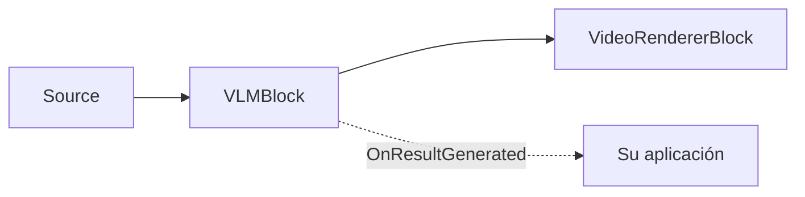

# Subtitulado VLM — VLMBlock

Necesita salida legible por humanos a partir del vídeo — un subtítulo para accesibilidad, una
descripción para indexar o moderar material, o el texto de un cartel — pero configurar y mantener
canalizaciones separadas de subtitulado, detección de objetos y OCR implica muchas piezas móviles. Un
**modelo de lenguaje visual** hace todo eso con un solo modelo: le da un fotograma y una tarea, y
obtiene texto (y, para las tareas de anclaje, cuadros). `VLMBlock` ejecuta Microsoft Florence-2 en el
dispositivo mediante ONNX — sin nube, sin costo por llamada.

`VLMBlock` ejecuta un **modelo de lenguaje visual** (Microsoft Florence-2) sobre el flujo de vídeo para
producir salida en lenguaje natural: un subtítulo de la escena, una descripción detallada, objetos
detectados con etiquetas, descripciones de regiones, texto OCR o frases ancladas a regiones de la
imagen. Es un bloque de vídeo de paso directo: los fotogramas fluyen sin modificaciones, las
superposiciones opcionales se dibujan en el sitio y cada fotograma procesado genera el evento
`OnResultGenerated` con el texto del modelo y las regiones que haya.

La inferencia se ejecuta en un hilo de trabajo en segundo plano regulado por `ProcessingInterval` — se
subtitula como máximo un fotograma por intervalo, y los demás fotogramas simplemente vuelven a dibujar
el resultado en caché, de modo que la canalización nunca se bloquea. Una única instancia del bloque
cambia de tarea en tiempo de ejecución a través de su propiedad `Task`.



!!! note "Florence-2 se ejecuta en la CPU"
    El bloque fuerza el proveedor de ejecución `CPU` — el backend DirectML ejecuta incorrectamente el
    decodificador autorregresivo combinado de Florence-2 y devuelve datos sin sentido. No hay un ajuste
    `Provider`/`DeviceId` en `VLMSettings`. Controle el costo con `ProcessingInterval` (con qué
    frecuencia se procesa un fotograma) y `MaxNewTokens` (cuánto texto se genera).

## Cómo funciona Florence-2

Un modelo de lenguaje visual (VLM) es una única red que toma una imagen más una instrucción de texto y
genera una respuesta de texto. `VLMBlock` ejecuta Microsoft **Florence-2** como una canalización ONNX
de cuatro etapas:

1. **Codificación visual.** El fotograma se redimensiona a 768x768 y se codifica en características de
   imagen.
2. **Prompt de tarea.** El `VLMTask` elegido se asigna a un token de tarea de Florence-2 (por ejemplo
   `<CAPTION>` o `<OD>`), unido con `TextInput` para el anclaje de frases, luego se tokeniza y se
   incrusta.
3. **Fusión.** El codificador de texto fusiona la tarea con las características de la imagen.
4. **Decodificación.** El decodificador genera tokens de forma voraz (argmax, sin búsqueda por haz)
   hasta `MaxNewTokens`. La cadena de salida se analiza en `Text` y, para las tareas de región, los
   tokens de coordenadas `<loc_N>` se convierten en valores `Box` de píxeles en `Regions`.

Un solo modelo cubre el subtitulado, la detección, la descripción de regiones, el OCR y el anclaje de
frases — el comportamiento se cambia modificando `Task`, no cargando un modelo distinto.

## Tareas

Establezca `VLMSettings.Task` (o `VLMBlock.Task` en tiempo de ejecución) para elegir qué hace el modelo
por cada fotograma procesado.

| `VLMTask` | Salida | Produce regiones |
| --- | --- | --- |
| `Caption` (predeterminado) | Un subtítulo breve de una frase que describe el fotograma. | No |
| `DetailedCaption` | Un subtítulo más detallado. | No |
| `MoreDetailedCaption` | Un subtítulo muy detallado de la longitud de un párrafo. | No |
| `ObjectDetection` | Objetos con una etiqueta de categoría y un cuadro delimitador cada uno. | Sí |
| `DenseRegionCaption` | Regiones con una descripción breve y un cuadro delimitador cada una. | Sí |
| `Ocr` | Todo el texto del fotograma como una única cadena. | No |
| `OcrWithRegion` | Bloques de texto, cada uno con su región. | Sí |
| `PhraseGrounding` | Ancla las frases del subtítulo en `TextInput` a regiones de la imagen. | Sí |

`PhraseGrounding` requiere `VLMSettings.TextInput` — el subtítulo cuyas frases se localizan (por
ejemplo `"a person next to a red car"`). Las tareas que producen regiones rellenan
`VLMResultGeneratedEventArgs.Regions`; las tareas de solo subtítulo devuelven únicamente texto.

### ¿Qué tarea debería usar?

| Objetivo | Tarea |
| --- | --- |
| Una etiqueta rápida de una línea de la escena | `Caption` |
| Una descripción rica para indexación, accesibilidad o metadatos de búsqueda | `DetailedCaption` / `MoreDetailedCaption` |
| Leer texto en pantalla o en la escena | `Ocr` (cadena) / `OcrWithRegion` (texto + cuadros) |
| Cuadros y etiquetas sin un detector entrenado | `ObjectDetection` / `DenseRegionCaption` |
| Confirmar y localizar una situación descrita | `PhraseGrounding` (establezca `TextInput`) |

Las descripciones más largas y el anclaje generan más tokens, por lo que tardan más por fotograma que
una `Caption` corta — aumente `MaxNewTokens` para ellas y mantenga `ProcessingInterval` holgado.

## Uso

```csharp
using VisioForge.Core.MediaBlocks;
using VisioForge.Core.MediaBlocks.AI;
using VisioForge.Core.MediaBlocks.VideoRendering;
using VisioForge.Core.Types.Events;
using VisioForge.Core.Types.X.AI;

// All model files resolve from one folder by their conventional names.
var settings = new VLMSettings(modelFolder)
{
    Task = VLMTask.DetailedCaption,
    ProcessingInterval = TimeSpan.FromSeconds(1),
    MaxNewTokens = 256,
    DrawResults = true,
};

var vlm = new VLMBlock(settings);
vlm.OnResultGenerated += (sender, e) =>
{
    var text = e.Text;
    if (string.IsNullOrEmpty(text) && e.Regions.Length > 0)
        text = string.Join(", ", e.Regions.Select(r => r.Label));

    Console.WriteLine($"[{e.Timestamp:hh\\:mm\\:ss}] {e.Task}: {text} ({e.InferenceTimeMs:F0} ms)");
};

var videoRenderer = new VideoRendererBlock(pipeline, videoView) { IsSync = false };

pipeline.Connect(source.Output, vlm.Input);
pipeline.Connect(vlm.Output, videoRenderer.Input);

await pipeline.StartAsync();

Console.WriteLine($"Running on: {vlm.ActiveProvider}"); // always CPU for Florence-2
```

`VLMResultGeneratedEventArgs` transporta la `Task` que produjo el resultado, el `Text` generado, un
arreglo `Regions` (`VLMRegion { Label, Box }`, cuadros en píxeles del fotograma de origen; vacío para
las tareas de solo subtítulo), el `Timestamp` del fotograma de origen y `InferenceTimeMs`. Los
controladores se generan en el hilo de trabajo del bloque — canalice las actualizaciones de la interfaz
de usuario al hilo de la interfaz.

### Cambio de tarea y texto de anclaje en tiempo de ejecución

```csharp
vlm.Task = VLMTask.Ocr;                       // switch to OCR on the fly

vlm.Task = VLMTask.PhraseGrounding;
vlm.TextInput = "a person next to a red car"; // required for phrase grounding
```

## Configuración clave

`VLMSettings` es una clase de configuración independiente (**no** deriva de `OnnxInferenceSettings`).

| Propiedad | Predeterminado | Descripción |
| --- | --- | --- |
| `Task` | `VLMTask.Caption` | La tarea realizada por cada fotograma procesado. Modificable en tiempo de ejecución. |
| `TextInput` | `null` | Subtítulo auxiliar usado solo por `PhraseGrounding`. Modificable en tiempo de ejecución. |
| `MaxNewTokens` | `256` | Máximo de tokens que el decodificador genera por fotograma. |
| `ProcessingInterval` | `1 segundo` | Intervalo mínimo entre dos inferencias. Los demás fotogramas vuelven a dibujar el resultado en caché. |
| `DrawResults` | `true` | Dibuja las regiones ancladas y la barra de subtítulos en el fotograma. |
| `BoxColor` / `BoxThickness` | LimeGreen / `2` | Estilo de superposición de los cuadros de región. |
| `LabelFontSize` | `0` | Tamaño de fuente de la etiqueta/subtítulo en px. `0` escala automáticamente según la altura del fotograma. |
| `VisionEncoderPath`, `EmbedTokensPath`, `EncoderModelPath`, `DecoderModelPath` | `null` | Los cuatro modelos ONNX de Florence-2. Establézcalos directamente o use el constructor `VLMSettings(modelFolder)`. |
| `VocabFilePath`, `MergesFilePath`, `AddedTokensFilePath` | `null` | Recursos del tokenizador BART. `AddedTokensFilePath` es obligatorio para las tareas de anclaje; las tareas de subtítulo funcionan sin él. |

No existe `Provider`, `DeviceId` ni `FramesToSkip` — Florence-2 es solo para CPU y la regulación se
basa en el tiempo mediante `ProcessingInterval`. `VLMBlock.ActiveProvider` siempre reporta `CPU`;
`DroppedFrameCount` permanece en `0` por diseño (los fotogramas se muestrean, nunca se descartan).

## Modelo

El bloque ejecuta Microsoft **Florence-2 (base)** como una canalización ONNX de cuatro sesiones —
codificador visual, incrustador de tokens, codificador de texto y un decodificador autorregresivo
combinado — más un tokenizador BART BPE a nivel de bytes. La decodificación es voraz (argmax). Los
pesos del modelo no se incluyen con el SDK; las demos los descargan en la primera ejecución desde
GitHub Releases y los almacenan en caché en `%USERPROFILE%\VisioForge\models\vlm`:

| Rol | Archivo |
| --- | --- |
| Codificador visual | `florence2-base-vision-encoder.onnx` |
| Incrustador de tokens | `florence2-base-embed-tokens.onnx` |
| Codificador de texto | `florence2-base-encoder.onnx` |
| Decodificador combinado | `florence2-base-decoder-merged.onnx` |
| Tokenizador | `florence2-vocab.json`, `florence2-merges.txt`, `florence2-added-tokens.json` |

La licencia de un modelo la determina su origen, independientemente de la licencia propia del SDK —
confirme la licencia de los pesos que despliegue.

## Rendimiento y ajuste

Florence-2 se ejecuta en la CPU y genera texto token por token, por lo que está diseñado para la
comprensión periódica de fotogramas, no para el subtitulado en tiempo real a alta tasa de fotogramas.
Ajústelo con dos parámetros:

- **`ProcessingInterval`** (predeterminado 1 segundo) establece con qué frecuencia se subtitula un
  fotograma. Los fotogramas entre inferencias reutilizan el último resultado para la superposición, de
  modo que el vídeo en vivo nunca se bloquea.
- **`MaxNewTokens`** (predeterminado 256) limita la latencia por fotograma. Las tareas de subtítulo
  corto terminan en muchos menos tokens que `MoreDetailedCaption` o el anclaje — redúzcalo si solo
  necesita una salida breve, auméntelo si la salida larga se está cortando.

`DroppedFrameCount` permanece en `0` por diseño (los fotogramas se muestrean, nunca se descartan) y
`ActiveProvider` siempre reporta `CPU`. No hay ajuste de GPU ni `FramesToSkip` — regule con
`ProcessingInterval`.

## Uso con VideoCaptureCoreX y MediaPlayerCoreX

Registre el bloque antes de que comience la sesión. En `MediaPlayerCoreX`, abra el archivo con el
renderizado de audio desactivado si solo desea subtítulos:

```csharp
var settings = new VLMSettings(modelFolder)
{
    Task = VLMTask.Caption,
    DrawResults = true,
};

var vlm = new VLMBlock(settings);
vlm.OnResultGenerated += Vlm_OnResultGenerated;

// VideoCaptureCoreX (live camera):
core.Video_Processing_AddBlock(vlm);            // before StartAsync
await core.StartAsync();

// MediaPlayerCoreX (file):
var source = await UniversalSourceSettings.CreateAsync(filePath, renderVideo: true, renderAudio: false);
player.Video_Processing_AddBlock(vlm);          // before OpenAsync / PlayAsync
player.Video_Play = true;
player.Audio_Play = false;
await player.OpenAsync(source);
await player.PlayAsync();
```

`Task` y `TextInput` siguen siendo actualizables en vivo mientras la sesión se ejecuta. Consulte
[Uso de bloques de IA con VideoCaptureCoreX y MediaPlayerCoreX](x-engines.md) para conocer la API
compartida de bloques de procesamiento y las reglas de ciclo de vida.

## Un modelo frente a OCR, detección y subtitulado por separado

`VLMBlock` puede reemplazar tres canalizaciones separadas — pero los bloques especializados son más
rápidos en su única tarea. Elija según lo que necesite:

| Usted necesita | La mejor opción |
| --- | --- |
| Un subtítulo o una descripción de la escena | `VLMBlock` (`Caption` / `DetailedCaption`) — ningún bloque especializado produce esto. |
| Texto leído del fotograma | `VLMBlock` (`Ocr`), o [`OcrBlock`](ocr.md) cuando lo necesita más rápido (PaddleOCR). |
| Cuadros y etiquetas para objetos | `VLMBlock` (`ObjectDetection`), o [`YOLOObjectDetectorBlock`](object-detection.md) para una velocidad mucho mayor en clases fijas. |
| La tasa de fotogramas más alta / tiempo real | Un bloque especializado — `VLMBlock` es solo para CPU y se ejecuta periódicamente. |
| Varias de las anteriores de un solo modelo | `VLMBlock` — cambie `Task` en tiempo de ejecución, una única descarga de modelo. |

Recurra a `VLMBlock` cuando desee una salida rica, flexible y en lenguaje natural — o varios de estos
resultados de un solo modelo a una cadencia relajada. Recurra a los bloques especializados cuando
necesite una salida específica a alta tasa de fotogramas. Se combinan: ejecute un VLM para
descripciones y un detector para cuadros en tiempo real en la misma canalización.

## Casos de uso

- **Descripciones automáticas de escenas** — subtitule una cámara en vivo o un archivo grabado para
  accesibilidad, registro o metadatos de búsqueda.
- **Indexación de contenido** — ejecute `DetailedCaption` a intervalos para construir una pista de
  resumen de texto para un archivo de vídeo.
- **Extracción de texto dentro del fotograma** — lea el texto en pantalla con `Ocr` / `OcrWithRegion`
  sin una canalización de OCR separada.
- **Comprobaciones visuales de preguntas** — use `PhraseGrounding` para confirmar si una situación
  descrita ("una persona con casco") está presente y dónde.
- **Etiquetado ligero de objetos y regiones** — `ObjectDetection` / `DenseRegionCaption` para una
  salida de etiquetas y cuadros cuando no hay un detector entrenado disponible.

## Solución de problemas

| Síntoma | Causa probable | Solución |
| --- | --- | --- |
| Error de inicio sobre un archivo de modelo faltante | No todos los siete archivos están presentes en la carpeta del modelo | Asegúrese de que los cuatro modelos `.onnx` y los tres archivos del tokenizador estén descargados antes de construir `VLMSettings(modelFolder)`. |
| `PhraseGrounding` no devuelve nada | `TextInput` está vacío | Establezca `TextInput` con el subtítulo cuyas frases deben anclarse. |
| Las tareas de anclaje no producen regiones | Falta `AddedTokensFilePath` | Las tareas de anclaje necesitan `florence2-added-tokens.json`; las tareas de subtítulo no. |
| Uso elevado de CPU / baja capacidad de respuesta | Fotogramas subtitulados con demasiada frecuencia, o `MaxNewTokens` demasiado alto | Aumente `ProcessingInterval`; reduzca `MaxNewTokens`. |
| Sin aceleración por GPU | Por diseño | Aquí Florence-2 es solo para CPU; ajuste el rendimiento con `ProcessingInterval` y `MaxNewTokens`. |

## Preguntas frecuentes

### ¿Cómo genero una descripción de un fotograma de vídeo en C#?

Añada un `VLMBlock` con `Task = VLMTask.DetailedCaption`, suscríbase a `OnResultGenerated` y lea
`e.Text` — esa cadena es la descripción del fotograma. Consulte [Uso](#uso). Use `ProcessingInterval`
para controlar con qué frecuencia se produce una descripción.

### ¿Puede un solo modelo hacer OCR y subtitulado a la vez?

Sí — Florence-2 gestiona el subtitulado, la descripción, la detección de objetos, la descripción de
regiones, el OCR y el anclaje de frases. Cambie entre ellos con la propiedad `Task` (incluso en tiempo
de ejecución) en lugar de cargar modelos separados. Consulte [Tareas](#tareas).

### ¿Puedo cambiar la tarea sin reiniciar la canalización?

Sí — establezca `VLMBlock.Task` (y `TextInput` para el anclaje de frases) en cualquier momento. El
cambio se aplica en el siguiente fotograma procesado.

### ¿Por qué establecer un proveedor de GPU no lo acelera?

`VLMSettings` intencionalmente no expone ningún ajuste de proveedor. El backend DirectML ejecuta
incorrectamente el decodificador combinado de Florence-2, por lo que el bloque fuerza la CPU. En su
lugar, regule con `ProcessingInterval`.

### ¿Con qué frecuencia se genera un subtítulo?

Como máximo una vez por `ProcessingInterval` (predeterminado 1 segundo). Los fotogramas que llegan
entre inferencias reutilizan el último resultado para la superposición, de modo que el vídeo en vivo
nunca se bloquea esperando al modelo.

### ¿En qué se diferencia esto del OCR o la detección de objetos?

[`OcrBlock`](ocr.md) y [`YOLOObjectDetectorBlock`](object-detection.md) son especializados, rápidos y
de un solo propósito. `VLMBlock` es un modelo general que puede subtitular, describir, detectar, anclar
y leer texto — más flexible pero más pesado, y solo para CPU. Use los bloques especializados cuando
necesite una de sus salidas exactas con rapidez; use `VLMBlock` para descripciones ricas o cuando desee
varias de estas salidas de un solo modelo.

### ¿Puedo hacer una pregunta de forma libre sobre el fotograma?

No como respuesta abierta a preguntas visuales — `VLMBlock` ejecuta el conjunto fijo de `VLMTask` de
Florence-2 (subtitular, describir, detectar, describir regiones, OCR, anclaje de frases). Lo más
cercano a una pregunta es `PhraseGrounding`: ponga una situación descrita en `TextInput` y el modelo
localiza sus frases en el fotograma. Para descripciones, use las tareas de subtítulo.

### ¿En qué idioma es la salida?

Florence-2 genera texto en inglés para los subtítulos, las descripciones y el OCR.

### ¿Cómo convierto los subtítulos en una pista de subtítulos o metadatos?

Cada `OnResultGenerated` le proporciona el `Text` y el `Timestamp` del fotograma de origen. Recopile
esos pares mientras el archivo se reproduce (o mientras la cámara funciona) y escríbalos en su propio
SRT/VTT o en un índice de metadatos — el bloque produce el texto y la temporización por fotograma;
ensamblar una pista es tarea de su aplicación.

### ¿Necesita conexión a internet?

No. La inferencia es totalmente local con ONNX. Solo la descarga del modelo en la primera ejecución
necesita red, y puede distribuir los archivos del modelo con su aplicación en su lugar.

## Demos

Las demos dedicadas construidas sobre Media Blocks, `VideoCaptureCoreX` y `MediaPlayerCoreX`
(`VLM Captioning Demo`, `VLM Captioning MB`, `Capture VLM Captioning X`,
`Capture VLM Captioning X WPF`, `Player VLM Captioning X`, `Player VLM Captioning X WPF`) forman parte
del conjunto de demos del SDK y se enlazarán aquí una vez publicadas en el repositorio público de
muestras.
