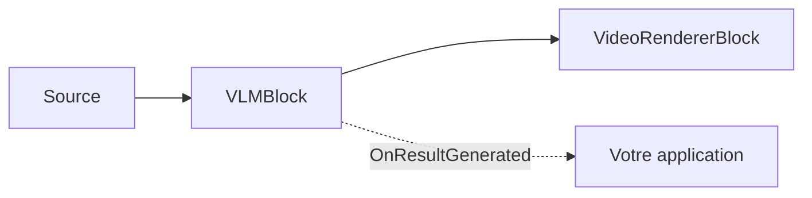

# Légendage VLM — VLMBlock

Vous avez besoin d'une sortie lisible par un humain à partir de la vidéo — une légende pour
l'accessibilité, une description pour indexer ou modérer des séquences, ou le texte d'un panneau —
mais mettre en place et maintenir des pipelines distincts de légendage, de détection d'objets et d'OCR
représente beaucoup de pièces mobiles. Un **modèle vision-langage** fait tout cela avec un seul
modèle : donnez-lui une image et une tâche, récupérez du texte (et, pour les tâches d'ancrage, des
boîtes). `VLMBlock` exécute Microsoft Florence-2 sur l'appareil via ONNX — sans cloud, sans coût par
appel.

`VLMBlock` exécute un **modèle vision-langage** (Microsoft Florence-2) sur le flux vidéo pour produire
une sortie en langage naturel : une légende de la scène, une description détaillée, des objets détectés
avec des étiquettes, des descriptions de régions, du texte OCR, ou des phrases ancrées à des régions de
l'image. C'est un bloc vidéo à passage direct : les images traversent sans modification, des
superpositions optionnelles sont dessinées en place, et chaque image traitée déclenche
`OnResultGenerated` avec le texte du modèle et les éventuelles régions.

L'inférence s'exécute sur un thread de travail en arrière-plan, régulé par `ProcessingInterval` — au
plus une image par intervalle est légendée, et les autres images redessinent simplement le résultat mis
en cache, de sorte que le pipeline n'est jamais bloqué. Une seule instance de bloc change de tâche à
l'exécution via sa propriété `Task`.



!!! note "Florence-2 s'exécute sur le CPU"
    Le bloc force le fournisseur d'exécution `CPU` — le backend DirectML exécute incorrectement le
    décodeur autorégressif fusionné de Florence-2 et renvoie des données inexploitables. Il n'existe
    aucun réglage `Provider`/`DeviceId` sur `VLMSettings`. Maîtrisez le coût avec `ProcessingInterval`
    (fréquence de traitement d'une image) et `MaxNewTokens` (quantité de texte généré).

## Fonctionnement de Florence-2

Un modèle vision-langage (VLM) est un réseau unique qui prend une image accompagnée d'une instruction
textuelle et génère une réponse textuelle. `VLMBlock` exécute Microsoft **Florence-2** sous forme de
pipeline ONNX en quatre étapes :

1. **Encodage visuel.** L'image est redimensionnée à 768x768 et encodée en caractéristiques d'image.
2. **Formulation de la tâche.** La `VLMTask` choisie correspond à un jeton de tâche Florence-2 (par
   exemple `<CAPTION>` ou `<OD>`), joint à `TextInput` pour l'ancrage de phrases, puis tokenisé et
   embarqué.
3. **Fusion.** L'encodeur de texte fusionne la tâche avec les caractéristiques de l'image.
4. **Décodage.** Le décodeur génère les jetons de façon gloutonne (argmax, sans recherche en faisceau)
   jusqu'à `MaxNewTokens`. La chaîne de sortie est analysée dans `Text` et, pour les tâches de région,
   les jetons de coordonnées `<loc_N>` sont convertis en valeurs `Box` en pixels dans `Regions`.

Un seul modèle couvre le légendage, la détection, la description de régions, l'OCR et l'ancrage de
phrases — vous changez de comportement en modifiant `Task`, pas en chargeant un modèle différent.

## Tâches

Définissez `VLMSettings.Task` (ou `VLMBlock.Task` à l'exécution) pour choisir ce que fait le modèle par
image traitée.

| `VLMTask` | Sortie | Produit des régions |
| --- | --- | --- |
| `Caption` (par défaut) | Une courte légende d'une phrase décrivant l'image. | Non |
| `DetailedCaption` | Une légende plus détaillée. | Non |
| `MoreDetailedCaption` | Une légende très détaillée, de la longueur d'un paragraphe. | Non |
| `ObjectDetection` | Des objets avec une étiquette de catégorie et une boîte englobante chacun. | Oui |
| `DenseRegionCaption` | Des régions avec une courte description et une boîte englobante chacune. | Oui |
| `Ocr` | Tout le texte de l'image sous forme d'une seule chaîne. | Non |
| `OcrWithRegion` | Des blocs de texte, chacun avec sa région. | Oui |
| `PhraseGrounding` | Ancre les phrases de la légende fournie dans `TextInput` à des régions de l'image. | Oui |

`PhraseGrounding` nécessite `VLMSettings.TextInput` — la légende dont les phrases sont localisées (par
exemple `"a person next to a red car"`). Les tâches produisant des régions remplissent
`VLMResultGeneratedEventArgs.Regions` ; les tâches de légende seule renvoient uniquement du texte.

### Quelle tâche utiliser ?

| Objectif | Tâche |
| --- | --- |
| Une étiquette rapide d'une ligne de la scène | `Caption` |
| Une description riche pour l'indexation, l'accessibilité ou les métadonnées de recherche | `DetailedCaption` / `MoreDetailedCaption` |
| Lire le texte à l'écran ou dans la scène | `Ocr` (chaîne) / `OcrWithRegion` (texte + boîtes) |
| Boîtes et étiquettes sans détecteur entraîné | `ObjectDetection` / `DenseRegionCaption` |
| Confirmer et localiser une situation décrite | `PhraseGrounding` (définissez `TextInput`) |

Les descriptions plus longues et l'ancrage génèrent plus de jetons, ils prennent donc plus de temps par
image qu'une courte `Caption` — augmentez `MaxNewTokens` pour ces tâches et gardez un
`ProcessingInterval` confortable.

## Utilisation

```csharp
using VisioForge.Core.MediaBlocks;
using VisioForge.Core.MediaBlocks.AI;
using VisioForge.Core.MediaBlocks.VideoRendering;
using VisioForge.Core.Types.Events;
using VisioForge.Core.Types.X.AI;

// All model files resolve from one folder by their conventional names.
var settings = new VLMSettings(modelFolder)
{
    Task = VLMTask.DetailedCaption,
    ProcessingInterval = TimeSpan.FromSeconds(1),
    MaxNewTokens = 256,
    DrawResults = true,
};

var vlm = new VLMBlock(settings);
vlm.OnResultGenerated += (sender, e) =>
{
    var text = e.Text;
    if (string.IsNullOrEmpty(text) && e.Regions.Length > 0)
        text = string.Join(", ", e.Regions.Select(r => r.Label));

    Console.WriteLine($"[{e.Timestamp:hh\\:mm\\:ss}] {e.Task}: {text} ({e.InferenceTimeMs:F0} ms)");
};

var videoRenderer = new VideoRendererBlock(pipeline, videoView) { IsSync = false };

pipeline.Connect(source.Output, vlm.Input);
pipeline.Connect(vlm.Output, videoRenderer.Input);

await pipeline.StartAsync();

Console.WriteLine($"Running on: {vlm.ActiveProvider}"); // always CPU for Florence-2
```

`VLMResultGeneratedEventArgs` transporte la `Task` qui a produit le résultat, le `Text` généré, un
tableau `Regions` (`VLMRegion { Label, Box }`, boîtes en pixels de l'image source ; vide pour les
tâches de légende seule), le `Timestamp` de l'image source, et `InferenceTimeMs`. Les gestionnaires
sont déclenchés sur le thread de travail du bloc — marshalez les mises à jour de l'interface vers le
thread d'interface utilisateur.

### Changer de tâche et de texte d'ancrage à l'exécution

```csharp
vlm.Task = VLMTask.Ocr;                       // switch to OCR on the fly

vlm.Task = VLMTask.PhraseGrounding;
vlm.TextInput = "a person next to a red car"; // required for phrase grounding
```

## Paramètres clés

`VLMSettings` est une classe de paramètres autonome (elle ne **dérive pas** de `OnnxInferenceSettings`).

| Propriété | Par défaut | Description |
| --- | --- | --- |
| `Task` | `VLMTask.Caption` | La tâche exécutée par image traitée. Modifiable à l'exécution. |
| `TextInput` | `null` | Légende auxiliaire utilisée uniquement par `PhraseGrounding`. Modifiable à l'exécution. |
| `MaxNewTokens` | `256` | Nombre maximal de jetons générés par le décodeur par image. |
| `ProcessingInterval` | `1 seconde` | Intervalle minimal entre deux inférences. Les autres images redessinent le résultat mis en cache. |
| `DrawResults` | `true` | Dessine les régions ancrées et la barre de légende dans l'image. |
| `BoxColor` / `BoxThickness` | Vert citron / `2` | Style de superposition des boîtes de région. |
| `LabelFontSize` | `0` | Taille de police de l'étiquette/légende en px. `0` adapte automatiquement à la hauteur de l'image. |
| `VisionEncoderPath`, `EmbedTokensPath`, `EncoderModelPath`, `DecoderModelPath` | `null` | Les quatre modèles ONNX de Florence-2. Définissez-les directement, ou utilisez le constructeur `VLMSettings(modelFolder)`. |
| `VocabFilePath`, `MergesFilePath`, `AddedTokensFilePath` | `null` | Ressources du tokeniseur BART. `AddedTokensFilePath` est requis pour les tâches d'ancrage ; les tâches de légende fonctionnent sans. |

Il n'y a ni `Provider`, ni `DeviceId`, ni `FramesToSkip` — Florence-2 fonctionne uniquement sur CPU et
la régulation est temporelle via `ProcessingInterval`. `VLMBlock.ActiveProvider` indique toujours
`CPU` ; `DroppedFrameCount` reste à `0` par conception (les images sont échantillonnées, jamais
supprimées).

## Modèle

Le bloc exécute Microsoft **Florence-2 (base)** sous forme de pipeline ONNX à quatre sessions —
encodeur visuel, embarqueur de jetons, encodeur de texte, et un décodeur autorégressif fusionné — plus
un tokeniseur BART BPE au niveau octet. Le décodage est glouton (argmax). Les poids du modèle ne sont
pas fournis avec le SDK ; les démos les téléchargent au premier lancement depuis GitHub Releases et les
mettent en cache dans `%USERPROFILE%\VisioForge\models\vlm` :

| Rôle | Fichier |
| --- | --- |
| Encodeur visuel | `florence2-base-vision-encoder.onnx` |
| Embarqueur de jetons | `florence2-base-embed-tokens.onnx` |
| Encodeur de texte | `florence2-base-encoder.onnx` |
| Décodeur fusionné | `florence2-base-decoder-merged.onnx` |
| Tokeniseur | `florence2-vocab.json`, `florence2-merges.txt`, `florence2-added-tokens.json` |

La licence d'un modèle est déterminée par son origine, indépendamment de la propre licence du SDK —
vérifiez la licence des poids que vous déployez.

## Performance et réglage

Florence-2 fonctionne sur le CPU et génère le texte jeton par jeton ; il est donc conçu pour une
compréhension périodique des images, et non pour un légendage en temps réel à haute fréquence d'images.
Réglez-le avec deux paramètres :

- **`ProcessingInterval`** (par défaut 1 seconde) définit la fréquence à laquelle une image est
  légendée. Les images entre les inférences réutilisent le dernier résultat pour la superposition, de
  sorte que la vidéo en direct ne se bloque jamais.
- **`MaxNewTokens`** (par défaut 256) borne la latence par image. Les tâches de légende courte
  s'achèvent en bien moins de jetons que `MoreDetailedCaption` ou l'ancrage — abaissez-le si vous
  n'avez besoin que d'une sortie brève, augmentez-le si une sortie longue est tronquée.

`DroppedFrameCount` reste à `0` par conception (les images sont échantillonnées, jamais supprimées), et
`ActiveProvider` indique toujours `CPU`. Il n'y a aucun réglage GPU ni `FramesToSkip` — régulez avec
`ProcessingInterval`.

## Utilisation avec VideoCaptureCoreX et MediaPlayerCoreX

Enregistrez le bloc avant le démarrage de la session. Sur `MediaPlayerCoreX`, ouvrez le fichier avec le
rendu audio désactivé si vous ne voulez que les légendes :

```csharp
var settings = new VLMSettings(modelFolder)
{
    Task = VLMTask.Caption,
    DrawResults = true,
};

var vlm = new VLMBlock(settings);
vlm.OnResultGenerated += Vlm_OnResultGenerated;

// VideoCaptureCoreX (live camera):
core.Video_Processing_AddBlock(vlm);            // before StartAsync
await core.StartAsync();

// MediaPlayerCoreX (file):
var source = await UniversalSourceSettings.CreateAsync(filePath, renderVideo: true, renderAudio: false);
player.Video_Processing_AddBlock(vlm);          // before OpenAsync / PlayAsync
player.Video_Play = true;
player.Audio_Play = false;
await player.OpenAsync(source);
await player.PlayAsync();
```

`Task` et `TextInput` restent modifiables en direct pendant l'exécution de la session. Consultez
[Utiliser les blocs IA avec VideoCaptureCoreX et MediaPlayerCoreX](x-engines.md) pour l'API de bloc de
traitement partagée et les règles de cycle de vie.

## Un seul modèle vs OCR, détection et légendage séparés

`VLMBlock` peut remplacer trois pipelines distincts — mais les blocs spécialisés sont plus rapides pour
leur unique tâche. Choisissez selon vos besoins :

| Vous avez besoin de | Meilleur choix |
| --- | --- |
| Une légende ou description de la scène | `VLMBlock` (`Caption` / `DetailedCaption`) — aucun bloc spécialisé ne le produit. |
| Du texte lu dans l'image | `VLMBlock` (`Ocr`), ou [`OcrBlock`](ocr.md) quand vous le voulez plus rapide (PaddleOCR). |
| Boîtes et étiquettes pour les objets | `VLMBlock` (`ObjectDetection`), ou [`YOLOObjectDetectorBlock`](object-detection.md) pour une vitesse bien supérieure sur des classes fixes. |
| Fréquence d'images maximale / temps réel | Un bloc spécialisé — `VLMBlock` fonctionne uniquement sur CPU et s'exécute périodiquement. |
| Plusieurs des éléments ci-dessus à partir d'un seul modèle | `VLMBlock` — changez de `Task` à l'exécution, un seul téléchargement de modèle. |

Optez pour `VLMBlock` lorsque vous voulez une sortie riche, flexible et en langage naturel — ou
plusieurs de ces résultats à partir d'un seul modèle à une cadence détendue. Optez pour les blocs
spécialisés lorsque vous avez besoin d'une sortie spécifique à haute fréquence d'images. Ils se
combinent : exécutez un VLM pour les descriptions et un détecteur pour des boîtes en temps réel dans le
même pipeline.

## Cas d'usage

- **Descriptions automatiques de scène** — légendez une caméra en direct ou un fichier enregistré pour
  l'accessibilité, la journalisation ou les métadonnées de recherche.
- **Indexation de contenu** — exécutez `DetailedCaption` à intervalles réguliers pour construire une
  piste de résumé textuel pour une archive vidéo.
- **Extraction de texte dans l'image** — lisez le texte à l'écran avec `Ocr` / `OcrWithRegion` sans
  pipeline OCR distinct.
- **Vérifications par question visuelle** — utilisez `PhraseGrounding` pour confirmer si une situation
  décrite (« une personne portant un casque ») est présente et où.
- **Étiquetage léger d'objets et de régions** — `ObjectDetection` / `DenseRegionCaption` pour une
  sortie étiquette-et-boîte lorsqu'un détecteur entraîné n'est pas disponible.

## Dépannage

| Symptôme | Cause probable | Solution |
| --- | --- | --- |
| Erreur au démarrage concernant un fichier de modèle manquant | Les sept fichiers ne sont pas tous présents dans le dossier du modèle | Assurez-vous que les quatre modèles `.onnx` et les trois fichiers du tokeniseur sont téléchargés avant de construire `VLMSettings(modelFolder)`. |
| `PhraseGrounding` ne renvoie rien | `TextInput` est vide | Définissez `TextInput` avec la légende dont les phrases doivent être ancrées. |
| Les tâches d'ancrage ne produisent aucune région | `AddedTokensFilePath` manquant | Les tâches d'ancrage nécessitent `florence2-added-tokens.json` ; les tâches de légende non. |
| Utilisation CPU élevée / faible réactivité | Images légendées trop souvent, ou `MaxNewTokens` trop élevé | Augmentez `ProcessingInterval` ; abaissez `MaxNewTokens`. |
| Aucune accélération GPU | Par conception | Florence-2 fonctionne uniquement sur CPU ici ; réglez le débit avec `ProcessingInterval` et `MaxNewTokens`. |

## Foire aux questions

### Comment générer une description d'une image vidéo en C# ?

Ajoutez un `VLMBlock` avec `Task = VLMTask.DetailedCaption`, abonnez-vous à `OnResultGenerated` et lisez
`e.Text` — cette chaîne est la description de l'image. Consultez [Utilisation](#utilisation). Utilisez
`ProcessingInterval` pour contrôler la fréquence à laquelle une description est produite.

### Un seul modèle peut-il faire à la fois l'OCR et le légendage ?

Oui — Florence-2 gère le légendage, la description, la détection d'objets, la description de régions,
l'OCR et l'ancrage de phrases. Basculez entre eux avec la propriété `Task` (même à l'exécution) plutôt
que de charger des modèles distincts. Consultez [Tâches](#taches).

### Puis-je changer de tâche sans redémarrer le pipeline ?

Oui — définissez `VLMBlock.Task` (et `TextInput` pour l'ancrage de phrases) à tout moment. Le
changement s'applique à l'image traitée suivante.

### Pourquoi définir un fournisseur GPU ne l'accélère-t-il pas ?

`VLMSettings` n'expose intentionnellement aucun réglage de fournisseur. Le backend DirectML exécute
incorrectement le décodeur fusionné de Florence-2, le bloc force donc le CPU. Régulez plutôt avec
`ProcessingInterval`.

### À quelle fréquence une légende est-elle générée ?

Au plus une fois par `ProcessingInterval` (par défaut 1 seconde). Les images arrivant entre les
inférences réutilisent le dernier résultat pour la superposition, de sorte que la vidéo en direct ne se
bloque jamais en attendant le modèle.

### En quoi cela diffère-t-il de l'OCR ou de la détection d'objets ?

[`OcrBlock`](ocr.md) et [`YOLOObjectDetectorBlock`](object-detection.md) sont spécialisés, rapides et à
usage unique. `VLMBlock` est un modèle général capable de légender, décrire, détecter, ancrer et lire
du texte — plus flexible mais plus lourd, et uniquement sur CPU. Utilisez les blocs spécialisés lorsque
vous avez besoin d'une de leurs sorties exactes à grande vitesse ; utilisez `VLMBlock` pour des
descriptions riches ou lorsque vous voulez plusieurs de ces sorties à partir d'un seul modèle.

### Puis-je poser une question libre sur l'image ?

Pas sous forme de réponse ouverte à des questions visuelles — `VLMBlock` exécute l'ensemble fixe de
`VLMTask` de Florence-2 (légende, description, détection, description de régions, OCR, ancrage de
phrases). Ce qui se rapproche le plus d'une question est `PhraseGrounding` : placez une situation
décrite dans `TextInput` et le modèle localise ses phrases dans l'image. Pour des descriptions,
utilisez les tâches de légende.

### Dans quelle langue est la sortie ?

Florence-2 génère du texte en anglais pour les légendes, les descriptions et l'OCR.

### Comment transformer les légendes en piste de sous-titres ou de métadonnées ?

Chaque `OnResultGenerated` vous fournit le `Text` et le `Timestamp` de l'image source. Collectez ces
paires au fil de la lecture du fichier (ou du fonctionnement de la caméra) et écrivez-les dans votre
propre SRT/VTT ou dans un index de métadonnées — le bloc produit le texte et le minutage par image ;
l'assemblage d'une piste est le travail de votre application.

### Nécessite-t-il une connexion Internet ?

Non. L'inférence est entièrement locale en ONNX. Seul le téléchargement du modèle au premier lancement
nécessite un réseau, et vous pouvez fournir les fichiers du modèle avec votre application à la place.

## Démos

Des démos dédiées construites sur Media Blocks, `VideoCaptureCoreX` et `MediaPlayerCoreX`
(`VLM Captioning Demo`, `VLM Captioning MB`, `Capture VLM Captioning X`,
`Capture VLM Captioning X WPF`, `Player VLM Captioning X`, `Player VLM Captioning X WPF`) figurent dans
l'ensemble de démos du SDK et seront liées ici une fois publiées dans le dépôt d'échantillons public.
