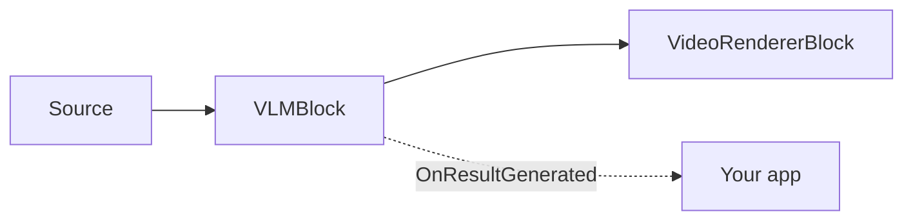

# VLM Captioning — VLMBlock

You need human-readable output from video — a caption for accessibility, a description to index or
moderate footage, or the text on a sign — but standing up and maintaining separate captioning,
object-detection, and OCR pipelines is a lot of moving parts. A **vision-language model** does all of
it with one model: give it a frame and a task, get back text (and, for grounding tasks, boxes).
`VLMBlock` runs Microsoft Florence-2 on-device via ONNX — no cloud, no per-call cost.

`VLMBlock` runs a **vision-language model** (Microsoft Florence-2) over the video stream to produce
natural-language output: a caption of the scene, a detailed description, detected objects with labels,
region descriptions, OCR text, or phrases grounded to image regions. It is a pass-through video block:
frames flow through untouched, optional overlays are drawn in place, and each processed frame raises
`OnResultGenerated` with the model's text and any regions.

Inference runs on a background worker throttled by `ProcessingInterval` — at most one frame per
interval is captioned, and other frames simply redraw the cached result, so the pipeline is never
stalled. A single block instance switches tasks at runtime through its `Task` property.



!!! note "Florence-2 runs on the CPU"
    The block forces the `CPU` execution provider — the DirectML backend mis-executes Florence-2's
    autoregressive merged decoder and returns garbage. There is no `Provider`/`DeviceId` knob on
    `VLMSettings`. Control cost with `ProcessingInterval` (how often a frame is processed) and
    `MaxNewTokens` (how much text is generated).

## How Florence-2 works

A vision-language model (VLM) is a single network that takes an image plus a text instruction and
generates a text answer. `VLMBlock` runs Microsoft **Florence-2** as a four-stage ONNX pipeline:

1. **Vision encoding.** The frame is resized to 768x768 and encoded into image features.
2. **Task prompting.** The chosen `VLMTask` maps to a Florence-2 task token (for example `<CAPTION>` or
   `<OD>`), joined with `TextInput` for phrase grounding, then tokenized and embedded.
3. **Fusion.** The text encoder fuses the task with the image features.
4. **Decoding.** The decoder generates tokens greedily (argmax, no beam search) up to `MaxNewTokens`.
   The output string is parsed into `Text` and, for region tasks, `<loc_N>` coordinate tokens are
   converted into pixel `Box` values in `Regions`.

One model covers captioning, detection, region description, OCR, and phrase grounding — you switch
behavior by changing `Task`, not by loading a different model.

## Tasks

Set `VLMSettings.Task` (or `VLMBlock.Task` at runtime) to choose what the model does per processed
frame.

| `VLMTask` | Output | Produces regions |
| --- | --- | --- |
| `Caption` (default) | A short one-sentence caption describing the frame. | No |
| `DetailedCaption` | A more detailed caption. | No |
| `MoreDetailedCaption` | A paragraph-length, highly detailed caption. | No |
| `ObjectDetection` | Objects with a category label and bounding box each. | Yes |
| `DenseRegionCaption` | Regions with a short description and bounding box each. | Yes |
| `Ocr` | All text in the frame as a single string. | No |
| `OcrWithRegion` | Text blocks, each with its region. | Yes |
| `PhraseGrounding` | Grounds the phrases of the caption in `TextInput` to image regions. | Yes |

`PhraseGrounding` requires `VLMSettings.TextInput` — the caption whose phrases are located (for
example `"a person next to a red car"`). The region-producing tasks fill
`VLMResultGeneratedEventArgs.Regions`; the caption-only tasks return text only.

### Which task should I use?

| Goal | Task |
| --- | --- |
| A quick one-line label of the scene | `Caption` |
| A rich description for indexing, accessibility, or search metadata | `DetailedCaption` / `MoreDetailedCaption` |
| Read on-screen or in-scene text | `Ocr` (string) / `OcrWithRegion` (text + boxes) |
| Boxes and labels without a trained detector | `ObjectDetection` / `DenseRegionCaption` |
| Confirm and locate a described situation | `PhraseGrounding` (set `TextInput`) |

Longer descriptions and grounding generate more tokens, so they take longer per frame than a short
`Caption` — raise `MaxNewTokens` for them and keep `ProcessingInterval` comfortable.

## Usage

```csharp
using VisioForge.Core.MediaBlocks;
using VisioForge.Core.MediaBlocks.AI;
using VisioForge.Core.MediaBlocks.VideoRendering;
using VisioForge.Core.Types.Events;
using VisioForge.Core.Types.X.AI;

// All model files resolve from one folder by their conventional names.
var settings = new VLMSettings(modelFolder)
{
    Task = VLMTask.DetailedCaption,
    ProcessingInterval = TimeSpan.FromSeconds(1),
    MaxNewTokens = 256,
    DrawResults = true,
};

var vlm = new VLMBlock(settings);
vlm.OnResultGenerated += (sender, e) =>
{
    var text = e.Text;
    if (string.IsNullOrEmpty(text) && e.Regions.Length > 0)
        text = string.Join(", ", e.Regions.Select(r => r.Label));

    Console.WriteLine($"[{e.Timestamp:hh\\:mm\\:ss}] {e.Task}: {text} ({e.InferenceTimeMs:F0} ms)");
};

var videoRenderer = new VideoRendererBlock(pipeline, videoView) { IsSync = false };

pipeline.Connect(source.Output, vlm.Input);
pipeline.Connect(vlm.Output, videoRenderer.Input);

await pipeline.StartAsync();

Console.WriteLine($"Running on: {vlm.ActiveProvider}"); // always CPU for Florence-2
```

`VLMResultGeneratedEventArgs` carries the `Task` that produced the result, the generated `Text`, a
`Regions` array (`VLMRegion { Label, Box }`, boxes in source-frame pixels; empty for caption-only
tasks), the source-frame `Timestamp`, and `InferenceTimeMs`. Handlers are raised on the block's worker
thread — marshal UI updates to the UI thread.

### Switching task and grounding text at runtime

```csharp
vlm.Task = VLMTask.Ocr;                       // switch to OCR on the fly

vlm.Task = VLMTask.PhraseGrounding;
vlm.TextInput = "a person next to a red car"; // required for phrase grounding
```

## Key settings

`VLMSettings` is a standalone settings class (it does **not** derive from `OnnxInferenceSettings`).

| Property | Default | Description |
| --- | --- | --- |
| `Task` | `VLMTask.Caption` | The task performed per processed frame. Runtime-changeable. |
| `TextInput` | `null` | Auxiliary caption used only by `PhraseGrounding`. Runtime-changeable. |
| `MaxNewTokens` | `256` | Maximum tokens the decoder generates per frame. |
| `ProcessingInterval` | `1 second` | Minimum interval between two inferences. Other frames redraw the cached result. |
| `DrawResults` | `true` | Draw grounded regions and the caption bar into the frame. |
| `BoxColor` / `BoxThickness` | LimeGreen / `2` | Region-box overlay styling. |
| `LabelFontSize` | `0` | Label/caption font size in px. `0` auto-scales to frame height. |
| `VisionEncoderPath`, `EmbedTokensPath`, `EncoderModelPath`, `DecoderModelPath` | `null` | The four Florence-2 ONNX models. Set directly, or use the `VLMSettings(modelFolder)` constructor. |
| `VocabFilePath`, `MergesFilePath`, `AddedTokensFilePath` | `null` | BART tokenizer assets. `AddedTokensFilePath` is required for grounding tasks; caption tasks work without it. |

There is no `Provider`, `DeviceId`, or `FramesToSkip` — Florence-2 is CPU-only and throttling is
time-based via `ProcessingInterval`. `VLMBlock.ActiveProvider` always reports `CPU`;
`DroppedFrameCount` stays `0` by design (frames are sampled, never dropped).

## Model

The block runs Microsoft **Florence-2 (base)** as a four-session ONNX pipeline — vision encoder, token
embedder, text encoder, and a merged autoregressive decoder — plus a BART byte-level BPE tokenizer.
Decoding is greedy (argmax). Model weights are not bundled with the SDK; the demos download them on
first run from GitHub Releases and cache them under `%USERPROFILE%\VisioForge\models\vlm`:

| Role | File |
| --- | --- |
| Vision encoder | `florence2-base-vision-encoder.onnx` |
| Token embedder | `florence2-base-embed-tokens.onnx` |
| Text encoder | `florence2-base-encoder.onnx` |
| Merged decoder | `florence2-base-decoder-merged.onnx` |
| Tokenizer | `florence2-vocab.json`, `florence2-merges.txt`, `florence2-added-tokens.json` |

A model's license is set by its origin, independent of the SDK's own license — confirm the license of
the weights you deploy.

## Performance and tuning

Florence-2 runs on the CPU and generates text token-by-token, so it is designed for periodic frame
understanding, not high-frame-rate real-time captioning. Tune it with two knobs:

- **`ProcessingInterval`** (default 1 second) sets how often a frame is captioned. Frames between
  inferences reuse the last result for the overlay, so live video never stalls.
- **`MaxNewTokens`** (default 256) bounds per-frame latency. Short-caption tasks finish in far fewer
  tokens than `MoreDetailedCaption` or grounding — lower it if you only need brief output, raise it if
  long output is being cut off.

`DroppedFrameCount` stays `0` by design (frames are sampled, never dropped), and `ActiveProvider`
always reports `CPU`. There is no GPU or `FramesToSkip` knob — throttle with `ProcessingInterval`.

## Use with VideoCaptureCoreX and MediaPlayerCoreX

Register the block before the session starts. On `MediaPlayerCoreX`, open the file with audio
rendering off if you only want captions:

```csharp
var settings = new VLMSettings(modelFolder)
{
    Task = VLMTask.Caption,
    DrawResults = true,
};

var vlm = new VLMBlock(settings);
vlm.OnResultGenerated += Vlm_OnResultGenerated;

// VideoCaptureCoreX (live camera):
core.Video_Processing_AddBlock(vlm);            // before StartAsync
await core.StartAsync();

// MediaPlayerCoreX (file):
var source = await UniversalSourceSettings.CreateAsync(filePath, renderVideo: true, renderAudio: false);
player.Video_Processing_AddBlock(vlm);          // before OpenAsync / PlayAsync
player.Video_Play = true;
player.Audio_Play = false;
await player.OpenAsync(source);
await player.PlayAsync();
```

`Task` and `TextInput` remain live-updatable while the session runs. See
[Using AI blocks with VideoCaptureCoreX and MediaPlayerCoreX](x-engines.md) for the shared
processing-block API and lifecycle rules.

## One model vs separate OCR, detection, and captioning

`VLMBlock` can replace three separate pipelines — but the specialized blocks are faster at their one
job. Pick by what you need:

| You need | Best fit |
| --- | --- |
| A caption or description of the scene | `VLMBlock` (`Caption` / `DetailedCaption`) — no specialized block produces this. |
| Text read from the frame | `VLMBlock` (`Ocr`), or [`OcrBlock`](ocr.md) when you need it faster (PaddleOCR). |
| Boxes and labels for objects | `VLMBlock` (`ObjectDetection`), or [`YOLOObjectDetectorBlock`](object-detection.md) for much higher speed on fixed classes. |
| Highest frame rate / real-time | A specialized block — `VLMBlock` is CPU-only and runs periodically. |
| Several of the above from one model | `VLMBlock` — switch `Task` at runtime, a single model download. |

Reach for `VLMBlock` when you want rich, flexible, natural-language output — or several of these results
from one model at a relaxed cadence. Reach for the specialized blocks when you need one specific output
at high frame rate. They compose: run a VLM for descriptions and a detector for real-time boxes in the
same pipeline.

## Use cases

- **Automatic scene descriptions** — caption a live camera or a recorded file for accessibility,
  logging, or search metadata.
- **Content indexing** — run `DetailedCaption` at intervals to build a text summary track for a video
  archive.
- **In-frame text extraction** — read on-screen text with `Ocr` / `OcrWithRegion` without a separate
  OCR pipeline.
- **Visual question checks** — use `PhraseGrounding` to confirm whether a described situation
  ("a person wearing a helmet") is present and where.
- **Lightweight object and region labeling** — `ObjectDetection` / `DenseRegionCaption` for
  label-and-box output when a trained detector isn't available.

## Troubleshooting

| Symptom | Likely cause | Fix |
| --- | --- | --- |
| Startup error about a missing model file | Not all seven files are present in the model folder | Ensure the four `.onnx` models and three tokenizer files are downloaded before constructing `VLMSettings(modelFolder)`. |
| `PhraseGrounding` returns nothing | `TextInput` is empty | Set `TextInput` to the caption whose phrases should be grounded. |
| Grounding tasks produce no regions | `AddedTokensFilePath` missing | Grounding tasks need `florence2-added-tokens.json`; caption tasks do not. |
| High CPU usage / low responsiveness | Frames captioned too often, or `MaxNewTokens` too high | Raise `ProcessingInterval`; lower `MaxNewTokens`. |
| No GPU acceleration | By design | Florence-2 is CPU-only here; tune throughput with `ProcessingInterval` and `MaxNewTokens`. |

## Frequently Asked Questions

### How do I generate a description of a video frame in C#?

Add a `VLMBlock` with `Task = VLMTask.DetailedCaption`, subscribe to `OnResultGenerated`, and read
`e.Text` — that string is the frame's description. See [Usage](#usage). Use `ProcessingInterval` to
control how often a description is produced.

### Can one model do both OCR and captioning?

Yes — Florence-2 handles captioning, description, object detection, region description, OCR, and phrase
grounding. Switch between them with the `Task` property (even at runtime) instead of loading separate
models. See [Tasks](#tasks).

### Can I change the task without restarting the pipeline?

Yes — set `VLMBlock.Task` (and `TextInput` for phrase grounding) at any time. The change applies on
the next processed frame.

### Why doesn't setting a GPU provider speed it up?

`VLMSettings` intentionally exposes no provider setting. The DirectML backend mis-executes Florence-2's
merged decoder, so the block forces CPU. Throttle with `ProcessingInterval` instead.

### How often is a caption generated?

At most once per `ProcessingInterval` (default 1 second). Frames arriving between inferences reuse the
last result for the overlay, so live video never stalls waiting on the model.

### How is this different from OCR or object detection?

[`OcrBlock`](ocr.md) and [`YOLOObjectDetectorBlock`](object-detection.md) are specialized, fast, and
single-purpose. `VLMBlock` is a general model that can caption, describe, detect, ground, and read
text — more flexible but heavier, and CPU-only. Use the specialized blocks when you need one of their
exact outputs at speed; use `VLMBlock` for rich descriptions or when you want several of these outputs
from one model.

### Can I ask a free-form question about the frame?

Not as open-ended visual question answering — `VLMBlock` runs Florence-2's fixed `VLMTask` set
(caption, describe, detect, region-caption, OCR, phrase grounding). The closest to a question is
`PhraseGrounding`: put a described situation in `TextInput` and the model locates its phrases in the
frame. For descriptions, use the caption tasks.

### What language is the output?

Florence-2 generates English text for captions, descriptions, and OCR.

### How do I turn captions into a subtitle or metadata track?

Each `OnResultGenerated` gives you the `Text` and the source-frame `Timestamp`. Collect those pairs as
the file plays (or as the camera runs) and write them to your own SRT/VTT or a metadata index — the
block produces the per-frame text and timing; assembling a track is your application's job.

### Does it need an internet connection?

No. Inference is fully local ONNX. Only the first-run model download needs a network, and you can ship
the model files with your app instead.

## Demos

Dedicated demos built on Media Blocks, `VideoCaptureCoreX`, and `MediaPlayerCoreX`
(`VLM Captioning Demo`, `VLM Captioning MB`, `Capture VLM Captioning X`,
`Capture VLM Captioning X WPF`, `Player VLM Captioning X`, `Player VLM Captioning X WPF`) are in the
SDK's demo set and will be linked here once published to the public samples repository.
