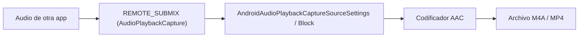
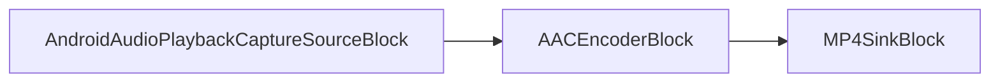

# Grabar el audio de otra aplicación en Android con C# y .NET

[Video Capture SDK .Net](https://www.visioforge.com/video-capture-sdk-net){ .md-button .md-button--primary target="_blank" } [Media Blocks SDK .Net](https://www.visioforge.com/media-blocks-sdk-net){ .md-button .md-button--primary target="_blank" }

## Introducción

Esta guía muestra cómo grabar el audio reproducido por **otra aplicación** en Android con C# y .NET. La captura utiliza la API `AudioPlaybackCapture` de Android junto con un token de consentimiento `MediaProjection` (Android 10 / API 29 y posteriores) y escribe el resultado en un archivo AAC `.m4a`. VisioForge expone la función a través de dos motores, de modo que puedes elegir el que mejor se adapte a tu aplicación: el de alto nivel `VideoCaptureCoreX` (grabación declarativa) y el de bajo nivel `MediaBlocksPipeline` (control total del grafo).

Para la instalación y la configuración de los paquetes, consulta la [guía de instalación](../../install/index.md). Los proyectos de ejemplo de Android en los que se basa esta guía se incluyen con el SDK en `Video Capture SDK X/Android/Audio Playback Capture` y `Media Blocks SDK/Android/Audio Playback Capture`.

## ¿Cómo funciona la captura de audio de reproducción en Android?

Android enruta el audio de otras aplicaciones a través de una fuente `REMOTE_SUBMIX` especial que solo puedes abrir después de que el usuario acepte un diálogo de consentimiento de captura de pantalla/audio. Tu aplicación solicita ese consentimiento, recibe un token `MediaProjection` y lo entrega a la fuente de VisioForge. La fuente abre el `AudioRecord` de captura de reproducción, el SDK codifica el flujo a AAC y un multiplexor escribe el archivo `.m4a`.



**La captura está restringida por diseño.** Solo se pueden capturar las aplicaciones que publican audio con un `usage` de `Media`, `Game` o `Unknown`, y únicamente cuando la aplicación **no** se ha excluido mediante `android:allowAudioPlaybackCapture="false"`. Los reproductores protegidos (Spotify, Netflix y la mayoría de las aplicaciones con DRM) se excluyen, por lo que producen silencio. Pruébalo con vídeo o música reproducidos localmente, o con tu propia aplicación.

## Requisitos previos y permisos

- **Android 10 (API nivel 29) o posterior.** Establece `<SupportedOSPlatformVersion>29.0</SupportedOSPlatformVersion>` en el `.csproj`.
- **Permisos y un servicio en primer plano** declarados en `AndroidManifest.xml`. El servicio debe usar el tipo de primer plano `mediaProjection` y, en Android 14+, debe iniciarse **después** de que se conceda el consentimiento.

```xml
<?xml version="1.0" encoding="utf-8"?>
<manifest xmlns:android="http://schemas.android.com/apk/res/android" package="com.visioforge.audioplaybackcapture">
    <application android:label="@string/app_name">
        <service android:name=".AudioCaptureService"
                 android:foregroundServiceType="mediaProjection"
                 android:exported="false" />
    </application>
    <uses-permission android:name="android.permission.RECORD_AUDIO" />
    <uses-permission android:name="android.permission.FOREGROUND_SERVICE" />
    <uses-permission android:name="android.permission.FOREGROUND_SERVICE_MEDIA_PROJECTION" />
    <uses-permission android:name="android.permission.INTERNET" />
</manifest>
```

`RECORD_AUDIO` es un permiso en tiempo de ejecución: solicítalo antes de iniciar la captura. `INTERNET` solo es necesario si transmites el resultado; un grabador de archivos puro puede prescindir de él.

## Solicitar el token de MediaProjection

El flujo del token es idéntico para ambos motores. El orden importa en Android 14+: solicita el consentimiento, luego inicia el servicio en primer plano y, por último, llama a `GetMediaProjection` una vez que el servicio esté en primer plano.

Primero, lanza el diálogo de consentimiento del sistema cuando el usuario pulse Iniciar:

```csharp
// _projectionManager = (MediaProjectionManager)GetSystemService(MediaProjectionService);
StartActivityForResult(_projectionManager.CreateScreenCaptureIntent(), REQUEST_MEDIA_PROJECTION);
```

El servicio en primer plano expone un `TaskCompletionSource` que se completa desde `OnStartCommand`, de modo que la actividad puede esperar hasta que el servicio esté realmente en estado de primer plano:

```csharp
[Service(ForegroundServiceType = ForegroundService.TypeMediaProjection, Exported = false)]
public class AudioCaptureService : Service
{
    public static TaskCompletionSource<bool> ForegroundStarted { get; set; }

    public override IBinder OnBind(Intent intent) => null;

    public override StartCommandResult OnStartCommand(Intent intent, StartCommandFlags flags, int startId)
    {
        CreateNotificationChannel();
        var notification = BuildNotification();
        var tcs = ForegroundStarted;
        ForegroundStarted = null;

        try
        {
            if (Build.VERSION.SdkInt >= BuildVersionCodes.Q)
            {
                StartForeground(NOTIFICATION_ID, notification, ForegroundService.TypeMediaProjection);
            }
            else
            {
                StartForeground(NOTIFICATION_ID, notification);
            }

            tcs?.TrySetResult(true);
        }
        catch (Exception ex)
        {
            Android.Util.Log.Error("AudioCaptureService", ex.ToString());
            tcs?.TrySetResult(false);
        }

        return StartCommandResult.Sticky;
    }
}
```

Por último, en `OnActivityResult`, inicia el servicio y obtén el token después de que esté en primer plano:

```csharp
protected override void OnActivityResult(int requestCode, Android.App.Result resultCode, Intent data)
{
    base.OnActivityResult(requestCode, resultCode, data);

    if (requestCode == REQUEST_MEDIA_PROJECTION && resultCode == Android.App.Result.Ok && data != null)
    {
        var projResultCode = (int)resultCode;

        var fgsTcs = new TaskCompletionSource<bool>();
        AudioCaptureService.ForegroundStarted = fgsTcs;

        // Inicia el servicio en primer plano DESPUÉS del consentimiento (obligatorio en Android 14+ / targetSDK 34+).
        var serviceIntent = new Intent(this, typeof(AudioCaptureService));
        StartForegroundService(serviceIntent);

        _ = Task.Run(async () =>
        {
            // Espera hasta que el servicio alcance el estado de primer plano.
            var completed = await Task.WhenAny(fgsTcs.Task, Task.Delay(5000));
            if (completed != fgsTcs.Task) { return; }

            // GetMediaProjection debe llamarse DESPUÉS de que el FGS esté en estado de primer plano.
            _mediaProjection = _projectionManager.GetMediaProjection(projResultCode, data);

            await StartCaptureAsync();
        });
    }
}
```

Con `_mediaProjection` en la mano, entrégalo a cualquiera de los motores que se muestran a continuación.

## ¿Cómo grabo el audio de una app con VideoCaptureCoreX?

`VideoCaptureCoreX` es la ruta recomendada: estableces la fuente de audio y añades una salida, y el motor construye el grafo por ti. Como aquí no hay cámara, crea el motor sin un `VideoView` y ejecútalo solo con audio.

```csharp
using VisioForge.Core.Types.X.Android.Sources;
using VisioForge.Core.Types.X.Output;
using VisioForge.Core.VideoCaptureX;

private async Task StartCaptureCoreAsync()
{
    // Captura solo de audio: sin VideoView, sin fuente de vídeo.
    _core = new VideoCaptureCoreX();
    _core.OnError += Core_OnError;

    // Fuente de captura de reproducción de audio (graba el audio de otras apps mediante MediaProjection).
    _core.Audio_Source = new AndroidAudioPlaybackCaptureSourceSettings(_mediaProjection);
    _core.Audio_Play = false;   // no reproduzcas el audio capturado por el altavoz
    _core.Audio_Record = true;  // enrútalo hacia la salida

    var musicDir = GetExternalFilesDir(Android.OS.Environment.DirectoryMusic);
    musicDir.Mkdirs();
    _recordingFilename = Path.Combine(musicDir.AbsolutePath, $"appaudio_{DateTime.Now:yyyyMMdd_HHmmss}.m4a");

    // Salida solo de audio M4A (AAC). autostart: true -> la grabación comienza con StartAsync.
    _core.Outputs_Add(new M4AOutput(_recordingFilename), true);

    await _core.StartAsync();
}
```

Para detener y finalizar el archivo, detén y libera el motor:

```csharp
private async Task StopCaptureCoreAsync()
{
    var core = Interlocked.Exchange(ref _core, null);
    if (core != null)
    {
        core.OnError -= Core_OnError;
        await core.StopAsync();
        await core.DisposeAsync();
    }

    StopService(new Intent(this, typeof(AudioCaptureService)));
}
```

`M4AOutput` usa de forma predeterminada el codificador AAC `AVENCAACEncoderSettings` dentro de un contenedor MP4, por lo que el resultado es un archivo `.m4a` estándar.

## ¿Cómo grabo el audio de una app con MediaBlocksPipeline?

`MediaBlocksPipeline` te da el grafo explícito. Creas tú mismo los bloques de fuente, codificador y sumidero, y conectas sus pads. Usa esta opción cuando necesites insertar procesamiento personalizado (por ejemplo, un bloque de volumen, un tee o un sumidero de red) entre la captura y el archivo.

```csharp
using VisioForge.Core.MediaBlocks;
using VisioForge.Core.MediaBlocks.AudioEncoders;
using VisioForge.Core.MediaBlocks.Sinks;
using VisioForge.Core.MediaBlocks.Sources;
using VisioForge.Core.Types.X.Android.Sources;
using VisioForge.Core.Types.X.Sinks;

private async Task StartCaptureCoreAsync()
{
    _pipeline = new MediaBlocksPipeline();
    _pipeline.OnError += Pipeline_OnError;

    // Fuente de captura de reproducción de audio (graba el audio de otras apps).
    var settings = new AndroidAudioPlaybackCaptureSourceSettings(_mediaProjection);
    _audioSource = new AndroidAudioPlaybackCaptureSourceBlock(settings);

    // Codificador AAC + sumidero MP4/M4A.
    _audioEncoder = new AACEncoderBlock();

    var musicDir = GetExternalFilesDir(Android.OS.Environment.DirectoryMusic);
    musicDir.Mkdirs();
    _recordingFilename = Path.Combine(musicDir.AbsolutePath, $"appaudio_{DateTime.Now:yyyyMMdd_HHmmss}.m4a");
    _sink = new MP4SinkBlock(new MP4SinkSettings(_recordingFilename));

    // fuente -> codificador -> sumidero
    _pipeline.Connect(_audioSource.Output, _audioEncoder.Input);
    _pipeline.Connect(_audioEncoder.Output, (_sink as IMediaBlockDynamicInputs).CreateNewInput(MediaBlockPadMediaType.Audio));

    await _pipeline.StartAsync();
}
```



Detén la canalización igual que cualquier otro grafo de Media Blocks:

```csharp
private async Task StopCaptureCoreAsync()
{
    var pipeline = Interlocked.Exchange(ref _pipeline, null);
    if (pipeline != null)
    {
        pipeline.OnError -= Pipeline_OnError;
        await pipeline.StopAsync(force: false);
        await pipeline.DisposeAsync();
    }

    StopService(new Intent(this, typeof(AudioCaptureService)));
}
```

## ¿Qué motor debo elegir?

Ambos motores usan el mismo `AndroidAudioPlaybackCaptureSourceSettings` y producen el mismo tipo de archivo `.m4a`. La diferencia es cuánto del grafo gestionas tú.

| Aspecto | VideoCaptureCoreX | MediaBlocksPipeline |
| --- | --- | --- |
| Fuente | `Audio_Source = new AndroidAudioPlaybackCaptureSourceSettings(token)` | `new AndroidAudioPlaybackCaptureSourceBlock(settings)` |
| Salida | `Outputs_Add(new M4AOutput(file), true)` | `AACEncoderBlock` → `MP4SinkBlock` conectados a mano |
| Grafo | Lo construye el motor | Conectas cada pad |
| Ideal para | Grabación rápida con un mínimo de código | Procesamiento personalizado, varias salidas, streaming |
| Iniciar / detener | `StartAsync` / `StopAsync` / `DisposeAsync` | `StartAsync` / `StopAsync` / `DisposeAsync` |

Empieza con `VideoCaptureCoreX`; pasa a `MediaBlocksPipeline` cuando necesites ramificar el audio o añadir elementos que la salida de alto nivel no expone.

## Guardar el archivo en la biblioteca del dispositivo

Ambos ejemplos escriben en el directorio externo privado `Music` de la aplicación (`GetExternalFilesDir(DirectoryMusic)`) y luego copian el archivo finalizado a la biblioteca multimedia compartida mediante `MediaStore` para que aparezca en las aplicaciones de música y los gestores de archivos:

```csharp
var values = new ContentValues();
values.Put(MediaStore.Audio.Media.InterfaceConsts.DisplayName, fileName);
values.Put(MediaStore.Audio.Media.InterfaceConsts.MimeType, "audio/mp4");
values.Put(MediaStore.Audio.Media.InterfaceConsts.RelativePath, Android.OS.Environment.DirectoryMusic);

var uri = ContentResolver.Insert(MediaStore.Audio.Media.ExternalContentUri, values);
using var output = ContentResolver.OpenOutputStream(uri);
using var input = new FileStream(filePath, FileMode.Open, FileAccess.Read);
input.CopyTo(output);
```

## Preguntas frecuentes

### ¿Puedo grabar el audio de Spotify, Netflix o YouTube?

Por lo general, no. Las aplicaciones que reproducen contenido protegido o con DRM establecen `android:allowAudioPlaybackCapture="false"` (o publican audio con un `usage` no capturable), lo que las excluye de `AudioPlaybackCapture`. Capturarlas produce silencio. Pruébalo con contenido reproducido localmente o con aplicaciones que permitan la captura.

### ¿La captura de audio de reproducción requiere root?

No. Usa la API pública `AudioPlaybackCapture` y un diálogo de consentimiento `MediaProjection` concedido por el usuario. No se necesita root, ni firma del sistema, ni ningún permiso especial del fabricante.

### ¿Cuál es la versión mínima de Android?

Android 10 (API nivel 29). `AudioPlaybackCapture` no existía antes de la API 29, así que establece `SupportedOSPlatformVersion` en `29.0`. En dispositivos más antiguos, la fuente de captura de reproducción informa de que no está disponible y la captura no puede iniciarse.

### ¿Puedo capturar el audio de otra app y el micrófono al mismo tiempo?

La fuente de esta guía captura únicamente el audio de reproducción. Mezclarlo con una fuente de micrófono requiere añadir una segunda fuente de audio y un mezclador de audio al grafo; ese es un tema aparte y se construye mejor sobre `MediaBlocksPipeline` para tener un control total.

### ¿Por qué mi grabación está en silencio?

Las dos causas habituales son: la aplicación de origen se excluyó de la captura de reproducción (contenido protegido) o simplemente no estaba produciendo sonido durante la ventana de captura. Confírmalo con un archivo de audio o vídeo local que se reproduzca de forma audible, y verifica que se concedió `RECORD_AUDIO` y que el servicio en primer plano se inició antes de llamar a `GetMediaProjection`.

## Véase también

- [Guía de instalación](../../install/index.md): añade los paquetes de VisioForge .NET a tu proyecto
- [Implementación y despliegue en Android](../../deployment-x/Android.md): configuración de NuGet y empaquetado para aplicaciones Android
- [Captura de audio y grabación del sonido del sistema](../../videocapture/audio-capture/index.md): graba el micrófono y el audio del sistema en C#
- [Bloques codificadores de audio](../../mediablocks/AudioEncoders/index.md): codificadores AAC, MP3, FLAC y Opus para la canalización de Media Blocks
- [Video Capture SDK .Net](https://www.visioforge.com/video-capture-sdk-net): el motor de alto nivel `VideoCaptureCoreX`
- [Media Blocks SDK .Net](https://www.visioforge.com/media-blocks-sdk-net): el motor de bajo nivel `MediaBlocksPipeline`
