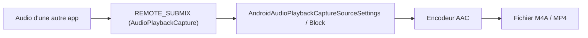
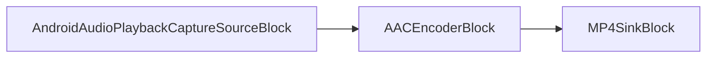

# Enregistrer l'audio d'une autre application sur Android en C# et .NET

[Video Capture SDK .Net](https://www.visioforge.com/video-capture-sdk-net){ .md-button .md-button--primary target="_blank" } [Media Blocks SDK .Net](https://www.visioforge.com/media-blocks-sdk-net){ .md-button .md-button--primary target="_blank" }

## Introduction

Ce guide montre comment enregistrer l'audio joué par **une autre application** sur Android en C# et .NET. La capture utilise l'API `AudioPlaybackCapture` d'Android associée à un jeton de consentement `MediaProjection` (Android 10 / API 29 et versions ultérieures) et écrit le résultat dans un fichier AAC `.m4a`. VisioForge expose la fonctionnalité via deux moteurs, vous pouvez donc choisir celui qui convient à votre application : le moteur de haut niveau `VideoCaptureCoreX` (enregistrement déclaratif) et le moteur de bas niveau `MediaBlocksPipeline` (contrôle total du graphe).

Pour l'installation et la configuration des paquets, consultez le [guide d'installation](../../install/index.md). Les projets d'exemple Android sur lesquels repose ce guide sont fournis avec le SDK sous `Video Capture SDK X/Android/Audio Playback Capture` et `Media Blocks SDK/Android/Audio Playback Capture`.

## Comment fonctionne la capture audio de lecture sur Android ?

Android achemine l'audio des autres applications via une source `REMOTE_SUBMIX` spéciale que vous ne pouvez ouvrir qu'après que l'utilisateur a accepté une boîte de dialogue de consentement de capture d'écran/audio. Votre application demande ce consentement, reçoit un jeton `MediaProjection` et le transmet à la source VisioForge. La source ouvre l'`AudioRecord` de capture de lecture, le SDK encode le flux en AAC et un multiplexeur écrit le fichier `.m4a`.



**La capture est restreinte par conception.** Seules les applications qui publient de l'audio avec un `usage` de `Media`, `Game` ou `Unknown` sont capturables, et uniquement lorsque l'application ne s'est **pas** exclue via `android:allowAudioPlaybackCapture="false"`. Les lecteurs protégés (Spotify, Netflix et la plupart des applications avec DRM) s'excluent et produisent donc du silence. Testez avec une vidéo ou de la musique lues localement, ou avec votre propre application.

## Prérequis et autorisations

- **Android 10 (API niveau 29) ou version ultérieure.** Définissez `<SupportedOSPlatformVersion>29.0</SupportedOSPlatformVersion>` dans le `.csproj`.
- **Des autorisations et un service de premier plan** déclarés dans `AndroidManifest.xml`. Le service doit utiliser le type de premier plan `mediaProjection` et, sur Android 14+, il doit être démarré **après** l'octroi du consentement.

```xml
<?xml version="1.0" encoding="utf-8"?>
<manifest xmlns:android="http://schemas.android.com/apk/res/android" package="com.visioforge.audioplaybackcapture">
    <application android:label="@string/app_name">
        <service android:name=".AudioCaptureService"
                 android:foregroundServiceType="mediaProjection"
                 android:exported="false" />
    </application>
    <uses-permission android:name="android.permission.RECORD_AUDIO" />
    <uses-permission android:name="android.permission.FOREGROUND_SERVICE" />
    <uses-permission android:name="android.permission.FOREGROUND_SERVICE_MEDIA_PROJECTION" />
    <uses-permission android:name="android.permission.INTERNET" />
</manifest>
```

`RECORD_AUDIO` est une autorisation d'exécution : demandez-la avant de démarrer la capture. `INTERNET` n'est nécessaire que si vous diffusez le résultat ; un simple enregistreur de fichiers peut s'en passer.

## Demander le jeton MediaProjection

Le flux du jeton est identique pour les deux moteurs. L'ordre compte sur Android 14+ : demandez le consentement, puis démarrez le service de premier plan, et enfin appelez `GetMediaProjection` une fois le service au premier plan.

D'abord, lancez la boîte de dialogue de consentement du système lorsque l'utilisateur appuie sur Démarrer :

```csharp
// _projectionManager = (MediaProjectionManager)GetSystemService(MediaProjectionService);
StartActivityForResult(_projectionManager.CreateScreenCaptureIntent(), REQUEST_MEDIA_PROJECTION);
```

Le service de premier plan expose un `TaskCompletionSource` qui est complété depuis `OnStartCommand`, de sorte que l'activité peut attendre jusqu'à ce que le service soit réellement au premier plan :

```csharp
[Service(ForegroundServiceType = ForegroundService.TypeMediaProjection, Exported = false)]
public class AudioCaptureService : Service
{
    public static TaskCompletionSource<bool> ForegroundStarted { get; set; }

    public override IBinder OnBind(Intent intent) => null;

    public override StartCommandResult OnStartCommand(Intent intent, StartCommandFlags flags, int startId)
    {
        CreateNotificationChannel();
        var notification = BuildNotification();
        var tcs = ForegroundStarted;
        ForegroundStarted = null;

        try
        {
            if (Build.VERSION.SdkInt >= BuildVersionCodes.Q)
            {
                StartForeground(NOTIFICATION_ID, notification, ForegroundService.TypeMediaProjection);
            }
            else
            {
                StartForeground(NOTIFICATION_ID, notification);
            }

            tcs?.TrySetResult(true);
        }
        catch (Exception ex)
        {
            Android.Util.Log.Error("AudioCaptureService", ex.ToString());
            tcs?.TrySetResult(false);
        }

        return StartCommandResult.Sticky;
    }
}
```

Enfin, dans `OnActivityResult`, démarrez le service et obtenez le jeton une fois qu'il est au premier plan :

```csharp
protected override void OnActivityResult(int requestCode, Android.App.Result resultCode, Intent data)
{
    base.OnActivityResult(requestCode, resultCode, data);

    if (requestCode == REQUEST_MEDIA_PROJECTION && resultCode == Android.App.Result.Ok && data != null)
    {
        var projResultCode = (int)resultCode;

        var fgsTcs = new TaskCompletionSource<bool>();
        AudioCaptureService.ForegroundStarted = fgsTcs;

        // Démarrez le service de premier plan APRÈS le consentement (obligatoire sur Android 14+ / targetSDK 34+).
        var serviceIntent = new Intent(this, typeof(AudioCaptureService));
        StartForegroundService(serviceIntent);

        _ = Task.Run(async () =>
        {
            // Attendez que le service atteigne l'état de premier plan.
            var completed = await Task.WhenAny(fgsTcs.Task, Task.Delay(5000));
            if (completed != fgsTcs.Task) { return; }

            // GetMediaProjection doit être appelé APRÈS que le FGS est à l'état de premier plan.
            _mediaProjection = _projectionManager.GetMediaProjection(projResultCode, data);

            await StartCaptureAsync();
        });
    }
}
```

Une fois `_mediaProjection` obtenu, transmettez-le à l'un des moteurs ci-dessous.

## Comment enregistrer l'audio d'une application avec VideoCaptureCoreX ?

`VideoCaptureCoreX` est la voie recommandée : vous définissez la source audio et ajoutez une sortie, et le moteur construit le graphe pour vous. Comme il n'y a pas de caméra ici, créez le moteur sans `VideoView` et exécutez-le uniquement en audio.

```csharp
using VisioForge.Core.Types.X.Android.Sources;
using VisioForge.Core.Types.X.Output;
using VisioForge.Core.VideoCaptureX;

private async Task StartCaptureCoreAsync()
{
    // Capture audio uniquement : pas de VideoView, pas de source vidéo.
    _core = new VideoCaptureCoreX();
    _core.OnError += Core_OnError;

    // Source de capture de lecture audio (enregistre l'audio des autres apps via MediaProjection).
    _core.Audio_Source = new AndroidAudioPlaybackCaptureSourceSettings(_mediaProjection);
    _core.Audio_Play = false;   // ne pas rejouer l'audio capturé par le haut-parleur
    _core.Audio_Record = true;  // l'acheminer vers la sortie

    var musicDir = GetExternalFilesDir(Android.OS.Environment.DirectoryMusic);
    musicDir.Mkdirs();
    _recordingFilename = Path.Combine(musicDir.AbsolutePath, $"appaudio_{DateTime.Now:yyyyMMdd_HHmmss}.m4a");

    // Sortie audio M4A (AAC) uniquement. autostart: true -> l'enregistrement commence avec StartAsync.
    _core.Outputs_Add(new M4AOutput(_recordingFilename), true);

    await _core.StartAsync();
}
```

Pour arrêter et finaliser le fichier, arrêtez et libérez le moteur :

```csharp
private async Task StopCaptureCoreAsync()
{
    var core = Interlocked.Exchange(ref _core, null);
    if (core != null)
    {
        core.OnError -= Core_OnError;
        await core.StopAsync();
        await core.DisposeAsync();
    }

    StopService(new Intent(this, typeof(AudioCaptureService)));
}
```

`M4AOutput` utilise par défaut l'encodeur AAC `AVENCAACEncoderSettings` dans un conteneur MP4, le résultat est donc un fichier `.m4a` standard.

## Comment enregistrer l'audio d'une application avec MediaBlocksPipeline ?

`MediaBlocksPipeline` vous donne le graphe explicite. Vous créez vous-même les blocs source, encodeur et puits, et connectez leurs pads. Utilisez cette voie lorsque vous devez insérer un traitement personnalisé (par exemple un bloc de volume, un tee ou un puits réseau) entre la capture et le fichier.

```csharp
using VisioForge.Core.MediaBlocks;
using VisioForge.Core.MediaBlocks.AudioEncoders;
using VisioForge.Core.MediaBlocks.Sinks;
using VisioForge.Core.MediaBlocks.Sources;
using VisioForge.Core.Types.X.Android.Sources;
using VisioForge.Core.Types.X.Sinks;

private async Task StartCaptureCoreAsync()
{
    _pipeline = new MediaBlocksPipeline();
    _pipeline.OnError += Pipeline_OnError;

    // Source de capture de lecture audio (enregistre l'audio des autres apps).
    var settings = new AndroidAudioPlaybackCaptureSourceSettings(_mediaProjection);
    _audioSource = new AndroidAudioPlaybackCaptureSourceBlock(settings);

    // Encodeur AAC + puits MP4/M4A.
    _audioEncoder = new AACEncoderBlock();

    var musicDir = GetExternalFilesDir(Android.OS.Environment.DirectoryMusic);
    musicDir.Mkdirs();
    _recordingFilename = Path.Combine(musicDir.AbsolutePath, $"appaudio_{DateTime.Now:yyyyMMdd_HHmmss}.m4a");
    _sink = new MP4SinkBlock(new MP4SinkSettings(_recordingFilename));

    // source -> encodeur -> puits
    _pipeline.Connect(_audioSource.Output, _audioEncoder.Input);
    _pipeline.Connect(_audioEncoder.Output, (_sink as IMediaBlockDynamicInputs).CreateNewInput(MediaBlockPadMediaType.Audio));

    await _pipeline.StartAsync();
}
```



Arrêtez le pipeline comme n'importe quel autre graphe Media Blocks :

```csharp
private async Task StopCaptureCoreAsync()
{
    var pipeline = Interlocked.Exchange(ref _pipeline, null);
    if (pipeline != null)
    {
        pipeline.OnError -= Pipeline_OnError;
        await pipeline.StopAsync(force: false);
        await pipeline.DisposeAsync();
    }

    StopService(new Intent(this, typeof(AudioCaptureService)));
}
```

## Quel moteur choisir ?

Les deux moteurs utilisent le même `AndroidAudioPlaybackCaptureSourceSettings` et produisent le même type de fichier `.m4a`. La différence réside dans la part du graphe que vous gérez.

| Aspect | VideoCaptureCoreX | MediaBlocksPipeline |
| --- | --- | --- |
| Source | `Audio_Source = new AndroidAudioPlaybackCaptureSourceSettings(token)` | `new AndroidAudioPlaybackCaptureSourceBlock(settings)` |
| Sortie | `Outputs_Add(new M4AOutput(file), true)` | `AACEncoderBlock` → `MP4SinkBlock` connectés à la main |
| Graphe | Construit par le moteur | Vous connectez chaque pad |
| Idéal pour | Enregistrement rapide avec un minimum de code | Traitement personnalisé, sorties multiples, streaming |
| Démarrer / arrêter | `StartAsync` / `StopAsync` / `DisposeAsync` | `StartAsync` / `StopAsync` / `DisposeAsync` |

Commencez par `VideoCaptureCoreX` ; passez à `MediaBlocksPipeline` lorsque vous devez dériver l'audio ou ajouter des éléments que la sortie de haut niveau n'expose pas.

## Enregistrer le fichier dans la bibliothèque de l'appareil

Les deux exemples écrivent dans le répertoire externe privé `Music` de l'application (`GetExternalFilesDir(DirectoryMusic)`), puis copient le fichier finalisé dans la bibliothèque multimédia partagée via `MediaStore` afin qu'il apparaisse dans les applications de musique et les gestionnaires de fichiers :

```csharp
var values = new ContentValues();
values.Put(MediaStore.Audio.Media.InterfaceConsts.DisplayName, fileName);
values.Put(MediaStore.Audio.Media.InterfaceConsts.MimeType, "audio/mp4");
values.Put(MediaStore.Audio.Media.InterfaceConsts.RelativePath, Android.OS.Environment.DirectoryMusic);

var uri = ContentResolver.Insert(MediaStore.Audio.Media.ExternalContentUri, values);
using var output = ContentResolver.OpenOutputStream(uri);
using var input = new FileStream(filePath, FileMode.Open, FileAccess.Read);
input.CopyTo(output);
```

## Foire aux questions

### Puis-je enregistrer l'audio de Spotify, Netflix ou YouTube ?

En général, non. Les applications qui lisent du contenu protégé ou DRM définissent `android:allowAudioPlaybackCapture="false"` (ou publient de l'audio avec un `usage` non capturable), ce qui les exclut d'`AudioPlaybackCapture`. Les capturer produit du silence. Testez avec du contenu lu localement ou avec des applications qui autorisent la capture.

### La capture de lecture audio nécessite-t-elle le root ?

Non. Elle utilise l'API publique `AudioPlaybackCapture` et une boîte de dialogue de consentement `MediaProjection` accordée par l'utilisateur. Aucun root, aucune signature système et aucune autorisation OEM spéciale n'est nécessaire.

### Quelle est la version minimale d'Android ?

Android 10 (API niveau 29). `AudioPlaybackCapture` n'existait pas avant l'API 29, définissez donc `SupportedOSPlatformVersion` sur `29.0`. Sur les appareils plus anciens, la source de capture de lecture signale qu'elle n'est pas disponible et la capture ne peut pas démarrer.

### Puis-je capturer l'audio d'une autre app et le microphone en même temps ?

La source de ce guide ne capture que l'audio de lecture. La mélanger avec une source de microphone nécessite d'ajouter une deuxième source audio et un mélangeur audio au graphe ; c'est un sujet distinct, mieux construit sur `MediaBlocksPipeline` pour un contrôle total.

### Pourquoi mon enregistrement est-il silencieux ?

Les deux causes courantes sont : l'application source s'est exclue de la capture de lecture (contenu protégé), ou elle ne produisait tout simplement pas de son pendant la fenêtre de capture. Vérifiez avec un fichier audio ou vidéo local qui se lit de manière audible, et assurez-vous que `RECORD_AUDIO` a été accordé et que le service de premier plan a démarré avant l'appel à `GetMediaProjection`.

## Voir aussi

- [Guide d'installation](../../install/index.md) : ajoutez les paquets VisioForge .NET à votre projet
- [Implémentation et déploiement sur Android](../../deployment-x/Android.md) : configuration NuGet et empaquetage pour les applications Android
- [Capture audio et enregistrement du son système](../../videocapture/audio-capture/index.md) : enregistrez le microphone et l'audio système en C#
- [Blocs encodeurs audio](../../mediablocks/AudioEncoders/index.md) : encodeurs AAC, MP3, FLAC et Opus pour le pipeline Media Blocks
- [Video Capture SDK .Net](https://www.visioforge.com/video-capture-sdk-net) : le moteur de haut niveau `VideoCaptureCoreX`
- [Media Blocks SDK .Net](https://www.visioforge.com/media-blocks-sdk-net) : le moteur de bas niveau `MediaBlocksPipeline`
