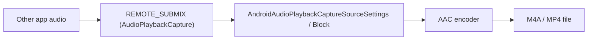
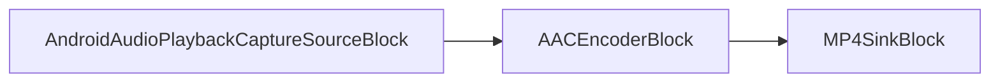

# Record Another App's Audio on Android in C# and .NET

[Video Capture SDK .Net](https://www.visioforge.com/video-capture-sdk-net){ .md-button .md-button--primary target="_blank" } [Media Blocks SDK .Net](https://www.visioforge.com/media-blocks-sdk-net){ .md-button .md-button--primary target="_blank" }

## Introduction

This guide shows how to record the audio played by **another application** on Android in C# and .NET. The capture uses Android's `AudioPlaybackCapture` API together with a `MediaProjection` consent token (Android 10 / API 29 and newer) and writes the result to an AAC `.m4a` file. VisioForge exposes the feature through two engines, so you can pick the one that fits your app: the high-level `VideoCaptureCoreX` (declarative recording) and the low-level `MediaBlocksPipeline` (full graph control).

For installation and package setup, see the [installation guide](../../install/index.md). The Android sample projects that this guide is based on ship with the SDK under `Video Capture SDK X/Android/Audio Playback Capture` and `Media Blocks SDK/Android/Audio Playback Capture`.

## How does audio playback capture work on Android?

Android routes the audio of other apps through a special `REMOTE_SUBMIX` source that you can only open after the user grants a screen/audio capture consent dialog. Your app requests that consent, receives a `MediaProjection` token, and hands the token to the VisioForge source. The source opens the playback-capture `AudioRecord`, the SDK encodes the stream to AAC, and a muxer writes the `.m4a` file.



**Capture is restricted by design.** Only apps that publish audio with `usage` of `Media`, `Game`, or `Unknown` are capturable, and only when the app has **not** opted out via `android:allowAudioPlaybackCapture="false"`. Protected players (Spotify, Netflix, and most DRM-backed apps) opt out, so they produce silence. Test with locally played video or music files, or with your own app.

## Prerequisites and permissions

- **Android 10 (API level 29) or newer.** Set `<SupportedOSPlatformVersion>29.0</SupportedOSPlatformVersion>` in the `.csproj`.
- **Permissions and a foreground service** declared in `AndroidManifest.xml`. The service must use the `mediaProjection` foreground type, and on Android 14+ it must be started **after** the consent is granted.

```xml
<?xml version="1.0" encoding="utf-8"?>
<manifest xmlns:android="http://schemas.android.com/apk/res/android" package="com.visioforge.audioplaybackcapture">
    <application android:label="@string/app_name">
        <service android:name=".AudioCaptureService"
                 android:foregroundServiceType="mediaProjection"
                 android:exported="false" />
    </application>
    <uses-permission android:name="android.permission.RECORD_AUDIO" />
    <uses-permission android:name="android.permission.FOREGROUND_SERVICE" />
    <uses-permission android:name="android.permission.FOREGROUND_SERVICE_MEDIA_PROJECTION" />
    <uses-permission android:name="android.permission.INTERNET" />
</manifest>
```

`RECORD_AUDIO` is a runtime permission — request it before starting capture. `INTERNET` is only needed if you stream the result; a pure file recorder can drop it.

## Requesting the MediaProjection token

The token flow is identical for both engines. The order matters on Android 14+: request consent, then start the foreground service, then call `GetMediaProjection` once the service is in the foreground.

First, kick off the system consent dialog when the user taps Start:

```csharp
// _projectionManager = (MediaProjectionManager)GetSystemService(MediaProjectionService);
StartActivityForResult(_projectionManager.CreateScreenCaptureIntent(), REQUEST_MEDIA_PROJECTION);
```

The foreground service exposes a `TaskCompletionSource` that is completed from `OnStartCommand`, so the activity can wait until the service is actually in the foreground state:

```csharp
[Service(ForegroundServiceType = ForegroundService.TypeMediaProjection, Exported = false)]
public class AudioCaptureService : Service
{
    public static TaskCompletionSource<bool> ForegroundStarted { get; set; }

    public override IBinder OnBind(Intent intent) => null;

    public override StartCommandResult OnStartCommand(Intent intent, StartCommandFlags flags, int startId)
    {
        CreateNotificationChannel();
        var notification = BuildNotification();
        var tcs = ForegroundStarted;
        ForegroundStarted = null;

        try
        {
            if (Build.VERSION.SdkInt >= BuildVersionCodes.Q)
            {
                StartForeground(NOTIFICATION_ID, notification, ForegroundService.TypeMediaProjection);
            }
            else
            {
                StartForeground(NOTIFICATION_ID, notification);
            }

            tcs?.TrySetResult(true);
        }
        catch (Exception ex)
        {
            Android.Util.Log.Error("AudioCaptureService", ex.ToString());
            tcs?.TrySetResult(false);
        }

        return StartCommandResult.Sticky;
    }
}
```

Finally, in `OnActivityResult`, start the service and obtain the token after it is foregrounded:

```csharp
protected override void OnActivityResult(int requestCode, Android.App.Result resultCode, Intent data)
{
    base.OnActivityResult(requestCode, resultCode, data);

    if (requestCode == REQUEST_MEDIA_PROJECTION && resultCode == Android.App.Result.Ok && data != null)
    {
        var projResultCode = (int)resultCode;

        var fgsTcs = new TaskCompletionSource<bool>();
        AudioCaptureService.ForegroundStarted = fgsTcs;

        // Start the foreground service AFTER consent (required on Android 14+ / targetSDK 34+).
        var serviceIntent = new Intent(this, typeof(AudioCaptureService));
        StartForegroundService(serviceIntent);

        _ = Task.Run(async () =>
        {
            // Wait until the service reaches the foreground state.
            var completed = await Task.WhenAny(fgsTcs.Task, Task.Delay(5000));
            if (completed != fgsTcs.Task) { return; }

            // GetMediaProjection must be called AFTER the FGS is in foreground state.
            _mediaProjection = _projectionManager.GetMediaProjection(projResultCode, data);

            await StartCaptureAsync();
        });
    }
}
```

With `_mediaProjection` in hand, hand it to either engine below.

## How do I record app audio with VideoCaptureCoreX?

`VideoCaptureCoreX` is the recommended path: you set the audio source and add an output, and the engine builds the graph for you. Because there is no camera here, create the engine without a `VideoView` and run it audio-only.

```csharp
using VisioForge.Core.Types.X.Android.Sources;
using VisioForge.Core.Types.X.Output;
using VisioForge.Core.VideoCaptureX;

private async Task StartCaptureCoreAsync()
{
    // Audio-only capture: no VideoView, no video source.
    _core = new VideoCaptureCoreX();
    _core.OnError += Core_OnError;

    // Audio playback capture source (records the audio of other apps via MediaProjection).
    _core.Audio_Source = new AndroidAudioPlaybackCaptureSourceSettings(_mediaProjection);
    _core.Audio_Play = false;   // do not play the captured audio back through the speaker
    _core.Audio_Record = true;  // route it into the output

    var musicDir = GetExternalFilesDir(Android.OS.Environment.DirectoryMusic);
    musicDir.Mkdirs();
    _recordingFilename = Path.Combine(musicDir.AbsolutePath, $"appaudio_{DateTime.Now:yyyyMMdd_HHmmss}.m4a");

    // M4A (AAC) audio-only output. autostart: true -> recording begins with StartAsync.
    _core.Outputs_Add(new M4AOutput(_recordingFilename), true);

    await _core.StartAsync();
}
```

To stop and finalize the file, stop and dispose the engine:

```csharp
private async Task StopCaptureCoreAsync()
{
    var core = Interlocked.Exchange(ref _core, null);
    if (core != null)
    {
        core.OnError -= Core_OnError;
        await core.StopAsync();
        await core.DisposeAsync();
    }

    StopService(new Intent(this, typeof(AudioCaptureService)));
}
```

`M4AOutput` defaults to the `AVENCAACEncoderSettings` AAC encoder inside an MP4 container, so the result is a standard `.m4a` file.

## How do I record app audio with MediaBlocksPipeline?

`MediaBlocksPipeline` gives you the explicit graph. You create the source, encoder, and sink blocks yourself and connect their pads. Use this when you need to insert custom processing (for example a volume block, a tee, or a network sink) between capture and the file.

```csharp
using VisioForge.Core.MediaBlocks;
using VisioForge.Core.MediaBlocks.AudioEncoders;
using VisioForge.Core.MediaBlocks.Sinks;
using VisioForge.Core.MediaBlocks.Sources;
using VisioForge.Core.Types.X.Android.Sources;
using VisioForge.Core.Types.X.Sinks;

private async Task StartCaptureCoreAsync()
{
    _pipeline = new MediaBlocksPipeline();
    _pipeline.OnError += Pipeline_OnError;

    // Audio playback capture source (records the audio of other apps).
    var settings = new AndroidAudioPlaybackCaptureSourceSettings(_mediaProjection);
    _audioSource = new AndroidAudioPlaybackCaptureSourceBlock(settings);

    // AAC encoder + MP4/M4A sink.
    _audioEncoder = new AACEncoderBlock();

    var musicDir = GetExternalFilesDir(Android.OS.Environment.DirectoryMusic);
    musicDir.Mkdirs();
    _recordingFilename = Path.Combine(musicDir.AbsolutePath, $"appaudio_{DateTime.Now:yyyyMMdd_HHmmss}.m4a");
    _sink = new MP4SinkBlock(new MP4SinkSettings(_recordingFilename));

    // source -> encoder -> sink
    _pipeline.Connect(_audioSource.Output, _audioEncoder.Input);
    _pipeline.Connect(_audioEncoder.Output, (_sink as IMediaBlockDynamicInputs).CreateNewInput(MediaBlockPadMediaType.Audio));

    await _pipeline.StartAsync();
}
```



Stop the pipeline the same way you stop any Media Blocks graph:

```csharp
private async Task StopCaptureCoreAsync()
{
    var pipeline = Interlocked.Exchange(ref _pipeline, null);
    if (pipeline != null)
    {
        pipeline.OnError -= Pipeline_OnError;
        await pipeline.StopAsync(force: false);
        await pipeline.DisposeAsync();
    }

    StopService(new Intent(this, typeof(AudioCaptureService)));
}
```

## Which engine should I choose?

Both engines use the same `AndroidAudioPlaybackCaptureSourceSettings` and produce the same kind of `.m4a` file. The difference is how much of the graph you manage.

| Aspect | VideoCaptureCoreX | MediaBlocksPipeline |
| --- | --- | --- |
| Source | `Audio_Source = new AndroidAudioPlaybackCaptureSourceSettings(token)` | `new AndroidAudioPlaybackCaptureSourceBlock(settings)` |
| Output | `Outputs_Add(new M4AOutput(file), true)` | `AACEncoderBlock` → `MP4SinkBlock` connected by hand |
| Graph | Built by the engine | You connect every pad |
| Best for | Quick recording with minimal code | Custom processing, multiple outputs, streaming |
| Start / stop | `StartAsync` / `StopAsync` / `DisposeAsync` | `StartAsync` / `StopAsync` / `DisposeAsync` |

Start with `VideoCaptureCoreX`; move to `MediaBlocksPipeline` when you need to branch the audio or add elements the high-level output does not expose.

## Saving the file to the device library

Both samples write to the app's private external `Music` directory (`GetExternalFilesDir(DirectoryMusic)`) and then copy the finished file into the shared media library through `MediaStore` so it appears in music apps and file managers:

```csharp
var values = new ContentValues();
values.Put(MediaStore.Audio.Media.InterfaceConsts.DisplayName, fileName);
values.Put(MediaStore.Audio.Media.InterfaceConsts.MimeType, "audio/mp4");
values.Put(MediaStore.Audio.Media.InterfaceConsts.RelativePath, Android.OS.Environment.DirectoryMusic);

var uri = ContentResolver.Insert(MediaStore.Audio.Media.ExternalContentUri, values);
using var output = ContentResolver.OpenOutputStream(uri);
using var input = new FileStream(filePath, FileMode.Open, FileAccess.Read);
input.CopyTo(output);
```

## Frequently Asked Questions

### Can I record audio from Spotify, Netflix, or YouTube?

Generally no. Apps that play protected or DRM content set `android:allowAudioPlaybackCapture="false"` (or publish audio with a non-capturable `usage`), which excludes them from `AudioPlaybackCapture`. Capturing them produces silence. Test with locally played media or apps that allow capture.

### Does audio playback capture require root?

No. It uses the public `AudioPlaybackCapture` API and a user-granted `MediaProjection` consent dialog. No root, no system signature, and no special OEM permission is needed.

### What is the minimum Android version?

Android 10 (API level 29). `AudioPlaybackCapture` did not exist before API 29, so set `SupportedOSPlatformVersion` to `29.0`. On older devices the playback-capture source reports that it is not available and the capture cannot start.

### Can I capture another app's audio and the microphone at the same time?

The source in this guide captures only playback audio. Mixing it with a microphone source requires adding a second audio source and an audio mixer to the graph — that is a separate topic and is best built on `MediaBlocksPipeline` for full control.

### Why is my recording silent?

The two common causes are: the source app opted out of playback capture (protected content), or it simply was not producing sound during the capture window. Confirm with a plain local audio/video file playing audibly, and verify `RECORD_AUDIO` was granted and the foreground service started before `GetMediaProjection` was called.

## See Also

- [Installation guide](../../install/index.md) — add the VisioForge .NET packages to your project
- [Android implementation and deployment](../../deployment-x/Android.md) — NuGet setup and packaging for Android apps
- [Audio capture and system sound recording](../../videocapture/audio-capture/index.md) — record the microphone and system audio in C#
- [Audio encoder blocks](../../mediablocks/AudioEncoders/index.md) — AAC, MP3, FLAC, and Opus encoders for the Media Blocks pipeline
- [Video Capture SDK .Net](https://www.visioforge.com/video-capture-sdk-net) — the high-level `VideoCaptureCoreX` engine
- [Media Blocks SDK .Net](https://www.visioforge.com/media-blocks-sdk-net) — the low-level `MediaBlocksPipeline` engine
