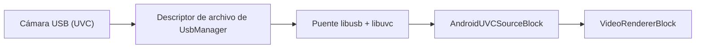

# Capturar cámaras USB (UVC) en Android con C# y .NET

[Media Blocks SDK .Net](https://www.visioforge.com/media-blocks-sdk-net){ .md-button .md-button--primary target="_blank" } [Video Capture SDK .Net](https://www.visioforge.com/video-capture-sdk-net){ .md-button target="_blank" }

## Introducción

Una cámara USB Video Class (UVC) conectada a un teléfono Android por OTG resulta invisible para la API de cámara estándar de Android en la mayoría de los dispositivos. `AndroidUVCSourceBlock` la alcanza de todos modos: se comunica con la cámara mediante un puente nativo libusb/libuvc incorporado y envía los fotogramas a un `MediaBlocksPipeline`. Necesita Android 9 (nivel de API 28) o posterior, el permiso `android.permission.CAMERA` y unas 40 líneas de C#.

Esta guía cubre todo el recorrido: por qué falla la API habitual, la configuración del manifiesto y de los permisos, el código de captura, cómo se compara el formato solicitado con lo que ofrece la cámara, qué entrega USB 2.0 de forma realista y cómo gestionar la desconexión de la cámara a mitad de la transmisión.

## ¿Por qué Camera2 no puede ver una cámara USB en Android?

Android expone las cámaras USB a la API Camera2 únicamente a través del **External Camera HAL**, un componente opcional que el fabricante del dispositivo debe incorporar al firmware. Muchos teléfonos populares se distribuyen sin él: en un Samsung Galaxy M55, por ejemplo, `pm list features` no informa de ningún `android.hardware.camera.external`, y el servicio de cámara solo lista los sensores frontal y posterior integrados. El kernel enumera una cámara UVC conectada a un teléfono así, pero ninguna API de cámara la devolverá jamás.

Dos soluciones aparentemente obvias también fallan. Los nodos `/dev/video*` que crea el kernel pertenecen al grupo `camera`, del que un proceso de aplicación corriente no es miembro. Y la API Java `UsbDeviceConnection` admite transferencias de control, masivas y de interrupción, pero **no isócronas**, el tipo de transferencia que usan en la práctica las webcams UVC.

Queda una sola vía viable, y es la que toma este bloque: obtener el descriptor de archivo USB de `UsbManager` y después controlar el dispositivo desde código nativo capaz de enviar transferencias isócronas.



## Qué necesita

- **Android 9 (nivel de API 28) o posterior.** Establezca `<SupportedOSPlatformVersion>28.0</SupportedOSPlatformVersion>` en el `.csproj`.
- **Un teléfono con soporte de host USB (OTG)** y un adaptador o cable OTG.
- **El paquete `VisioForge.CrossPlatform.Core.Android`**, que incluye el contenido nativo, además de `VisioForge.DotNet.MediaBlocks` y la referencia al proyecto `VisioForge.Core.Android.X10` que usan todos los ejemplos de Android. Consulte la [guía de implementación en Android](../../deployment-x/Android.md).

### Entradas del manifiesto

```xml
<!-- Android deniega el acceso a los dispositivos USB video class si la aplicación no posee el
     permiso de cámara, aunque aquí nunca se use la API Camera2. -->
<uses-permission android:name="android.permission.CAMERA" />
<!-- Por lo demás, ese permiso convierte la cámara integrada en un REQUISITO implícito, lo que
     ocultaría la aplicación justo a los dispositivos a los que se dirige: aquellos cuya cámara
     llega por USB. -->
<uses-feature android:name="android.hardware.camera" android:required="false" />
<uses-feature android:name="android.hardware.camera.autofocus" android:required="false" />
<uses-feature android:name="android.hardware.usb.host" android:required="true" />
```

Mantenga `android.hardware.usb.host` en `required="true"` solo si su aplicación completa no sirve sin una cámara USB: también es un filtro de Google Play y, en `true`, oculta la aplicación en todos los dispositivos sin soporte de host USB.

!!! warning "La línea `required="false"` no es opcional"

    Declarar `android.permission.CAMERA` hace que Google Play trate la cámara integrada como un
    requisito del dispositivo. Si se deja implícito, eso filtra su aplicación de la ficha de la
    tienda en los dispositivos sin cámara integrada, que incluyen buena parte del hardware con más
    probabilidad de necesitar una cámara USB en primer lugar.

## Solicitar los dos permisos

La captura desde cámara USB necesita dos concesiones distintas, en este orden.

**1. El permiso `CAMERA` en tiempo de ejecución.** Solicítelo como de costumbre:

```csharp
private const int CameraPermissionRequest = 1004;

protected override void OnCreate(Bundle savedInstanceState)
{
    base.OnCreate(savedInstanceState);

    RequestPermissions(new[] { Manifest.Permission.Camera }, CameraPermissionRequest);
}

public override void OnRequestPermissionsResult(
    int requestCode, string[] permissions, Android.Content.PM.Permission[] grantResults)
{
    base.OnRequestPermissionsResult(requestCode, permissions, grantResults);

    if (requestCode != CameraPermissionRequest)
    {
        return;
    }

    if (AndroidUVCDevices.HasCameraPermission())
    {
        _ = StartPreviewAsync();
    }
}
```

**2. El permiso para el dispositivo USB concreto**, que muestra el diálogo del sistema:

```csharp
if (!await AndroidUVCDevices.RequestPermissionAsync(camera))
{
    // denegado, descartado o sin respuesta durante dos minutos
    return;
}
```

`RequestPermissionAsync` devuelve `false` si se deniega, si se descarta el diálogo y tras un tiempo de espera de dos minutos; lanza `OperationCanceledException` solo cuando usted la cancela mediante su propio `CancellationToken`.

!!! danger "La falta del permiso CAMERA falla en silencio"

    Sin `android.permission.CAMERA` concedido, la solicitud de permiso USB devuelve
    `false` **al instante y no se muestra ningún diálogo**. La única pista está en logcat:
    `UsbUserPermissionManager: Camera permission required for USB video class devices`.
    Compruebe primero `AndroidUVCDevices.HasCameraPermission()` y nunca perseguirá este problema.

## Capturar desde la cámara

Con ambos permisos en su poder, la captura en sí es código Media Blocks corriente. Tenga en cuenta que estos tipos se compilan solo para el marco de destino de Android, así que en un proyecto MAUI o con varios destinos este código va en un archivo exclusivo de Android o dentro de `#if ANDROID`:

```csharp
using VisioForge.Core;
using VisioForge.Core.GStreamer.Android.UVC;
using VisioForge.Core.MediaBlocks;
using VisioForge.Core.MediaBlocks.Sources;
using VisioForge.Core.MediaBlocks.VideoRendering;
using VisioForge.Core.Types;
using VisioForge.Core.Types.Events;
using VisioForge.Core.Types.X.Sources.AndroidUVC;

// listar las cámaras USB conectadas
var cameras = AndroidUVCDevices.FindCameras();
if (cameras.Count == 0)
{
    SetStatus("No USB camera found. Connect one over OTG.");
    return;
}

var camera = cameras[0];

if (!await AndroidUVCDevices.RequestPermissionAsync(camera))
{
    SetStatus("Access to the USB camera was denied.");
    return;
}

_pipeline = new MediaBlocksPipeline();
_pipeline.OnError += Pipeline_OnError;
_pipeline.OnStop += Pipeline_OnStop;

var settings = new AndroidUVCSourceSettings
{
    Device = camera,
    Width = 1280,
    Height = 720,
    FrameRate = new VideoFrameRate(30),
};

_videoSource = new AndroidUVCSourceBlock(settings);
_videoRenderer = new VideoRendererBlock(_pipeline, _videoView) { IsSync = false };

_pipeline.Connect(_videoSource.Output, _videoRenderer.Input);

if (!await _pipeline.StartAsync())
{
    SetStatus("Unable to start. Another app may be using the camera.");

    // la cámara ya estaba ocupada durante la construcción, así que devuélvala
    await DisposePipelineAsync();
    return;
}

SetStatus($"Streaming from {camera.ProductName}");
```

Observe que `StartAsync` devuelve un `bool`. Ignorarlo le deja mirando una vista previa en negro sin saber por qué, así que compruébelo y libere el pipeline cuando falle: eso es lo que devuelve la cámara para el siguiente intento.

Para averiguar si la captura es posible antes de construir nada, llame a `AndroidUVCSourceBlock.IsAvailable()`. Confirma que la versión de Android es suficientemente reciente, que están presentes los elementos que necesita cualquier modo y que el puente nativo se carga. Deliberadamente no comprueba `jpegdec`, que solo necesita un modo MJPEG, ni si hay una cámara conectada: esto último lo responde `AndroidUVCSourceBlock.GetDevices()`.

## Capturar con VideoCaptureCoreX

La misma cámara funciona también como fuente de video de `VideoCaptureCoreX`, que es el camino más corto cuando desea grabación, streaming de red, efectos de video o instantáneas en lugar de un pipeline que usted mismo monta. Asigne los ajustes a `Video_Source` y el motor construye todo lo que va después:

```csharp
using VisioForge.Core.GStreamer.Android.UVC;
using VisioForge.Core.Types;
using VisioForge.Core.Types.X.Output;
using VisioForge.Core.Types.X.Sources.AndroidUVC;
using VisioForge.Core.VideoCaptureX;

var cameras = AndroidUVCDevices.FindCameras();
if (cameras.Count == 0 || !await AndroidUVCDevices.RequestPermissionAsync(cameras[0]))
{
    return;
}

_core = new VideoCaptureCoreX(_videoView);
_core.OnError += Core_OnError;

// una cámara en vivo no tiene con qué sincronizar la rama de grabación, y dejarla
// sincronizada hace que esa rama espere al reloj hasta que su cola se llene y
// detenga la previsualización con ella; una captura con audio ajusta
// Audio_Output_IsSync igual, pero esta es solo de vídeo
_core.Video_Output_IsSync = false;

_core.Video_Source = new AndroidUVCSourceSettings
{
    Device = cameras[0],
    Width = 1280,
    Height = 720,
    FrameRate = new VideoFrameRate(30),
};

_core.Video_Play = true;

// registrado antes de StartAsync para que exista la rama de grabación; con autoStart
// en false no se escribe nada hasta llamar a StartCaptureAsync
_core.Outputs_Add(new MP4Output(placeholderPath), false);

await _core.StartAsync();

// más tarde, cuando el usuario pulsa grabar
await _core.StartCaptureAsync(0, targetPath);
```

!!! warning "Hoy, una grabación por instancia del motor"

    `StartCaptureAsync` arranca el pipeline propio de la salida, y reiniciar uno detenido es un
    defecto abierto conocido: la **segunda** llamada con el mismo índice de salida devuelve `true` y
    no escribe ningún archivo, sin excepción, sin `OnError` y sin nada en el registro. Compruebe el
    valor devuelto *y* verifique que el archivo existe después de `StopCaptureAsync`, y vuelva a crear
    el motor entre grabaciones si su aplicación necesita grabar más de una vez. La vista previa no se
    ve afectada.

Merece la pena conocer dos diferencias respecto a la vía de Media Blocks. `Video_Source_SwitchCamera` solo gestiona cámaras del sistema, así que cambiar a una cámara USB o desde ella implica detener y reiniciar el motor en lugar de un intercambio en vivo. Y `VideoCaptureCoreX` no informa de una cámara desconectada: consulte [Gestionar una cámara desconectada](#handling-a-disconnected-camera).

!!! warning "La grabación es solo de video, y el micrófono del teléfono no es una solución"

    Una interfaz de video UVC no transporta audio, así que nada en este pipeline produce sonido.
    Recurrir al micrófono del teléfono no lo resuelve en una webcam típica: una cámara con micrófono
    incorporado también se registra como entrada de **audio** USB, Android prefiere entonces esa
    entrada para grabar y no puede abrirse mientras el puente transmite desde el mismo dispositivo
    físico. Añadir la fuente de audio hace fallar todo el pipeline con `Internal data stream error`
    de `openslessrc`. Verificado en un Galaxy M55 con una Logitech BRIO. Con una cámara sin micrófono,
    el micrófono del teléfono sigue siendo la entrada predeterminada y el audio funciona con normalidad.

## ¿Qué formato debería solicitar?

Solicite resoluciones MJPEG y trate sus valores de `Width`, `Height` y `FrameRate` como una preferencia más que como una orden. El bloque los compara con los modos que la cámara anuncia realmente: primero la resolución más cercana por número de píxeles, después MJPEG con preferencia sobre los formatos sin comprimir y, por último, la velocidad de fotogramas más cercana. Una discrepancia produce una advertencia en logcat, no un error, así que el pipeline arranca con un formato que usted no pidió. El SDK registra el que eligió como `USB camera ready: WxH@fps FORMAT`; consulte esa línea en logcat si el formato exacto le importa. Para decidir a partir de las capacidades reales de la cámara en lugar de una suposición, llame a `AndroidUVCDevices.GetModes(device)` una vez concedido el permiso USB: devuelve las resoluciones, velocidades de fotogramas y formatos entre los que puede elegir realmente. Los formatos que el SDK no puede transmitir (los modos H.264 o NV12 de una cámara) quedan fuera, así que la lista es lo utilizable y no todo lo que anuncia la cámara. Asigne `Format` en los ajustes para pedir el formato del modo que eligió; dejarlo en `Unknown` favorece MJPEG, que suele ser lo deseado. Abre la cámara para leerlos, así que llámelo antes de iniciar la captura.

La preferencia por MJPEG es deliberada e importa más que la velocidad de fotogramas. Sobre un enlace USB 2.0, un flujo sin comprimir consume aproximadamente 20 veces el ancho de banda de la misma imagen en MJPEG. Una cámara que anuncia 1080p30 en MJPEG normalmente alcanza unos **5 fps** sin comprimir a esa resolución, lo que parece un pipeline roto más que un límite de ancho de banda. Si una cámara solo ofrece formatos sin comprimir, sigue funcionando, solo que despacio.

## Qué ofrece realmente USB 2.0

La mayoría de los teléfonos enumeran una cámara USB a High Speed (480 Mbps) y no a los 5 Gbps que ofrece un puerto USB 3 de escritorio, incluso cuando el puerto admite USB 3. Las cámaras informan de sus capacidades por velocidad de enlace, así que los modos de ancho de banda alto simplemente están ausentes de los descriptores. Una Logitech BRIO, que hace 4K en un equipo de escritorio, no expone ningún modo 4K en un teléfono; su techo práctico allí es **1080p30 o 720p60 en MJPEG**.

Téngalo en cuenta al elegir una resolución. 720p30 es un valor predeterminado seguro en cualquier cámara UVC, y es lo que usa `AndroidUVCSourceSettings` si deja los valores predeterminados sin tocar.

## Gestionar una cámara desconectada { #handling-a-disconnected-camera }

Alguien desconectará la cámara mientras su aplicación transmite. Cuando eso ocurre, el bloque termina el flujo, por lo que un `MediaBlocksPipeline` emite `OnStop`:

```csharp
private void Pipeline_OnError(object sender, ErrorsEventArgs e)
{
    SetStatus(e.Message);
}

private void Pipeline_OnStop(object sender, StopEventArgs e)
{
    SetStatus("The camera was disconnected.");
}
```

Merece la pena conocer dos detalles. El renderizador sigue mostrando el último fotograma recibido, así que la vista previa no se queda en blanco por sí sola: borre u oculte su vista de video en este controlador. Y una cámara retirada a mitad de un fotograma entrega un fotograma parcial, que se decodifica como ruido visible, así que ese último fotograma congelado puede parecer dañado. Ocultar la vista evita mostrarlo en absoluto.

No libere el pipeline dentro de este controlador si se ejecuta en el hilo de callback del dispositivo; desmonte desde su propio hilo, por ejemplo desde el `OnDestroy` de la actividad:

```csharp
private async Task DisposePipelineAsync()
{
    if (_pipeline == null)
    {
        return;
    }

    _pipeline.OnError -= Pipeline_OnError;
    _pipeline.OnStop -= Pipeline_OnStop;

    await _pipeline.DisposeAsync();
    _pipeline = null;
}

protected override async void OnDestroy()
{
    // primero, antes de cualquier cosa que pueda esperar: vea la nota siguiente
    base.OnDestroy();

    try
    {
        await DisposePipelineAsync();
    }
    catch (Exception ex)
    {
        Log.Error(TAG, ex.ToString());
    }

    VisioForgeX.DestroySDK();
}
```

!!! warning "`base.OnDestroy()` debe ir primero"

    Android comprueba que la implementación base se ejecutó cuando `OnDestroy` retorna, y un `await`
    devuelve el control al sistema mucho antes de que el método termine. Llamarla al final, después
    de esperar el desmontaje, lanza `android.util.SuperNotCalledException: Activity did not call
    through to super.onDestroy()` y mata el proceso. Llámela primero: la continuación se ejecuta
    igualmente y libera el pipeline después.

Con `VideoCaptureCoreX` no existe tal evento. El motor emite `OnStop` desde su propia ruta de parada y no observa un flujo que termina por sí solo, así que una cámara desconectada nunca llega a `OnStop`. La fuente sí lo informa mediante `OnError`, pero solo cuando los fotogramas llevan varios segundos sin llegar: para entonces la vista previa ya está congelada y una grabación en curso sigue abierta. Suscríbase también a la difusión `ACTION_USB_DEVICE_DETACHED` de Android, que llega en el momento en que se desconecta el cable: confirme que su cámara es el dispositivo que desapareció y detenga después la captura y el motor:

```csharp
// once the pipeline is running
RegisterReceiver(
    new UsbDetachReceiver(OnUsbDetached),
    new IntentFilter(UsbManager.ActionUsbDeviceDetached),
    ReceiverFlags.NotExported);
```

Ambos miembros pertenecen a su actividad: el manejador y el receptor que le reenvía la difusión:

```csharp
private async void OnUsbDetached()
{
    // la difusión no incluye un dispositivo utilizable en los niveles actuales de
    // Android, pero una cámara desconectada deja de enumerarse: ignore las demás
    if (AndroidUVCDevices.FindCameras().Any(c => c.DeviceName == _camera.DeviceName))
    {
        return;
    }

    await _core.StopCaptureAsync(0);
    await _core.StopAsync();
}

private class UsbDetachReceiver : BroadcastReceiver
{
    private readonly Action _onDetached;

    public UsbDetachReceiver(Action onDetached)
    {
        _onDetached = onDetached;
    }

    public override void OnReceive(Context context, Intent intent)
    {
        _onDetached();
    }
}
```

Detener primero la captura es lo que cierra la grabación correctamente. Los fotogramas ya escritos se vuelcan en cualquier caso, así que el archivo sigue siendo reproducible, pero el motor sigue creyendo que está en marcha hasta que usted lo detiene.

## Solución de problemas

| Qué observa | Qué significa |
|---|---|
| Permiso USB denegado al instante, sin diálogo | `android.permission.CAMERA` no está concedido. En logcat: `Camera permission required for USB video class devices`. |
| `USB camera capture requires Android 9 (API 28) or later.` | El dispositivo es anterior a la API 28. Compruebe `AndroidUVCDevices.IsSupportedPlatform()` antes de ofrecer la función. |
| `No permission for the USB camera. Call AndroidUVCDevices.RequestPermissionAsync first.` | Falta la concesión del dispositivo; se llamó a `StartAsync` demasiado pronto. |
| `The camera advertises no usable video modes.` | La cámara no expone ni MJPEG ni YUY2 en este enlace. |
| `StartAsync` devuelve `false` y logcat menciona un modo no válido | Otro proceso tiene la cámara. Solo una aplicación puede transmitir desde un dispositivo UVC a la vez. |
| `Requested 1920x1080@30 is not offered; using 1280x720@30.` | Informativo: se seleccionó en su lugar el modo anunciado más cercano. |
| No llegan fotogramas tras volver a conectar y el pipeline sigue en pausa | Una condición USB transitoria tras la reconexión. Reinicie la captura. |
| `Unable to create the jpegdec element.` | El contenido de GStreamer no incluye decodificador JPEG, así que no puede construirse un modo MJPEG. `IsAvailable()` no cubre esto: devuelve `true` porque los modos sin comprimir seguirían funcionando. |

## Preguntas frecuentes

### ¿Funciona en cualquier teléfono Android?

Funciona en cualquier dispositivo con Android 9 (nivel de API 28) o posterior que admita el modo host USB, lo que abarca la mayoría de los teléfonos y tabletas vendidos desde 2018. A diferencia de la vía Camera2, no depende de que el fabricante incluya el External Camera HAL, así que funciona en hardware donde la API de cámara integrada no puede ver en absoluto una cámara USB. El dispositivo debe cumplir dos condiciones más: soporte de OTG en el hardware y suficiente alimentación en el bus USB para la cámara, ya que una cámara que consuma más de lo que suministra el puerto no logrará enumerarse. Llame a `AndroidUVCDevices.IsSupportedPlatform()` para comprobar la versión de Android y a `AndroidUVCSourceBlock.IsAvailable()` para confirmar que el puente nativo se cargó antes de ofrecer la función en su interfaz.

### ¿Necesito acceso root?

No. Todo el sentido de este diseño es que funcione como una aplicación corriente. Root sería una forma de abrir los nodos `/dev/video*` que el kernel crea para una cámara UVC, ya que pertenecen al grupo `camera` del que los procesos de aplicación no forman parte, pero no es la vía adoptada aquí. En su lugar, la aplicación pide permiso a `UsbManager`, recibe un descriptor de archivo del dispositivo y lo entrega al puente nativo, que envía las transferencias USB isócronas que la cámara necesita. Todo sucede mediante API documentadas de Android y el consentimiento del propio usuario, así que la aplicación se instala y se ejecuta con normalidad, y puede publicarse en Google Play.

### ¿Puedo grabar en un archivo en lugar de mostrar una vista previa?

Sí. `AndroidUVCSourceBlock` es una fuente Media Blocks normal con un único pad de salida de video, así que se conecta a cualquier cosa que ofrezca el SDK: una [salida MP4](../../mediablocks/Outputs/index.md), un [sumidero RTMP o SRT](../../mediablocks/Sinks/index.md) para streaming, o una cadena de procesamiento de video. Conecte su pad `Output` a un codificador o a un bloque de salida en lugar del renderizador, o además de él. Los fotogramas llegan decodificados, así que no se necesita ningún paso de decodificación adicional. El bloque no tiene pad de audio, así que un MP4 grabado solo con él queda sin sonido y muchos servicios rechazan un envío RTMP sin audio. Añadir una fuente de audio aparte es la respuesta, pero lea primero la advertencia anterior: en una cámara con micrófono propio, Android prefiere esa entrada de audio USB y no puede capturarse mientras se transmite desde la cámara. Tenga en cuenta el techo de ancho de banda al elegir una resolución de grabación: 720p30 es cómodo, 1080p30 es el máximo práctico en la mayoría de los teléfonos.

### ¿Por qué se prefiere MJPEG frente al video sin comprimir?

Porque el video sin comprimir no cabe por un enlace USB High Speed a ninguna velocidad de fotogramas útil. Un fotograma de 1280x720 en YUY2 ocupa unos 1.8 MB, así que 30 fps necesitan aproximadamente 440 Mbps. El bus funciona a 480 Mbps, pero el límite real es más bajo: un extremo isócrono de ancho de banda alto transporta como máximo 3072 bytes por microtrama, unos 24.5 MB/s, es decir, alrededor de 196 Mbps. Las cámaras resuelven esto anunciando los formatos sin comprimir solo a velocidades muy bajas: una cámara que ofrece 1080p30 en MJPEG normalmente limita 1080p sin comprimir a unos 5 fps. Por tanto, seleccionar el modo sin comprimir parece un pipeline roto o atascado más que un compromiso deliberado. Dentro de una resolución, el selector de modo prefiere MJPEG incluso cuando su velocidad de fotogramas queda más lejos de la solicitada, y el pipeline decodifica los fotogramas JPEG por usted. Sin embargo, la resolución se compara primero, así que una cámara que solo ofrece 1080p sin comprimir le entregará ese modo lento si usted pide 1080p: solicite una resolución que la cámara ofrezca en MJPEG.

### ¿Qué bibliotecas nativas se incluyen y bajo qué licencia?

Dos, ambas distribuidas dentro del paquete `VisioForge.CrossPlatform.Core.Android` para las cuatro ABI de Android. **libusb 1.0.30** proporciona el transporte USB y tiene licencia **LGPL v2.1 o posterior**; se distribuye como un objeto compartido aparte, `libusb1.0.so`, enlazado dinámicamente y por tanto reemplazable, como exige esa licencia. **libuvc** proporciona la capa del protocolo UVC y tiene la licencia permisiva **BSD 3-Clause**; está compilada dentro de `libVisioForge_UVC.so`. Ninguna de las dos bibliotecas está parcheada. Los avisos completos, incluidos ambos textos de licencia íntegros y las versiones exactas, se distribuyen con el paquete en `THIRD-PARTY-NOTICES.txt`.

## Documentación relacionada

- [Bloque fuente de cámara USB (UVC)](../../mediablocks/Sources/index.md#usb-uvc-camera-source-block) - la referencia del bloque
- [Guía de implementación en Android](../../deployment-x/Android.md) - paquetes, permisos y contenido nativo
- [Grabar el audio de otra aplicación en Android](android-audio-playback-capture.md) - otro flujo de captura específico de Android
