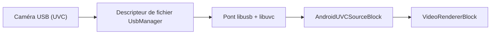

# Capturer une caméra USB (UVC) sur Android en C# et .NET

[Media Blocks SDK .Net](https://www.visioforge.com/media-blocks-sdk-net){ .md-button .md-button--primary target="_blank" } [Video Capture SDK .Net](https://www.visioforge.com/video-capture-sdk-net){ .md-button target="_blank" }

## Introduction

Sur la plupart des appareils, une caméra USB Video Class (UVC) branchée en OTG sur un téléphone Android est invisible pour l'API caméra standard d'Android. `AndroidUVCSourceBlock` l'atteint malgré tout : il dialogue avec la caméra via un pont natif libusb/libuvc intégré et pousse les images dans un `MediaBlocksPipeline`. Il exige Android 9 (niveau d'API 28) ou une version ultérieure, l'autorisation `android.permission.CAMERA` et une quarantaine de lignes de C#.

Ce guide couvre l'ensemble du parcours : pourquoi l'API normale échoue, la configuration du manifeste et des autorisations, le code de capture, la manière dont un format demandé est confronté à ce que propose la caméra, ce que l'USB 2.0 délivre réellement, et comment gérer le débranchement de la caméra en pleine diffusion.

## Pourquoi Camera2 ne voit-il pas une caméra USB sur Android ?

Android n'expose les caméras USB à l'API Camera2 qu'au travers de l'**External Camera HAL**, un composant optionnel que le fabricant de l'appareil doit intégrer au micrologiciel. De nombreux téléphones populaires en sont dépourvus : sur un Samsung Galaxy M55, par exemple, `pm list features` ne signale aucun `android.hardware.camera.external`, et le service caméra ne liste que les capteurs avant et arrière intégrés. Une caméra UVC branchée sur un tel téléphone est bien énumérée par le noyau, mais aucune API caméra ne la renverra jamais.

Deux contournements évidents échouent également. Les nœuds `/dev/video*` créés par le noyau appartiennent au groupe `camera`, dont un processus applicatif ordinaire n'est pas membre. Et l'API Java `UsbDeviceConnection` prend en charge les transferts de contrôle, bulk et interruption, mais **pas les transferts isochrones** — le type de transfert que les webcams UVC utilisent en pratique.

Il ne reste donc qu'une voie viable, et c'est celle que suit ce bloc : obtenir le descripteur de fichier USB auprès de `UsbManager`, puis piloter l'appareil depuis du code natif capable de soumettre des transferts isochrones.



## Ce dont vous avez besoin

- **Android 9 (niveau d'API 28) ou une version ultérieure.** Définissez `<SupportedOSPlatformVersion>28.0</SupportedOSPlatformVersion>` dans le `.csproj`.
- **Un téléphone prenant en charge le mode hôte USB (OTG)** et un adaptateur ou un câble OTG.
- **Le paquet `VisioForge.CrossPlatform.Core.Android`**, qui embarque la charge native, plus `VisioForge.DotNet.MediaBlocks` et la référence de projet `VisioForge.Core.Android.X10` utilisée par tous les exemples Android. Consultez le [guide de déploiement Android](../../deployment-x/Android.md).

### Entrées de manifeste

```xml
<!-- Android refuse l'accès aux périphériques USB video class si l'application ne détient pas
     l'autorisation caméra, même si l'API Camera2 n'est jamais utilisée ici. -->
<uses-permission android:name="android.permission.CAMERA" />
<!-- Sinon, cette autorisation fait d'une caméra intégrée une EXIGENCE implicite, ce qui masquerait
     l'application précisément sur les appareils qu'elle cible : ceux dont la caméra arrive par USB. -->
<uses-feature android:name="android.hardware.camera" android:required="false" />
<uses-feature android:name="android.hardware.camera.autofocus" android:required="false" />
<uses-feature android:name="android.hardware.usb.host" android:required="true" />
```

Ne conservez `android.hardware.usb.host` à `required="true"` que si votre application entière est inutile sans caméra USB : c'est aussi un filtre Google Play et, à `true`, il masque l'application sur tous les appareils dépourvus du mode hôte USB.

!!! warning "La ligne `required="false"` n'est pas facultative"

    Déclarer `android.permission.CAMERA` amène Google Play à considérer une caméra intégrée
    comme une exigence de l'appareil. Laissée implicite, elle exclut votre application de la
    fiche du store sur les appareils sans caméra intégrée — ce qui inclut une bonne part du
    matériel le plus susceptible d'avoir besoin d'une caméra USB.

## Demander les deux autorisations

La capture depuis une caméra USB nécessite deux accords distincts, dans cet ordre.

**1. L'autorisation `CAMERA` à l'exécution.** Demandez-la comme d'habitude :

```csharp
private const int CameraPermissionRequest = 1004;

protected override void OnCreate(Bundle savedInstanceState)
{
    base.OnCreate(savedInstanceState);

    RequestPermissions(new[] { Manifest.Permission.Camera }, CameraPermissionRequest);
}

public override void OnRequestPermissionsResult(
    int requestCode, string[] permissions, Android.Content.PM.Permission[] grantResults)
{
    base.OnRequestPermissionsResult(requestCode, permissions, grantResults);

    if (requestCode != CameraPermissionRequest)
    {
        return;
    }

    if (AndroidUVCDevices.HasCameraPermission())
    {
        _ = StartPreviewAsync();
    }
}
```

**2. L'autorisation pour le périphérique USB précis**, qui affiche la boîte de dialogue système :

```csharp
if (!await AndroidUVCDevices.RequestPermissionAsync(camera))
{
    // refusée, boîte de dialogue fermée, ou sans réponse pendant deux minutes
    return;
}
```

`RequestPermissionAsync` renvoie `false` en cas de refus, lorsque la boîte de dialogue est fermée, et après un délai d'attente de deux minutes ; elle ne lève `OperationCanceledException` que si vous l'annulez via votre propre `CancellationToken`.

!!! danger "L'absence de l'autorisation CAMERA échoue silencieusement"

    Sans `android.permission.CAMERA` accordée, la demande d'autorisation USB renvoie
    `false` **instantanément et aucune boîte de dialogue n'est jamais affichée**. Le seul
    indice se trouve dans logcat :
    `UsbUserPermissionManager: Camera permission required for USB video class devices`.
    Vérifiez d'abord `AndroidUVCDevices.HasCameraPermission()` et vous ne chercherez jamais cette panne.

## Capturer depuis la caméra

Les deux autorisations en main, la capture elle-même est du code Media Blocks ordinaire. Notez que ces types ne sont compilés que pour le framework cible Android : dans un projet MAUI ou multicible, ce code doit donc figurer dans un fichier propre à Android ou dans un bloc `#if ANDROID` :

```csharp
using VisioForge.Core;
using VisioForge.Core.GStreamer.Android.UVC;
using VisioForge.Core.MediaBlocks;
using VisioForge.Core.MediaBlocks.Sources;
using VisioForge.Core.MediaBlocks.VideoRendering;
using VisioForge.Core.Types;
using VisioForge.Core.Types.Events;
using VisioForge.Core.Types.X.Sources.AndroidUVC;

// lister les caméras USB branchées
var cameras = AndroidUVCDevices.FindCameras();
if (cameras.Count == 0)
{
    SetStatus("No USB camera found. Connect one over OTG.");
    return;
}

var camera = cameras[0];

if (!await AndroidUVCDevices.RequestPermissionAsync(camera))
{
    SetStatus("Access to the USB camera was denied.");
    return;
}

_pipeline = new MediaBlocksPipeline();
_pipeline.OnError += Pipeline_OnError;
_pipeline.OnStop += Pipeline_OnStop;

var settings = new AndroidUVCSourceSettings
{
    Device = camera,
    Width = 1280,
    Height = 720,
    FrameRate = new VideoFrameRate(30),
};

_videoSource = new AndroidUVCSourceBlock(settings);
_videoRenderer = new VideoRendererBlock(_pipeline, _videoView) { IsSync = false };

_pipeline.Connect(_videoSource.Output, _videoRenderer.Input);

if (!await _pipeline.StartAsync())
{
    SetStatus("Unable to start. Another app may be using the camera.");

    // la caméra a déjà été réservée pendant la construction : il faut donc la rendre
    await DisposePipelineAsync();
    return;
}

SetStatus($"Streaming from {camera.ProductName}");
```

Notez que `StartAsync` renvoie un `bool`. L'ignorer vous laisse devant un aperçu noir sans savoir pourquoi : vérifiez-le donc et libérez le pipeline en cas d'échec — c'est ce qui rend la caméra disponible pour la tentative suivante.

Pour savoir si la capture est possible avant de construire quoi que ce soit, appelez `AndroidUVCSourceBlock.IsAvailable()`. La méthode confirme que la version d'Android est suffisamment récente, que les éléments dont tout mode a besoin sont présents et que le pont natif se charge. Elle ne teste délibérément pas `jpegdec`, dont seul un mode MJPEG a besoin, ni la présence d'une caméra — `AndroidUVCSourceBlock.GetDevices()` répond à cette dernière question.

## Capturer avec VideoCaptureCoreX

La même caméra fonctionne aussi comme source vidéo de `VideoCaptureCoreX`, ce qui est la voie la plus courte lorsque vous voulez de l'enregistrement, de la diffusion réseau, des effets vidéo ou des captures d'image plutôt qu'un pipeline que vous assemblez vous-même. Affectez les paramètres à `Video_Source` et le moteur construit tout ce qui suit :

```csharp
using VisioForge.Core.GStreamer.Android.UVC;
using VisioForge.Core.Types;
using VisioForge.Core.Types.X.Output;
using VisioForge.Core.Types.X.Sources.AndroidUVC;
using VisioForge.Core.VideoCaptureX;

var cameras = AndroidUVCDevices.FindCameras();
if (cameras.Count == 0 || !await AndroidUVCDevices.RequestPermissionAsync(cameras[0]))
{
    return;
}

_core = new VideoCaptureCoreX(_videoView);
_core.OnError += Core_OnError;

// une caméra en direct n'a rien sur quoi synchroniser la branche d'enregistrement,
// et la laisser synchronisée fait attendre cette branche sur l'horloge jusqu'à ce
// que sa file se remplisse et bloque l'aperçu avec elle ; une capture avec audio
// règle Audio_Output_IsSync de la même façon, mais celle-ci est sans audio
_core.Video_Output_IsSync = false;

_core.Video_Source = new AndroidUVCSourceSettings
{
    Device = cameras[0],
    Width = 1280,
    Height = 720,
    FrameRate = new VideoFrameRate(30),
};

_core.Video_Play = true;

// enregistré avant StartAsync pour que la branche d'enregistrement existe ; avec autoStart
// à false, rien n'est écrit avant l'appel à StartCaptureAsync
_core.Outputs_Add(new MP4Output(placeholderPath), false);

await _core.StartAsync();

// plus tard, lorsque l'utilisateur appuie sur enregistrer
await _core.StartCaptureAsync(0, targetPath);
```

!!! warning "Aujourd'hui, un seul enregistrement par instance du moteur"

    `StartCaptureAsync` démarre le pipeline propre à la sortie, et relancer un pipeline arrêté est un
    défaut ouvert connu : le **second** appel sur le même index de sortie renvoie `true` et n'écrit
    aucun fichier — sans exception, sans `OnError`, sans rien dans le journal. Vérifiez la valeur de
    retour *et* l'existence du fichier après `StopCaptureAsync`, et recréez le moteur entre deux
    enregistrements si votre application doit enregistrer plusieurs fois. L'aperçu n'est pas affecté.

Deux différences avec la voie Media Blocks méritent d'être connues. `Video_Source_SwitchCamera` ne gère que les caméras système : passer à une caméra USB ou en sortir implique donc d'arrêter puis de relancer le moteur, et non un échange à chaud. Et `VideoCaptureCoreX` ne signale pas une caméra débranchée — consultez [Gérer une caméra déconnectée](#handling-a-disconnected-camera).

!!! warning "L'enregistrement est sans audio, et le microphone du téléphone n'est pas un contournement"

    Une interface vidéo UVC ne transporte pas d'audio : rien dans ce pipeline ne produit de son.
    Recourir au microphone du téléphone ne règle pas le problème sur une webcam classique : une caméra
    dotée d'un micro intégré s'enregistre aussi comme entrée **audio** USB, Android privilégie alors
    cette entrée pour l'enregistrement, et elle ne peut pas être ouverte pendant que le pont diffuse
    depuis le même appareil physique. Ajouter la source audio fait échouer tout le pipeline avec
    `Internal data stream error` venant d'`openslessrc`. Vérifié sur un Galaxy M55 avec une Logitech
    BRIO. Avec une caméra sans microphone, le micro du téléphone reste l'entrée par défaut et l'audio
    fonctionne normalement.

## Quel format faut-il demander ?

Demandez des résolutions MJPEG, et traitez vos valeurs `Width`, `Height` et `FrameRate` comme une préférence plutôt que comme un ordre. Le bloc les confronte aux modes que la caméra annonce réellement : d'abord la résolution la plus proche en nombre de pixels, puis le MJPEG de préférence aux formats non compressés, puis la fréquence d'images la plus proche. Un écart produit un avertissement dans logcat, pas une erreur : le pipeline démarre donc sur un format que vous n'avez pas demandé. Le SDK journalise celui qu'il a retenu sous la forme `USB camera ready: WxH@fps FORMAT` : consultez cette ligne dans logcat si le format exact importe. Pour décider d'après les capacités réelles de la caméra plutôt qu'au hasard, appelez `AndroidUVCDevices.GetModes(device)` une fois l'autorisation USB accordée : la méthode renvoie les résolutions, fréquences d'images et formats parmi lesquels vous pouvez réellement choisir. Les formats que le SDK ne sait pas diffuser — les modes H.264 ou NV12 d'une caméra — sont écartés : la liste est donc ce qui est utilisable, et non tout ce que la caméra annonce. Renseignez `Format` dans les paramètres pour demander le format du mode retenu ; le laisser à `Unknown` privilégie le MJPEG, ce qui convient généralement. Elle ouvre la caméra pour les lire : appelez-la donc avant de démarrer la capture.

La préférence pour le MJPEG est délibérée et elle importe plus que la fréquence d'images. Sur un lien USB 2.0, un flux non compressé consomme environ vingt fois la bande passante de la même image en MJPEG. Une caméra qui annonce du 1080p30 en MJPEG atteint généralement environ **5 images par seconde** en non compressé à cette résolution — ce qui ressemble à un pipeline cassé plutôt qu'à une limite de bande passante. Si une caméra ne propose que des formats non compressés, elle fonctionne quand même, mais lentement.

## Ce que l'USB 2.0 délivre réellement

La plupart des téléphones énumèrent une caméra USB en High Speed — 480 Mbps — et non aux 5 Gbps que fournit un port USB 3 de bureau, même lorsque le port gère l'USB 3. Les caméras déclarent leurs capacités par vitesse de lien : les modes à haute bande passante sont donc tout simplement absents des descripteurs. Une Logitech BRIO, capable de 4K sur un ordinateur de bureau, n'expose aucun mode 4K sur un téléphone ; son plafond pratique y est de **1080p30 ou 720p60 en MJPEG**.

Prévoyez-le lorsque vous choisissez une résolution. Le 720p30 est une valeur sûre sur n'importe quelle caméra UVC, et c'est ce qu'utilise `AndroidUVCSourceSettings` si vous laissez les valeurs par défaut.

## Gérer une caméra déconnectée { #handling-a-disconnected-camera }

Quelqu'un débranchera la caméra pendant que votre application diffuse. Dans ce cas, le bloc met fin au flux et un `MediaBlocksPipeline` déclenche `OnStop` :

```csharp
private void Pipeline_OnError(object sender, ErrorsEventArgs e)
{
    SetStatus(e.Message);
}

private void Pipeline_OnStop(object sender, StopEventArgs e)
{
    SetStatus("The camera was disconnected.");
}
```

Deux détails méritent d'être connus. Le moteur de rendu continue d'afficher la dernière image reçue : l'aperçu ne se vide donc pas de lui-même — effacez ou masquez votre vue vidéo dans ce gestionnaire. Et une caméra retirée en pleine image livre une image partielle, qui se décode en bruit visible : cette dernière image figée peut donc paraître corrompue. Masquer la vue évite de l'afficher du tout.

Ne libérez pas le pipeline depuis ce gestionnaire si celui-ci s'exécute sur le thread de rappel du périphérique ; démontez-le depuis votre propre thread — par exemple depuis le `OnDestroy` de l'activité :

```csharp
private async Task DisposePipelineAsync()
{
    if (_pipeline == null)
    {
        return;
    }

    _pipeline.OnError -= Pipeline_OnError;
    _pipeline.OnStop -= Pipeline_OnStop;

    await _pipeline.DisposeAsync();
    _pipeline = null;
}

protected override async void OnDestroy()
{
    // d'abord, avant tout ce qui peut faire await — voyez la note ci-dessous
    base.OnDestroy();

    try
    {
        await DisposePipelineAsync();
    }
    catch (Exception ex)
    {
        Log.Error(TAG, ex.ToString());
    }

    VisioForgeX.DestroySDK();
}
```

!!! warning "`base.OnDestroy()` doit venir en premier"

    Android vérifie que l'implémentation de base s'est exécutée au moment où `OnDestroy` retourne, et
    un `await` rend la main au runtime bien avant la fin de la méthode. L'appeler en dernier, après
    avoir attendu la libération, lève `android.util.SuperNotCalledException: Activity did not call
    through to super.onDestroy()` et tue le processus. Appelez-la en premier : la continuation
    s'exécute quand même et libère le pipeline ensuite.

Avec `VideoCaptureCoreX`, cet événement n'existe pas. Le moteur déclenche `OnStop` depuis son propre chemin d'arrêt et n'observe pas un flux qui se termine de lui-même : une caméra débranchée n'atteint donc jamais `OnStop`. La source le signale bien via `OnError`, mais seulement après plusieurs secondes sans image — l'aperçu est alors déjà figé et un enregistrement en cours toujours ouvert. Abonnez-vous également à la diffusion `ACTION_USB_DEVICE_DETACHED` d'Android, qui arrive dès que le câble est retiré : vérifiez que votre caméra est bien l'appareil disparu, puis arrêtez la capture et le moteur :

```csharp
// once the pipeline is running
RegisterReceiver(
    new UsbDetachReceiver(OnUsbDetached),
    new IntentFilter(UsbManager.ActionUsbDeviceDetached),
    ReceiverFlags.NotExported);
```

Les deux membres appartiennent à votre activité — le gestionnaire, et le receveur qui lui transmet la diffusion :

```csharp
private async void OnUsbDetached()
{
    // la diffusion ne transporte pas d'appareil utilisable sur les niveaux Android
    // actuels, mais une caméra débranchée cesse d'être énumérée : ignorez les autres
    if (AndroidUVCDevices.FindCameras().Any(c => c.DeviceName == _camera.DeviceName))
    {
        return;
    }

    await _core.StopCaptureAsync(0);
    await _core.StopAsync();
}

private class UsbDetachReceiver : BroadcastReceiver
{
    private readonly Action _onDetached;

    public UsbDetachReceiver(Action onDetached)
    {
        _onDetached = onDetached;
    }

    public override void OnReceive(Context context, Intent intent)
    {
        _onDetached();
    }
}
```

Arrêter d'abord la capture est ce qui referme correctement l'enregistrement. Les images déjà écrites sont vidées dans tous les cas, le fichier reste donc lisible, mais le moteur continue de se croire en marche jusqu'à ce que vous l'arrêtiez.

## Dépannage

| Ce que vous observez | Ce que cela signifie |
|---|---|
| Autorisation USB refusée instantanément, sans boîte de dialogue | `android.permission.CAMERA` n'est pas accordée. Dans logcat : `Camera permission required for USB video class devices`. |
| `USB camera capture requires Android 9 (API 28) or later.` | L'appareil est antérieur à l'API 28. Vérifiez `AndroidUVCDevices.IsSupportedPlatform()` avant de proposer la fonctionnalité. |
| `No permission for the USB camera. Call AndroidUVCDevices.RequestPermissionAsync first.` | L'accord pour le périphérique manque ; `StartAsync` a été appelé trop tôt. |
| `The camera advertises no usable video modes.` | La caméra n'expose ni MJPEG ni YUY2 sur ce lien. |
| `StartAsync` renvoie `false`, logcat mentionne un mode invalide | Un autre processus détient la caméra. Une seule application peut diffuser depuis un périphérique UVC à la fois. |
| `Requested 1920x1080@30 is not offered; using 1280x720@30.` | Information : le mode annoncé le plus proche a été sélectionné à la place. |
| Aucune image n'arrive après un rebranchement, le pipeline reste en pause | Un état USB transitoire après le rebranchement. Relancez la capture. |
| `Unable to create the jpegdec element.` | La charge GStreamer ne contient pas de décodeur JPEG : un mode MJPEG ne peut donc pas être construit. `IsAvailable()` ne couvre pas ce cas — la méthode renvoie `true` car les modes non compressés fonctionneraient encore. |

## Foire aux questions

### Cela fonctionne-t-il sur n'importe quel téléphone Android ?

Cela fonctionne sur tout appareil exécutant Android 9 (niveau d'API 28) ou une version ultérieure et prenant en charge le mode hôte USB, soit la plupart des téléphones et tablettes vendus depuis 2018. Contrairement à la voie Camera2, cela ne dépend pas de la fourniture de l'External Camera HAL par le fabricant : le procédé fonctionne donc sur du matériel où l'API caméra intégrée ne voit absolument pas une caméra USB. Deux choses restent exigées de l'appareil : la prise en charge matérielle de l'OTG, et une alimentation du bus USB suffisante pour la caméra — une caméra tirant plus que ce que le port fournit n'arrivera pas à s'énumérer. Appelez `AndroidUVCDevices.IsSupportedPlatform()` pour vérifier la version d'Android et `AndroidUVCSourceBlock.IsAvailable()` pour confirmer que le pont natif s'est chargé avant de proposer la fonctionnalité dans votre interface.

### Les droits root sont-ils nécessaires ?

Non. Tout l'intérêt de cette conception est qu'elle s'exécute comme une application ordinaire. Le root serait une manière d'ouvrir les nœuds `/dev/video*` que le noyau crée pour une caméra UVC, puisqu'ils appartiennent au groupe `camera` dont les processus applicatifs ne font pas partie — mais ce n'est pas la voie retenue ici. À la place, l'application demande l'autorisation à `UsbManager`, reçoit un descripteur de fichier pour le périphérique et transmet ce descripteur au pont natif, qui soumet les transferts USB isochrones dont la caméra a besoin. Tout passe par des API Android documentées et par le consentement de l'utilisateur : l'application s'installe et s'exécute normalement, et peut être publiée sur Google Play.

### Puis-je enregistrer dans un fichier au lieu d'afficher un aperçu ?

Oui. `AndroidUVCSourceBlock` est une source Media Blocks normale, avec un unique pad de sortie vidéo : elle se connecte donc à tout ce que fournit le SDK — une [sortie MP4](../../mediablocks/Outputs/index.md), un [puits RTMP ou SRT](../../mediablocks/Sinks/index.md) pour la diffusion, ou une chaîne de traitement vidéo. Connectez son pad `Output` à un encodeur ou à un bloc de sortie au lieu du moteur de rendu — ou en plus de celui-ci. Les images arrivent décodées : aucune étape de décodage supplémentaire n'est nécessaire. Le bloc n'a pas de pad audio : un MP4 enregistré à partir de lui seul est donc muet, et de nombreux services refusent une diffusion RTMP sans audio. Ajouter une source audio distincte est la réponse, mais lisez d'abord l'avertissement ci-dessus : sur une caméra dotée de son propre microphone, Android privilégie cette entrée audio USB, qui ne peut pas être capturée pendant que la caméra est diffusée. Gardez à l'esprit le plafond de bande passante lors du choix d'une résolution d'enregistrement : le 720p30 est confortable, le 1080p30 est le maximum pratique sur la plupart des téléphones.

### Pourquoi le MJPEG est-il préféré à la vidéo non compressée ?

Parce que la vidéo non compressée ne passe pas par un lien USB High Speed à une fréquence d'images utile. Une image 1280x720 en YUY2 pèse environ 1,8 Mo : 30 images par seconde exigent donc à peu près 440 Mbps. Le bus fonctionne à 480 Mbps, mais la limite réelle est plus basse : un point de terminaison isochrone à haute bande passante transporte au plus 3072 octets par micro-trame, soit environ 24,5 Mo/s, c'est-à-dire quelque 196 Mbps. Les caméras résolvent cela en n'annonçant les formats non compressés qu'à des cadences très basses : une caméra proposant du 1080p30 en MJPEG plafonne généralement le 1080p non compressé autour de 5 images par seconde. Sélectionner le mode non compressé ressemble donc à un pipeline cassé ou bloqué plutôt qu'à un compromis délibéré. À résolution donnée, le sélecteur de mode privilégie le MJPEG même quand sa fréquence d'images est plus éloignée de celle que vous avez demandée, et le pipeline décode les images JPEG pour vous. La résolution est toutefois comparée en premier : une caméra qui ne propose le 1080p qu'en non compressé vous livrera donc ce mode lent si vous demandez du 1080p — demandez une résolution que la caméra propose en MJPEG.

### Quelles bibliothèques natives sont incluses, et sous quelle licence ?

Deux, toutes deux livrées à l'intérieur du paquet `VisioForge.CrossPlatform.Core.Android` pour les quatre ABI Android. **libusb 1.0.30** assure le transport USB et est distribuée sous **LGPL v2.1 ou ultérieure** ; elle est livrée comme objet partagé distinct, `libusb1.0.so`, lié dynamiquement et donc remplaçable, comme cette licence l'exige. **libuvc** fournit la couche protocolaire UVC et est distribuée sous la licence permissive **BSD 3-Clause** ; elle est compilée à l'intérieur de `libVisioForge_UVC.so`. Aucune des deux bibliothèques n'est modifiée. Les mentions légales complètes, y compris les deux textes de licence intégraux et les versions exactes, sont fournies avec le paquet dans `THIRD-PARTY-NOTICES.txt`.

## Documentation associée

- [Bloc source de caméra USB (UVC)](../../mediablocks/Sources/index.md#usb-uvc-camera-source-block) — la référence du bloc
- [Guide de déploiement Android](../../deployment-x/Android.md) — paquets, autorisations et charge native
- [Enregistrer l'audio d'une autre application sur Android](android-audio-playback-capture.md) — un autre flux de capture spécifique à Android
