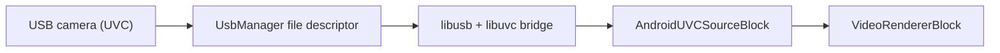

# Capture USB (UVC) Cameras on Android in C# and .NET

[Media Blocks SDK .Net](https://www.visioforge.com/media-blocks-sdk-net){ .md-button .md-button--primary target="_blank" } [Video Capture SDK .Net](https://www.visioforge.com/video-capture-sdk-net){ .md-button target="_blank" }

## Introduction

A USB Video Class (UVC) camera plugged into an Android phone over OTG is invisible to the standard Android camera API on most devices. `AndroidUVCSourceBlock` reaches it anyway: it talks to the camera through a bundled native libusb/libuvc bridge and pushes the frames into a `MediaBlocksPipeline`. It needs Android 9 (API level 28) or newer, the `android.permission.CAMERA` permission, and roughly 40 lines of C#.

This guide covers the whole path: why the normal API fails, the manifest and permission setup, the capture code, how a requested format is matched against what the camera offers, what USB 2.0 realistically delivers, and how to handle the camera being unplugged mid-stream.

## Why can't Camera2 see a USB camera on Android?

Android exposes USB cameras to the Camera2 API only through the **External Camera HAL**, an optional component that the device vendor has to build into the firmware. Many popular phones ship without it - on a Samsung Galaxy M55, for example, `pm list features` reports no `android.hardware.camera.external`, and the camera service lists only the built-in front and rear sensors. A UVC camera attached to such a phone is enumerated by the kernel, but no camera API will ever return it.

Two obvious workarounds also fail. The `/dev/video*` nodes the kernel creates belong to the `camera` group, which an ordinary app process is not a member of. And the Java `UsbDeviceConnection` API supports control, bulk, and interrupt transfers but **not isochronous** transfers - the transfer type UVC webcams use in practice.

That leaves one viable route, and it is the one this block takes: obtain the USB file descriptor from `UsbManager`, then drive the device from native code that can submit isochronous transfers.



## What you need

- **Android 9 (API level 28) or newer.** Set `<SupportedOSPlatformVersion>28.0</SupportedOSPlatformVersion>` in the `.csproj`.
- **A phone with USB host (OTG) support** and an OTG adapter or cable.
- **The `VisioForge.CrossPlatform.Core.Android` package**, which carries the native payload, plus `VisioForge.DotNet.MediaBlocks` and the `VisioForge.Core.Android.X10` project reference that every Android sample uses. See the [Android deployment guide](../../deployment-x/Android.md).

### Manifest entries

```xml
<!-- Android denies access to USB video class devices unless the app holds the camera
     permission, even though the Camera2 API is never used here. -->
<uses-permission android:name="android.permission.CAMERA" />
<!-- That permission otherwise makes a built-in camera an implied REQUIREMENT, which would
     hide the app from exactly the devices it targets: ones whose camera arrives over USB. -->
<uses-feature android:name="android.hardware.camera" android:required="false" />
<uses-feature android:name="android.hardware.camera.autofocus" android:required="false" />
<uses-feature android:name="android.hardware.usb.host" android:required="true" />
```

Keep `android.hardware.usb.host` at `required="true"` only if your whole app is useless without a USB camera - it is a Play Store filter too, and on `true` it hides the app from every device without USB host support.

!!! warning "The `required="false"` line is not optional"

    Declaring `android.permission.CAMERA` makes Google Play treat a built-in camera as a
    device requirement. Left implicit, that filters your app out of the store listing on
    devices that have no built-in camera - which includes much of the hardware most likely
    to need a USB camera in the first place.

## Requesting the two permissions

USB camera capture needs two separate grants, in this order.

**1. The runtime `CAMERA` permission.** Request it as usual:

```csharp
private const int CameraPermissionRequest = 1004;

protected override void OnCreate(Bundle savedInstanceState)
{
    base.OnCreate(savedInstanceState);

    RequestPermissions(new[] { Manifest.Permission.Camera }, CameraPermissionRequest);
}

public override void OnRequestPermissionsResult(
    int requestCode, string[] permissions, Android.Content.PM.Permission[] grantResults)
{
    base.OnRequestPermissionsResult(requestCode, permissions, grantResults);

    if (requestCode != CameraPermissionRequest)
    {
        return;
    }

    if (AndroidUVCDevices.HasCameraPermission())
    {
        _ = StartPreviewAsync();
    }
}
```

**2. Permission for the specific USB device**, which shows the system dialog:

```csharp
if (!await AndroidUVCDevices.RequestPermissionAsync(camera))
{
    // denied, dismissed, or unanswered for two minutes
    return;
}
```

`RequestPermissionAsync` returns `false` on denial, on a dismissed dialog, and after a two-minute timeout; it throws `OperationCanceledException` only when you cancel it through your own `CancellationToken`.

!!! danger "Missing CAMERA permission fails silently"

    Without `android.permission.CAMERA` granted, the USB permission request returns
    `false` **instantly and no dialog is ever shown**. The only clue is in logcat:
    `UsbUserPermissionManager: Camera permission required for USB video class devices`.
    Check `AndroidUVCDevices.HasCameraPermission()` first and you will never chase this.

## Capturing from the camera

With both permissions in hand, the capture itself is ordinary Media Blocks code. Note that these types are compiled only for the Android target framework, so in a MAUI or other multi-targeted project this code belongs in an Android-only file or inside `#if ANDROID`:

```csharp
using VisioForge.Core;
using VisioForge.Core.GStreamer.Android.UVC;
using VisioForge.Core.MediaBlocks;
using VisioForge.Core.MediaBlocks.Sources;
using VisioForge.Core.MediaBlocks.VideoRendering;
using VisioForge.Core.Types;
using VisioForge.Core.Types.Events;
using VisioForge.Core.Types.X.Sources.AndroidUVC;

// list the attached USB cameras
var cameras = AndroidUVCDevices.FindCameras();
if (cameras.Count == 0)
{
    SetStatus("No USB camera found. Connect one over OTG.");
    return;
}

var camera = cameras[0];

if (!await AndroidUVCDevices.RequestPermissionAsync(camera))
{
    SetStatus("Access to the USB camera was denied.");
    return;
}

_pipeline = new MediaBlocksPipeline();
_pipeline.OnError += Pipeline_OnError;
_pipeline.OnStop += Pipeline_OnStop;

var settings = new AndroidUVCSourceSettings
{
    Device = camera,
    Width = 1280,
    Height = 720,
    FrameRate = new VideoFrameRate(30),
};

_videoSource = new AndroidUVCSourceBlock(settings);
_videoRenderer = new VideoRendererBlock(_pipeline, _videoView) { IsSync = false };

_pipeline.Connect(_videoSource.Output, _videoRenderer.Input);

if (!await _pipeline.StartAsync())
{
    SetStatus("Unable to start. Another app may be using the camera.");

    // the camera was already claimed while building, so hand it back
    await DisposePipelineAsync();
    return;
}

SetStatus($"Streaming from {camera.ProductName}");
```

Note that `StartAsync` returns a `bool`. Ignoring it leaves you looking at a black preview with no idea why, so check it and dispose the pipeline when it fails - that is what releases the camera for the next attempt.

To find out whether capture is possible before you build anything, call `AndroidUVCSourceBlock.IsAvailable()`. It confirms the Android release is new enough, the elements every mode needs are present, and the native bridge loads. It deliberately does not probe `jpegdec`, which only an MJPEG mode needs, nor whether a camera is attached - `AndroidUVCSourceBlock.GetDevices()` answers the latter.

## Capturing with VideoCaptureCoreX

The same camera also works as a `VideoCaptureCoreX` video source, which is the shorter route when you want recording, network streaming, video effects or snapshots rather than a pipeline you assemble yourself. Assign the settings to `Video_Source` and the engine builds everything downstream:

```csharp
using VisioForge.Core.GStreamer.Android.UVC;
using VisioForge.Core.Types;
using VisioForge.Core.Types.X.Output;
using VisioForge.Core.Types.X.Sources.AndroidUVC;
using VisioForge.Core.VideoCaptureX;

var cameras = AndroidUVCDevices.FindCameras();
if (cameras.Count == 0 || !await AndroidUVCDevices.RequestPermissionAsync(cameras[0]))
{
    return;
}

_core = new VideoCaptureCoreX(_videoView);
_core.OnError += Core_OnError;

// a live camera has nothing to sync the recording branch to, and leaving it
// synced makes that branch wait on the clock until its queue fills and stalls
// the preview with it; a capture with audio sets Audio_Output_IsSync the same
// way, but this one is video-only
_core.Video_Output_IsSync = false;

_core.Video_Source = new AndroidUVCSourceSettings
{
    Device = cameras[0],
    Width = 1280,
    Height = 720,
    FrameRate = new VideoFrameRate(30),
};

_core.Video_Play = true;

// registered before StartAsync so the recording branch exists; autoStart false
// means nothing is written until StartCaptureAsync is called
_core.Outputs_Add(new MP4Output(placeholderPath), false);

await _core.StartAsync();

// later, when the user presses record
await _core.StartCaptureAsync(0, targetPath);
```

!!! warning "One recording per engine instance, today"

    `StartCaptureAsync` starts the output's own pipeline, and restarting a stopped one is a known
    open defect: the **second** call on the same output index returns `true` and writes no file at
    all - no exception, no `OnError`, nothing in the log. Check the return value *and* verify the file
    exists after `StopCaptureAsync`, and recreate the engine between recordings if your app needs to
    record more than once. Preview is unaffected.

Two differences from the Media Blocks route are worth knowing. `Video_Source_SwitchCamera` handles system cameras only, so switching to or from a USB camera means stopping and restarting the engine rather than a live swap. And `VideoCaptureCoreX` does not report an unplugged camera - see [Handling a disconnected camera](#handling-a-disconnected-camera).

!!! warning "The recording is video-only, and the phone microphone is not a workaround"

    A UVC video interface carries no audio, so nothing in this pipeline produces sound. Reaching for
    the phone microphone does not fix it on a typical webcam: a camera with a built-in mic also
    registers as a USB **audio** input, Android then prefers that input for recording, and it cannot
    be opened while the bridge is streaming from the same physical device. Adding the audio source
    fails the whole pipeline with `Internal data stream error` from `openslessrc`. Verified on a
    Galaxy M55 with a Logitech BRIO. A camera with no microphone leaves the phone mic as the default
    input, and then audio works normally.

## Which format should you request?

Request MJPEG resolutions, and treat your `Width`, `Height`, and `FrameRate` values as a preference rather than a command. The block matches them against the modes the camera actually advertises: nearest resolution by pixel count first, then MJPEG in preference to uncompressed formats, then the nearest frame rate. A mismatch produces a warning in logcat, not an error, so the pipeline starts on a format you did not ask for. The SDK logs the one it settled on as `USB camera ready: WxH@fps FORMAT` - check that line in logcat if the exact format matters. To decide from the camera's real capabilities rather than a guess, call `AndroidUVCDevices.GetModes(device)` after the USB permission is granted: it returns the resolutions, frame rates and formats you can actually pick from. Formats the SDK cannot stream - a camera's H.264 or NV12 modes - are left out, so the list is what is usable rather than everything the camera advertises. Set `Format` on the settings to ask for the format of the mode you picked; leaving it at `Unknown` favours MJPEG, which is normally what you want. It opens the camera to read them, so call it before starting capture.

The preference for MJPEG is deliberate and it matters more than the frame rate does. Over a USB 2.0 link, an uncompressed stream burns roughly 20 times the bandwidth of the same picture in MJPEG. A camera that advertises 1080p30 in MJPEG typically manages about **5 fps** uncompressed at that resolution - which looks like a broken pipeline rather than a bandwidth limit. If a camera offers only uncompressed formats it still works, just slowly.

## What USB 2.0 actually delivers

Most phones enumerate a USB camera at High Speed - 480 Mbps - rather than at the 5 Gbps a desktop USB 3 port provides, even when the port itself is USB 3 capable. Cameras report their capabilities per link speed, so the high-bandwidth modes are simply absent from the descriptors. A Logitech BRIO, which does 4K on a desktop, exposes no 4K mode at all on a phone; its practical ceiling there is **1080p30 or 720p60 in MJPEG**.

Plan for that when you pick a resolution. 720p30 is a safe default on any UVC camera, and it is what `AndroidUVCSourceSettings` uses if you leave the defaults alone.

## Handling a disconnected camera { #handling-a-disconnected-camera }

Someone will unplug the camera while your app is streaming. When that happens the block ends the stream, so a `MediaBlocksPipeline` raises `OnStop`:

```csharp
private void Pipeline_OnError(object sender, ErrorsEventArgs e)
{
    SetStatus(e.Message);
}

private void Pipeline_OnStop(object sender, StopEventArgs e)
{
    SetStatus("The camera was disconnected.");
}
```

Two details are worth knowing. The renderer keeps displaying the last frame it received, so the preview does not go blank on its own - clear or hide your video view in this handler. And a camera pulled out mid-frame delivers a partial frame, which decodes into visible noise, so that frozen last frame may look corrupted. Hiding the view avoids showing it at all.

Do not dispose the pipeline from inside this handler if your handler runs on the device callback thread; tear down from your own thread - for example from the activity's `OnDestroy`:

```csharp
private async Task DisposePipelineAsync()
{
    if (_pipeline == null)
    {
        return;
    }

    _pipeline.OnError -= Pipeline_OnError;
    _pipeline.OnStop -= Pipeline_OnStop;

    await _pipeline.DisposeAsync();
    _pipeline = null;
}

protected override async void OnDestroy()
{
    // first, before anything that can await - see the note below
    base.OnDestroy();

    try
    {
        await DisposePipelineAsync();
    }
    catch (Exception ex)
    {
        Log.Error(TAG, ex.ToString());
    }

    VisioForgeX.DestroySDK();
}
```

!!! warning "`base.OnDestroy()` has to come first"

    Android checks that the base implementation ran by the time `OnDestroy` returns, and an `await`
    returns to the runtime long before the method finishes. Calling it last - after awaiting the
    teardown - throws `android.util.SuperNotCalledException: Activity did not call through to
    super.onDestroy()` and kills the process. Call it first; the continuation still runs and
    disposes the pipeline afterwards.

With `VideoCaptureCoreX` there is no such event. The engine raises `OnStop` from its own stop path and does not observe a stream that ends on its own, so an unplugged camera never reaches `OnStop`. The source does report it through `OnError`, but only once the frames have stopped arriving for a few seconds - the preview is already frozen by then, and a recording in progress is still open. Subscribe to Android's `ACTION_USB_DEVICE_DETACHED` broadcast as well, which arrives the moment the cable comes out: confirm that your camera is the device that went away, then stop the capture and the engine:

```csharp
// once the pipeline is running
RegisterReceiver(
    new UsbDetachReceiver(OnUsbDetached),
    new IntentFilter(UsbManager.ActionUsbDeviceDetached),
    ReceiverFlags.NotExported);
```

Both members belong to your activity - the handler, and the receiver that forwards the broadcast to it:

```csharp
private async void OnUsbDetached()
{
    // the broadcast carries no usable device on current Android levels, but an
    // unplugged camera stops being enumerated - so ignore every other device
    if (AndroidUVCDevices.FindCameras().Any(c => c.DeviceName == _camera.DeviceName))
    {
        return;
    }

    await _core.StopCaptureAsync(0);
    await _core.StopAsync();
}

private class UsbDetachReceiver : BroadcastReceiver
{
    private readonly Action _onDetached;

    public UsbDetachReceiver(Action onDetached)
    {
        _onDetached = onDetached;
    }

    public override void OnReceive(Context context, Intent intent)
    {
        _onDetached();
    }
}
```

Stopping the capture first is what closes the recording properly. The frames already written are flushed either way, so the file stays playable, but the engine keeps thinking it is running until you stop it.

## Troubleshooting

| What you see | What it means |
|---|---|
| USB permission denied instantly, no dialog | `android.permission.CAMERA` is not granted. Logcat: `Camera permission required for USB video class devices`. |
| `USB camera capture requires Android 9 (API 28) or later.` | The device is older than API 28. Check `AndroidUVCDevices.IsSupportedPlatform()` before offering the feature. |
| `No permission for the USB camera. Call AndroidUVCDevices.RequestPermissionAsync first.` | The device grant is missing; `StartAsync` was called too early. |
| `The camera advertises no usable video modes.` | The camera exposes neither MJPEG nor YUY2 on this link. |
| `StartAsync` returns `false`, logcat mentions an invalid mode | Another process holds the camera. Only one application can stream from a UVC device at a time. |
| `Requested 1920x1080@30 is not offered; using 1280x720@30.` | Informational: the nearest advertised mode was selected instead. |
| No frames arrive after a re-plug, pipeline stays paused | A transient USB condition after re-plugging. Restart the capture. |
| `Unable to create the jpegdec element.` | The GStreamer payload has no JPEG decoder, so an MJPEG mode cannot be built. `IsAvailable()` does not cover this - it returns `true` because uncompressed modes would still work. |

## Frequently Asked Questions

### Does this work on any Android phone?

It works on any device running Android 9 (API level 28) or newer that supports USB host mode, which is most phones and tablets sold since 2018. Unlike the Camera2 route, it does not depend on the vendor shipping the External Camera HAL, so it works on hardware where the built-in camera API cannot see a USB camera at all. Two things are still required from the device: OTG support in the hardware, and enough USB bus power for the camera - a camera drawing more than the port supplies will fail to enumerate. Call `AndroidUVCDevices.IsSupportedPlatform()` to check the Android version and `AndroidUVCSourceBlock.IsAvailable()` to confirm the native bridge loaded before you offer the feature in your UI.

### Do I need root access?

No. The whole point of this design is that it runs as an ordinary app. Root would be one way to open the `/dev/video*` nodes the kernel creates for a UVC camera, since those belong to the `camera` group that app processes are not in - but that is not the route taken here. Instead the app asks `UsbManager` for permission, receives a file descriptor for the device, and hands that descriptor to the native bridge, which submits the isochronous USB transfers the camera needs. Everything happens through documented Android APIs and the user's own consent, so the app installs and runs normally, and can ship on Google Play.

### Can I record to a file instead of previewing?

Yes. `AndroidUVCSourceBlock` is a normal Media Blocks source with a single video output pad, so it connects to anything the SDK provides: an [MP4 output](../../mediablocks/Outputs/index.md), an [RTMP or SRT sink](../../mediablocks/Sinks/index.md) for streaming, or a video processing chain. Connect its `Output` pad to an encoder or output block instead of - or in addition to - the renderer. Frames arrive decoded, so no extra decoding step is needed. The block has no audio pad, so an MP4 recorded from it alone is video-only and an RTMP push without audio is rejected by many services. Adding a separate audio source is the answer, but read the warning above first: on a camera that has its own microphone, Android prefers that USB audio input and it cannot be captured while the camera is being streamed. Bear in mind the bandwidth ceiling when choosing a recording resolution: 720p30 is comfortable, 1080p30 is the practical maximum on most phones.

### Why is MJPEG preferred over uncompressed video?

Because uncompressed video does not fit through a High Speed USB link at any useful frame rate. A 1280x720 frame in YUY2 is about 1.8 MB, so 30 fps needs roughly 440 Mbps. The bus itself runs at 480 Mbps, but the real limit is lower: a high-bandwidth isochronous endpoint carries at most 3072 bytes per microframe, or about 24.5 MB/s - roughly 196 Mbps. Cameras solve this by advertising uncompressed formats only at very low rates: a camera offering 1080p30 in MJPEG typically caps uncompressed 1080p at about 5 fps. Selecting the uncompressed mode therefore looks like a broken or stalled pipeline rather than a deliberate trade-off. Within a resolution the mode selector prefers MJPEG even when its frame rate is further from what you requested, and the pipeline decodes the JPEG frames for you. Resolution is matched first, though, so a camera that offers 1080p only as uncompressed video will still hand you that slow mode if you ask for 1080p - request a resolution the camera offers in MJPEG.

### Which native libraries are included, and under what licence?

Two, both shipped inside the `VisioForge.CrossPlatform.Core.Android` package for all four Android ABIs. **libusb 1.0.30** provides the USB transport and is licensed under the **LGPL v2.1 or later**; it ships as a separate shared object, `libusb1.0.so`, dynamically linked and therefore replaceable, as that licence requires. **libuvc** provides the UVC protocol layer and is licensed under the permissive **BSD 3-Clause** licence; it is compiled into `libVisioForge_UVC.so`. Neither library is patched. The complete notices, including both full licence texts and the exact versions, ship with the package as `THIRD-PARTY-NOTICES.txt`.

## Related documentation

- [USB (UVC) Camera Source Block](../../mediablocks/Sources/index.md#usb-uvc-camera-source-block) - the block reference
- [Android deployment guide](../../deployment-x/Android.md) - packages, permissions, and native payload
- [Record another app's audio on Android](android-audio-playback-capture.md) - another Android-specific capture flow
