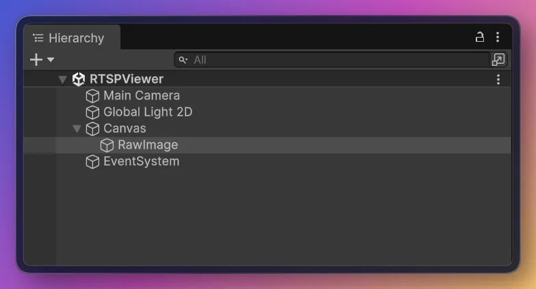
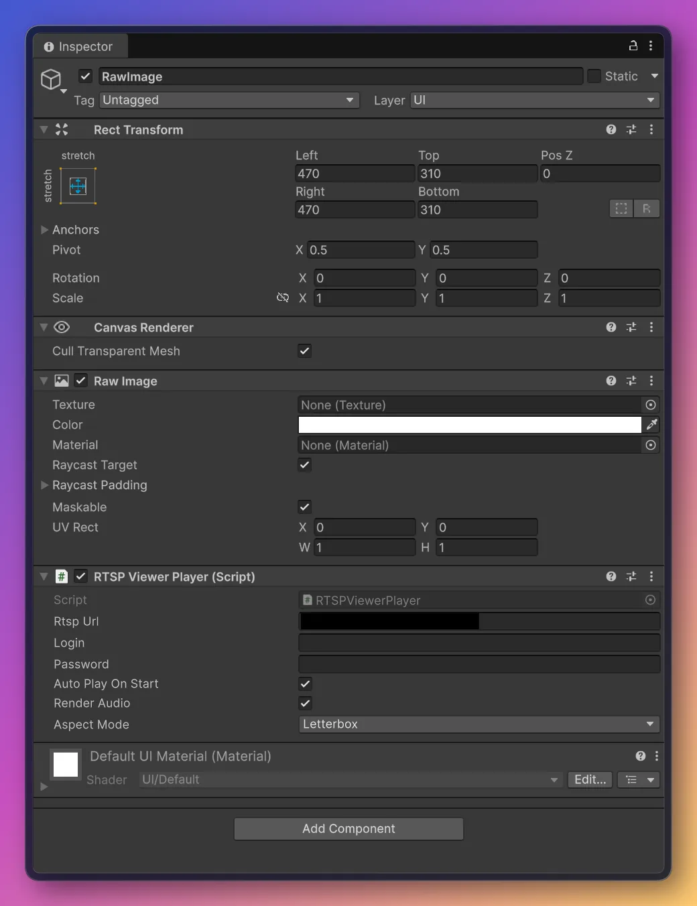
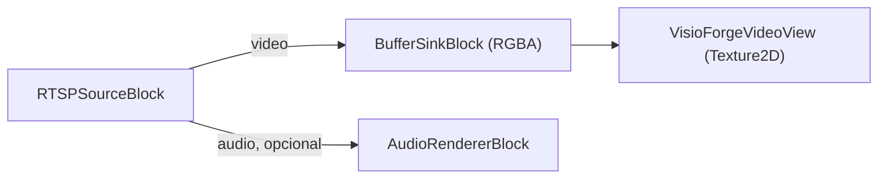
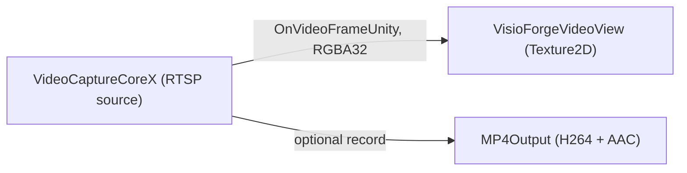

# Ver una cámara RTSP en Unity

[Media Blocks SDK .Net](https://www.visioforge.com/media-blocks-sdk-net){ .md-button .md-button--primary target="_blank" }
[Video Capture SDK .Net](https://www.visioforge.com/video-capture-sdk-net){ .md-button target="_blank" }

Hay dos formas de visualizar un stream en vivo de cámara RTSP / IP en Unity, y el paquete incluye
una escena lista para cada una. Ambas renderizan en un `RawImage` de Unity y se ejecutan en
**Windows**, **Android**, **macOS Standalone** e **iOS**. Este artículo asume que ya has importado
el paquete de Unity y aplicado los dos ajustes de proyecto requeridos — consulta primero
[Usar VisioForge en Unity](index.md).

## Dos escenas, dos motores

| Escena | Motor | Nivel | Ideal para |
|---|---|---|---|
| **`RTSPViewer`** | `MediaBlocksPipeline` (Media Blocks SDK) | Bajo nivel | Control total de la canalización — eliges tus propios sinks, efectos y salidas. |
| **`IPCameraX`** | `VideoCaptureCoreX` (Video Capture SDK) | Alto nivel | Motor de captura listo para usar — añade salidas de grabación, instantáneas, enrutamiento de audio y superposiciones sobre el mismo stream. |

Elige `RTSPViewer` cuando quieras montar la canalización tú mismo; elige `IPCameraX` cuando quieras
un motor de captura que además pueda grabar mientras previsualiza. Ambas alimentan el mismo
`VisioForgeVideoView` incluido, así que la subida de textura, el manejo de aspecto y el volteo
vertical son idénticos.

## RTSPViewer — la canalización de Media Blocks

La escena **`RTSPViewer`** muestra un stream en vivo de cámara RTSP / IP con el **Media Blocks
SDK .NET** de bajo nivel, renderizado en un `RawImage`.

### Ejecutar la escena RTSPViewer

1. En la ventana **Project** abre `Assets/Scenes/RTSPViewer.unity` (haz doble clic en ella).
2. En la **Hierarchy** selecciona el GameObject **RawImage**. El componente `RTSPViewerPlayer` está
   adjunto a él.
3. En el **Inspector**, establece **Rtsp Url** (y **Login** / **Password** si la cámara requiere
   autenticación).
4. Pulsa **▶ Play** — el stream se renderiza en la vista Game.





### Campos del Inspector (RTSPViewerPlayer)

| Campo | Predeterminado | Descripción |
|---|---|---|
| **Rtsp Url** | `rtsp://192.168.1.10:554/stream` | URL RTSP de la cámara/stream. |
| **Login** | *(vacío)* | Nombre de usuario RTSP — déjalo vacío si el stream no necesita autenticación. |
| **Password** | *(vacío)* | Contraseña RTSP. |
| **Auto Play On Start** | `true` | Conectar automáticamente en `Start()`. |
| **Render Audio** | `true` | Renderizar audio a través del dispositivo predeterminado del sistema. |
| **Aspect Mode** | `Letterbox` | Cómo se ajusta el video al `RawImage`: `Stretch`, `Letterbox` o `Crop`. |

### La canalización de RTSPViewer

`RTSPViewerPlayer` construye este pipeline:



El núcleo de `PlayAsync`:

```csharp
_pipeline = new MediaBlocksPipeline();

// readInfo:false omite el pre-sondeo del medio (puede fallar en el runtime de Unity, y
// sondear un stream en vivo añade latencia de conexión); el codec se negocia al iniciar la reproducción.
var settings = await RTSPSourceSettings.CreateAsync(
    new Uri(rtspUrl), login ?? string.Empty, password ?? string.Empty,
    audioEnabled: _renderAudio, readInfo: false);

_source = new RTSPSourceBlock(settings);

_videoSink = new BufferSinkBlock(VideoFormatX.RGBA);
_videoSink.OnVideoFrameBuffer += _videoView.OnFrameBuffer;
_pipeline.Connect(_source.VideoOutput, _videoSink.Input);

if (_renderAudio && _source.AudioOutput != null)
{
    _audioRenderer = new AudioRendererBlock();
    _pipeline.Connect(_source.AudioOutput, _audioRenderer.Input);
}

await _pipeline.StartAsync();
```

## IPCameraX — el motor VideoCaptureCoreX

La escena **`IPCameraX`** visualiza la misma cámara RTSP / IP con el motor de alto nivel
**`VideoCaptureCoreX`**. Además de la vista previa en vivo, puede grabar a MP4 y expone
instantáneas, enrutamiento de audio y superposiciones — las funciones de motor de captura que la
canalización `RTSPViewer` construida a mano no proporciona de fábrica.

### El evento OnVideoFrameUnity

`VideoCaptureCoreX` expone el evento exclusivo de Unity **`OnVideoFrameUnity`**: cada fotograma llega
como **RGBA32** empaquetado de forma compacta (`Stride == Width * 4`), listo para
`Texture2D.LoadRawTextureData` sin conversión. Suscríbete antes de `StartAsync`.

### Ejecutar la escena IPCameraX

1. En la ventana **Project** abre `Assets/Scenes/SampleScene.unity`.
2. En la **Hierarchy** selecciona el GameObject **RawImage** — el componente `IPCameraXViewer` está
   adjunto a él.
3. En el **Inspector** establece **Rtsp Url** (y **Login** / **Password** si la cámara los necesita).
4. Pulsa **▶ Play** — el stream de la cámara aparece en la vista Game.

### Campos del Inspector (IPCameraXViewer)

| Campo | Predeterminado | Descripción |
|---|---|---|
| **Rtsp Url** | `rtsp://192.168.1.10:554/stream` | URL de cámara RTSP / HTTP. |
| **Login** | *(vacío)* | Nombre de usuario de la cámara (vacío para streams abiertos). |
| **Password** | *(vacío)* | Contraseña de la cámara (vacío para streams abiertos). |
| **Render Audio** | `false` | Solicitar y renderizar el stream de audio de la cámara, si está presente. |
| **Record To File** | `false` | Grabar el stream a MP4 mientras se previsualiza. |
| **Output Path** | *(vacío)* | Ruta MP4. Vacío → `<persistentDataPath>/ipcamera.mp4`. |
| **Auto Play On Start** | `true` | Conectar automáticamente en `Start()`. |
| **Aspect Mode** | `Letterbox` | Cómo se ajusta el video en el `RawImage`. |

### La canalización de IPCameraX



El núcleo de `PlayAsync`:

```csharp
_capture = new VideoCaptureCoreX();

// readInfo:false omite el pre-sondeo del medio (puede fallar bajo el runtime de Unity y añade latencia).
var rtspSettings = await RTSPSourceSettings.CreateAsync(
    new Uri(rtspUrl), login, password, audioEnabled: renderAudio, readInfo: false);
_capture.Video_Source = rtspSettings;

// Fotogramas RGBA32 listos para textura directamente hacia la vista.
_capture.OnVideoFrameUnity += _videoView.OnFrameBuffer;

if (recordToFile)
    _capture.Outputs_Add(new MP4Output(outputPath), autostart: true);

await _capture.StartAsync();
```

## Úsalo en tu propia escena

Añade un **Canvas → Raw Image** (*GameObject → UI → Raw Image*), selecciónalo, **Add Component →**
`RTSPViewerPlayer` (canalización Media Blocks) o `IPCameraXViewer` (motor VideoCaptureCoreX),
establece **Rtsp Url** y pulsa **▶ Play**. El diseño del `RawImage`, el manejo del aspecto y el
volteo vertical los gestiona el `VisioForgeVideoView` incluido. Para reproducción de archivos
locales en lugar de RTSP, usa `MediaBlocksPlayer` o `MediaPlayerXPlayer` (consulta
[Reproducir un archivo multimedia](simple-player.md)).

## Ajustes de build y permisos de red por plataforma

Ambas escenas se ejecutan sin cambios en cada plataforma soportada — pero cada target tiene sus
propios requisitos de permisos de red y de Build Profile.

=== "Windows"

    | Ajuste | Valor |
    |---|---|
    | Architecture | x86_64 |
    | Api Compatibility Level | `.NET Standard 2.1` |
    | Scripting Backend | Mono *(predeterminado)* o IL2CPP |

    El TCP / UDP saliente al puerto RTSP de la cámara funciona sin declaración especial.
    Windows Defender Firewall puede preguntar la primera vez que el player vincule un socket
    UDP — acepta el prompt de red privada. Consulta [Compilar para Windows](windows.md) para
    la lista completa.

=== "Android"

    | Ajuste | Valor |
    |---|---|
    | Architecture | arm64-v8a (**desmarca ARMv7**) |
    | Api Compatibility Level | `.NET Standard 2.1` |
    | Scripting Backend | **IL2CPP** (obligatorio) |
    | Internet Access | **Require** |

    `AndroidManifest.xml` debe declarar:

    ```xml
    <uses-permission android:name="android.permission.INTERNET" />
    <uses-permission android:name="android.permission.ACCESS_NETWORK_STATE" />
    ```

    Para RTSP sobre UDP en una red pública, Android 9+ (API 28+) también requiere
    `android:usesCleartextTraffic="true"` en el elemento `<application>` si la cámara solo es
    alcanzable vía RTSP / RTP plano sin TLS. Consulta [Compilar para Android](android.md) para
    la lista completa.

=== "macOS"

    | Ajuste | Valor |
    |---|---|
    | Architecture | Universal arm64 + x86_64 |
    | Api Compatibility Level | `.NET Standard 2.1` |
    | Scripting Backend | Mono *(predeterminado)* o IL2CPP |

    No hay entradas de manifiesto adicionales — las conexiones salientes son irrestrictas por
    defecto. Para distribución por Mac App Store, añade el entitlement
    **com.apple.security.network.client** al bundle firmado para que el App Sandbox permita
    acceso de red saliente. Consulta [Compilar para macOS](macos.md) para notas de firma de
    código y notarización.

=== "iOS"

    | Ajuste | Valor |
    |---|---|
    | Architecture | dispositivo arm64 (Simulator no soportado) |
    | Api Compatibility Level | `.NET Standard 2.1` |
    | Scripting Backend | **IL2CPP** (obligatorio) |

    iOS 14+ bloquea el primer intento de conexión a cualquier dirección de red local hasta que
    tu app declare por qué. Añade a `Info.plist`:

    ```xml
    <key>NSLocalNetworkUsageDescription</key>
    <string>Esta app reproduce video de cámaras IP locales en tu red.</string>
    ```

    Para URLs `rtsp://` planas (sin TLS) o `http://`, añade una excepción de App Transport
    Security:

    ```xml
    <key>NSAppTransportSecurity</key>
    <dict>
        <key>NSAllowsArbitraryLoads</key>
        <true/>
    </dict>
    ```

    Las URLs públicas `https://` / `rtsps://` con certificados firmados por CA no necesitan
    excepción ATS. Consulta [Compilar para iOS](ios.md) para el flujo Xcode completo.

## Auto-reconexión

Ambos motores se reconectan automáticamente cuando el stream cae, con backoff entre intentos — sin
máquina de estado manual en tu script. Para `RTSPViewer`, sube el timeout en los ajustes
`RTSPSourceSettings` subyacentes antes de pasarlos a `RTSPSourceBlock` si necesitas una ventana más
larga; `IPCameraX` (`VideoCaptureCoreX`) gestiona los reinicios de la cámara y las breves
interrupciones de la misma forma.

## Preguntas frecuentes

### ¿Qué escena debería usar — RTSPViewer o IPCameraX?

Usa **`RTSPViewer`** (`MediaBlocksPipeline`) para una canalización ligera de solo visualización que
montas tú mismo. Usa **`IPCameraX`** (`VideoCaptureCoreX`) cuando además quieras grabación a MP4,
instantáneas, enrutamiento de audio o superposiciones sobre el mismo stream — vienen listas en el
motor de captura.

### ¿Cómo proporciono las credenciales de la cámara?

Establece los campos **Login** y **Password** en cualquiera de los componentes. Déjalos vacíos para
streams que no necesitan autenticación; las credenciales se envían a la cámara, no se incrustan en
la URL.

### ¿Qué formato de URL debo usar?

La forma estándar `rtsp://host:port/path` que expone tu cámara, p. ej.
`rtsp://192.168.1.21:554/Streaming/Channels/101` (Hikvision) o
`rtsp://192.168.1.22:554/cam/realmonitor?channel=1&subtype=0` (Dahua). Consulta el manual de tu
cámara para conocer la ruta exacta del stream.

### ¿Graba la cámara?

`IPCameraX` sí — activa **Record To File** para añadir un `MP4Output` junto a la vista previa.
`RTSPViewer` es solo de visualización; añade tú mismo una rama de grabación a su canalización si la
necesitas.

### ¿Qué ocurre si la cámara no tiene audio?

Ambas funcionan solo con video. La rama de audio se conecta únicamente cuando el stream realmente
lleva audio, por lo que una cámara solo de video no necesita ningún cambio.

### ¿Puedo mostrar varias cámaras a la vez?

Sí. Añade un `RawImage` con su propio `RTSPViewerPlayer` o `IPCameraXViewer` para cada cámara; cada
uno construye un pipeline independiente.

## Véase también

- [Usar VisioForge en Unity](index.md) — visión general del paquete, configuración y cómo funciona el renderizado
- [Reproducir un archivo multimedia en Unity](simple-player.md) — las escenas de reproducción de archivos locales / URL
- [Capturar una webcam en Unity](video-capture-x.md) — captura de cámara local (Windows / macOS)
- [Guía de streaming RTSP](../network-streaming/rtsp.md) — RTSP en los SDKs .NET de VisioForge
- [Directorio de marcas de cámaras IP](../../camera-brands/index.md) — URLs y ajustes de cámaras probadas
- [Reproductor RTSP de Media Blocks en C#](../../mediablocks/Guides/rtsp-player-csharp.md) — un ejemplo RTSP fuera de Unity
