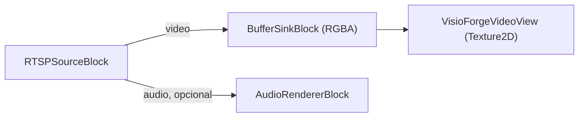

# Ver una cámara RTSP en Unity

[Media Blocks SDK .Net](https://www.visioforge.com/media-blocks-sdk-net){ .md-button .md-button--primary target="_blank" }

La escena **`RTSPViewer`** muestra un stream en vivo de cámara RTSP / IP con el **Media Blocks SDK
.NET**, renderizado en un `RawImage` de Unity. Este artículo asume que ya has importado el paquete de
Unity y aplicado los dos ajustes de proyecto requeridos — consulta primero
[Usar VisioForge en Unity](index.md).

## Ejecutar el ejemplo

1. En la ventana **Project** abre `Assets/Scenes/RTSPViewer.unity` (haz doble clic en ella).
2. En la **Hierarchy** selecciona el GameObject **RawImage**. El componente `RTSPViewerPlayer` está
   adjunto a él.
3. En el **Inspector**, establece **Rtsp Url** (y **Login** / **Password** si la cámara requiere
   autenticación).
4. Pulsa **▶ Play** — el stream se renderiza en la vista Game.


## Campos del Inspector

| Campo | Predeterminado | Descripción |
|---|---|---|
| **Rtsp Url** | `rtsp://192.168.1.10:554/stream` | URL RTSP de la cámara/stream. |
| **Login** | *(vacío)* | Nombre de usuario RTSP — déjalo vacío si el stream no necesita autenticación. |
| **Password** | *(vacío)* | Contraseña RTSP. |
| **Auto Play On Start** | `true` | Conectar automáticamente en `Start()`. |
| **Render Audio** | `true` | Renderizar audio a través del dispositivo predeterminado del sistema. |
| **Aspect Mode** | `Letterbox` | Cómo se ajusta el video al `RawImage`: `Stretch`, `Letterbox` o `Crop`. |

## El pipeline

`RTSPViewerPlayer` construye este pipeline:



El núcleo de `PlayAsync`:

```csharp
_pipeline = new MediaBlocksPipeline();

// readInfo:false omite el pre-sondeo del medio (puede fallar en el runtime de Unity, y
// sondear un stream en vivo añade latencia de conexión); el codec se negocia al iniciar la reproducción.
var settings = await RTSPSourceSettings.CreateAsync(
    new Uri(rtspUrl), login ?? string.Empty, password ?? string.Empty,
    audioEnabled: _renderAudio, readInfo: false);

_source = new RTSPSourceBlock(settings);

_videoSink = new BufferSinkBlock(VideoFormatX.RGBA);
_videoSink.OnVideoFrameBuffer += _videoView.OnFrameBuffer;
_pipeline.Connect(_source.VideoOutput, _videoSink.Input);

if (_renderAudio && _source.AudioOutput != null)
{
    _audioRenderer = new AudioRendererBlock();
    _pipeline.Connect(_source.AudioOutput, _audioRenderer.Input);
}

await _pipeline.StartAsync();
```

## Úsalo en tu propia escena

Añade un **Canvas → Raw Image** (*GameObject → UI → Raw Image*), selecciónalo, **Add Component →**
`RTSPViewerPlayer`, establece **Rtsp Url** y pulsa **▶ Play**. El diseño del `RawImage`, el manejo
del aspecto y el volteo vertical los gestiona el `VisioForgeVideoView` incluido. Para reproducción
de archivos locales en lugar de RTSP, usa `MediaBlocksPlayer` (consulta
[Reproducir un archivo multimedia](simple-player.md)).

## Preguntas frecuentes

### ¿Cómo proporciono las credenciales de la cámara?

Establece los campos **Login** y **Password**. Déjalos vacíos para streams que no necesitan
autenticación; las credenciales se envían a la cámara, no se incrustan en la URL.

### ¿Qué formato de URL debo usar?

La forma estándar `rtsp://host:port/path` que expone tu cámara, p. ej.
`rtsp://192.168.1.21:554/Streaming/Channels/101` (Hikvision) o
`rtsp://192.168.1.22:554/cam/realmonitor?channel=1&subtype=0` (Dahua). Consulta el manual de tu
cámara para conocer la ruta exacta del stream.

### ¿Qué ocurre si la cámara no tiene audio?

Funciona solo con video. La rama de audio se conecta únicamente cuando el stream realmente lleva
audio, por lo que una cámara solo de video no necesita ningún cambio.

### ¿Puedo mostrar varias cámaras a la vez?

Sí. Añade un `RawImage` con su propio `RTSPViewerPlayer` para cada cámara; cada uno construye un
pipeline independiente.

## Véase también

- [Usar VisioForge en Unity](index.md) — visión general del paquete, configuración y cómo funciona el renderizado
- [Reproducir un archivo multimedia en Unity](simple-player.md) — el ejemplo de reproducción de archivos
- [Guía de streaming RTSP](../network-streaming/rtsp.md) — RTSP en los SDKs .NET de VisioForge
- [Directorio de marcas de cámaras IP](../../camera-brands/index.md) — URLs y ajustes de cámaras probadas
- [Reproductor RTSP de Media Blocks en C#](../../mediablocks/Guides/rtsp-player-csharp.md) — un ejemplo RTSP fuera de Unity
