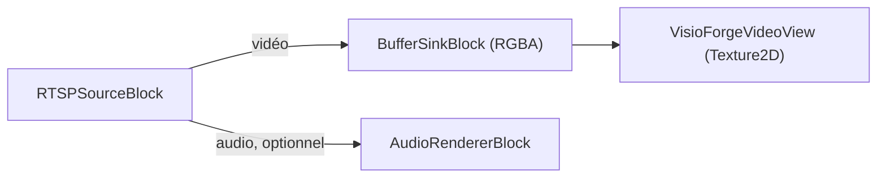

# Afficher une caméra RTSP dans Unity

[Media Blocks SDK .Net](https://www.visioforge.com/media-blocks-sdk-net){ .md-button .md-button--primary target="_blank" }

La scène **`RTSPViewer`** affiche un flux de caméra RTSP / IP en direct avec le **Media Blocks
SDK .NET**, rendu dans un `RawImage` Unity. La même scène s'exécute sur chaque plateforme
prise en charge par le paquet — **Windows**, **Android**, **macOS Standalone** et **iOS** —
avec les réglages de build et les exigences de permissions réseau par plateforme indiqués
ci-dessous. Cet article suppose que vous avez importé le paquet Unity et appliqué les deux
réglages de projet requis — consultez d'abord [Utiliser VisioForge dans Unity](index.md).

## Lancer l'exemple

1. Dans la fenêtre **Project**, ouvrez `Assets/Scenes/RTSPViewer.unity` (double-cliquez dessus).
2. Dans la **Hierarchy**, sélectionnez le GameObject **RawImage**. Le composant `RTSPViewerPlayer`
   y est attaché.
3. Dans l'**Inspector**, définissez **Rtsp Url** (et **Login** / **Password** si la caméra requiert
   une authentification).
4. Appuyez sur **▶ Play** — le flux s'affiche dans la vue Game.


## Champs de l'Inspector

| Champ | Valeur par défaut | Description |
|---|---|---|
| **Rtsp Url** | `rtsp://192.168.1.10:554/stream` | URL RTSP de la caméra/du flux. |
| **Login** | *(vide)* | Nom d'utilisateur RTSP — laissez vide si le flux ne nécessite pas d'authentification. |
| **Password** | *(vide)* | Mot de passe RTSP. |
| **Auto Play On Start** | `true` | Se connecter automatiquement dans `Start()`. |
| **Render Audio** | `true` | Diffuser l'audio via le périphérique par défaut du système. |
| **Aspect Mode** | `Letterbox` | Manière d'adapter la vidéo au `RawImage` : `Stretch`, `Letterbox` ou `Crop`. |

## Le pipeline

`RTSPViewerPlayer` construit ce pipeline :



Le cœur de `PlayAsync` :

```csharp
_pipeline = new MediaBlocksPipeline();

// readInfo:false ignore le pré-sondage du média (il peut échouer sous le runtime Unity, et
// sonder un flux en direct ajoute de la latence de connexion) ; le codec est négocié au démarrage de la lecture.
var settings = await RTSPSourceSettings.CreateAsync(
    new Uri(rtspUrl), login ?? string.Empty, password ?? string.Empty,
    audioEnabled: _renderAudio, readInfo: false);

_source = new RTSPSourceBlock(settings);

_videoSink = new BufferSinkBlock(VideoFormatX.RGBA);
_videoSink.OnVideoFrameBuffer += _videoView.OnFrameBuffer;
_pipeline.Connect(_source.VideoOutput, _videoSink.Input);

if (_renderAudio && _source.AudioOutput != null)
{
    _audioRenderer = new AudioRendererBlock();
    _pipeline.Connect(_source.AudioOutput, _audioRenderer.Input);
}

await _pipeline.StartAsync();
```

## L'utiliser dans votre propre scène

Ajoutez un **Canvas → Raw Image** (*GameObject → UI → Raw Image*), sélectionnez-le, **Add Component →**
`RTSPViewerPlayer`, définissez **Rtsp Url**, puis appuyez sur **▶ Play**. La disposition du
`RawImage`, la gestion de l'aspect et le retournement vertical sont pris en charge par le
`VisioForgeVideoView` fourni. Pour la lecture de fichiers locaux plutôt que le RTSP, utilisez
`MediaBlocksPlayer` (voir [Lire un fichier multimédia](simple-player.md)).

## Réglages de build et permissions réseau par plateforme

`RTSPViewer` s'exécute sans modification sur chaque plateforme prise en charge — mais chaque
cible a ses propres exigences de permissions réseau et de Build Profile.

=== "Windows"

    | Réglage | Valeur |
    |---|---|
    | Architecture | x86_64 |
    | Api Compatibility Level | `.NET Standard 2.1` |
    | Scripting Backend | Mono *(par défaut)* ou IL2CPP |

    Le TCP / UDP sortant vers le port RTSP de la caméra fonctionne sans déclaration
    spéciale. Windows Defender Firewall peut demander la première fois que le player attache
    un socket UDP — acceptez l'invite réseau privé. Voir
    [Compilation pour Windows](windows.md) pour la checklist complète.

=== "Android"

    | Réglage | Valeur |
    |---|---|
    | Architecture | arm64-v8a (**décochez ARMv7**) |
    | Api Compatibility Level | `.NET Standard 2.1` |
    | Scripting Backend | **IL2CPP** (obligatoire) |
    | Internet Access | **Require** |

    `AndroidManifest.xml` doit déclarer :

    ```xml
    <uses-permission android:name="android.permission.INTERNET" />
    <uses-permission android:name="android.permission.ACCESS_NETWORK_STATE" />
    ```

    Pour RTSP sur UDP sur un réseau public, Android 9+ (API 28+) nécessite aussi
    `android:usesCleartextTraffic="true"` sur l'élément `<application>` si la caméra n'est
    joignable que via RTSP / RTP plat sans TLS. Voir [Compilation pour Android](android.md)
    pour la checklist complète.

=== "macOS"

    | Réglage | Valeur |
    |---|---|
    | Architecture | Universel arm64 + x86_64 |
    | Api Compatibility Level | `.NET Standard 2.1` |
    | Scripting Backend | Mono *(par défaut)* ou IL2CPP |

    Aucune entrée de manifeste supplémentaire — les connexions sortantes sont
    non-restreintes par défaut. Pour la distribution Mac App Store, ajoutez l'entitlement
    **com.apple.security.network.client** au bundle signé pour que l'App Sandbox autorise
    l'accès réseau sortant. Voir [Compilation pour macOS](macos.md) pour les notes de
    signature de code et notarisation.

=== "iOS"

    | Réglage | Valeur |
    |---|---|
    | Architecture | appareil arm64 (Simulator non pris en charge) |
    | Api Compatibility Level | `.NET Standard 2.1` |
    | Scripting Backend | **IL2CPP** (obligatoire) |

    iOS 14+ bloque la première tentative de connexion à toute adresse réseau local jusqu'à
    ce que votre app déclare pourquoi. Ajoutez à `Info.plist` :

    ```xml
    <key>NSLocalNetworkUsageDescription</key>
    <string>Cette application diffuse des vidéos à partir de caméras IP locales sur votre réseau.</string>
    ```

    Pour les URLs `rtsp://` plates (sans TLS) ou `http://`, ajoutez une exception App
    Transport Security :

    ```xml
    <key>NSAppTransportSecurity</key>
    <dict>
        <key>NSAllowsArbitraryLoads</key>
        <true/>
    </dict>
    ```

    Les URLs publiques `https://` / `rtsps://` avec des certificats signés par CA n'ont pas
    besoin d'exception ATS. Voir [Compilation pour iOS](ios.md) pour le flux Xcode complet.

## Auto-reconnexion

`RTSPSourceBlock` se reconnecte automatiquement quand le flux tombe, avec backoff entre les
tentatives. Le comportement est le même sur chaque plateforme — pas de machine d'état
manuelle dans votre script. Si le flux reste déconnecté plus longtemps que votre timeout,
augmentez-le dans les réglages de la source sous-jacente avant de les passer à
`RTSPSourceBlock`.

## Foire aux questions

### Comment fournir les identifiants de la caméra ?

Renseignez les champs **Login** et **Password**. Laissez-les vides pour les flux qui ne nécessitent
aucune authentification ; les identifiants sont envoyés à la caméra, ils ne sont pas intégrés à
l'URL.

### Quel format d'URL dois-je utiliser ?

La forme standard `rtsp://host:port/path` exposée par votre caméra, par exemple
`rtsp://192.168.1.21:554/Streaming/Channels/101` (Hikvision) ou
`rtsp://192.168.1.22:554/cam/realmonitor?channel=1&subtype=0` (Dahua). Consultez le manuel de votre
caméra pour connaître son chemin de flux exact.

### Que se passe-t-il si la caméra n'a pas d'audio ?

Cela fonctionne en vidéo seule. La branche audio n'est connectée que lorsque le flux transporte
effectivement de l'audio ; une caméra sans audio ne nécessite donc aucune modification.

### Puis-je afficher plusieurs caméras à la fois ?

Oui. Ajoutez un `RawImage` avec son propre `RTSPViewerPlayer` pour chaque caméra ; chacun construit
un pipeline indépendant.

## Voir aussi

- [Utiliser VisioForge dans Unity](index.md) — présentation du paquet, configuration et fonctionnement du rendu
- [Lire un fichier multimédia dans Unity](simple-player.md) — l'exemple de lecture de fichier
- [Guide du streaming RTSP](../network-streaming/rtsp.md) — le RTSP à travers les SDK VisioForge .NET
- [Répertoire des marques de caméras IP](../../camera-brands/index.md) — URLs et réglages de caméras testés
- [Lecteur RTSP Media Blocks en C#](../../mediablocks/Guides/rtsp-player-csharp.md) — un exemple RTSP hors Unity
