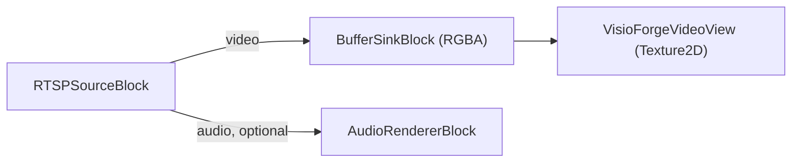

# View an RTSP camera in Unity

[Media Blocks SDK .Net](https://www.visioforge.com/media-blocks-sdk-net){ .md-button .md-button--primary target="_blank" }

The **`RTSPViewer`** scene displays a live RTSP / IP camera stream with the **Media Blocks SDK
.NET**, rendered into a Unity `RawImage`. This article assumes you have imported the Unity package
and applied the two required project settings — see [Using VisioForge in Unity](index.md) first.

## Run the sample

1. In the **Project** window open `Assets/Scenes/RTSPViewer.unity` (double-click it).
2. In the **Hierarchy** select the **RawImage** GameObject. The `RTSPViewerPlayer` component is
   attached to it.
3. In the **Inspector**, set **Rtsp Url** (and **Login** / **Password** if the camera requires
   authentication).
4. Press **▶ Play** — the stream renders in the Game view.


## Inspector fields

| Field | Default | Description |
|---|---|---|
| **Rtsp Url** | `rtsp://192.168.1.10:554/stream` | RTSP URL of the camera/stream. |
| **Login** | *(empty)* | RTSP username — leave empty if the stream needs no auth. |
| **Password** | *(empty)* | RTSP password. |
| **Auto Play On Start** | `true` | Connect automatically in `Start()`. |
| **Render Audio** | `true` | Render audio through the system default device. |
| **Aspect Mode** | `Letterbox` | How the video is fitted into the `RawImage`: `Stretch`, `Letterbox`, or `Crop`. |

## The pipeline

`RTSPViewerPlayer` builds this pipeline:



The core of `PlayAsync`:

```csharp
_pipeline = new MediaBlocksPipeline();

// readInfo:false skips the media pre-probe (it can fail under the Unity runtime, and
// probing a live stream adds connect latency); the codec is negotiated when playback starts.
var settings = await RTSPSourceSettings.CreateAsync(
    new Uri(rtspUrl), login ?? string.Empty, password ?? string.Empty,
    audioEnabled: _renderAudio, readInfo: false);

_source = new RTSPSourceBlock(settings);

_videoSink = new BufferSinkBlock(VideoFormatX.RGBA);
_videoSink.OnVideoFrameBuffer += _videoView.OnFrameBuffer;
_pipeline.Connect(_source.VideoOutput, _videoSink.Input);

if (_renderAudio && _source.AudioOutput != null)
{
    _audioRenderer = new AudioRendererBlock();
    _pipeline.Connect(_source.AudioOutput, _audioRenderer.Input);
}

await _pipeline.StartAsync();
```

## Use it in your own scene

Add a **Canvas → Raw Image** (*GameObject → UI → Raw Image*), select it, **Add Component →**
`RTSPViewerPlayer`, set **Rtsp Url**, and press **▶ Play**. The `RawImage` layout, aspect handling,
and vertical flip are handled by the bundled `VisioForgeVideoView`. For local file playback instead
of RTSP, use `MediaBlocksPlayer` (see [Play a media file](simple-player.md)).

## Frequently Asked Questions

### How do I provide camera credentials?

Set the **Login** and **Password** fields. Leave them empty for streams that need no
authentication; the credentials are sent to the camera, not embedded in the URL.

### What URL format should I use?

The standard `rtsp://host:port/path` form your camera exposes, e.g.
`rtsp://192.168.1.21:554/Streaming/Channels/101` (Hikvision) or
`rtsp://192.168.1.22:554/cam/realmonitor?channel=1&subtype=0` (Dahua). Check your camera's manual
for its exact stream path.

### What if the camera has no audio?

It works as video-only. The audio branch is connected only when the stream actually carries audio,
so a video-only camera needs no changes.

### Can I display several cameras at once?

Yes. Add a `RawImage` with its own `RTSPViewerPlayer` for each camera; each builds an independent
pipeline.

## See Also

- [Using VisioForge in Unity](index.md) — package overview, setup, and how rendering works
- [Play a media file in Unity](simple-player.md) — the file-playback sample
- [RTSP streaming guide](../network-streaming/rtsp.md) — RTSP across the VisioForge .NET SDKs
- [IP camera brands directory](../../camera-brands/index.md) — tested camera URLs and settings
- [Media Blocks RTSP player in C#](../../mediablocks/Guides/rtsp-player-csharp.md) — a non-Unity RTSP example
