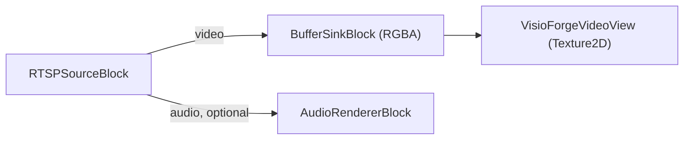
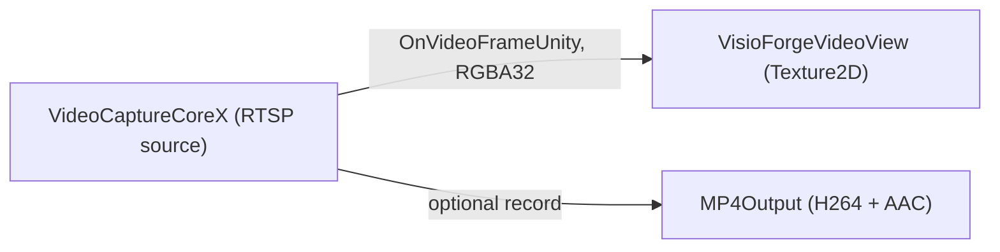

# View an RTSP camera in Unity

[Media Blocks SDK .Net](https://www.visioforge.com/media-blocks-sdk-net){ .md-button .md-button--primary target="_blank" }
[Video Capture SDK .Net](https://www.visioforge.com/video-capture-sdk-net){ .md-button target="_blank" }

There are two ways to view a live RTSP / IP camera stream in Unity, and the package ships a ready
scene for each. Both render into a Unity `RawImage` and run on **Windows**, **Android**, **macOS
Standalone**, and **iOS**. This article assumes you have imported the Unity package and applied the
two required project settings — see [Using VisioForge in Unity](index.md) first.

## Two scenes, two engines

| Scene | Engine | Level | Best for |
|---|---|---|---|
| **`RTSPViewer`** | `MediaBlocksPipeline` (Media Blocks SDK) | Low-level | Full control over the pipeline — pick your own sinks, effects, and outputs. |
| **`IPCameraX`** | `VideoCaptureCoreX` (Video Capture SDK) | High-level | Ready-made capture engine — adds recording outputs, snapshots, audio routing, and overlays on top of the same stream. |

Pick `RTSPViewer` when you want to assemble the pipeline yourself; pick `IPCameraX` when you want a
capture engine that can also record while it previews. Both feed the same bundled
`VisioForgeVideoView`, so the texture upload, aspect handling, and vertical flip are identical.

## RTSPViewer — the Media Blocks pipeline

The **`RTSPViewer`** scene displays a live RTSP / IP camera stream with the low-level **Media Blocks
SDK .NET**, rendered into a `RawImage`.

### Run the RTSPViewer scene

1. In the **Project** window open `Assets/Scenes/RTSPViewer.unity` (double-click it).
2. In the **Hierarchy** select the **RawImage** GameObject. The `RTSPViewerPlayer` component is
   attached to it.
3. In the **Inspector**, set **Rtsp Url** (and **Login** / **Password** if the camera requires
   authentication).
4. Press **▶ Play** — the stream renders in the Game view.


### Inspector fields (RTSPViewerPlayer)

| Field | Default | Description |
|---|---|---|
| **Rtsp Url** | `rtsp://192.168.1.10:554/stream` | RTSP URL of the camera/stream. |
| **Login** | *(empty)* | RTSP username — leave empty if the stream needs no auth. |
| **Password** | *(empty)* | RTSP password. |
| **Auto Play On Start** | `true` | Connect automatically in `Start()`. |
| **Render Audio** | `true` | Render audio through the system default device. |
| **Aspect Mode** | `Letterbox` | How the video is fitted into the `RawImage`: `Stretch`, `Letterbox`, or `Crop`. |

### The RTSPViewer pipeline

`RTSPViewerPlayer` builds this pipeline:



The core of `PlayAsync`:

```csharp
_pipeline = new MediaBlocksPipeline();

// readInfo:false skips the media pre-probe (it can fail under the Unity runtime, and
// probing a live stream adds connect latency); the codec is negotiated when playback starts.
var settings = await RTSPSourceSettings.CreateAsync(
    new Uri(rtspUrl), login ?? string.Empty, password ?? string.Empty,
    audioEnabled: _renderAudio, readInfo: false);

_source = new RTSPSourceBlock(settings);

_videoSink = new BufferSinkBlock(VideoFormatX.RGBA);
_videoSink.OnVideoFrameBuffer += _videoView.OnFrameBuffer;
_pipeline.Connect(_source.VideoOutput, _videoSink.Input);

if (_renderAudio && _source.AudioOutput != null)
{
    _audioRenderer = new AudioRendererBlock();
    _pipeline.Connect(_source.AudioOutput, _audioRenderer.Input);
}

await _pipeline.StartAsync();
```

## IPCameraX — the VideoCaptureCoreX engine

The **`IPCameraX`** scene views the same RTSP / IP camera with the high-level **`VideoCaptureCoreX`**
engine. On top of the live preview it can record to MP4 and exposes snapshots, audio routing, and
overlays — the capture-engine features the hand-built `RTSPViewer` pipeline does not provide
out of the box.

### The OnVideoFrameUnity event

`VideoCaptureCoreX` exposes the Unity-only **`OnVideoFrameUnity`** event: each frame arrives as
tightly packed **RGBA32** (`Stride == Width * 4`), ready for `Texture2D.LoadRawTextureData` with no
conversion. Subscribe before `StartAsync`.

### Run the IPCameraX scene

1. In the **Project** window open `Assets/Scenes/SampleScene.unity`.
2. In the **Hierarchy** select the **RawImage** GameObject — the `IPCameraXViewer` component is
   attached to it.
3. In the **Inspector** set **Rtsp Url** (and **Login** / **Password** if the camera needs them).
4. Press **▶ Play** — the camera stream appears in the Game view.

### Inspector fields (IPCameraXViewer)

| Field | Default | Description |
|---|---|---|
| **Rtsp Url** | `rtsp://192.168.1.10:554/stream` | RTSP / HTTP camera URL. |
| **Login** | *(empty)* | Camera user name (empty for open streams). |
| **Password** | *(empty)* | Camera password (empty for open streams). |
| **Render Audio** | `false` | Request and render the camera audio stream, if present. |
| **Record To File** | `false` | Record the stream to MP4 while previewing. |
| **Output Path** | *(empty)* | MP4 path. Empty → `<persistentDataPath>/ipcamera.mp4`. |
| **Auto Play On Start** | `true` | Connect automatically in `Start()`. |
| **Aspect Mode** | `Letterbox` | How the video is fitted into the `RawImage`. |

### The IPCameraX pipeline



The core of `PlayAsync`:

```csharp
_capture = new VideoCaptureCoreX();

// readInfo:false skips the media pre-probe (it can fail under the Unity runtime and adds latency).
var rtspSettings = await RTSPSourceSettings.CreateAsync(
    new Uri(rtspUrl), login, password, audioEnabled: renderAudio, readInfo: false);
_capture.Video_Source = rtspSettings;

// Texture-ready RGBA32 frames straight into the view.
_capture.OnVideoFrameUnity += _videoView.OnFrameBuffer;

if (recordToFile)
    _capture.Outputs_Add(new MP4Output(outputPath), autostart: true);

await _capture.StartAsync();
```

## Use it in your own scene

Add a **Canvas → Raw Image** (*GameObject → UI → Raw Image*), select it, **Add Component →**
`RTSPViewerPlayer` (Media Blocks pipeline) or `IPCameraXViewer` (VideoCaptureCoreX engine), set
**Rtsp Url**, and press **▶ Play**. The `RawImage` layout, aspect handling, and vertical flip are
handled by the bundled `VisioForgeVideoView`. For local file playback instead of RTSP, use
`MediaBlocksPlayer` or `MediaPlayerXPlayer` (see [Play a media file](simple-player.md)).

## Per-platform Build Settings and network permissions

Both scenes run unchanged on every supported platform — but each target has its own
network-permission and Build Profile requirements.

=== "Windows"

    | Setting | Value |
    |---|---|
    | Architecture | x86_64 |
    | Api Compatibility Level | `.NET Standard 2.1` |
    | Scripting Backend | Mono *(default)* or IL2CPP |

    Outbound TCP / UDP to the camera's RTSP port works with no special declaration. Windows
    Defender Firewall may prompt the first time the player binds a UDP socket — accept the
    private-network prompt. See [Build for Windows](windows.md) for the full checklist.

=== "Android"

    | Setting | Value |
    |---|---|
    | Architecture | arm64-v8a (**uncheck ARMv7**) |
    | Api Compatibility Level | `.NET Standard 2.1` |
    | Scripting Backend | **IL2CPP** (mandatory) |
    | Internet Access | **Require** |

    `AndroidManifest.xml` must declare:

    ```xml
    <uses-permission android:name="android.permission.INTERNET" />
    <uses-permission android:name="android.permission.ACCESS_NETWORK_STATE" />
    ```

    For RTSP over UDP on a public network, Android 9+ (API 28+) also requires
    `android:usesCleartextTraffic="true"` on the `<application>` element if the camera is reachable
    only via plain RTSP / RTP without TLS. See [Build for Android](android.md) for the full
    checklist.

=== "macOS"

    | Setting | Value |
    |---|---|
    | Architecture | Universal arm64 + x86_64 |
    | Api Compatibility Level | `.NET Standard 2.1` |
    | Scripting Backend | Mono *(default)* or IL2CPP |

    No additional manifest entries — outbound connections are unrestricted by default.
    For Mac App Store distribution add the **com.apple.security.network.client** entitlement to
    the signed bundle so the App Sandbox allows outbound network access. See
    [Build for macOS](macos.md) for code-signing and notarization notes.

=== "iOS"

    | Setting | Value |
    |---|---|
    | Architecture | device arm64 (Simulator not supported) |
    | Api Compatibility Level | `.NET Standard 2.1` |
    | Scripting Backend | **IL2CPP** (mandatory) |

    iOS 14+ blocks the first connection attempt to any local-network address until your app
    declares why. Add to `Info.plist`:

    ```xml
    <key>NSLocalNetworkUsageDescription</key>
    <string>This app streams video from local IP cameras on your network.</string>
    ```

    For plain `rtsp://` (no TLS) or `http://` URLs, add an App Transport Security exception:

    ```xml
    <key>NSAppTransportSecurity</key>
    <dict>
        <key>NSAllowsArbitraryLoads</key>
        <true/>
    </dict>
    ```

    Public `https://` / `rtsps://` URLs with CA-signed certificates need no ATS exception. See
    [Build for iOS](ios.md) for the full Xcode workflow.

## Auto-reconnect

Both engines reconnect automatically when the stream drops, with backoff between attempts — no
manual state machine in your script. For `RTSPViewer`, raise the timeout on the underlying
`RTSPSourceSettings` before passing them to `RTSPSourceBlock` if you need a longer window;
`IPCameraX` (`VideoCaptureCoreX`) handles camera reboots and brief interruptions the same way.

## Frequently Asked Questions

### Which scene should I use — RTSPViewer or IPCameraX?

Use **`RTSPViewer`** (`MediaBlocksPipeline`) for a lean view-only pipeline you assemble yourself. Use
**`IPCameraX`** (`VideoCaptureCoreX`) when you also want recording to MP4, snapshots, audio routing,
or overlays on the same stream — they are ready-made on the capture engine.

### How do I provide camera credentials?

Set the **Login** and **Password** fields on either component. Leave them empty for streams that need
no authentication; the credentials are sent to the camera, not embedded in the URL.

### What URL format should I use?

The standard `rtsp://host:port/path` form your camera exposes, e.g.
`rtsp://192.168.1.21:554/Streaming/Channels/101` (Hikvision) or
`rtsp://192.168.1.22:554/cam/realmonitor?channel=1&subtype=0` (Dahua). Check your camera's manual
for its exact stream path.

### Does it record the camera?

`IPCameraX` does — enable **Record To File** to add an `MP4Output` alongside the preview.
`RTSPViewer` is view-only; add a recording branch to its pipeline yourself if you need it.

### What if the camera has no audio?

Both work as video-only. The audio branch is connected only when the stream actually carries audio,
so a video-only camera needs no changes.

### Can I display several cameras at once?

Yes. Add a `RawImage` with its own `RTSPViewerPlayer` or `IPCameraXViewer` for each camera; each
builds an independent pipeline.

## See Also

- [Using VisioForge in Unity](index.md) — package overview, setup, and how rendering works
- [Play a media file in Unity](simple-player.md) — the local file / URL playback scenes
- [Capture a webcam in Unity](video-capture-x.md) — local-camera capture (Windows / macOS)
- [RTSP streaming guide](../network-streaming/rtsp.md) — RTSP across the VisioForge .NET SDKs
- [IP camera brands directory](../../camera-brands/index.md) — tested camera URLs and settings
- [Media Blocks RTSP player in C#](../../mediablocks/Guides/rtsp-player-csharp.md) — a non-Unity RTSP example
