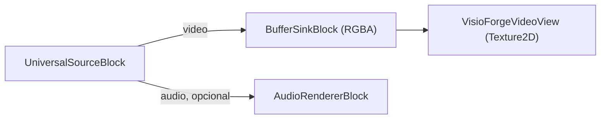

# Reproducir un archivo multimedia en Unity

[Media Blocks SDK .Net](https://www.visioforge.com/media-blocks-sdk-net){ .md-button .md-button--primary target="_blank" }

La escena **`SimplePlayer`** reproduce un archivo de video local con el **Media Blocks SDK .NET**
y lo renderiza en un `RawImage` de Unity. La misma escena se ejecuta en cada plataforma
soportada por el paquete — **Windows**, **Android**, **macOS Standalone** e **iOS** — con los
ajustes de build por plataforma indicados abajo. Este artículo asume que ya has importado el
paquete de Unity y aplicado los dos ajustes de proyecto requeridos; consulta primero
[Usar VisioForge en Unity](index.md).

## Ejecutar el ejemplo

1. En la ventana **Project** abre `Assets/Scenes/SimplePlayer.unity` (haz doble clic en ella).
2. En la **Hierarchy** selecciona el GameObject **RawImage**. El componente `MediaBlocksPlayer` está
   adjunto a él.
3. En el **Inspector**, establece **File Path** en una ruta absoluta a un archivo multimedia local.
4. Pulsa **▶ Play** — el video aparece en la vista Game y el audio se reproduce a través del
   dispositivo predeterminado del sistema.


!!! tip "El RawImage está en blanco hasta que pulsas Play"
    La textura de video se crea en tiempo de ejecución, por lo que el `RawImage` no muestra nada en
    el modo de edición.

## Campos del Inspector

| Campo | Predeterminado | Descripción |
|---|---|---|
| **File Path** | `C:\Samples\!video.avi` | Ruta absoluta al archivo multimedia que se reproducirá. |
| **Auto Play On Start** | `true` | Iniciar la reproducción automáticamente en `Start()`. |
| **Render Audio** | `true` | Renderizar audio a través del dispositivo predeterminado del sistema. |
| **Use Test Pattern** | `false` | Reproducir un patrón de prueba sintético en lugar del archivo (línea base de diagnóstico). |
| **Aspect Mode** | `Letterbox` | Cómo se ajusta el video al `RawImage`: `Stretch`, `Letterbox` o `Crop`. |

## El pipeline

`MediaBlocksPlayer` construye este pipeline:



El núcleo de `PlayAsync`:

```csharp
_pipeline = new MediaBlocksPipeline();

_videoSink = new BufferSinkBlock(VideoFormatX.RGBA);
_videoSink.OnVideoFrameBuffer += _videoView.OnFrameBuffer;

// ignoreMediaInfoReader:true omite el pre-sondeo del medio (puede fallar en el runtime
// de Unity); el codec se negocia al iniciar el pipeline.
var settings = await UniversalSourceSettings.CreateAsync(
    filePath, renderVideo: true, renderAudio: _renderAudio, ignoreMediaInfoReader: true);

_source = new UniversalSourceBlock(settings);
_pipeline.Connect(_source.VideoOutput, _videoSink.Input);

if (_renderAudio && _source.AudioOutput != null)
{
    _audioRenderer = new AudioRendererBlock();
    _pipeline.Connect(_source.AudioOutput, _audioRenderer.Input);
}

await _pipeline.StartAsync();
```

`UniversalSourceBlock` detecta automáticamente el contenedor y el codec. La rama de audio se conecta
únicamente cuando el archivo tiene un stream de audio (`_source.AudioOutput != null`).

## Úsalo en tu propia escena

No tienes que usar la escena de ejemplo:

1. Añade un **Canvas → Raw Image** (*GameObject → UI → Raw Image*).
2. Selecciona el **Raw Image** y **Add Component →** `MediaBlocksPlayer`.
3. Establece **File Path** y pulsa **▶ Play**.

El manejo del aspecto (`Stretch` / `Letterbox` / `Crop`), el diseño del `RawImage` y el volteo
vertical los gestiona por ti el `VisioForgeVideoView` incluido — no escribes ningún código de
textura. Para cambiar el mismo GameObject a reproducción RTSP, sustituye `MediaBlocksPlayer` por
`RTSPViewerPlayer` (consulta [Ver una cámara RTSP](rtsp-viewer.md)).

## Ajustes de build por plataforma

`SimplePlayer` se ejecuta sin cambios en cada plataforma soportada. Cambia Build Target y
aplica los ajustes correspondientes:

=== "Windows"

    | Ajuste | Valor |
    |---|---|
    | Architecture | x86_64 |
    | Api Compatibility Level | `.NET Standard 2.1` |
    | Scripting Backend | Mono *(predeterminado)* o IL2CPP |

    Las rutas de archivos locales usan la forma estándar de Windows
    (`C:\Samples\video.mp4`). Consulta [Compilar para Windows](windows.md) para la lista
    completa.

=== "Android"

    | Ajuste | Valor |
    |---|---|
    | Architecture | arm64-v8a (**desmarca ARMv7**) |
    | Api Compatibility Level | `.NET Standard 2.1` |
    | Scripting Backend | **IL2CPP** (obligatorio) |
    | Internet Access | Require |

    Los archivos locales viven en `Application.persistentDataPath` o
    `Application.streamingAssetsPath` — las rutas absolutas de Windows no son portables. Para
    leer medios desde almacenamiento externo, declara `READ_MEDIA_VIDEO` / `READ_MEDIA_AUDIO`
    en `AndroidManifest.xml`. Consulta [Compilar para Android](android.md) para la lista
    completa.

=== "macOS"

    | Ajuste | Valor |
    |---|---|
    | Architecture | Universal arm64 + x86_64 |
    | Api Compatibility Level | `.NET Standard 2.1` |
    | Scripting Backend | Mono *(predeterminado)* o IL2CPP |

    Las rutas de archivos locales usan la forma Unix (`/Users/<tu>/Movies/video.mp4`). Consulta
    [Compilar para macOS](macos.md) para notas de firma de código y notarización.

=== "iOS"

    | Ajuste | Valor |
    |---|---|
    | Architecture | dispositivo arm64 (Simulator no soportado) |
    | Api Compatibility Level | `.NET Standard 2.1` |
    | Scripting Backend | **IL2CPP** (obligatorio) |
    | Info.plist | Añade `NSCameraUsageDescription` / `NSMicrophoneUsageDescription` solo si también capturas desde hardware del dispositivo |

    Los archivos locales deben vivir dentro del sandbox de la app — típicamente
    `Application.persistentDataPath` (la carpeta Documents) o `Application.streamingAssetsPath`
    (solo lectura dentro del bundle `.app`). Consulta [Compilar para iOS](ios.md) para el
    flujo Xcode.

## Preguntas frecuentes

### ¿Qué formatos de video y audio puede reproducir?

El paquete incluye FFmpeg/libav, por lo que los formatos comunes se decodifican de inmediato — MP4,
MKV, AVI, MOV con H.264/H.265, MPEG-4, además de audio MP3/AAC, entre otros.
`UniversalSourceBlock` detecta automáticamente el formato.

### ¿Puedo cambiar el archivo en tiempo de ejecución?

Sí. Establece la propiedad `FilePath` (o llama a `PlayAsync(path)`) y el reproductor reconstruye el
pipeline para el nuevo archivo.

### ¿Cómo controlo cómo se ajusta el video al RawImage?

Usa el campo **Aspect Mode**: `Stretch` (rellenar, puede distorsionar), `Letterbox` (ajustar con
bandas) o `Crop` (rellenar y recortar el sobrante).

### ¿Se reproduce el audio también?

Sí, cuando **Render Audio** está habilitado y el archivo tiene una pista de audio — el audio se
reproduce a través del dispositivo predeterminado del sistema. La rama de audio se omite
automáticamente para archivos solo de video.

## Véase también

- [Usar VisioForge en Unity](index.md) — visión general del paquete, configuración y cómo funciona el renderizado
- [Ver una cámara RTSP en Unity](rtsp-viewer.md) — el ejemplo en vivo de cámara RTSP / IP
- [Visión general del Media Blocks SDK .NET](../../mediablocks/index.md) — el catálogo completo de bloques
- [Reproductor RTSP de Media Blocks en C#](../../mediablocks/Guides/rtsp-player-csharp.md) — un ejemplo de reproducción fuera de Unity
