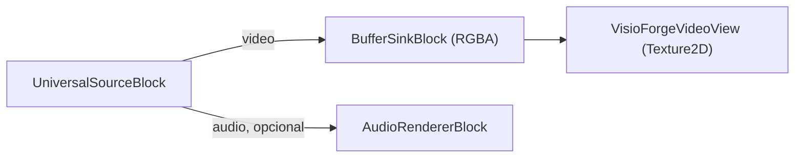
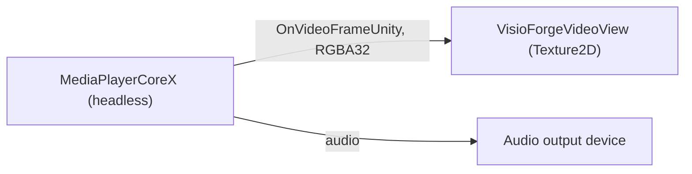

# Reproducir un archivo multimedia en Unity

[Media Blocks SDK .Net](https://www.visioforge.com/media-blocks-sdk-net){ .md-button .md-button--primary target="_blank" }
[Media Player SDK .Net](https://www.visioforge.com/media-player-sdk-net){ .md-button target="_blank" }

Hay dos formas de reproducir un archivo local o una URL de red en Unity, y el paquete incluye una
escena lista para cada una. Ambas renderizan en un `RawImage` de Unity y se ejecutan en
**Windows**, **Android**, **macOS Standalone** e **iOS**. Este artículo asume que ya has importado
el paquete de Unity y aplicado los dos ajustes de proyecto requeridos; consulta primero
[Usar VisioForge en Unity](index.md).

## Dos escenas, dos motores

| Escena | Motor | Nivel | Ideal para |
|---|---|---|---|
| **`SimplePlayer`** | `MediaBlocksPipeline` (Media Blocks SDK) | Bajo nivel | Control total de la canalización — eliges tu propia fuente, sinks, efectos y codificadores. |
| **`MediaPlayerX`** | `MediaPlayerCoreX` (Media Player SDK) | Alto nivel | Control de reproducción listo para usar — reproducir, pausar, reanudar, buscar, volumen y velocidad sin conexión manual. |

Elige `SimplePlayer` cuando quieras montar la canalización tú mismo; elige `MediaPlayerX` cuando
quieras un motor de reproductor que ya expone controles de transporte. Ambas alimentan el mismo
`VisioForgeVideoView` incluido, así que la subida de textura, el manejo de aspecto y el volteo
vertical son idénticos.

## SimplePlayer — la canalización de Media Blocks

La escena **`SimplePlayer`** reproduce un archivo de video local con el **Media Blocks SDK .NET** de
bajo nivel y lo renderiza en un `RawImage`.

### Ejecutar la escena SimplePlayer

1. En la ventana **Project** abre `Assets/Scenes/SimplePlayer.unity` (haz doble clic en ella).
2. En la **Hierarchy** selecciona el GameObject **RawImage**. El componente `MediaBlocksPlayer` está
   adjunto a él.
3. En el **Inspector**, establece **File Path** en una ruta absoluta a un archivo multimedia local.
4. Pulsa **▶ Play** — el video aparece en la vista Game y el audio se reproduce a través del
   dispositivo predeterminado del sistema.


!!! tip "El RawImage está en blanco hasta que pulsas Play"
    La textura de video se crea en tiempo de ejecución, por lo que el `RawImage` no muestra nada en
    el modo de edición.

### Campos del Inspector (MediaBlocksPlayer)

| Campo | Predeterminado | Descripción |
|---|---|---|
| **File Path** | `C:\Samples\!video.avi` | Ruta absoluta al archivo multimedia que se reproducirá. |
| **Auto Play On Start** | `true` | Iniciar la reproducción automáticamente en `Start()`. |
| **Render Audio** | `true` | Renderizar audio a través del dispositivo predeterminado del sistema. |
| **Use Test Pattern** | `false` | Reproducir un patrón de prueba sintético en lugar del archivo (línea base de diagnóstico). |
| **Aspect Mode** | `Letterbox` | Cómo se ajusta el video al `RawImage`: `Stretch`, `Letterbox` o `Crop`. |

### La canalización de SimplePlayer

`MediaBlocksPlayer` construye este pipeline:



El núcleo de `PlayAsync`:

```csharp
_pipeline = new MediaBlocksPipeline();

_videoSink = new BufferSinkBlock(VideoFormatX.RGBA);
_videoSink.OnVideoFrameBuffer += _videoView.OnFrameBuffer;

// ignoreMediaInfoReader:true omite el pre-sondeo del medio (puede fallar en el runtime
// de Unity); el codec se negocia al iniciar el pipeline.
var settings = await UniversalSourceSettings.CreateAsync(
    filePath, renderVideo: true, renderAudio: _renderAudio, ignoreMediaInfoReader: true);

_source = new UniversalSourceBlock(settings);
_pipeline.Connect(_source.VideoOutput, _videoSink.Input);

if (_renderAudio && _source.AudioOutput != null)
{
    _audioRenderer = new AudioRendererBlock();
    _pipeline.Connect(_source.AudioOutput, _audioRenderer.Input);
}

await _pipeline.StartAsync();
```

`UniversalSourceBlock` detecta automáticamente el contenedor y el codec. La rama de audio se conecta
únicamente cuando el archivo tiene un stream de audio (`_source.AudioOutput != null`).

## MediaPlayerX — el motor MediaPlayerCoreX

La escena **`MediaPlayerX`** reproduce los mismos archivos y URLs con el motor de alto nivel
**`MediaPlayerCoreX`**. A diferencia de la canalización `SimplePlayer` construida a mano,
`MediaPlayerCoreX` te ofrece control de reproducción listo para usar — reproducir, pausar, reanudar,
buscar, volumen y velocidad de reproducción — sin conexión manual de la canalización.

### El evento OnVideoFrameUnity

`MediaPlayerCoreX`, `VideoCaptureCoreX` y `VideoEditCoreX` exponen un evento exclusivo de Unity,
**`OnVideoFrameUnity`**, que entrega cada fotograma de vista previa como **RGBA32** empaquetado de
forma compacta (`Stride == Width * 4`, sin relleno de fila). Se sube directamente a una `Texture2D`
sin conversión de píxeles. Suscríbete a él antes de abrir la fuente para que el motor conecte su
capturador interno de fotogramas en la canalización.

### Ejecutar la escena MediaPlayerX

1. En la ventana **Project** abre `Assets/Scenes/SampleScene.unity`.
2. En la **Hierarchy** selecciona el GameObject **RawImage** — el componente `MediaPlayerXPlayer`
   está adjunto a él.
3. En el **Inspector**, establece **File Path** en una ruta absoluta o una URL.
4. Pulsa **▶ Play** — el video aparece en la vista Game y el audio se reproduce por el dispositivo
   predeterminado.

### Campos del Inspector (MediaPlayerXPlayer)

| Campo | Predeterminado | Descripción |
|---|---|---|
| **File Path** | `C:\Samples\!video.mp4` | Ruta absoluta, o una URL `file`/`http`/`https`/`rtsp`/`hls`. |
| **Auto Play On Start** | `true` | Iniciar la reproducción automáticamente en `Start()`. |
| **Render Audio** | `true` | Renderizar el audio a través del dispositivo de salida predeterminado del sistema. |
| **Volume** | `1.0` | Volumen de audio inicial (0..1). |
| **Aspect Mode** | `Letterbox` | Cómo se ajusta el video en el `RawImage`: `Stretch`, `Letterbox` o `Crop`. |

### La canalización de MediaPlayerX



El núcleo de `PlayAsync`:

```csharp
_player = new MediaPlayerCoreX();

// Fotogramas RGBA32 listos para textura directamente hacia la vista.
_player.OnVideoFrameUnity += _videoView.OnFrameBuffer;

// MediaPlayerCoreX solo renderiza audio cuando se establece un dispositivo de salida.
var outputs = await _player.Audio_OutputDevicesAsync();
if (outputs != null && outputs.Length > 0)
{
    _player.Audio_OutputDevice = new AudioRendererSettings(outputs[0]);
    _player.Audio_OutputDevice_Volume = 1.0;
}

// ignoreMediaInfoReader:true omite el pre-sondeo del medio (puede fallar bajo el runtime de Unity).
var source = await UniversalSourceSettings.CreateAsync(
    filePath, renderVideo: true, renderAudio: true, renderSubtitle: false,
    deepDiscovery: false, ignoreMediaInfoReader: true);

await _player.OpenAsync(source);
await _player.PlayAsync();
```

`PauseAsync`, `ResumeAsync` y `Position_SetAsync(TimeSpan)` te dan control de transporte; el
ejemplo los expone como `PauseAsync()`, `ResumeAsync()` y `SeekAsync(position)`.

## Úsalo en tu propia escena

No tienes que usar una escena de ejemplo:

1. Añade un **Canvas → Raw Image** (*GameObject → UI → Raw Image*).
2. Selecciona el **Raw Image** y **Add Component →** `MediaBlocksPlayer` (canalización Media Blocks)
   o `MediaPlayerXPlayer` (motor MediaPlayerCoreX).
3. Establece **File Path** y pulsa **▶ Play**.

El manejo del aspecto (`Stretch` / `Letterbox` / `Crop`), el diseño del `RawImage` y el volteo
vertical los gestiona por ti el `VisioForgeVideoView` incluido — no escribes ningún código de
textura. Para cambiar el mismo GameObject a reproducción RTSP, usa `RTSPViewerPlayer` o
`IPCameraXViewer` (consulta [Ver una cámara RTSP](rtsp-viewer.md)).

## Ajustes de build por plataforma

Ambas escenas se ejecutan sin cambios en cada plataforma soportada. Cambia Build Target y aplica los
ajustes correspondientes:

=== "Windows"

    | Ajuste | Valor |
    |---|---|
    | Architecture | x86_64 |
    | Api Compatibility Level | `.NET Standard 2.1` |
    | Scripting Backend | Mono *(predeterminado)* o IL2CPP |

    Las rutas de archivos locales usan la forma estándar de Windows
    (`C:\Samples\video.mp4`). Consulta [Compilar para Windows](windows.md) para la lista
    completa.

=== "Android"

    | Ajuste | Valor |
    |---|---|
    | Architecture | arm64-v8a (**desmarca ARMv7**) |
    | Api Compatibility Level | `.NET Standard 2.1` |
    | Scripting Backend | **IL2CPP** (obligatorio) |
    | Internet Access | Require (para URLs de red) |

    Los archivos locales viven en `Application.persistentDataPath` o
    `Application.streamingAssetsPath` — las rutas absolutas de Windows no son portables. Para
    leer medios desde almacenamiento externo, declara `READ_MEDIA_VIDEO` / `READ_MEDIA_AUDIO`
    en `AndroidManifest.xml`. Consulta [Compilar para Android](android.md) para la lista
    completa.

=== "macOS"

    | Ajuste | Valor |
    |---|---|
    | Architecture | Universal arm64 + x86_64 |
    | Api Compatibility Level | `.NET Standard 2.1` |
    | Scripting Backend | Mono *(predeterminado)* o IL2CPP |

    Las rutas de archivos locales usan la forma Unix (`/Users/<tu>/Movies/video.mp4`). Consulta
    [Compilar para macOS](macos.md) para notas de firma de código y notarización.

=== "iOS"

    | Ajuste | Valor |
    |---|---|
    | Architecture | dispositivo arm64 (Simulator no soportado) |
    | Api Compatibility Level | `.NET Standard 2.1` |
    | Scripting Backend | **IL2CPP** (obligatorio) |
    | App Transport Security | Añade una excepción ATS para URLs HTTP/RTSP en texto plano |

    Los archivos locales deben vivir dentro del sandbox de la app — típicamente
    `Application.persistentDataPath` (la carpeta Documents) o `Application.streamingAssetsPath`
    (solo lectura dentro del bundle `.app`). Consulta [Compilar para iOS](ios.md) para el
    flujo Xcode.

## Preguntas frecuentes

### ¿Qué escena debería usar — SimplePlayer o MediaPlayerX?

Usa **`SimplePlayer`** (`MediaBlocksPipeline`) cuando quieras construir la canalización tú mismo —
añadir efectos, varios sinks, grabación o fuentes personalizadas. Usa **`MediaPlayerX`**
(`MediaPlayerCoreX`) cuando quieras un motor de reproductor que ya proporciona búsqueda,
pausa/reanudar, duración, selección de dispositivo de audio y control de velocidad como métodos
listos para usar.

### ¿Qué formatos de video y audio puede reproducir?

El paquete incluye FFmpeg/libav, por lo que los formatos comunes se decodifican de inmediato — MP4,
MKV, AVI, MOV con H.264/H.265, MPEG-4, además de audio MP3/AAC, entre otros. Ambos motores detectan
automáticamente el formato.

### ¿Puede reproducir streams de red?

Sí. `MediaPlayerX` toma una URL `http`/`https`/`rtsp`/`hls` directamente en **File Path**
(`UniversalSourceSettings` gestiona tanto archivos locales como URLs). `SimplePlayer` reproduce
archivos locales; para una canalización de cámara en vivo dedicada usa
[Ver una cámara RTSP](rtsp-viewer.md).

### ¿Cómo busco o pauso?

En `MediaPlayerX`, llama a `SeekAsync(TimeSpan)`, `PauseAsync()` y `ResumeAsync()` en el componente —
envuelven `Position_SetAsync`, `PauseAsync` y `ResumeAsync` en `MediaPlayerCoreX`. El `SimplePlayer`
de bajo nivel no expone controles de transporte; reconstruye la canalización para cambiar de fuente.

### ¿Por qué MediaPlayerX necesita establecer un dispositivo de salida de audio?

`MediaPlayerCoreX` renderiza audio solo cuando se establece `Audio_OutputDevice`. El ejemplo enumera
los dispositivos de salida con `Audio_OutputDevicesAsync()` y selecciona el primero. `SimplePlayer`
en cambio enruta el audio a través de un `AudioRendererBlock`.

### ¿Cómo controlo cómo se ajusta el video al RawImage?

Usa el campo **Aspect Mode** en cualquiera de los componentes: `Stretch` (rellenar, puede
distorsionar), `Letterbox` (ajustar con bandas) o `Crop` (rellenar y recortar el sobrante).

## Véase también

- [Usar VisioForge en Unity](index.md) — visión general del paquete, configuración y cómo funciona el renderizado
- [Ver una cámara RTSP en Unity](rtsp-viewer.md) — las escenas en vivo de cámara RTSP / IP
- [Capturar una webcam en Unity](video-capture-x.md) — el ejemplo de grabador VideoCaptureCoreX
- [Editar y renderizar en Unity](video-edit-x.md) — el ejemplo de línea de tiempo VideoEditCoreX
- [Visión general del Media Blocks SDK .NET](../../mediablocks/index.md) — el catálogo completo de bloques
