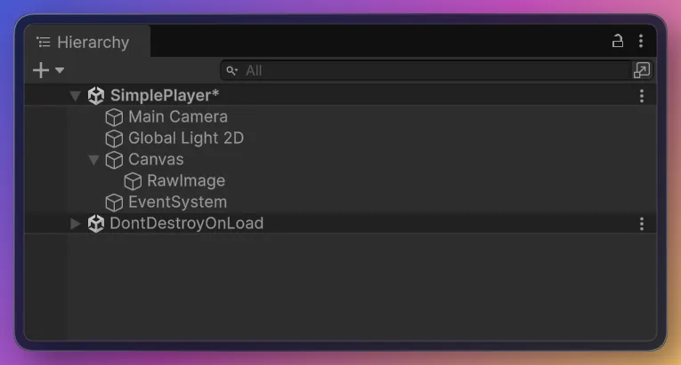
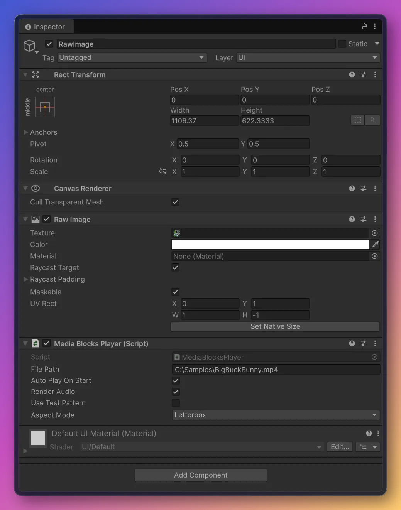
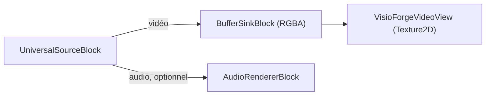

# Lire un fichier multimédia dans Unity

[Media Blocks SDK .Net](https://www.visioforge.com/media-blocks-sdk-net){ .md-button .md-button--primary target="_blank" }

La scène **`SimplePlayer`** lit un fichier vidéo local avec le **Media Blocks SDK .NET** et le rend
dans un `RawImage` Unity. Cet article suppose que vous avez importé le paquet Unity et appliqué les
deux réglages de projet requis — consultez d'abord [Utiliser VisioForge dans Unity](index.md).

## Lancer l'exemple

1. Dans la fenêtre **Project**, ouvrez `Assets/Scenes/SimplePlayer.unity` (double-cliquez dessus).
2. Dans la **Hierarchy**, sélectionnez le GameObject **RawImage**. Le composant `MediaBlocksPlayer`
   y est attaché.
3. Dans l'**Inspector**, définissez **File Path** sur un chemin absolu vers un fichier multimédia
   local.
4. Appuyez sur **▶ Play** — la vidéo apparaît dans la vue Game et l'audio est diffusé via le
   périphérique par défaut du système.





!!! tip "Le RawImage est vierge tant que vous n'avez pas appuyé sur Play"
    La texture vidéo est créée à l'exécution, le `RawImage` n'affiche donc rien en mode édition.

## Champs de l'Inspector

| Champ | Valeur par défaut | Description |
|---|---|---|
| **File Path** | `C:\Samples\!video.avi` | Chemin absolu vers le fichier multimédia à lire. |
| **Auto Play On Start** | `true` | Démarrer la lecture automatiquement dans `Start()`. |
| **Render Audio** | `true` | Diffuser l'audio via le périphérique par défaut du système. |
| **Use Test Pattern** | `false` | Lire une mire de test synthétique au lieu du fichier (référence de diagnostic). |
| **Aspect Mode** | `Letterbox` | Manière d'adapter la vidéo au `RawImage` : `Stretch`, `Letterbox` ou `Crop`. |

## Le pipeline

`MediaBlocksPlayer` construit ce pipeline :



Le cœur de `PlayAsync` :

```csharp
_pipeline = new MediaBlocksPipeline();

_videoSink = new BufferSinkBlock(VideoFormatX.RGBA);
_videoSink.OnVideoFrameBuffer += _videoView.OnFrameBuffer;

// ignoreMediaInfoReader:true ignore le pré-sondage du média (il peut échouer sous le
// runtime Unity) ; le codec est négocié au démarrage du pipeline.
var settings = await UniversalSourceSettings.CreateAsync(
    filePath, renderVideo: true, renderAudio: _renderAudio, ignoreMediaInfoReader: true);

_source = new UniversalSourceBlock(settings);
_pipeline.Connect(_source.VideoOutput, _videoSink.Input);

if (_renderAudio && _source.AudioOutput != null)
{
    _audioRenderer = new AudioRendererBlock();
    _pipeline.Connect(_source.AudioOutput, _audioRenderer.Input);
}

await _pipeline.StartAsync();
```

`UniversalSourceBlock` détecte automatiquement le conteneur et le codec. La branche audio n'est
connectée que lorsque le fichier comporte un flux audio (`_source.AudioOutput != null`).

## L'utiliser dans votre propre scène

Vous n'êtes pas obligé d'utiliser la scène d'exemple :

1. Ajoutez un **Canvas → Raw Image** (*GameObject → UI → Raw Image*).
2. Sélectionnez le **Raw Image** et **Add Component →** `MediaBlocksPlayer`.
3. Définissez **File Path** et appuyez sur **▶ Play**.

La gestion de l'aspect (`Stretch` / `Letterbox` / `Crop`), la disposition du `RawImage` et le
retournement vertical sont pris en charge pour vous par le `VisioForgeVideoView` fourni — vous
n'écrivez aucun code de texture. Pour basculer le même GameObject vers la lecture RTSP, remplacez
`MediaBlocksPlayer` par `RTSPViewerPlayer` (voir [Afficher une caméra RTSP](rtsp-viewer.md)).

## Foire aux questions

### Quels formats vidéo et audio peut-il lire ?

Le paquet embarque FFmpeg/libav, les formats courants se décodent donc d'emblée — MP4, MKV, AVI, MOV
avec H.264/H.265, MPEG-4, ainsi que l'audio MP3/AAC, entre autres. `UniversalSourceBlock` détecte
automatiquement le format.

### Puis-je changer de fichier à l'exécution ?

Oui. Définissez la propriété `FilePath` (ou appelez `PlayAsync(path)`) et le lecteur reconstruit le
pipeline pour le nouveau fichier.

### Comment contrôler l'adaptation de la vidéo au RawImage ?

Utilisez le champ **Aspect Mode** : `Stretch` (remplissage, peut déformer), `Letterbox` (adaptation
avec bandes) ou `Crop` (remplissage avec rognage du débordement).

### L'audio est-il lu également ?

Oui, lorsque **Render Audio** est activé et que le fichier comporte une piste audio — l'audio est
diffusé via le périphérique par défaut du système. La branche audio est automatiquement ignorée pour
les fichiers vidéo seule.

## Voir aussi

- [Utiliser VisioForge dans Unity](index.md) — présentation du paquet, configuration et fonctionnement du rendu
- [Afficher une caméra RTSP dans Unity](rtsp-viewer.md) — l'exemple de flux RTSP / caméra IP en direct
- [Présentation du Media Blocks SDK .NET](../../mediablocks/index.md) — le catalogue complet des blocs
- [Lecteur RTSP Media Blocks en C#](../../mediablocks/Guides/rtsp-player-csharp.md) — un exemple de lecture hors Unity
