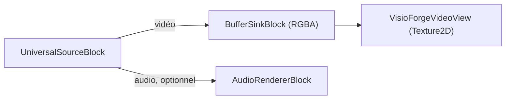
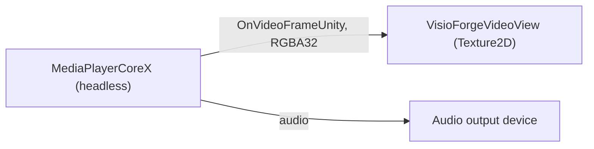

# Lire un fichier multimédia dans Unity

[Media Blocks SDK .Net](https://www.visioforge.com/media-blocks-sdk-net){ .md-button .md-button--primary target="_blank" }
[Media Player SDK .Net](https://www.visioforge.com/media-player-sdk-net){ .md-button target="_blank" }

Il existe deux façons de lire un fichier local ou une URL réseau dans Unity, et le paquet fournit
une scène prête pour chacune. Les deux s'affichent dans un `RawImage` Unity et fonctionnent sur
**Windows**, **Android**, **macOS Standalone** et **iOS**. Cet article suppose que vous avez importé
le paquet Unity et appliqué les deux réglages de projet requis — consultez d'abord
[Utiliser VisioForge dans Unity](index.md).

## Deux scènes, deux moteurs

| Scène | Moteur | Niveau | Idéal pour |
|---|---|---|---|
| **`SimplePlayer`** | `MediaBlocksPipeline` (Media Blocks SDK) | Bas niveau | Contrôle total du pipeline — vous choisissez votre source, vos sinks, effets et encodeurs. |
| **`MediaPlayerX`** | `MediaPlayerCoreX` (Media Player SDK) | Haut niveau | Contrôle de lecture clé en main — lecture, pause, reprise, navigation, volume et vitesse sans câblage manuel. |

Choisissez `SimplePlayer` quand vous voulez assembler le pipeline vous-même ; choisissez
`MediaPlayerX` quand vous voulez un moteur de lecture qui expose déjà les contrôles de transport.
Les deux alimentent le même `VisioForgeVideoView` fourni, donc le chargement de texture, la gestion
de l'aspect et le retournement vertical sont identiques.

## SimplePlayer — le pipeline Media Blocks

La scène **`SimplePlayer`** lit un fichier vidéo local avec le **Media Blocks SDK .NET** de bas
niveau et l'affiche dans un `RawImage`.

### Lancer la scène SimplePlayer

1. Dans la fenêtre **Project**, ouvrez `Assets/Scenes/SimplePlayer.unity` (double-cliquez dessus).
2. Dans la **Hierarchy**, sélectionnez le GameObject **RawImage**. Le composant `MediaBlocksPlayer`
   y est attaché.
3. Dans l'**Inspector**, définissez **File Path** sur un chemin absolu vers un fichier multimédia
   local.
4. Appuyez sur **▶ Play** — la vidéo apparaît dans la vue Game et l'audio est diffusé via le
   périphérique par défaut du système.


!!! tip "Le RawImage est vierge tant que vous n'avez pas appuyé sur Play"
    La texture vidéo est créée à l'exécution, le `RawImage` n'affiche donc rien en mode édition.

### Champs de l'Inspector (MediaBlocksPlayer)

| Champ | Valeur par défaut | Description |
|---|---|---|
| **File Path** | `C:\Samples\!video.avi` | Chemin absolu vers le fichier multimédia à lire. |
| **Auto Play On Start** | `true` | Démarrer la lecture automatiquement dans `Start()`. |
| **Render Audio** | `true` | Diffuser l'audio via le périphérique par défaut du système. |
| **Use Test Pattern** | `false` | Lire une mire de test synthétique au lieu du fichier (référence de diagnostic). |
| **Aspect Mode** | `Letterbox` | Manière d'adapter la vidéo au `RawImage` : `Stretch`, `Letterbox` ou `Crop`. |

### Le pipeline SimplePlayer

`MediaBlocksPlayer` construit ce pipeline :



Le cœur de `PlayAsync` :

```csharp
_pipeline = new MediaBlocksPipeline();

_videoSink = new BufferSinkBlock(VideoFormatX.RGBA);
_videoSink.OnVideoFrameBuffer += _videoView.OnFrameBuffer;

// ignoreMediaInfoReader:true ignore le pré-sondage du média (il peut échouer sous le
// runtime Unity) ; le codec est négocié au démarrage du pipeline.
var settings = await UniversalSourceSettings.CreateAsync(
    filePath, renderVideo: true, renderAudio: _renderAudio, ignoreMediaInfoReader: true);

_source = new UniversalSourceBlock(settings);
_pipeline.Connect(_source.VideoOutput, _videoSink.Input);

if (_renderAudio && _source.AudioOutput != null)
{
    _audioRenderer = new AudioRendererBlock();
    _pipeline.Connect(_source.AudioOutput, _audioRenderer.Input);
}

await _pipeline.StartAsync();
```

`UniversalSourceBlock` détecte automatiquement le conteneur et le codec. La branche audio n'est
connectée que lorsque le fichier comporte un flux audio (`_source.AudioOutput != null`).

## MediaPlayerX — le moteur MediaPlayerCoreX

La scène **`MediaPlayerX`** lit les mêmes fichiers et URL avec le moteur de haut niveau
**`MediaPlayerCoreX`**. Contrairement au pipeline `SimplePlayer` câblé à la main, `MediaPlayerCoreX`
vous offre un contrôle de lecture clé en main — lecture, pause, reprise, navigation, volume et
vitesse de lecture — sans câblage manuel du pipeline.

### L'événement OnVideoFrameUnity

`MediaPlayerCoreX`, `VideoCaptureCoreX` et `VideoEditCoreX` exposent un événement propre à Unity,
**`OnVideoFrameUnity`**, qui livre chaque image d'aperçu en **RGBA32** compacté
(`Stride == Width * 4`, sans remplissage de ligne). Elle est chargée directement dans un `Texture2D`
sans conversion de pixels. Abonnez-vous à cet événement avant d'ouvrir la source afin que le moteur
intègre son capteur d'images interne dans le pipeline.

### Exécuter la scène MediaPlayerX

1. Dans la fenêtre **Project**, ouvrez `Assets/Scenes/SampleScene.unity`.
2. Dans la **Hierarchy**, sélectionnez le GameObject **RawImage** — le composant `MediaPlayerXPlayer`
   y est attaché.
3. Dans l'**Inspector**, définissez **File Path** sur un chemin absolu ou une URL.
4. Appuyez sur **▶ Play** — la vidéo apparaît dans la vue Game et l'audio est lu via le périphérique
   par défaut.

### Champs de l'Inspector (MediaPlayerXPlayer)

| Champ | Valeur par défaut | Description |
|---|---|---|
| **File Path** | `C:\Samples\!video.mp4` | Chemin absolu, ou une URL `file`/`http`/`https`/`rtsp`/`hls`. |
| **Auto Play On Start** | `true` | Démarre la lecture automatiquement dans `Start()`. |
| **Render Audio** | `true` | Rend l'audio via le périphérique de sortie système par défaut. |
| **Volume** | `1.0` | Volume audio initial (0..1). |
| **Aspect Mode** | `Letterbox` | Comment la vidéo est ajustée dans le `RawImage` : `Stretch`, `Letterbox` ou `Crop`. |

### Le pipeline MediaPlayerX



Le cœur de `PlayAsync` :

```csharp
_player = new MediaPlayerCoreX();

// Images RGBA32 prêtes pour la texture, directement dans la vue.
_player.OnVideoFrameUnity += _videoView.OnFrameBuffer;

// MediaPlayerCoreX ne rend l'audio que lorsqu'un périphérique de sortie est défini.
var outputs = await _player.Audio_OutputDevicesAsync();
if (outputs != null && outputs.Length > 0)
{
    _player.Audio_OutputDevice = new AudioRendererSettings(outputs[0]);
    _player.Audio_OutputDevice_Volume = 1.0;
}

// ignoreMediaInfoReader:true ignore la pré-analyse du média (elle peut échouer sous le runtime Unity).
var source = await UniversalSourceSettings.CreateAsync(
    filePath, renderVideo: true, renderAudio: true, renderSubtitle: false,
    deepDiscovery: false, ignoreMediaInfoReader: true);

await _player.OpenAsync(source);
await _player.PlayAsync();
```

`PauseAsync`, `ResumeAsync` et `Position_SetAsync(TimeSpan)` vous offrent le contrôle du transport ;
l'exemple les expose sous la forme `PauseAsync()`, `ResumeAsync()` et `SeekAsync(position)`.

## L'utiliser dans votre propre scène

Vous n'êtes pas obligé d'utiliser une scène d'exemple :

1. Ajoutez un **Canvas → Raw Image** (*GameObject → UI → Raw Image*).
2. Sélectionnez le **Raw Image** et **Add Component →** `MediaBlocksPlayer` (pipeline Media Blocks)
   ou `MediaPlayerXPlayer` (moteur MediaPlayerCoreX).
3. Définissez **File Path** et appuyez sur **▶ Play**.

La gestion de l'aspect (`Stretch` / `Letterbox` / `Crop`), la disposition du `RawImage` et le
retournement vertical sont pris en charge pour vous par le `VisioForgeVideoView` fourni — vous
n'écrivez aucun code de texture. Pour basculer le même GameObject vers la lecture RTSP, utilisez
`RTSPViewerPlayer` ou `IPCameraXViewer` (voir [Afficher une caméra RTSP](rtsp-viewer.md)).

## Réglages de build par plateforme

Les deux scènes s'exécutent sans modification sur chaque plateforme prise en charge. Basculez
Build Target et appliquez les réglages correspondants :

=== "Windows"

    | Réglage | Valeur |
    |---|---|
    | Architecture | x86_64 |
    | Api Compatibility Level | `.NET Standard 2.1` |
    | Scripting Backend | Mono *(par défaut)* ou IL2CPP |

    Les chemins de fichiers locaux utilisent la forme Windows standard
    (`C:\Samples\video.mp4`). Voir [Compilation pour Windows](windows.md) pour la checklist
    complète.

=== "Android"

    | Réglage | Valeur |
    |---|---|
    | Architecture | arm64-v8a (**décochez ARMv7**) |
    | Api Compatibility Level | `.NET Standard 2.1` |
    | Scripting Backend | **IL2CPP** (obligatoire) |
    | Internet Access | Require (pour les URL réseau) |

    Les fichiers locaux vivent sous `Application.persistentDataPath` ou
    `Application.streamingAssetsPath` — les chemins absolus Windows ne sont pas portables.
    Pour lire des médias depuis le stockage externe, déclarez `READ_MEDIA_VIDEO` /
    `READ_MEDIA_AUDIO` dans `AndroidManifest.xml`. Voir
    [Compilation pour Android](android.md) pour la checklist complète.

=== "macOS"

    | Réglage | Valeur |
    |---|---|
    | Architecture | Universel arm64 + x86_64 |
    | Api Compatibility Level | `.NET Standard 2.1` |
    | Scripting Backend | Mono *(par défaut)* ou IL2CPP |

    Les chemins de fichiers locaux utilisent la forme Unix
    (`/Users/<vous>/Movies/video.mp4`). Voir [Compilation pour macOS](macos.md) pour les
    notes de signature de code et notarisation.

=== "iOS"

    | Réglage | Valeur |
    |---|---|
    | Architecture | appareil arm64 (Simulator non pris en charge) |
    | Api Compatibility Level | `.NET Standard 2.1` |
    | Scripting Backend | **IL2CPP** (obligatoire) |
    | App Transport Security | Ajoutez une exception ATS pour les URL HTTP/RTSP en clair |

    Les fichiers locaux doivent vivre dans le sandbox de l'app — typiquement
    `Application.persistentDataPath` (le dossier Documents) ou
    `Application.streamingAssetsPath` (lecture seule dans le bundle `.app`). Voir
    [Compilation pour iOS](ios.md) pour le flux Xcode.

## Foire aux questions

### Quelle scène utiliser — SimplePlayer ou MediaPlayerX ?

Utilisez **`SimplePlayer`** (`MediaBlocksPipeline`) quand vous voulez construire le pipeline
vous-même — ajouter des effets, plusieurs sinks, l'enregistrement ou des sources personnalisées.
Utilisez **`MediaPlayerX`** (`MediaPlayerCoreX`) quand vous voulez un moteur de lecture qui fournit
déjà la navigation, la pause/reprise, la durée, la sélection du périphérique audio et le contrôle de
vitesse sous forme de méthodes clé en main.

### Quels formats vidéo et audio peut-il lire ?

Le paquet embarque FFmpeg/libav, les formats courants se décodent donc d'emblée — MP4, MKV, AVI, MOV
avec H.264/H.265, MPEG-4, ainsi que l'audio MP3/AAC, entre autres. Les deux moteurs détectent
automatiquement le format.

### Peut-il lire des flux réseau ?

Oui. `MediaPlayerX` prend une URL `http`/`https`/`rtsp`/`hls` directement dans **File Path**
(`UniversalSourceSettings` gère à la fois les fichiers locaux et les URL). `SimplePlayer` lit des
fichiers locaux ; pour un pipeline de caméra en direct dédié, voir
[Afficher une caméra RTSP](rtsp-viewer.md).

### Comment naviguer ou mettre en pause ?

Sur `MediaPlayerX`, appelez `SeekAsync(TimeSpan)`, `PauseAsync()` et `ResumeAsync()` sur le composant
— ils encapsulent `Position_SetAsync`, `PauseAsync` et `ResumeAsync` sur `MediaPlayerCoreX`. Le
`SimplePlayer` de bas niveau n'expose pas de contrôles de transport ; reconstruisez le pipeline pour
changer de source.

### Pourquoi MediaPlayerX doit-il définir un périphérique de sortie audio ?

`MediaPlayerCoreX` ne rend l'audio que lorsque `Audio_OutputDevice` est défini. L'exemple énumère les
périphériques de sortie avec `Audio_OutputDevicesAsync()` et sélectionne le premier. `SimplePlayer`
achemine plutôt l'audio via un `AudioRendererBlock`.

### Comment contrôler l'adaptation de la vidéo au RawImage ?

Utilisez le champ **Aspect Mode** sur l'un ou l'autre composant : `Stretch` (remplissage, peut
déformer), `Letterbox` (adaptation avec bandes) ou `Crop` (remplissage avec rognage du débordement).

## Voir aussi

- [Utiliser VisioForge dans Unity](index.md) — présentation du paquet, configuration et fonctionnement du rendu
- [Afficher une caméra RTSP dans Unity](rtsp-viewer.md) — les scènes RTSP / caméra IP en direct
- [Capturer une webcam dans Unity](video-capture-x.md) — l'exemple d'enregistreur VideoCaptureCoreX
- [Éditer et rendre dans Unity](video-edit-x.md) — l'exemple de montage VideoEditCoreX
- [Présentation du Media Blocks SDK .NET](../../mediablocks/index.md) — le catalogue complet des blocs
