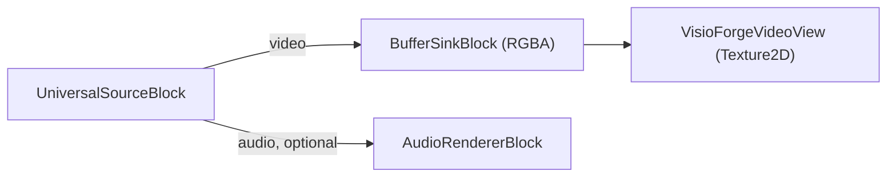
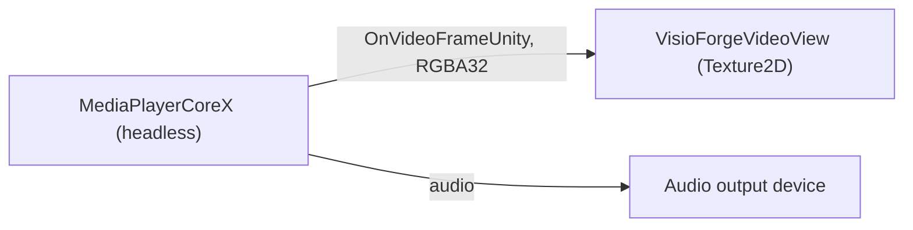

# Play a media file in Unity

[Media Blocks SDK .Net](https://www.visioforge.com/media-blocks-sdk-net){ .md-button .md-button--primary target="_blank" }
[Media Player SDK .Net](https://www.visioforge.com/media-player-sdk-net){ .md-button target="_blank" }

There are two ways to play a local file or a network URL in Unity, and the package ships a ready
scene for each. Both render into a Unity `RawImage` and run on **Windows**, **Android**, **macOS
Standalone**, and **iOS**. This article assumes you have imported the Unity package and applied the
two required project settings; see [Using VisioForge in Unity](index.md) first.

## Two scenes, two engines

| Scene | Engine | Level | Best for |
|---|---|---|---|
| **`SimplePlayer`** | `MediaBlocksPipeline` (Media Blocks SDK) | Low-level | Full control over the pipeline — pick your own source, sinks, effects, and encoders. |
| **`MediaPlayerX`** | `MediaPlayerCoreX` (Media Player SDK) | High-level | Ready-made playback control — play, pause, resume, seek, volume, and rate with no manual wiring. |

Pick `SimplePlayer` when you want to assemble the pipeline yourself; pick `MediaPlayerX` when you
want a player engine that already exposes transport controls. Both feed the same bundled
`VisioForgeVideoView`, so the texture upload, aspect handling, and vertical flip are identical.

## SimplePlayer — the Media Blocks pipeline

The **`SimplePlayer`** scene plays a local video file with the low-level **Media Blocks SDK .NET**
and renders it into a `RawImage`.

### Run the SimplePlayer scene

1. In the **Project** window open `Assets/Scenes/SimplePlayer.unity` (double-click it).
2. In the **Hierarchy** select the **RawImage** GameObject. The `MediaBlocksPlayer` component is
   attached to it.
3. In the **Inspector**, set **File Path** to an absolute path to a local media file.
4. Press **▶ Play** — the video appears in the Game view and audio plays through the system
   default device.


!!! tip "The RawImage is blank until you press Play"
    The video texture is created at runtime, so the `RawImage` shows nothing in edit mode.

### Inspector fields (MediaBlocksPlayer)

| Field | Default | Description |
|---|---|---|
| **File Path** | `C:\Samples\!video.avi` | Absolute path to the media file to play. |
| **Auto Play On Start** | `true` | Start playback automatically in `Start()`. |
| **Render Audio** | `true` | Render audio through the system default device. |
| **Use Test Pattern** | `false` | Play a synthetic test pattern instead of the file (diagnostic baseline). |
| **Aspect Mode** | `Letterbox` | How the video is fitted into the `RawImage`: `Stretch`, `Letterbox`, or `Crop`. |

### The SimplePlayer pipeline

`MediaBlocksPlayer` builds this pipeline:



The core of `PlayAsync`:

```csharp
_pipeline = new MediaBlocksPipeline();

_videoSink = new BufferSinkBlock(VideoFormatX.RGBA);
_videoSink.OnVideoFrameBuffer += _videoView.OnFrameBuffer;

// ignoreMediaInfoReader:true skips the media pre-probe (it can fail under the Unity
// runtime); the codec is negotiated when the pipeline starts.
var settings = await UniversalSourceSettings.CreateAsync(
    filePath, renderVideo: true, renderAudio: _renderAudio, ignoreMediaInfoReader: true);

_source = new UniversalSourceBlock(settings);
_pipeline.Connect(_source.VideoOutput, _videoSink.Input);

if (_renderAudio && _source.AudioOutput != null)
{
    _audioRenderer = new AudioRendererBlock();
    _pipeline.Connect(_source.AudioOutput, _audioRenderer.Input);
}

await _pipeline.StartAsync();
```

`UniversalSourceBlock` auto-detects the container and codec. The audio branch is connected only
when the file has an audio stream (`_source.AudioOutput != null`).

## MediaPlayerX — the MediaPlayerCoreX engine

The **`MediaPlayerX`** scene plays the same files and URLs with the high-level
**`MediaPlayerCoreX`** engine. Unlike the hand-built `SimplePlayer` pipeline, `MediaPlayerCoreX`
gives you ready-made playback control — play, pause, resume, seek, volume, and playback rate — with
no manual pipeline wiring.

### The OnVideoFrameUnity event

`MediaPlayerCoreX`, `VideoCaptureCoreX`, and `VideoEditCoreX` expose a Unity-only event,
**`OnVideoFrameUnity`**, that delivers each preview frame as tightly packed **RGBA32**
(`Stride == Width * 4`, no row padding). It is uploaded straight into a `Texture2D` with no pixel
conversion. Subscribe to it before opening the source so the engine wires its internal frame
grabber into the pipeline.

### Run the MediaPlayerX scene

1. In the **Project** window open `Assets/Scenes/SampleScene.unity`.
2. In the **Hierarchy** select the **RawImage** GameObject — the `MediaPlayerXPlayer` component is
   attached to it.
3. In the **Inspector**, set **File Path** to an absolute path or a URL.
4. Press **▶ Play** — the video appears in the Game view and audio plays through the default device.

### Inspector fields (MediaPlayerXPlayer)

| Field | Default | Description |
|---|---|---|
| **File Path** | `C:\Samples\!video.mp4` | Absolute path, or a `file`/`http`/`https`/`rtsp`/`hls` URL. |
| **Auto Play On Start** | `true` | Start playback automatically in `Start()`. |
| **Render Audio** | `true` | Render audio through the system default output device. |
| **Volume** | `1.0` | Initial audio volume (0..1). |
| **Aspect Mode** | `Letterbox` | How the video is fitted into the `RawImage`: `Stretch`, `Letterbox`, or `Crop`. |

### The MediaPlayerX pipeline



The core of `PlayAsync`:

```csharp
_player = new MediaPlayerCoreX();

// Texture-ready RGBA32 frames straight into the view.
_player.OnVideoFrameUnity += _videoView.OnFrameBuffer;

// MediaPlayerCoreX only renders audio when an output device is set.
var outputs = await _player.Audio_OutputDevicesAsync();
if (outputs != null && outputs.Length > 0)
{
    _player.Audio_OutputDevice = new AudioRendererSettings(outputs[0]);
    _player.Audio_OutputDevice_Volume = 1.0;
}

// ignoreMediaInfoReader:true skips the media pre-probe (it can fail under the Unity runtime).
var source = await UniversalSourceSettings.CreateAsync(
    filePath, renderVideo: true, renderAudio: true, renderSubtitle: false,
    deepDiscovery: false, ignoreMediaInfoReader: true);

await _player.OpenAsync(source);
await _player.PlayAsync();
```

`PauseAsync`, `ResumeAsync`, and `Position_SetAsync(TimeSpan)` give you transport control; the
sample exposes them as `PauseAsync()`, `ResumeAsync()`, and `SeekAsync(position)`.

## Use it in your own scene

You do not have to use a sample scene:

1. Add a **Canvas → Raw Image** (*GameObject → UI → Raw Image*).
2. Select the **Raw Image** and **Add Component →** `MediaBlocksPlayer` (Media Blocks pipeline) or
   `MediaPlayerXPlayer` (MediaPlayerCoreX engine).
3. Set **File Path** and press **▶ Play**.

The aspect handling (`Stretch` / `Letterbox` / `Crop`), the `RawImage` layout, and the vertical
flip are handled for you by the bundled `VisioForgeVideoView` — you do not write any texture code.
To switch the same GameObject to RTSP playback, use `RTSPViewerPlayer` or `IPCameraXViewer`
(see [View an RTSP camera](rtsp-viewer.md)).

## Per-platform Build Settings

Both scenes run unchanged on every supported platform. Switch Build Target and apply the matching
settings:

=== "Windows"

    | Setting | Value |
    |---|---|
    | Architecture | x86_64 |
    | Api Compatibility Level | `.NET Standard 2.1` |
    | Scripting Backend | Mono *(default)* or IL2CPP |

    Local file paths use the standard Windows form (`C:\Samples\video.mp4`). See
    [Build for Windows](windows.md) for the full checklist.

=== "Android"

    | Setting | Value |
    |---|---|
    | Architecture | arm64-v8a (**uncheck ARMv7**) |
    | Api Compatibility Level | `.NET Standard 2.1` |
    | Scripting Backend | **IL2CPP** (mandatory) |
    | Internet Access | Require (for network URLs) |

    Local files live under `Application.persistentDataPath` or
    `Application.streamingAssetsPath` — absolute Windows paths are not portable. To read media
    from external storage, declare `READ_MEDIA_VIDEO` / `READ_MEDIA_AUDIO` in
    `AndroidManifest.xml`. See [Build for Android](android.md) for the full checklist.

=== "macOS"

    | Setting | Value |
    |---|---|
    | Architecture | Universal arm64 + x86_64 |
    | Api Compatibility Level | `.NET Standard 2.1` |
    | Scripting Backend | Mono *(default)* or IL2CPP |

    Local file paths use Unix form (`/Users/<you>/Movies/video.mp4`). See
    [Build for macOS](macos.md) for code-signing and notarization notes.

=== "iOS"

    | Setting | Value |
    |---|---|
    | Architecture | device arm64 (Simulator not supported) |
    | Api Compatibility Level | `.NET Standard 2.1` |
    | Scripting Backend | **IL2CPP** (mandatory) |
    | App Transport Security | Add an ATS exception for plain-HTTP/RTSP URLs |

    Local files must live inside the app sandbox — typically
    `Application.persistentDataPath` (the Documents folder) or `Application.streamingAssetsPath`
    (read-only inside the `.app` bundle). See [Build for iOS](ios.md) for the Xcode workflow.

## Frequently Asked Questions

### Which scene should I use — SimplePlayer or MediaPlayerX?

Use **`SimplePlayer`** (`MediaBlocksPipeline`) when you want to build the pipeline yourself — add
effects, multiple sinks, recording, or custom sources. Use **`MediaPlayerX`** (`MediaPlayerCoreX`)
when you want a player engine that already provides seeking, pause/resume, duration, audio device
selection, and rate control as ready-made methods.

### Which video and audio formats can it play?

The package bundles FFmpeg/libav, so common formats decode out of the box — MP4, MKV, AVI, MOV with
H.264/H.265, MPEG-4, plus MP3/AAC audio, among others. Both engines auto-detect the format.

### Can it play network streams?

Yes. `MediaPlayerX` takes an `http`/`https`/`rtsp`/`hls` URL directly in **File Path**
(`UniversalSourceSettings` handles both local files and URLs). `SimplePlayer` plays local files; for
a dedicated live-camera pipeline use [View an RTSP camera](rtsp-viewer.md).

### How do I seek or pause?

On `MediaPlayerX`, call `SeekAsync(TimeSpan)`, `PauseAsync()`, and `ResumeAsync()` on the component
— they wrap `Position_SetAsync`, `PauseAsync`, and `ResumeAsync` on `MediaPlayerCoreX`. The
low-level `SimplePlayer` does not expose transport controls; rebuild the pipeline to change source.

### Why does MediaPlayerX need an audio output device set?

`MediaPlayerCoreX` renders audio only when `Audio_OutputDevice` is set. The sample enumerates output
devices with `Audio_OutputDevicesAsync()` and selects the first one. `SimplePlayer` instead routes
audio through an `AudioRendererBlock`.

### How do I control how the video fits the RawImage?

Use the **Aspect Mode** field on either component: `Stretch` (fill, may distort), `Letterbox` (fit
with bars), or `Crop` (fill and crop the overflow).

## See Also

- [Using VisioForge in Unity](index.md) — package overview, setup, and how rendering works
- [View an RTSP camera in Unity](rtsp-viewer.md) — the live RTSP / IP camera scenes
- [Capture a webcam in Unity](video-capture-x.md) — the VideoCaptureCoreX recorder sample
- [Edit and render in Unity](video-edit-x.md) — the VideoEditCoreX timeline sample
- [Media Blocks SDK .NET overview](../../mediablocks/index.md) — the full block catalog
