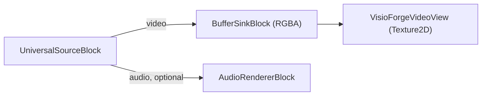

# Play a media file in Unity

[Media Blocks SDK .Net](https://www.visioforge.com/media-blocks-sdk-net){ .md-button .md-button--primary target="_blank" }

The **`SimplePlayer`** scene plays a local video file with the **Media Blocks SDK .NET** and
renders it into a Unity `RawImage`. The same scene runs on every platform the package supports —
**Windows**, **Android**, **macOS Standalone**, and **iOS** — with the per-platform build
settings noted below. This article assumes you have imported the Unity package and applied the
two required project settings; see [Using VisioForge in Unity](index.md) first.

## Run the sample

1. In the **Project** window open `Assets/Scenes/SimplePlayer.unity` (double-click it).
2. In the **Hierarchy** select the **RawImage** GameObject. The `MediaBlocksPlayer` component is
   attached to it.
3. In the **Inspector**, set **File Path** to an absolute path to a local media file.
4. Press **▶ Play** — the video appears in the Game view and audio plays through the system
   default device.


!!! tip "The RawImage is blank until you press Play"
    The video texture is created at runtime, so the `RawImage` shows nothing in edit mode.

## Inspector fields

| Field | Default | Description |
|---|---|---|
| **File Path** | `C:\Samples\!video.avi` | Absolute path to the media file to play. |
| **Auto Play On Start** | `true` | Start playback automatically in `Start()`. |
| **Render Audio** | `true` | Render audio through the system default device. |
| **Use Test Pattern** | `false` | Play a synthetic test pattern instead of the file (diagnostic baseline). |
| **Aspect Mode** | `Letterbox` | How the video is fitted into the `RawImage`: `Stretch`, `Letterbox`, or `Crop`. |

## The pipeline

`MediaBlocksPlayer` builds this pipeline:



The core of `PlayAsync`:

```csharp
_pipeline = new MediaBlocksPipeline();

_videoSink = new BufferSinkBlock(VideoFormatX.RGBA);
_videoSink.OnVideoFrameBuffer += _videoView.OnFrameBuffer;

// ignoreMediaInfoReader:true skips the media pre-probe (it can fail under the Unity
// runtime); the codec is negotiated when the pipeline starts.
var settings = await UniversalSourceSettings.CreateAsync(
    filePath, renderVideo: true, renderAudio: _renderAudio, ignoreMediaInfoReader: true);

_source = new UniversalSourceBlock(settings);
_pipeline.Connect(_source.VideoOutput, _videoSink.Input);

if (_renderAudio && _source.AudioOutput != null)
{
    _audioRenderer = new AudioRendererBlock();
    _pipeline.Connect(_source.AudioOutput, _audioRenderer.Input);
}

await _pipeline.StartAsync();
```

`UniversalSourceBlock` auto-detects the container and codec. The audio branch is connected only
when the file has an audio stream (`_source.AudioOutput != null`).

## Use it in your own scene

You do not have to use the sample scene:

1. Add a **Canvas → Raw Image** (*GameObject → UI → Raw Image*).
2. Select the **Raw Image** and **Add Component →** `MediaBlocksPlayer`.
3. Set **File Path** and press **▶ Play**.

The aspect handling (`Stretch` / `Letterbox` / `Crop`), the `RawImage` layout, and the vertical
flip are handled for you by the bundled `VisioForgeVideoView` — you do not write any texture code.
To switch the same GameObject to RTSP playback, swap `MediaBlocksPlayer` for `RTSPViewerPlayer`
(see [View an RTSP camera](rtsp-viewer.md)).

## Per-platform Build Settings

`SimplePlayer` runs unchanged on every supported platform. Switch Build Target and apply the
matching settings:

=== "Windows"

    | Setting | Value |
    |---|---|
    | Architecture | x86_64 |
    | Api Compatibility Level | `.NET Standard 2.1` |
    | Scripting Backend | Mono *(default)* or IL2CPP |

    Local file paths use the standard Windows form (`C:\Samples\video.mp4`). See
    [Build for Windows](windows.md) for the full checklist.

=== "Android"

    | Setting | Value |
    |---|---|
    | Architecture | arm64-v8a (**uncheck ARMv7**) |
    | Api Compatibility Level | `.NET Standard 2.1` |
    | Scripting Backend | **IL2CPP** (mandatory) |
    | Internet Access | Require |

    Local files live under `Application.persistentDataPath` or
    `Application.streamingAssetsPath` — absolute Windows paths are not portable. To read media
    from external storage, declare `READ_MEDIA_VIDEO` / `READ_MEDIA_AUDIO` in
    `AndroidManifest.xml`. See [Build for Android](android.md) for the full checklist.

=== "macOS"

    | Setting | Value |
    |---|---|
    | Architecture | Universal arm64 + x86_64 |
    | Api Compatibility Level | `.NET Standard 2.1` |
    | Scripting Backend | Mono *(default)* or IL2CPP |

    Local file paths use Unix form (`/Users/<you>/Movies/video.mp4`). See
    [Build for macOS](macos.md) for code-signing and notarization notes.

=== "iOS"

    | Setting | Value |
    |---|---|
    | Architecture | device arm64 (Simulator not supported) |
    | Api Compatibility Level | `.NET Standard 2.1` |
    | Scripting Backend | **IL2CPP** (mandatory) |
    | Info.plist | Add `NSCameraUsageDescription` / `NSMicrophoneUsageDescription` only if you also capture from device hardware |

    Local files must live inside the app sandbox — typically
    `Application.persistentDataPath` (the Documents folder) or `Application.streamingAssetsPath`
    (read-only inside the `.app` bundle). See [Build for iOS](ios.md) for the Xcode workflow.

## Frequently Asked Questions

### Which video and audio formats can it play?

The package bundles FFmpeg/libav, so common formats decode out of the box — MP4, MKV, AVI, MOV with
H.264/H.265, MPEG-4, plus MP3/AAC audio, among others. `UniversalSourceBlock` auto-detects the
format.

### Can I change the file at runtime?

Yes. Set the `FilePath` property (or call `PlayAsync(path)`) and the player rebuilds the pipeline
for the new file.

### How do I control how the video fits the RawImage?

Use the **Aspect Mode** field: `Stretch` (fill, may distort), `Letterbox` (fit with bars), or
`Crop` (fill and crop the overflow).

### Does audio play too?

Yes, when **Render Audio** is enabled and the file has an audio track — audio plays through the
system default device. The audio branch is skipped automatically for video-only files.

## See Also

- [Using VisioForge in Unity](index.md) — package overview, setup, and how rendering works
- [View an RTSP camera in Unity](rtsp-viewer.md) — the live RTSP / IP camera sample
- [Media Blocks SDK .NET overview](../../mediablocks/index.md) — the full block catalog
- [Media Blocks RTSP player in C#](../../mediablocks/Guides/rtsp-player-csharp.md) — a non-Unity playback example
