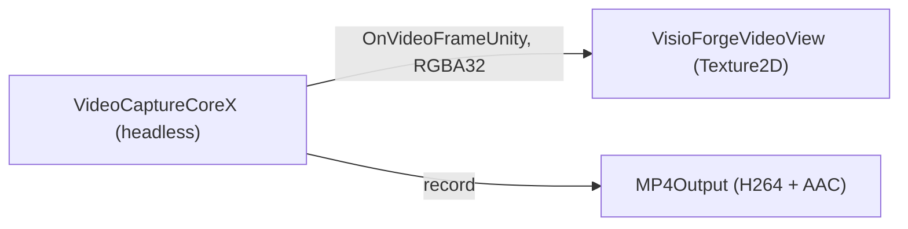
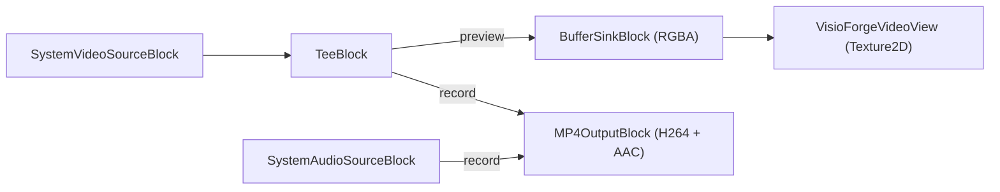

# Capturar una webcam en Unity con VideoCaptureCoreX

[Video Capture SDK .Net](https://www.visioforge.com/video-capture-sdk-net){ .md-button .md-button--primary target="_blank" }
[Media Blocks SDK .Net](https://www.visioforge.com/media-blocks-sdk-net){ .md-button target="_blank" }

La escena **`VideoCaptureX`** captura desde una webcam local (y micrófono) con el motor de alto nivel
**`VideoCaptureCoreX`**, muestra una vista previa de los fotogramas en vivo en un `RawImage` de Unity y graba a un
archivo MP4 al mismo tiempo. También puedes capturar una webcam con la API de bajo nivel
**`MediaBlocksPipeline`** — esa receta está en [Capturar con la canalización de Media Blocks](#capturar-con-la-canalizacion-de-media-blocks-bajo-nivel)
más abajo. Este artículo asume que has importado el paquete de Unity y aplicado los ajustes de
proyecto necesarios; consulta primero [Uso de VisioForge en Unity](index.md).

!!! info "Compatibilidad de plataformas para la captura de cámara local"
    La captura local de webcam/micrófono en el paquete de Unity está dirigida a **Windows** y **macOS
    Standalone** en esta versión. En **Android** e **iOS**, usa el
    [ejemplo de cámara IP / RTSP](rtsp-viewer.md) — `VideoCaptureCoreX` sobre RTSP funciona en las cuatro
    plataformas. La captura de dispositivos locales en Android/iOS depende de las APIs de cámara de la plataforma que aún no están
    integradas en el paquete multiplataforma.

## El evento OnVideoFrameUnity

`VideoCaptureCoreX` expone el evento exclusivo de Unity **`OnVideoFrameUnity`**: cada fotograma llega como
**RGBA32** empaquetado de forma compacta (`Stride == Width * 4`), listo para `Texture2D.LoadRawTextureData` sin
conversión. Suscríbete antes de `StartAsync`.

## Ejecutar el ejemplo

1. Conecta una webcam, luego abre `Assets/Scenes/SampleScene.unity`.
2. En la **Hierarchy** selecciona el GameObject **RawImage** — el componente `VideoCaptureXRecorder`
   está adjunto a él.
3. En el **Inspector** establece **Camera Index** y el **Output Path**.
4. Pulsa **▶ Play** — la cámara en vivo se renderiza en la vista Game. Alterna la grabación con
   `StartRecordingAsync()` / `StopRecordingAsync()` (por ejemplo, desde un botón de UI).

## Campos del Inspector

| Campo | Predeterminado | Descripción |
|---|---|---|
| **Camera Index** | `0` | Índice en `DeviceEnumerator.VideoSourcesAsync()`. |
| **Capture Audio** | `true` | Capturar y grabar audio desde el micrófono predeterminado. |
| **Record On Start** | `false` | Comenzar a grabar al archivo en cuanto se inicia la vista previa. |
| **Output Path** | *(vacío)* | Ruta MP4. Vacío → `<persistentDataPath>/capture.mp4`. |
| **Aspect Mode** | `Letterbox` | Cómo se ajusta el video en el `RawImage`. |

## La canalización



El núcleo de la configuración de vista previa + grabación:

```csharp
var cameras = await DeviceEnumerator.Shared.VideoSourcesAsync();

_capture = new VideoCaptureCoreX();
_capture.Video_Source = new VideoCaptureDeviceSourceSettings(cameras[cameraIndex]);

var audioSources = await DeviceEnumerator.Shared.AudioSourcesAsync();
if (audioSources.Length > 0)
    _capture.Audio_Source = audioSources[0].CreateSourceSettingsVC();

// Fotogramas RGBA32 listos para textura directamente hacia la vista.
_capture.OnVideoFrameUnity += _videoView.OnFrameBuffer;

// Pre-registra la salida MP4 (autostart:false) para que la vista previa se ejecute sin grabar.
_capture.Outputs_Add(new MP4Output(outputPath), autostart: false);

await _capture.StartAsync();
```

La grabación se alterna en tiempo de ejecución para que la vista previa siga ejecutándose de forma independiente a la captura a archivo:

```csharp
await _capture.StartCaptureAsync(0, outputPath); // comenzar a grabar
await _capture.StopCaptureAsync(0);              // detener grabación
```

## Capturar con la canalización de Media Blocks (bajo nivel)

`VideoCaptureCoreX` es el motor de alto nivel. Para un control total de la canalización puedes
capturar la misma webcam con la API de bajo nivel **`MediaBlocksPipeline`** — el enfoque que usan las
[escenas SimplePlayer / RTSPViewer](simple-player.md). No hay una escena de webcam prediseñada para
esta vía; añade la receta de abajo a tu propio `MonoBehaviour` (modélala sobre el `MediaBlocksPlayer`
incluido):

Un `TeeBlock` divide el video de la cámara para que alimente a la vez la vista previa
(`BufferSinkBlock`) y la grabación (`MP4OutputBlock`, que agrupa los codificadores H.264 + AAC y el
muxer MP4). El micrófono se añade directamente a la salida MP4:



```csharp
_pipeline = new MediaBlocksPipeline();

// Fuentes de captura
var cameras = await DeviceEnumerator.Shared.VideoSourcesAsync();
var videoSource = new SystemVideoSourceBlock(new VideoCaptureDeviceSourceSettings(cameras[cameraIndex]));

var mics = await DeviceEnumerator.Shared.AudioSourcesAsync();
var audioSource = new SystemAudioSourceBlock(mics[0].CreateSourceSettings());

// Vista previa: fotogramas RGBA empaquetados de forma compacta hacia la vista de Unity
var videoSink = new BufferSinkBlock(VideoFormatX.RGBA);
videoSink.OnVideoFrameBuffer += _videoView.OnFrameBuffer;

// Grabación: video H.264 + audio AAC multiplexados a MP4
var mp4 = new MP4OutputBlock(outputPath);

// Bifurca el video de la cámara hacia el sink de vista previa y la grabación
var videoTee = new TeeBlock(2, MediaBlockPadMediaType.Video);
_pipeline.Connect(videoSource, videoTee);

// Rama de vista previa — una salida del tee hacia el buffer sink
_pipeline.Connect(videoTee.Outputs[0], videoSink.Input);

// Rama de grabación — MP4OutputBlock no tiene entradas fijas; llama a CreateNewInput una vez por stream
_pipeline.Connect(videoTee.Outputs[1], mp4.CreateNewInput(MediaBlockPadMediaType.Video));
_pipeline.Connect(audioSource.Output, mp4.CreateNewInput(MediaBlockPadMediaType.Audio));

await _pipeline.StartAsync();             // vista previa + grabación corren a la vez
```

`MP4OutputBlock` empieza sin pads de entrada — cada llamada a
`CreateNewInput(MediaBlockPadMediaType.Video|Audio)` añade una entrada tipada conectada al codificador
interno H.264 / AAC, así que crea exactamente una por stream. `BufferSinkBlock.OnVideoFrameBuffer`
tiene la misma firma `VisioForgeVideoView.OnFrameBuffer` que el evento `OnVideoFrameUnity` del motor,
por lo que la misma vista renderiza la previsualización. Quita el `videoTee` / `MP4OutputBlock` / la
rama de audio para solo previsualizar; o usa la vía de alto nivel `VideoCaptureCoreX` de arriba, que
permite iniciar y detener la grabación en tiempo de ejecución sin reconstruir la canalización. Esta
vía de bajo nivel usa la misma fuente de dispositivo que el motor, por lo que la captura de cámara
local tiene el mismo alcance **Windows / macOS**.

## Configuración de compilación por plataforma

=== "Windows"

    | Ajuste | Valor |
    |---|---|
    | Architecture | x86_64 |
    | Api Compatibility Level | `.NET Standard 2.1` |
    | Scripting Backend | Mono *(predeterminado)* o IL2CPP |

    No se requiere ninguna entrada de manifiesto para el acceso a la cámara. Consulta [Compilar para Windows](windows.md).

=== "macOS"

    | Ajuste | Valor |
    |---|---|
    | Architecture | Universal arm64 + x86_64 |
    | Api Compatibility Level | `.NET Standard 2.1` |
    | Scripting Backend | Mono *(predeterminado)* o IL2CPP |
    | Privacy | Añade descripciones de uso / entitlements de cámara + micrófono |

    La cámara se selecciona a través de `avfvideosrc`. Consulta [Compilar para macOS](macos.md).

## Preguntas frecuentes

### ¿Cómo grabo a un archivo?

El ejemplo pre-registra un `MP4Output` y alterna la captura con `StartCaptureAsync(0, path)` /
`StopCaptureAsync(0)`, por lo que la vista previa en vivo se ejecuta tanto si estás grabando como si no.

### ¿Puedo capturar desde una cámara local en Android o iOS?

No en esta versión. Usa el [ejemplo de cámara IP / RTSP](rtsp-viewer.md) en móviles —
`VideoCaptureCoreX` sobre RTSP funciona en las cuatro plataformas. La captura de dispositivos locales en Android/iOS está
planificada para un paquete futuro.

### ¿Cómo elijo una cámara específica?

Establece **Camera Index** en la posición del dispositivo en `DeviceEnumerator.Shared.VideoSourcesAsync()`.

### ¿Con qué codificadores graba?

`MP4Output` usa por defecto video H.264 + audio AAC. Ajusta la configuración de `MP4Output` para codificadores personalizados.

## Consulta también

- [Uso de VisioForge en Unity](index.md) — descripción general del paquete, configuración y cómo funciona el renderizado
- [Ver una cámara IP / RTSP en Unity](rtsp-viewer.md) — `VideoCaptureCoreX` sobre RTSP (todas las plataformas)
- [Reproducir multimedia en Unity con MediaPlayerCoreX](simple-player.md) — el ejemplo de reproductor de alto nivel
- [Editar y renderizar en Unity](video-edit-x.md) — el ejemplo de línea de tiempo VideoEditCoreX
