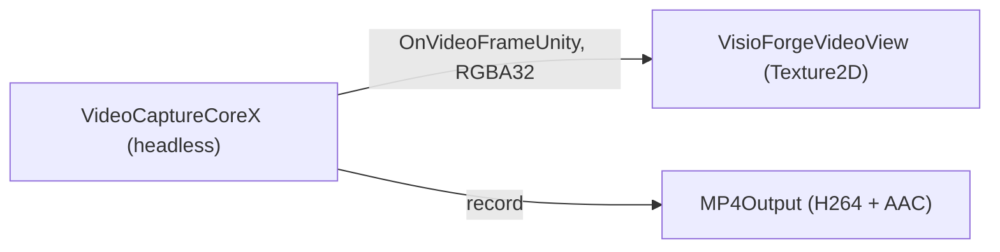
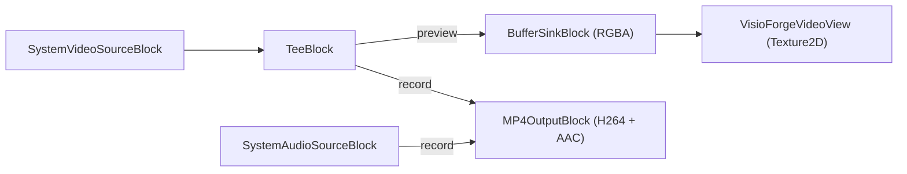

# Capturer une webcam dans Unity avec VideoCaptureCoreX

[Video Capture SDK .Net](https://www.visioforge.com/video-capture-sdk-net){ .md-button .md-button--primary target="_blank" }
[Media Blocks SDK .Net](https://www.visioforge.com/media-blocks-sdk-net){ .md-button target="_blank" }

La scène **`VideoCaptureX`** capture depuis une webcam locale (et un microphone) avec le moteur de haut
niveau **`VideoCaptureCoreX`**, affiche les images en direct dans un `RawImage` Unity et enregistre
simultanément dans un fichier MP4. Vous pouvez aussi capturer une webcam avec l'API de bas niveau
**`MediaBlocksPipeline`** — cette recette se trouve dans [Capturer avec le pipeline Media Blocks](#capturer-avec-le-pipeline-media-blocks-bas-niveau)
ci-dessous. Cet article suppose que vous avez importé le paquet Unity et appliqué les paramètres de
projet requis ; consultez d'abord [Utiliser VisioForge dans Unity](index.md).

!!! info "Prise en charge des plateformes pour la capture par caméra locale"
    La capture par webcam/microphone local dans le paquet Unity cible **Windows** et **macOS
    Standalone** dans cette version. Sur **Android** et **iOS**, utilisez l'
    [exemple de caméra IP / RTSP](rtsp-viewer.md) — `VideoCaptureCoreX` via RTSP fonctionne sur les quatre
    plateformes. La capture par périphérique local sur Android/iOS dépend d'API caméra de plateforme qui ne
    sont pas encore intégrées au paquet multiplateforme.

## L'événement OnVideoFrameUnity

`VideoCaptureCoreX` expose l'événement **`OnVideoFrameUnity`** propre à Unity : chaque image arrive en
**RGBA32** compacté (`Stride == Width * 4`), prête pour `Texture2D.LoadRawTextureData` sans aucune
conversion. Abonnez-vous avant `StartAsync`.

## Exécuter l'exemple

1. Connectez une webcam, puis ouvrez `Assets/Scenes/SampleScene.unity`.
2. Dans la **Hierarchy**, sélectionnez le GameObject **RawImage** — le composant `VideoCaptureXRecorder`
   y est attaché.
3. Dans l'**Inspector**, définissez **Camera Index** et le **Output Path**.
4. Appuyez sur **▶ Play** — la caméra en direct s'affiche dans la vue Game. Basculez l'enregistrement avec
   `StartRecordingAsync()` / `StopRecordingAsync()` (par exemple depuis un bouton d'interface).

## Champs de l'Inspector

| Champ | Valeur par défaut | Description |
|---|---|---|
| **Camera Index** | `0` | Index dans `DeviceEnumerator.VideoSourcesAsync()`. |
| **Capture Audio** | `true` | Capture et enregistre l'audio du microphone par défaut. |
| **Record On Start** | `false` | Commence l'enregistrement dans le fichier dès le démarrage de l'aperçu. |
| **Output Path** | *(vide)* | Chemin MP4. Vide → `<persistentDataPath>/capture.mp4`. |
| **Aspect Mode** | `Letterbox` | Comment la vidéo est ajustée dans le `RawImage`. |

## Le pipeline



Le cœur de la configuration aperçu + enregistrement :

```csharp
var cameras = await DeviceEnumerator.Shared.VideoSourcesAsync();

_capture = new VideoCaptureCoreX();
_capture.Video_Source = new VideoCaptureDeviceSourceSettings(cameras[cameraIndex]);

var audioSources = await DeviceEnumerator.Shared.AudioSourcesAsync();
if (audioSources.Length > 0)
    _capture.Audio_Source = audioSources[0].CreateSourceSettingsVC();

// Images RGBA32 prêtes pour la texture, directement dans la vue.
_capture.OnVideoFrameUnity += _videoView.OnFrameBuffer;

// Pré-enregistre la sortie MP4 (autostart:false) pour que l'aperçu tourne sans enregistrer.
_capture.Outputs_Add(new MP4Output(outputPath), autostart: false);

await _capture.StartAsync();
```

L'enregistrement est basculé à l'exécution afin que l'aperçu continue indépendamment de la capture vers fichier :

```csharp
await _capture.StartCaptureAsync(0, outputPath); // démarre l'enregistrement
await _capture.StopCaptureAsync(0);              // arrête l'enregistrement
```

## Capturer avec le pipeline Media Blocks (bas niveau)

`VideoCaptureCoreX` est le moteur de haut niveau. Pour un contrôle total du pipeline, vous pouvez
capturer la même webcam avec l'API de bas niveau **`MediaBlocksPipeline`** — l'approche utilisée par
les [scènes SimplePlayer / RTSPViewer](simple-player.md). Il n'existe pas de scène webcam préconçue
pour cette voie ; ajoutez la recette ci-dessous à votre propre `MonoBehaviour` (modelez-la sur le
`MediaBlocksPlayer` fourni) :

Un `TeeBlock` divise la vidéo de la caméra pour qu'elle alimente à la fois l'aperçu
(`BufferSinkBlock`) et l'enregistrement (`MP4OutputBlock`, qui regroupe les encodeurs H.264 + AAC et
le muxer MP4). Le microphone est ajouté directement à la sortie MP4 :



```csharp
_pipeline = new MediaBlocksPipeline();

// Sources de capture
var cameras = await DeviceEnumerator.Shared.VideoSourcesAsync();
var videoSource = new SystemVideoSourceBlock(new VideoCaptureDeviceSourceSettings(cameras[cameraIndex]));

var mics = await DeviceEnumerator.Shared.AudioSourcesAsync();
var audioSource = new SystemAudioSourceBlock(mics[0].CreateSourceSettings());

// Aperçu : images RGBA compactées vers la vue Unity
var videoSink = new BufferSinkBlock(VideoFormatX.RGBA);
videoSink.OnVideoFrameBuffer += _videoView.OnFrameBuffer;

// Enregistrement : vidéo H.264 + audio AAC multiplexés en MP4
var mp4 = new MP4OutputBlock(outputPath);

// Dérive la vidéo de la caméra vers le sink d'aperçu et l'enregistrement
var videoTee = new TeeBlock(2, MediaBlockPadMediaType.Video);
_pipeline.Connect(videoSource, videoTee);

// Branche d'aperçu — une sortie du tee vers le buffer sink
_pipeline.Connect(videoTee.Outputs[0], videoSink.Input);

// Branche d'enregistrement — MP4OutputBlock n'a pas d'entrées fixes ; appelez CreateNewInput une fois par flux
_pipeline.Connect(videoTee.Outputs[1], mp4.CreateNewInput(MediaBlockPadMediaType.Video));
_pipeline.Connect(audioSource.Output, mp4.CreateNewInput(MediaBlockPadMediaType.Audio));

await _pipeline.StartAsync();             // aperçu + enregistrement tournent ensemble
```

`MP4OutputBlock` démarre sans pads d'entrée — chaque appel à
`CreateNewInput(MediaBlockPadMediaType.Video|Audio)` ajoute une entrée typée câblée à l'encodeur
interne H.264 / AAC ; créez-en donc exactement une par flux. `BufferSinkBlock.OnVideoFrameBuffer` a la
même signature `VisioForgeVideoView.OnFrameBuffer` que l'événement `OnVideoFrameUnity` du moteur — la
même vue affiche donc l'aperçu. Supprimez le `videoTee` / `MP4OutputBlock` / la branche audio pour ne
faire que l'aperçu ; ou utilisez la voie de haut niveau `VideoCaptureCoreX` ci-dessus, qui permet de
démarrer et d'arrêter l'enregistrement à l'exécution sans reconstruire le pipeline. Cette voie de bas
niveau utilise la même source de périphérique que le moteur ; la capture par caméra locale a donc la
même portée **Windows / macOS**.

## Paramètres de build par plateforme

=== "Windows"

    | Paramètre | Valeur |
    |---|---|
    | Architecture | x86_64 |
    | Api Compatibility Level | `.NET Standard 2.1` |
    | Scripting Backend | Mono *(par défaut)* ou IL2CPP |

    Aucune entrée de manifeste n'est requise pour l'accès à la caméra. Consultez [Compiler pour Windows](windows.md).

=== "macOS"

    | Paramètre | Valeur |
    |---|---|
    | Architecture | Universal arm64 + x86_64 |
    | Api Compatibility Level | `.NET Standard 2.1` |
    | Scripting Backend | Mono *(par défaut)* ou IL2CPP |
    | Privacy | Ajoutez les descriptions d'usage / autorisations caméra + microphone |

    La caméra est sélectionnée via `avfvideosrc`. Consultez [Compiler pour macOS](macos.md).

## Foire aux questions

### Comment enregistrer dans un fichier ?

L'exemple pré-enregistre un `MP4Output` et bascule la capture avec `StartCaptureAsync(0, path)` /
`StopCaptureAsync(0)`, de sorte que l'aperçu en direct tourne que vous enregistriez ou non.

### Puis-je capturer depuis une caméra locale sur Android ou iOS ?

Pas dans cette version. Utilisez l'[exemple de caméra IP / RTSP](rtsp-viewer.md) sur mobile —
`VideoCaptureCoreX` via RTSP fonctionne sur les quatre plateformes. La capture par périphérique local sur
Android/iOS est prévue pour un paquet futur.

### Comment choisir une caméra précise ?

Définissez **Camera Index** sur la position du périphérique dans `DeviceEnumerator.Shared.VideoSourcesAsync()`.

### Avec quels encodeurs enregistre-t-il ?

`MP4Output` utilise par défaut la vidéo H.264 + l'audio AAC. Ajustez les paramètres de `MP4Output` pour des encodeurs personnalisés.

## Voir aussi

- [Utiliser VisioForge dans Unity](index.md) — présentation du paquet, configuration et fonctionnement du rendu
- [Afficher une caméra IP / RTSP dans Unity](rtsp-viewer.md) — `VideoCaptureCoreX` via RTSP (toutes plateformes)
- [Lire des médias dans Unity avec MediaPlayerCoreX](simple-player.md) — l'exemple de lecteur de haut niveau
- [Éditer et rendre dans Unity](video-edit-x.md) — l'exemple de montage VideoEditCoreX
