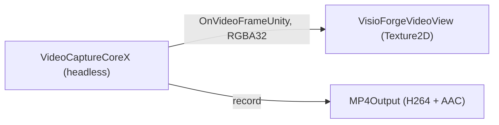
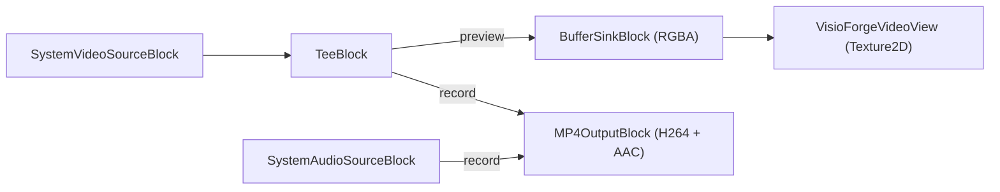

# Capture a webcam in Unity with VideoCaptureCoreX

[Video Capture SDK .Net](https://www.visioforge.com/video-capture-sdk-net){ .md-button .md-button--primary target="_blank" }
[Media Blocks SDK .Net](https://www.visioforge.com/media-blocks-sdk-net){ .md-button target="_blank" }

The **`VideoCaptureX`** scene captures from a local webcam (and microphone) with the high-level
**`VideoCaptureCoreX`** engine, previews the live frames into a Unity `RawImage`, and records to an
MP4 file at the same time. You can also capture a webcam with the low-level **`MediaBlocksPipeline`**
API — that recipe is in [Capture with the Media Blocks pipeline](#capture-with-the-media-blocks-pipeline-low-level)
below. This article assumes you have imported the Unity package and applied the required project
settings; see [Using VisioForge in Unity](index.md) first.

!!! info "Platform support for local-camera capture"
    Local webcam/microphone capture in the Unity package targets **Windows** and **macOS
    Standalone** in this release. On **Android** and **iOS**, use the
    [IP / RTSP camera sample](rtsp-viewer.md) — `VideoCaptureCoreX` over RTSP works on all four
    platforms. Local device capture on Android/iOS depends on platform camera APIs that are not yet
    wired into the cross-platform package.

## The OnVideoFrameUnity event

`VideoCaptureCoreX` exposes the Unity-only **`OnVideoFrameUnity`** event: each frame arrives as
tightly packed **RGBA32** (`Stride == Width * 4`), ready for `Texture2D.LoadRawTextureData` with no
conversion. Subscribe before `StartAsync`.

## Run the sample

1. Connect a webcam, then open `Assets/Scenes/SampleScene.unity`.
2. In the **Hierarchy** select the **RawImage** GameObject — the `VideoCaptureXRecorder` component
   is attached to it.
3. In the **Inspector** set **Camera Index** and the **Output Path**.
4. Press **▶ Play** — the live camera renders into the Game view. Toggle recording with
   `StartRecordingAsync()` / `StopRecordingAsync()` (for example from a UI button).

## Inspector fields

| Field | Default | Description |
|---|---|---|
| **Camera Index** | `0` | Index into `DeviceEnumerator.VideoSourcesAsync()`. |
| **Capture Audio** | `true` | Capture and record audio from the default microphone. |
| **Record On Start** | `false` | Begin recording to file as soon as preview starts. |
| **Output Path** | *(empty)* | MP4 path. Empty → `<persistentDataPath>/capture.mp4`. |
| **Aspect Mode** | `Letterbox` | How the video is fitted into the `RawImage`. |

## The pipeline



The core of the preview + record setup:

```csharp
var cameras = await DeviceEnumerator.Shared.VideoSourcesAsync();

_capture = new VideoCaptureCoreX();
_capture.Video_Source = new VideoCaptureDeviceSourceSettings(cameras[cameraIndex]);

var audioSources = await DeviceEnumerator.Shared.AudioSourcesAsync();
if (audioSources.Length > 0)
    _capture.Audio_Source = audioSources[0].CreateSourceSettingsVC();

// Texture-ready RGBA32 frames straight into the view.
_capture.OnVideoFrameUnity += _videoView.OnFrameBuffer;

// Pre-register the MP4 output (autostart:false) so preview runs without recording.
_capture.Outputs_Add(new MP4Output(outputPath), autostart: false);

await _capture.StartAsync();
```

Recording is toggled at runtime so the preview keeps running independently of capture-to-file:

```csharp
await _capture.StartCaptureAsync(0, outputPath); // begin recording
await _capture.StopCaptureAsync(0);              // stop recording
```

## Capture with the Media Blocks pipeline (low-level)

`VideoCaptureCoreX` is the high-level engine. For full control over the pipeline you can capture the
same webcam with the low-level **`MediaBlocksPipeline`** API — the approach the
[SimplePlayer / RTSPViewer scenes](simple-player.md) use. There is no prebuilt webcam scene for this
path; add the recipe below to your own `MonoBehaviour` (model it on the bundled `MediaBlocksPlayer`):

A `TeeBlock` splits the camera video so it feeds the preview (`BufferSinkBlock`) and the recording
(`MP4OutputBlock`, which bundles the H.264 + AAC encoders and the MP4 muxer) at the same time. The
microphone is added straight to the MP4 output:



```csharp
_pipeline = new MediaBlocksPipeline();

// Capture sources
var cameras = await DeviceEnumerator.Shared.VideoSourcesAsync();
var videoSource = new SystemVideoSourceBlock(new VideoCaptureDeviceSourceSettings(cameras[cameraIndex]));

var mics = await DeviceEnumerator.Shared.AudioSourcesAsync();
var audioSource = new SystemAudioSourceBlock(mics[0].CreateSourceSettings());

// Preview: tightly packed RGBA frames into the Unity view
var videoSink = new BufferSinkBlock(VideoFormatX.RGBA);
videoSink.OnVideoFrameBuffer += _videoView.OnFrameBuffer;

// Record: H.264 video + AAC audio muxed to MP4
var mp4 = new MP4OutputBlock(outputPath);

// Tee the camera video to both the preview sink and the recording
var videoTee = new TeeBlock(2, MediaBlockPadMediaType.Video);
_pipeline.Connect(videoSource, videoTee);

// Preview branch — one tee output to the buffer sink
_pipeline.Connect(videoTee.Outputs[0], videoSink.Input);

// Record branch — MP4OutputBlock has no fixed inputs; call CreateNewInput once per stream
_pipeline.Connect(videoTee.Outputs[1], mp4.CreateNewInput(MediaBlockPadMediaType.Video));
_pipeline.Connect(audioSource.Output, mp4.CreateNewInput(MediaBlockPadMediaType.Audio));

await _pipeline.StartAsync();             // preview + recording both run
```

`MP4OutputBlock` starts with no input pads — each `CreateNewInput(MediaBlockPadMediaType.Video|Audio)`
call adds a typed input wired to the internal H.264 / AAC encoder, so create exactly one per stream.
`BufferSinkBlock.OnVideoFrameBuffer` has the same `VisioForgeVideoView.OnFrameBuffer` signature as the
engine's `OnVideoFrameUnity`, so the same view renders the preview. Drop the `videoTee` /
`MP4OutputBlock` / audio branch to preview only; or use the high-level `VideoCaptureCoreX` path above,
which lets you start and stop recording at runtime without rebuilding the pipeline. This low-level
path uses the same device source as the engine, so local-camera capture has the same
**Windows / macOS** scope.

## Per-platform Build Settings

=== "Windows"

    | Setting | Value |
    |---|---|
    | Architecture | x86_64 |
    | Api Compatibility Level | `.NET Standard 2.1` |
    | Scripting Backend | Mono *(default)* or IL2CPP |

    No manifest entry is required for camera access. See [Build for Windows](windows.md).

=== "macOS"

    | Setting | Value |
    |---|---|
    | Architecture | Universal arm64 + x86_64 |
    | Api Compatibility Level | `.NET Standard 2.1` |
    | Scripting Backend | Mono *(default)* or IL2CPP |
    | Privacy | Add camera + microphone usage descriptions / entitlements |

    The camera is selected through `avfvideosrc`. See [Build for macOS](macos.md).

## Frequently Asked Questions

### How do I record to a file?

The sample pre-registers an `MP4Output` and toggles capture with `StartCaptureAsync(0, path)` /
`StopCaptureAsync(0)`, so the live preview runs whether or not you are recording.

### Can I capture from a local camera on Android or iOS?

Not in this release. Use the [IP / RTSP camera sample](rtsp-viewer.md) on mobile —
`VideoCaptureCoreX` over RTSP works on all four platforms. Local device capture on Android/iOS is
planned for a future package.

### How do I pick a specific camera?

Set **Camera Index** to the device's position in `DeviceEnumerator.Shared.VideoSourcesAsync()`.

### Which encoders does it record with?

`MP4Output` defaults to H.264 video + AAC audio. Adjust the `MP4Output` settings for custom encoders.

## See Also

- [Using VisioForge in Unity](index.md) — package overview, setup, and how rendering works
- [View an IP / RTSP camera in Unity](rtsp-viewer.md) — `VideoCaptureCoreX` over RTSP (all platforms)
- [Play media in Unity with MediaPlayerCoreX](simple-player.md) — the high-level player sample
- [Edit and render in Unity](video-edit-x.md) — the VideoEditCoreX timeline sample
