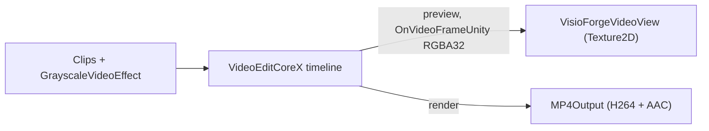

# Editar y renderizar video en Unity con VideoEditCoreX

[Video Edit SDK .Net](https://www.visioforge.com/video-edit-sdk-net){ .md-button .md-button--primary target="_blank" }

La escena **`VideoEditX`** combina clips en una línea de tiempo **`VideoEditCoreX`**, opcionalmente aplica un
efecto de escala de grises, y o bien **previsualiza** la línea de tiempo en un `RawImage` de Unity o la **renderiza** a
un archivo MP4. Este artículo asume que has importado el paquete de Unity y aplicado los ajustes de
proyecto necesarios; consulta primero [Uso de VisioForge en Unity](index.md).

## El evento OnVideoFrameUnity

`VideoEditCoreX` previsualiza la línea de tiempo en Unity a través del evento exclusivo de Unity **`OnVideoFrameUnity`**.
Como el motor está construido sobre GStreamer Editing Services, el ejemplo redirige el sink de video de la
vista previa a un capturador interno de fotogramas RGBA cuando el evento está suscrito y no hay archivo de salida
establecido. Los fotogramas son **RGBA32** empaquetados de forma compacta (`Stride == Width * 4`), listos para
`Texture2D.LoadRawTextureData`. En modo **render** (con un archivo de salida establecido) el evento está inactivo —
la línea de tiempo se codifica a disco tan rápido como el host lo permita.

## Ejecutar el ejemplo

1. Abre `Assets/Scenes/SampleScene.unity`.
2. En la **Hierarchy** selecciona el GameObject **RawImage** — el componente `VideoEditXRenderer` está
   adjunto a él.
3. En el **Inspector** establece **Clip 1** y **Clip 2** en archivos locales.
4. Deja **Render To File On Start** desactivado para **previsualizar** la línea de tiempo, o actívalo para **renderizar** un
   MP4. Pulsa **▶ Play**.

## Campos del Inspector

| Campo | Predeterminado | Descripción |
|---|---|---|
| **Clip 1** | `C:\Samples\clip1.mp4` | Primer clip (ruta absoluta). |
| **Clip 2** | `C:\Samples\clip2.mp4` | Segundo clip; déjalo vacío para un solo clip. |
| **Grayscale** | `true` | Aplicar un efecto de video en escala de grises a la línea de tiempo. |
| **Render To File On Start** | `false` | Renderizar a archivo en `Start()`; desactivado = vista previa en la textura. |
| **Output Path** | *(vacío)* | Ruta MP4 para el modo render. Vacío → `<persistentDataPath>/edited.mp4`. |
| **Output Width / Height** | `1920` / `1080` | Resolución de salida para el modo render. |
| **Output Frame Rate** | `30` | Velocidad de fotogramas de salida para el modo render. |
| **Aspect Mode** | `Letterbox` | Cómo se ajusta la vista previa en el `RawImage`. |

## La canalización



El núcleo de la construcción + ejecución:

```csharp
// VideoEditCoreX está construido sobre GStreamer Editing Services — inicializa GES una vez.
VideoEditCoreX.SDKInit();

_editor = new VideoEditCoreX();
_editor.Input_AddAudioVideoFile(clip1);
_editor.Input_AddAudioVideoFile(clip2);

if (grayscale)
    _editor.Video_Effects.Add(new GrayscaleVideoEffect());

if (renderToFile)
{
    _editor.Output_VideoSize = new Size(1920, 1080);
    _editor.Output_VideoFrameRate = new VideoFrameRate(30.0);
    _editor.Output_Format = new MP4Output(outputPath);
}
else
{
    // Modo vista previa: sin Output_Format → la línea de tiempo se reproduce en el capturador OnVideoFrameUnity.
    _editor.OnVideoFrameUnity += _videoView.OnFrameBuffer;
    _editor.Output_Format = null;
}

_editor.Start();
```

En modo render, suscríbete a `OnProgress` para los porcentajes de progreso y a `OnStop` para la finalización.

## Configuración de compilación por plataforma

=== "Windows"

    | Ajuste | Valor |
    |---|---|
    | Architecture | x86_64 |
    | Api Compatibility Level | `.NET Standard 2.1` |
    | Scripting Backend | Mono *(predeterminado)* o IL2CPP |

    Consulta [Compilar para Windows](windows.md).

=== "Android"

    | Ajuste | Valor |
    |---|---|
    | Architecture | arm64-v8a (**desmarca ARMv7**) |
    | Api Compatibility Level | `.NET Standard 2.1` |
    | Scripting Backend | **IL2CPP** (obligatorio) |

    Los clips deben residir en `Application.persistentDataPath`. Consulta [Compilar para Android](android.md).

=== "macOS"

    | Ajuste | Valor |
    |---|---|
    | Architecture | Universal arm64 + x86_64 |
    | Api Compatibility Level | `.NET Standard 2.1` |
    | Scripting Backend | Mono *(predeterminado)* o IL2CPP |

    Consulta [Compilar para macOS](macos.md).

=== "iOS"

    | Ajuste | Valor |
    |---|---|
    | Architecture | arm64 de dispositivo (Simulator no compatible) |
    | Api Compatibility Level | `.NET Standard 2.1` |
    | Scripting Backend | **IL2CPP** (obligatorio) |

    Los clips y la salida deben residir dentro del sandbox de la app. Consulta [Compilar para iOS](ios.md).

## Preguntas frecuentes

### ¿Cuál es la diferencia entre el modo vista previa y el modo render?

La vista previa (sin `Output_Format`) reproduce la línea de tiempo en vivo en el `RawImage` a través de
`OnVideoFrameUnity`. El render (`Output_Format` establecido en un `MP4Output`) codifica la línea de tiempo a un archivo
tan rápido como el host lo permita; no se produce vista previa en vivo durante un render.

### ¿Necesito una llamada de inicialización del SDK aparte?

Sí. Llama a `VideoEditCoreX.SDKInit()` una vez (además del `VisioForgeEnvironment.InitializeSdk()`
del paquete) — inicializa GStreamer Editing Services.

### ¿Cómo añado más clips o efectos?

Llama a `Input_AddAudioVideoFile` por cada clip y añade más entradas a `Video_Effects`. El ejemplo
usa un solo `GrayscaleVideoEffect` a modo de ilustración.

### ¿Cómo sé cuándo termina un render?

Suscríbete a `OnStop`; suscríbete a `OnProgress` para las actualizaciones de progreso durante el renderizado.

## Consulta también

- [Uso de VisioForge en Unity](index.md) — descripción general del paquete, configuración y cómo funciona el renderizado
- [Reproducir multimedia en Unity con MediaPlayerCoreX](simple-player.md) — el ejemplo de reproductor de alto nivel
- [Capturar una webcam en Unity](video-capture-x.md) — el ejemplo de grabador VideoCaptureCoreX
- [Ver una cámara IP / RTSP en Unity](rtsp-viewer.md) — `VideoCaptureCoreX` sobre RTSP
