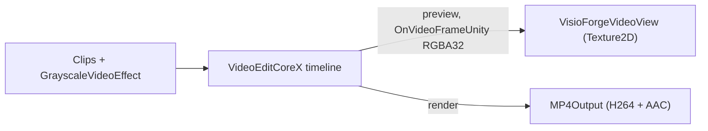

# Éditer et rendre une vidéo dans Unity avec VideoEditCoreX

[Video Edit SDK .Net](https://www.visioforge.com/video-edit-sdk-net){ .md-button .md-button--primary target="_blank" }

La scène **`VideoEditX`** assemble des clips sur un montage **`VideoEditCoreX`**, applique éventuellement
un effet de niveaux de gris, puis soit **affiche l'aperçu** du montage dans un `RawImage` Unity, soit le
**rend** dans un fichier MP4. Cet article suppose que vous avez importé le paquet Unity et appliqué les
paramètres de projet requis ; consultez d'abord [Utiliser VisioForge dans Unity](index.md).

## L'événement OnVideoFrameUnity

`VideoEditCoreX` affiche l'aperçu du montage dans Unity via l'événement **`OnVideoFrameUnity`** propre à
Unity. Comme le moteur repose sur GStreamer Editing Services, l'exemple redirige le puits vidéo d'aperçu
vers un capteur d'images RGBA interne lorsque l'événement est abonné et qu'aucun fichier de sortie n'est
défini. Les images sont en **RGBA32** compacté (`Stride == Width * 4`), prêtes pour
`Texture2D.LoadRawTextureData`. En mode **rendu** (un fichier de sortie est défini), l'événement est inactif —
le montage est encodé sur disque aussi vite que l'hôte le permet.

## Exécuter l'exemple

1. Ouvrez `Assets/Scenes/SampleScene.unity`.
2. Dans la **Hierarchy**, sélectionnez le GameObject **RawImage** — le composant `VideoEditXRenderer`
   y est attaché.
3. Dans l'**Inspector**, définissez **Clip 1** et **Clip 2** sur des fichiers locaux.
4. Laissez **Render To File On Start** désactivé pour **afficher l'aperçu** du montage, ou activez-le pour
   **rendre** un MP4. Appuyez sur **▶ Play**.

## Champs de l'Inspector

| Champ | Valeur par défaut | Description |
|---|---|---|
| **Clip 1** | `C:\Samples\clip1.mp4` | Premier clip (chemin absolu). |
| **Clip 2** | `C:\Samples\clip2.mp4` | Deuxième clip ; laissez vide pour un clip unique. |
| **Grayscale** | `true` | Applique un effet vidéo de niveaux de gris au montage. |
| **Render To File On Start** | `false` | Rend vers un fichier dans `Start()` ; désactivé = aperçu dans la texture. |
| **Output Path** | *(vide)* | Chemin MP4 pour le mode rendu. Vide → `<persistentDataPath>/edited.mp4`. |
| **Output Width / Height** | `1920` / `1080` | Résolution de sortie pour le mode rendu. |
| **Output Frame Rate** | `30` | Fréquence d'images de sortie pour le mode rendu. |
| **Aspect Mode** | `Letterbox` | Comment l'aperçu est ajusté dans le `RawImage`. |

## Le pipeline



Le cœur de la construction + exécution :

```csharp
// VideoEditCoreX repose sur GStreamer Editing Services — initialisez GES une seule fois.
VideoEditCoreX.SDKInit();

_editor = new VideoEditCoreX();
_editor.Input_AddAudioVideoFile(clip1);
_editor.Input_AddAudioVideoFile(clip2);

if (grayscale)
    _editor.Video_Effects.Add(new GrayscaleVideoEffect());

if (renderToFile)
{
    _editor.Output_VideoSize = new Size(1920, 1080);
    _editor.Output_VideoFrameRate = new VideoFrameRate(30.0);
    _editor.Output_Format = new MP4Output(outputPath);
}
else
{
    // Mode aperçu : pas d'Output_Format → le montage est lu dans le capteur OnVideoFrameUnity.
    _editor.OnVideoFrameUnity += _videoView.OnFrameBuffer;
    _editor.Output_Format = null;
}

_editor.Start();
```

En mode rendu, abonnez-vous à `OnProgress` pour les pourcentages de progression et à `OnStop` pour l'achèvement.

## Paramètres de build par plateforme

=== "Windows"

    | Paramètre | Valeur |
    |---|---|
    | Architecture | x86_64 |
    | Api Compatibility Level | `.NET Standard 2.1` |
    | Scripting Backend | Mono *(par défaut)* ou IL2CPP |

    Consultez [Compiler pour Windows](windows.md).

=== "Android"

    | Paramètre | Valeur |
    |---|---|
    | Architecture | arm64-v8a (**décochez ARMv7**) |
    | Api Compatibility Level | `.NET Standard 2.1` |
    | Scripting Backend | **IL2CPP** (obligatoire) |

    Les clips doivent résider sous `Application.persistentDataPath`. Consultez [Compiler pour Android](android.md).

=== "macOS"

    | Paramètre | Valeur |
    |---|---|
    | Architecture | Universal arm64 + x86_64 |
    | Api Compatibility Level | `.NET Standard 2.1` |
    | Scripting Backend | Mono *(par défaut)* ou IL2CPP |

    Consultez [Compiler pour macOS](macos.md).

=== "iOS"

    | Paramètre | Valeur |
    |---|---|
    | Architecture | arm64 sur appareil (le Simulateur n'est pas pris en charge) |
    | Api Compatibility Level | `.NET Standard 2.1` |
    | Scripting Backend | **IL2CPP** (obligatoire) |

    Les clips et la sortie doivent résider dans le bac à sable de l'application. Consultez [Compiler pour iOS](ios.md).

## Foire aux questions

### Quelle est la différence entre le mode aperçu et le mode rendu ?

L'aperçu (sans `Output_Format`) lit le montage en direct dans le `RawImage` via `OnVideoFrameUnity`. Le rendu
(`Output_Format` défini sur un `MP4Output`) encode le montage dans un fichier aussi vite que l'hôte le permet ;
aucun aperçu en direct n'est produit pendant un rendu.

### Ai-je besoin d'un appel d'initialisation du SDK distinct ?

Oui. Appelez `VideoEditCoreX.SDKInit()` une seule fois (en plus du `VisioForgeEnvironment.InitializeSdk()` du
paquet) — il initialise GStreamer Editing Services.

### Comment ajouter d'autres clips ou effets ?

Appelez `Input_AddAudioVideoFile` pour chaque clip et ajoutez d'autres entrées à `Video_Effects`. L'exemple
utilise un unique `GrayscaleVideoEffect` à titre d'illustration.

### Comment savoir quand un rendu se termine ?

Abonnez-vous à `OnStop` ; abonnez-vous à `OnProgress` pour les mises à jour de progression pendant le rendu.

## Voir aussi

- [Utiliser VisioForge dans Unity](index.md) — présentation du paquet, configuration et fonctionnement du rendu
- [Lire des médias dans Unity avec MediaPlayerCoreX](simple-player.md) — l'exemple de lecteur de haut niveau
- [Capturer une webcam dans Unity](video-capture-x.md) — l'exemple d'enregistreur VideoCaptureCoreX
- [Afficher une caméra IP / RTSP dans Unity](rtsp-viewer.md) — `VideoCaptureCoreX` via RTSP
