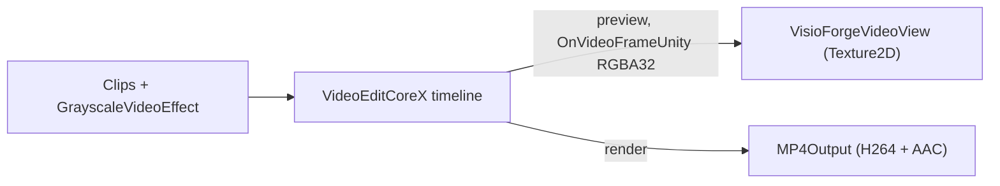

# Edit and render video in Unity with VideoEditCoreX

[Video Edit SDK .Net](https://www.visioforge.com/video-edit-sdk-net){ .md-button .md-button--primary target="_blank" }

The **`VideoEditX`** scene combines clips on a **`VideoEditCoreX`** timeline, optionally applies a
grayscale effect, and either **previews** the timeline into a Unity `RawImage` or **renders** it to
an MP4 file. This article assumes you have imported the Unity package and applied the required
project settings; see [Using VisioForge in Unity](index.md) first.

## The OnVideoFrameUnity event

`VideoEditCoreX` previews the timeline into Unity through the Unity-only **`OnVideoFrameUnity`**
event. Because the engine is built on GStreamer Editing Services, the sample redirects the preview
video sink to an internal RGBA frame grabber when the event is subscribed and no output file is
set. Frames are tightly packed **RGBA32** (`Stride == Width * 4`), ready for
`Texture2D.LoadRawTextureData`. In **render** mode (an output file is set) the event is inactive —
the timeline is encoded to disk as fast as the host allows.

## Run the sample

1. Open `Assets/Scenes/SampleScene.unity`.
2. In the **Hierarchy** select the **RawImage** GameObject — the `VideoEditXRenderer` component is
   attached to it.
3. In the **Inspector** set **Clip 1** and **Clip 2** to local files.
4. Leave **Render To File On Start** off to **preview** the timeline, or enable it to **render** an
   MP4. Press **▶ Play**.

## Inspector fields

| Field | Default | Description |
|---|---|---|
| **Clip 1** | `C:\Samples\clip1.mp4` | First clip (absolute path). |
| **Clip 2** | `C:\Samples\clip2.mp4` | Second clip; leave empty for a single clip. |
| **Grayscale** | `true` | Apply a grayscale video effect to the timeline. |
| **Render To File On Start** | `false` | Render to file on `Start()`; off = preview into the texture. |
| **Output Path** | *(empty)* | MP4 path for render mode. Empty → `<persistentDataPath>/edited.mp4`. |
| **Output Width / Height** | `1920` / `1080` | Output resolution for render mode. |
| **Output Frame Rate** | `30` | Output frame rate for render mode. |
| **Aspect Mode** | `Letterbox` | How the preview is fitted into the `RawImage`. |

## The pipeline



The core of the build + run:

```csharp
// VideoEditCoreX is built on GStreamer Editing Services — initialize GES once.
VideoEditCoreX.SDKInit();

_editor = new VideoEditCoreX();
_editor.Input_AddAudioVideoFile(clip1);
_editor.Input_AddAudioVideoFile(clip2);

if (grayscale)
    _editor.Video_Effects.Add(new GrayscaleVideoEffect());

if (renderToFile)
{
    _editor.Output_VideoSize = new Size(1920, 1080);
    _editor.Output_VideoFrameRate = new VideoFrameRate(30.0);
    _editor.Output_Format = new MP4Output(outputPath);
}
else
{
    // Preview mode: no Output_Format → the timeline plays into the OnVideoFrameUnity grabber.
    _editor.OnVideoFrameUnity += _videoView.OnFrameBuffer;
    _editor.Output_Format = null;
}

_editor.Start();
```

In render mode, subscribe to `OnProgress` for progress percentages and `OnStop` for completion.

## Per-platform Build Settings

=== "Windows"

    | Setting | Value |
    |---|---|
    | Architecture | x86_64 |
    | Api Compatibility Level | `.NET Standard 2.1` |
    | Scripting Backend | Mono *(default)* or IL2CPP |

    See [Build for Windows](windows.md).

=== "Android"

    | Setting | Value |
    |---|---|
    | Architecture | arm64-v8a (**uncheck ARMv7**) |
    | Api Compatibility Level | `.NET Standard 2.1` |
    | Scripting Backend | **IL2CPP** (mandatory) |

    Clips must live under `Application.persistentDataPath`. See [Build for Android](android.md).

=== "macOS"

    | Setting | Value |
    |---|---|
    | Architecture | Universal arm64 + x86_64 |
    | Api Compatibility Level | `.NET Standard 2.1` |
    | Scripting Backend | Mono *(default)* or IL2CPP |

    See [Build for macOS](macos.md).

=== "iOS"

    | Setting | Value |
    |---|---|
    | Architecture | device arm64 (Simulator not supported) |
    | Api Compatibility Level | `.NET Standard 2.1` |
    | Scripting Backend | **IL2CPP** (mandatory) |

    Clips and output must live inside the app sandbox. See [Build for iOS](ios.md).

## Frequently Asked Questions

### What is the difference between preview and render mode?

Preview (no `Output_Format`) plays the timeline live into the `RawImage` through
`OnVideoFrameUnity`. Render (`Output_Format` set to an `MP4Output`) encodes the timeline to a file
as fast as the host allows; live preview is not produced during a render.

### Do I need a separate SDK init call?

Yes. Call `VideoEditCoreX.SDKInit()` once (in addition to the package's
`VisioForgeEnvironment.InitializeSdk()`) — it initializes GStreamer Editing Services.

### How do I add more clips or effects?

Call `Input_AddAudioVideoFile` for each clip and add more entries to `Video_Effects`. The sample
uses a single `GrayscaleVideoEffect` for illustration.

### How do I know when a render finishes?

Subscribe to `OnStop`; subscribe to `OnProgress` for progress updates while rendering.

## See Also

- [Using VisioForge in Unity](index.md) — package overview, setup, and how rendering works
- [Play media in Unity with MediaPlayerCoreX](simple-player.md) — the high-level player sample
- [Capture a webcam in Unity](video-capture-x.md) — the VideoCaptureCoreX recorder sample
- [View an IP / RTSP camera in Unity](rtsp-viewer.md) — `VideoCaptureCoreX` over RTSP
