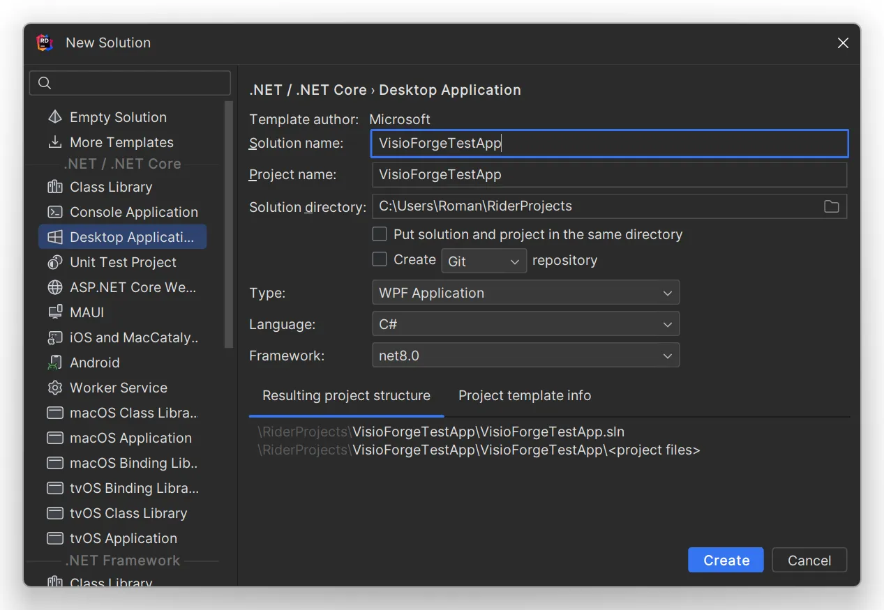
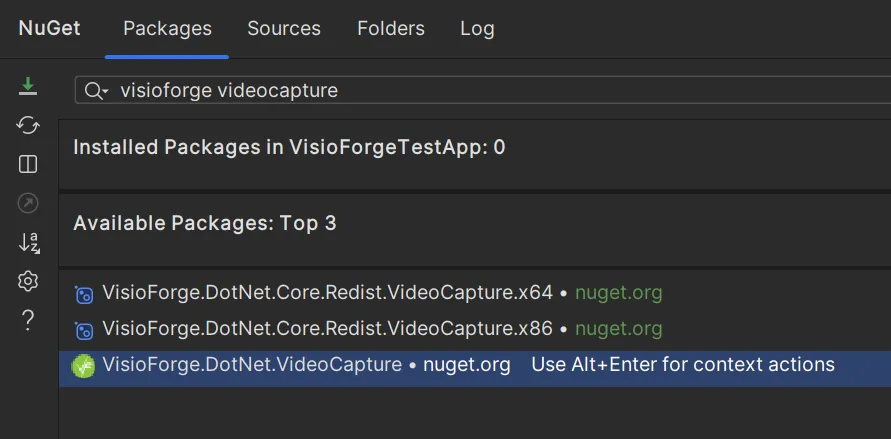

# Intégration des SDK .Net avec JetBrains Rider

## Introduction

[Video Capture SDK .Net](https://www.visioforge.com/video-capture-sdk-net){ .md-button .md-button--primary target="_blank" } [Video Edit SDK .Net](https://www.visioforge.com/video-edit-sdk-net){ .md-button .md-button--primary target="_blank" } [Media Blocks SDK .Net](https://www.visioforge.com/media-blocks-sdk-net){ .md-button .md-button--primary target="_blank" } [Media Player SDK .Net](https://www.visioforge.com/media-player-sdk-net){ .md-button .md-button--primary target="_blank" }

Ce guide complet vous accompagne pas à pas dans l'installation et la configuration des SDK VisioForge .Net au sein de JetBrains Rider, un puissant IDE multiplateforme pour le développement .NET. Bien que nous utilisions une application Windows en WPF comme exemple principal, ces étapes d'installation peuvent être facilement adaptées aux applications macOS, iOS ou Android. JetBrains Rider offre une expérience de développement cohérente sur Windows, macOS et Linux, ce qui en fait un excellent choix pour le développement .NET multiplateforme.

## Création de votre projet

### Mise en place d'une structure de projet moderne

Commencez par lancer JetBrains Rider et créer un nouveau projet. Pour ce tutoriel, nous utiliserons WPF (Windows Presentation Foundation) comme framework. Il est essentiel d'utiliser le format de projet moderne, qui offre une compatibilité accrue avec les SDK VisioForge et une expérience de développement plus rationalisée.

1. Ouvrez JetBrains Rider
2. Sélectionnez « Create New Solution » depuis l'écran d'accueil
3. Choisissez « WPF Application » parmi les modèles disponibles
4. Configurez les paramètres de votre projet en veillant à sélectionner le format de projet moderne
5. Cliquez sur « Create » pour générer la structure de votre projet



## Ajout des paquets NuGet requis

### Installation du paquet principal du SDK

Chaque SDK VisioForge dispose d'un paquet principal correspondant qui fournit les fonctionnalités essentielles. Vous devrez sélectionner le paquet approprié en fonction du SDK que vous utilisez.

1. Faites un clic droit sur votre projet dans l'Explorateur de solutions
2. Sélectionnez l'élément de menu « Manage NuGet Packages »
3. Dans le gestionnaire de paquets NuGet, recherchez le paquet VisioForge correspondant au SDK souhaité
4. Sélectionnez la dernière version stable et cliquez sur « Install »



### Paquets principaux disponibles

Choisissez parmi les paquets principaux suivants selon vos besoins de développement :

- [VisioForge.DotNet.VideoCapture](https://www.nuget.org/packages/VisioForge.DotNet.VideoCapture) — pour les applications nécessitant des fonctionnalités de capture vidéo
- [VisioForge.DotNet.VideoEdit](https://www.nuget.org/packages/VisioForge.DotNet.VideoEdit) — pour les applications d'édition et de traitement vidéo
- [VisioForge.DotNet.MediaPlayer](https://www.nuget.org/packages/VisioForge.DotNet.MediaPlayer) — pour les applications de lecture multimédia
- [VisioForge.DotNet.MediaBlocks](https://www.nuget.org/packages/VisioForge.DotNet.MediaBlocks) — pour les applications nécessitant des capacités modulaires de traitement multimédia

### Ajout du paquet d'interface utilisateur, si nécessaire

Le paquet principal du SDK contient les composants d'interface utilisateur de base pour WinForms, WPF, Android et Apple.

Pour les autres plateformes, vous devrez installer le paquet d'interface utilisateur correspondant à votre framework d'interface choisi.

### Paquets d'interface utilisateur disponibles

Selon votre plateforme cible et votre framework d'interface utilisateur, choisissez parmi ces paquets :

- Le paquet principal contient les composants d'interface utilisateur de base pour WinForms, WPF et Apple
- [VisioForge.DotNet.Core.UI.WinUI](https://www.nuget.org/packages/VisioForge.DotNet.Core.UI.WinUI) — pour les applications Windows utilisant le framework moderne WinUI
- [VisioForge.DotNet.Core.UI.MAUI](https://www.nuget.org/packages/VisioForge.DotNet.Core.UI.MAUI) — pour les applications multiplateformes utilisant .NET MAUI
- [VisioForge.DotNet.Core.UI.Avalonia](https://www.nuget.org/packages/VisioForge.DotNet.Core.UI.Avalonia) — pour les applications multiplateformes utilisant Avalonia UI

## Intégration du contrôle VideoView (optionnel)

### Ajout de capacités d'aperçu vidéo

Si votre application nécessite une fonctionnalité d'aperçu vidéo, vous devrez ajouter le contrôle VideoView à votre interface utilisateur. Cela peut se faire soit via le balisage XAML, soit par programmation dans votre fichier code-behind. Nous montrerons ci-dessous comment l'ajouter via XAML.

#### Étape 1 : ajouter l'espace de noms WPF

Tout d'abord, ajoutez la référence d'espace de noms nécessaire à votre fichier XAML :

```xml
xmlns:wpf="clr-namespace:VisioForge.Core.UI.WPF;assembly=VisioForge.Core"
```

#### Étape 2 : ajouter le contrôle VideoView

Ensuite, ajoutez le contrôle VideoView à votre disposition :

```xml
<wpf:VideoView 
    Width="640" 
    Height="480" 
    Margin="10,10,0,0" 
    HorizontalAlignment="Left" 
    VerticalAlignment="Top"/>
```

Ce contrôle fournit une zone d'affichage où le contenu vidéo peut être présenté en temps réel ; il est essentiel pour les applications de capture, d'édition ou de lecture vidéo.

## Ajout des paquets de redistribution requis

### Dépendances spécifiques à la plateforme

Selon votre plateforme cible, le produit choisi et le moteur spécifique que vous utilisez, des paquets de redistribution supplémentaires peuvent être nécessaires pour assurer un bon fonctionnement dans tous les environnements de déploiement.

Pour des informations complètes sur les paquets de redistribution requis pour votre scénario spécifique, consultez la page de documentation Déploiement pour le produit VisioForge sélectionné. Ces ressources fournissent des conseils détaillés sur :

- Les dépendances système requises
- Les considérations spécifiques à la plateforme
- Les stratégies d'optimisation du déploiement
- Les exigences d'exécution

Suivre ces directives de déploiement garantira que votre application fonctionnera correctement sur les systèmes utilisateurs sans dépendances manquantes ni erreurs d'exécution.

## Ressources supplémentaires

Pour davantage d'exemples et de guides d'implémentation détaillés, consultez notre [dépôt GitHub](https://github.com/visioforge/.Net-SDK-s-samples), qui contient de nombreux exemples de code illustrant diverses fonctionnalités et scénarios d'intégration.

Notre portail de documentation propose également des références d'API complètes, des tutoriels détaillés et des guides de bonnes pratiques pour tirer le meilleur parti des SDK VisioForge dans vos projets JetBrains Rider.

## Conclusion

En suivant ce guide d'installation, vous avez intégré avec succès les SDK VisioForge .Net à JetBrains Rider, posant ainsi les bases pour développer de puissantes applications multimédias. La combinaison des solides capacités de traitement multimédia de VisioForge et de l'environnement de développement intelligent de JetBrains Rider constitue une plateforme idéale pour créer des applications multimédias sophistiquées sur plusieurs plateformes.
