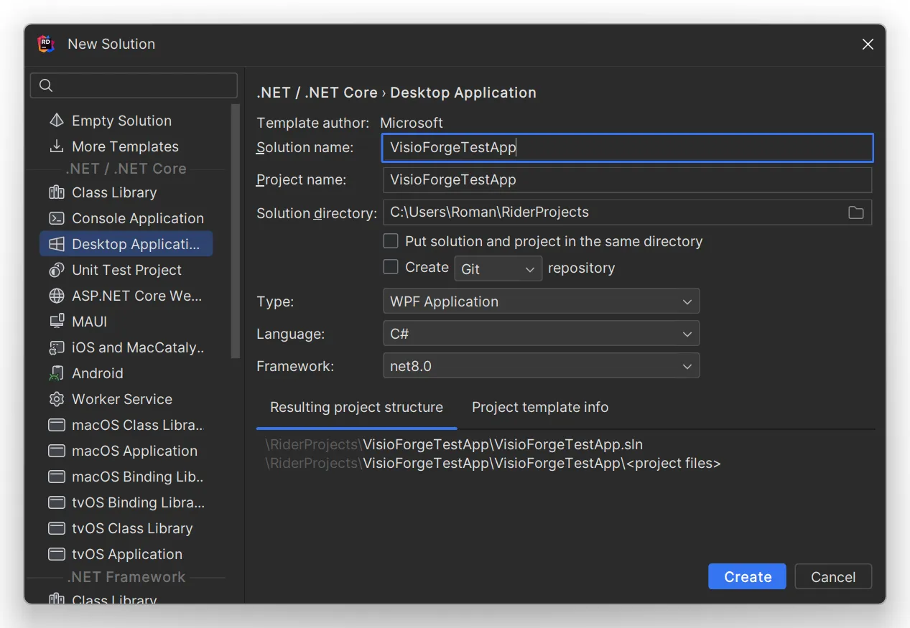
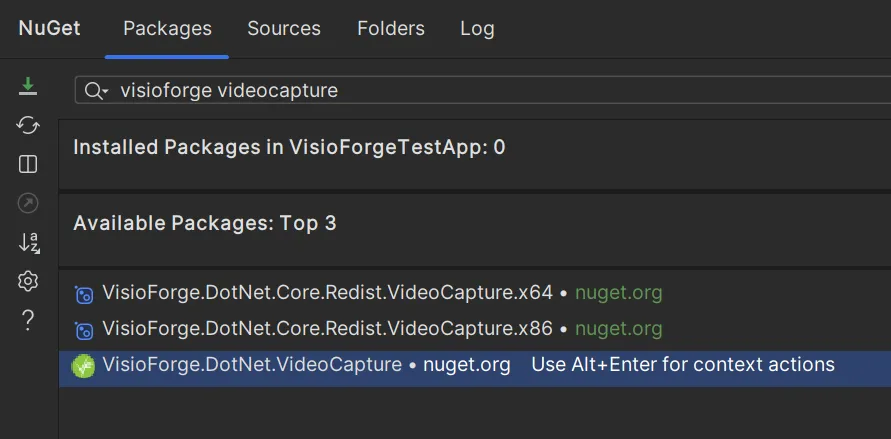

# .Net SDKs Integration with JetBrains Rider

## Introduction

[Video Capture SDK .Net](https://www.visioforge.com/video-capture-sdk-net){ .md-button .md-button--primary target="_blank" } [Video Edit SDK .Net](https://www.visioforge.com/video-edit-sdk-net){ .md-button .md-button--primary target="_blank" } [Media Blocks SDK .Net](https://www.visioforge.com/media-blocks-sdk-net){ .md-button .md-button--primary target="_blank" } [Media Player SDK .Net](https://www.visioforge.com/media-player-sdk-net){ .md-button .md-button--primary target="_blank" }

This comprehensive guide walks you through the process of installing and configuring VisioForge .Net SDKs within JetBrains Rider, a powerful cross-platform IDE for .NET development. While we'll use a Windows application with WPF as our primary example, these installation steps can be readily adapted for macOS, iOS, or Android applications as well. JetBrains Rider provides a consistent development experience across Windows, macOS, and Linux platforms, making it an excellent choice for cross-platform .NET development.

## Creating Your Project

### Setting Up a Modern Project Structure

Begin by launching JetBrains Rider and creating a new project. For this tutorial, we'll use WPF (Windows Presentation Foundation) as our framework. It's crucial to utilize the modern project format, which provides enhanced compatibility with VisioForge SDKs and offers a more streamlined development experience.

1. Open JetBrains Rider
2. Select "Create New Solution" from the welcome screen
3. Choose "WPF Application" from the available templates
4. Configure your project settings, ensuring you select the modern project format
5. Click "Create" to generate your project structure



## Adding Required NuGet Packages

### Installing the Main SDK Package

Each VisioForge SDK has a corresponding main package that provides core functionality. You'll need to select the appropriate package based on which SDK you're working with.

1. Right-click on your project in the Solution Explorer
2. Select the "Manage NuGet Packages" menu item
3. In the NuGet Package Manager, search for the VisioForge package that corresponds to your desired SDK
4. Select the latest stable version and click "Install"



### Available Main SDK Packages

Choose from the following main packages based on your development needs:

- [VisioForge.DotNet.VideoCapture](https://www.nuget.org/packages/VisioForge.DotNet.VideoCapture) - For applications requiring video capture functionality
- [VisioForge.DotNet.VideoEdit](https://www.nuget.org/packages/VisioForge.DotNet.VideoEdit) - For video editing and processing applications
- [VisioForge.DotNet.MediaPlayer](https://www.nuget.org/packages/VisioForge.DotNet.MediaPlayer) - For media playback applications
- [VisioForge.DotNet.MediaBlocks](https://www.nuget.org/packages/VisioForge.DotNet.MediaBlocks) - For applications requiring modular media processing capabilities

### Adding the UI Package, if needed

Main SDK package contains the core UI components for WinForms, WPF, Android, and Apple.

For other platforms, you'll need to install the appropriate UI package that corresponds to your chosen UI framework.

### Available UI Packages

Depending on your target platform and UI framework, choose from these UI packages:

- Core package contains the core UI components For WinForms, WPF, and Apple
- [VisioForge.DotNet.Core.UI.WinUI](https://www.nuget.org/packages/VisioForge.DotNet.Core.UI.WinUI) - For Windows applications using the modern WinUI framework
- [VisioForge.DotNet.Core.UI.MAUI](https://www.nuget.org/packages/VisioForge.DotNet.Core.UI.MAUI) - For cross-platform applications using .NET MAUI
- [VisioForge.DotNet.Core.UI.Avalonia](https://www.nuget.org/packages/VisioForge.DotNet.Core.UI.Avalonia) - For cross-platform applications using Avalonia UI

## Integrating VideoView Control (Optional)

### Adding Video Preview Capabilities

If your application requires video preview functionality, you'll need to add the VideoView control to your user interface. This can be accomplished either through XAML markup or programmatically in your code-behind file. Below, we'll demonstrate how to add it via XAML.

#### Step 1: Add the WPF Namespace

First, add the necessary namespace reference to your XAML file:

```xml
xmlns:wpf="clr-namespace:VisioForge.Core.UI.WPF;assembly=VisioForge.Core"
```

#### Step 2: Add the VideoView Control

Then, add the VideoView control to your layout:

```xml
<wpf:VideoView 
    Width="640" 
    Height="480" 
    Margin="10,10,0,0" 
    HorizontalAlignment="Left" 
    VerticalAlignment="Top"/>
```

This control provides a canvas where video content can be displayed in real-time, essential for applications that involve video capture, editing, or playback.

## Adding Required Redistribution Packages

### Platform-Specific Dependencies

Depending on your target platform, chosen product, and the specific engine you're utilizing, additional redistribution packages may be needed to ensure proper functionality across all deployment environments.

For comprehensive information about which redistribution packages are required for your specific scenario, please consult the Deployment documentation page for your selected VisioForge product. These resources provide detailed guidance on:

- Required system dependencies
- Platform-specific considerations
- Deployment optimization strategies
- Runtime requirements

Following these deployment guidelines will ensure your application functions correctly on end-user systems without missing dependencies or runtime errors.

## Additional Resources

For more examples and detailed implementation guides, visit our [GitHub repository](https://github.com/visioforge/.Net-SDK-s-samples), which contains numerous code samples demonstrating various features and integration scenarios.

Our documentation portal also offers comprehensive API references, detailed tutorials, and best practice guides to help you make the most of VisioForge SDKs in your JetBrains Rider projects.

## Conclusion

By following this installation guide, you've successfully integrated VisioForge .Net SDKs with JetBrains Rider, setting the foundation for developing powerful media applications. The combination of VisioForge's robust media processing capabilities and JetBrains Rider's intelligent development environment provides an ideal platform for creating sophisticated media applications across multiple platforms.
