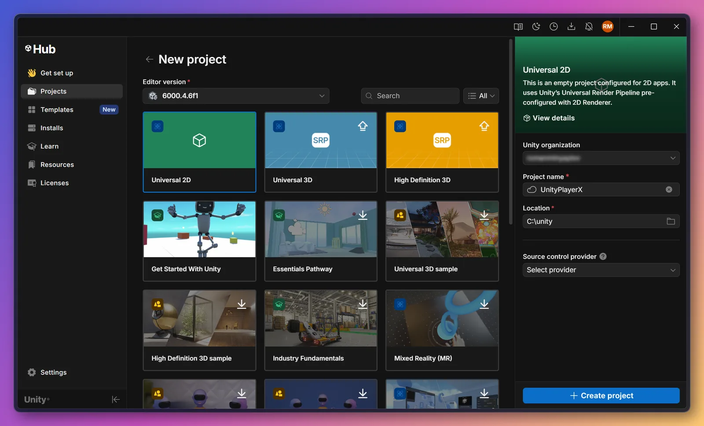
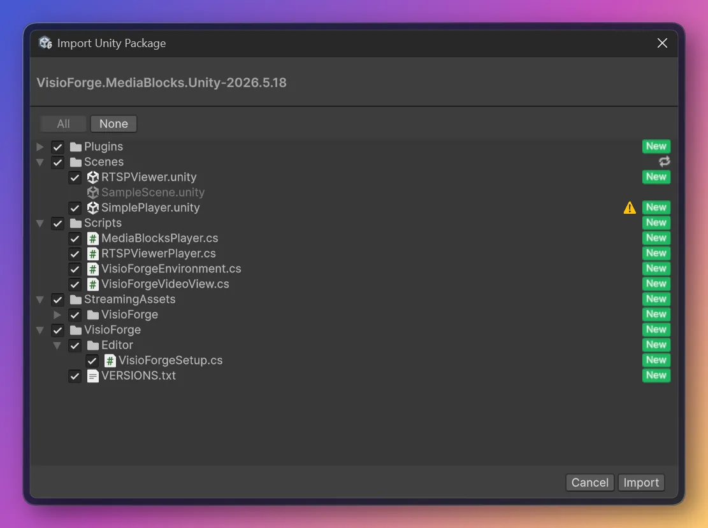
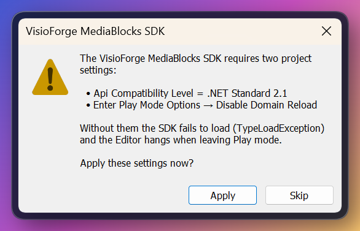
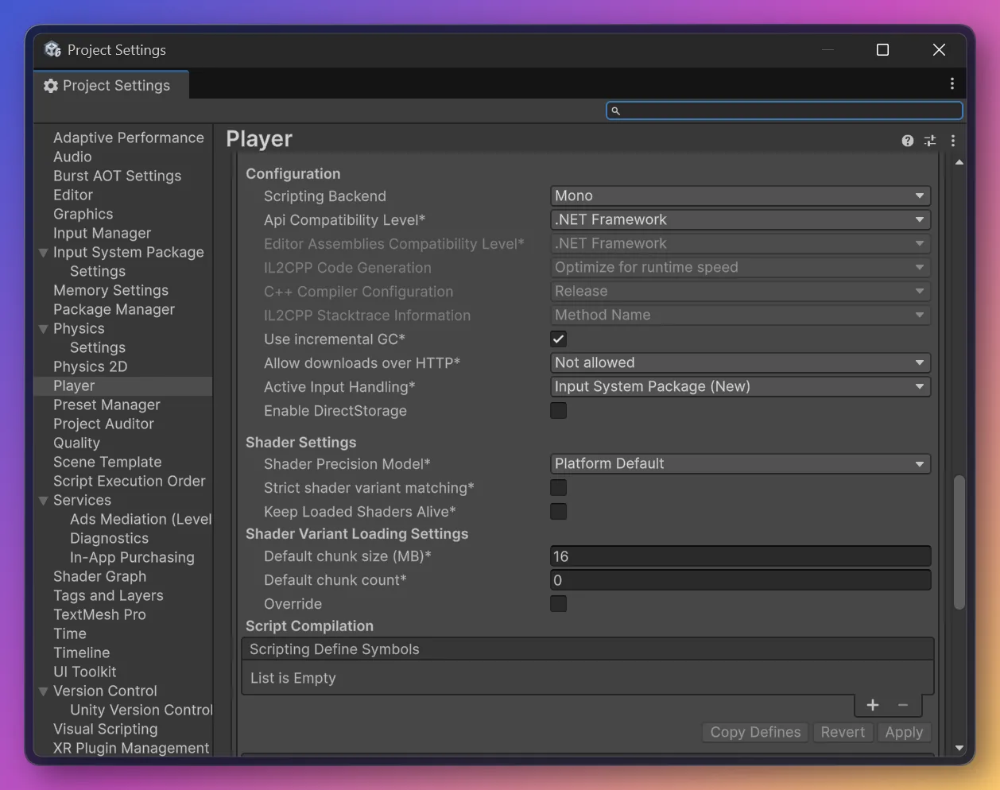
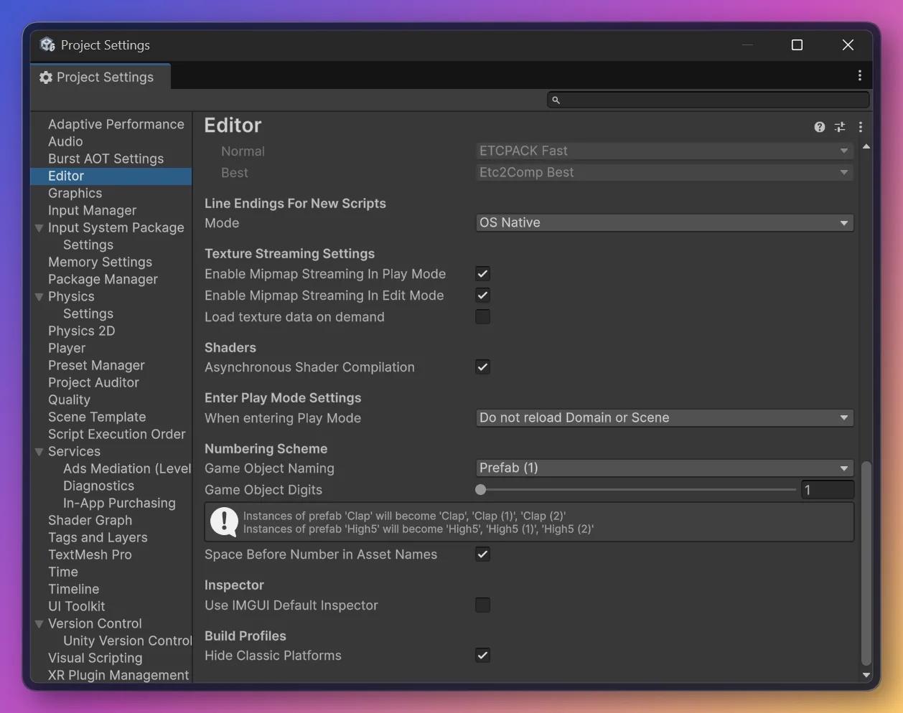
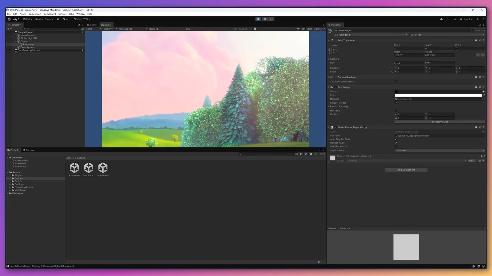

# Installer Media Blocks SDK dans Unity

[Media Blocks SDK .Net](https://www.visioforge.com/media-blocks-sdk-net){ .md-button .md-button--primary target="_blank" }

Ce guide décrit l'installation du **Media Blocks SDK .NET** dans **Unity 6** sur **Windows
x64**. Le SDK est livré sous forme de **`.unitypackage`** prêt à importer et entièrement autonome :
vous ne compilez rien à partir des sources, vous n'avez pas besoin de NuGet, et il n'y a aucune
dépendance externe à installer. Après l'import, ouvrez une scène d'exemple et appuyez sur **Play**.

Une fois l'installation effectuée, consultez les guides d'utilisation : [Lire un fichier multimédia dans Unity](../general/unity/simple-player.md)
et [Afficher une caméra RTSP dans Unity](../general/unity/rtsp-viewer.md).

## Prérequis

| | |
|---|---|
| Unity | **6 (6000.x)** — vérifié sur `6000.4.6f1` |
| Plateforme | **Windows x64** (Éditeur et lecteur autonome) |

!!! warning "Utilisez un chemin court sur NTFS — pas un volume Dev Drive / ReFS"
    L'import du paquet écrit des milliers de petits fichiers natifs, et l'import/compilation d'Unity
    génère de fortes E/S sur de petits fichiers. Sur un Dev Drive (ReFS), c'est **nettement plus
    lent** (un import à froid peut prendre plusieurs minutes au lieu de quelques secondes) et plus
    sujet à la condition de course `EPERM rename`. Conservez le projet sur un disque **NTFS**
    classique avec un chemin racine court, par exemple `C:\unity\MyApp`. Le cache de paquets d'Unity
    produit également des chemins profonds susceptibles de dépasser la limite Windows de 260
    caractères (`MAX_PATH`).

## Téléchargement

Téléchargez le dernier paquet :

[**VisioForge.MediaBlocks.Unity.unitypackage**](https://files.visioforge.com/unity/VisioForge.MediaBlocks.Unity.unitypackage)

```text
https://files.visioforge.com/unity/VisioForge.MediaBlocks.Unity.unitypackage
```

## Étape 1 — Créer ou ouvrir un projet Unity

Utilisez un projet Unity 6 existant ou créez-en un nouveau (n'importe quel modèle). Conservez la
racine du projet sur un chemin NTFS court (voir l'avertissement ci-dessus).



## Étape 2 — Importer le paquet

Dans l'Éditeur : **Assets → Import Package → Custom Package…**, sélectionnez le `.unitypackage`
téléchargé, puis cliquez sur **Import** (laissez tous les éléments cochés).



Le paquet ajoute :

| Contenu | Emplacement | Rôle |
|---|---|---|
| SDK managé (`net48`) + dépendances | `Assets/Plugins/` | les assemblies du Media Blocks SDK .NET |
| Runtime des bibliothèques natives du SDK, FFmpeg/libav inclus | `Assets/StreamingAssets/VisioForge/x64/` | le moteur multimédia ; copié à l'identique dans les builds autonomes |
| Scripts réutilisables | `Assets/Scripts/` | `VisioForgeEnvironment`, `VisioForgeVideoView` et les deux lecteurs |
| Deux scènes prêtes à l'emploi | `Assets/Scenes/` | `SimplePlayer` (fichier) et `RTSPViewer` (RTSP) |
| Assistant de configuration unique | `Assets/VisioForge/Editor/` | applique les deux réglages de projet requis |

## Étape 3 — Appliquer les réglages de projet requis

Au premier import, l'assistant de configuration affiche une boîte de dialogue proposant d'appliquer
deux réglages de projet requis. Cliquez sur **Apply** — les deux réglages sont configurés pour vous.



Ces deux réglages sont **obligatoires** — le SDK ne fonctionnera pas sans eux :

- **Api Compatibility Level = .NET Framework** — Unity 6 utilise par défaut `.NET Standard 2.1`, qui
  ne peut pas charger ce build `net48` du SDK (symptôme : `TypeLoadException` au lancement).
- **Disable Domain Reload** — le SDK s'initialise une fois par processus et est réutilisé d'une
  session Play/Stop à l'autre ; avec Domain Reload activé, l'Éditeur peut se figer en quittant le
  mode Play.

## Étape 4 — Définir les réglages manuellement (uniquement si vous avez cliqué sur Skip)

Si vous avez cliqué sur **Skip**, définissez les deux réglages à la main :

1. **Api Compatibility Level = .NET Framework**
   *Edit → Project Settings → Player → Other Settings → Configuration → Api Compatibility Level*.

   

2. **Disable Domain Reload**
   *Edit → Project Settings → Editor → Enter Play Mode Settings* → réglez **When entering Play Mode**
   sur une option qui ne recharge **pas** le domaine — soit **Reload Scene only** (équivalent à ce
   que fait **Apply**), soit **Do not reload Domain or Scene**.

   

## Étape 5 — Lancer une scène d'exemple

Dans la fenêtre **Project**, ouvrez `Assets/Scenes/SimplePlayer.unity` (double-cliquez dessus — ne
restez pas sur la scène par défaut vide), sélectionnez le GameObject **RawImage**, définissez son
**File Path** dans l'Inspector, puis appuyez sur **▶ Play**. La vidéo s'affiche dans la vue Game et
l'audio est diffusé via le périphérique par défaut du système.



!!! tip "Le RawImage semble vide tant que vous n'avez pas appuyé sur Play"
    La texture vidéo est créée à l'exécution, le `RawImage` est donc vierge (blanc) en mode édition.

Lisez ensuite les guides d'utilisation :

- [Lire un fichier multimédia dans Unity](../general/unity/simple-player.md) — l'exemple `SimplePlayer`.
- [Afficher une caméra RTSP dans Unity](../general/unity/rtsp-viewer.md) — l'exemple `RTSPViewer`.

## Builds autonomes

*File → Build Settings → Windows x64 → Build* produit un lecteur autonome qui fonctionne sans aucune
étape supplémentaire : le runtime natif présent dans `Assets/StreamingAssets/VisioForge/x64` est
copié à l'identique par Unity dans `<game>_Data/StreamingAssets/VisioForge/x64`, et les assemblies
managées de `Assets/Plugins` sont déployées automatiquement. Le même chemin de chargement se résout
aussi bien dans l'Éditeur que dans le build autonome.

## Désinstaller ou mettre à jour le paquet

Un `.unitypackage` n'a pas de désinstalleur : supprimez les fichiers manuellement.

1. **Fermez d'abord l'Éditeur Unity** — il verrouille les DLL natives et le cache `Library/`.
2. Supprimez le contenu VisioForge de `Assets/` :
   - `Assets/StreamingAssets/VisioForge/` — le runtime natif (~300 fichiers).
   - `Assets/VisioForge/` — l'assistant de configuration initiale.
   - Les quatre scripts réutilisables de `Assets/Scripts/` : `VisioForgeEnvironment.cs`,
     `VisioForgeVideoView.cs`, `MediaBlocksPlayer.cs`, `RTSPViewerPlayer.cs` (ainsi que leurs `.meta`)
     — conservez vos propres scripts éventuels situés dans le même dossier.
   - Les scènes d'exemple `Assets/Scenes/SimplePlayer.unity` et `Assets/Scenes/RTSPViewer.unity`.
   - Les assemblies VisioForge dans `Assets/Plugins/` (`VisioForge.*.dll`, `GstSharp.dll`,
     `GLibSharp.dll` et leurs dépendances, chacune avec son `.meta`). Ne supprimez tout le dossier
     `Assets/Plugins/` que s'il ne contient rien d'autre que des assemblies VisioForge.
3. Supprimez le dossier `Library/` du projet (à côté de `Assets/`) pour vider l'état d'importation
   en cache. Unity le régénère à la prochaine ouverture (le premier lancement est plus lent).

**Mise à jour :** importez le nouveau `.unitypackage` par-dessus l'ancien — les GUID des plugins
managés sont déterministes, Unity écrase donc les assets existants sur place et les références sont
préservées. Si vous venez d'un paquet bien plus ancien ou que vous voyez des DLL dupliquées dans
`Assets/Plugins/`, effectuez d'abord une suppression propre (étapes ci-dessus), puis importez le nouveau paquet.

## Résolution des problèmes

| Symptôme | Cause | Correctif |
|---|---|---|
| `TypeLoadException` au lancement | Api Compatibility Level vaut `.NET Standard 2.1` | Réglez-le sur `.NET Framework`, ou réimportez et cliquez sur **Apply** |
| L'Éditeur se fige sur « Reloading domain » au Play/Stop | Domain Reload est activé | Conservez Disable Domain Reload activé |
| L'Éditeur plante au 2e Play | Le SDK a été arrêté au Stop puis réinitialisé | N'arrêtez pas le SDK au Stop ; conservez Disable Domain Reload activé |
| Runtime natif introuvable | Paquet importé partiellement | Réimportez le paquet avec tous les éléments cochés |
| Pas de vidéo, erreurs dans la Console après l'import | L'Éditeur a besoin d'un rechargement propre après le déploiement du runtime | Redémarrez l'Éditeur |
| L'Éditeur devient instable après une longue session d'édition | Recompilations répétées des scripts | Redémarrez l'Éditeur |

## Limitations connues

- **Windows x64 uniquement** — le runtime natif fourni est destiné à Windows x64. Les autres
  plateformes ne sont pas encore prises en charge par le paquet.

## Foire aux questions

### Puis-je installer le SDK dans Unity via NuGet ?

Non. Unity n'exécute pas de restauration NuGet, et le SDK comprend environ 300 fichiers natifs que
NuGet ne déploierait pas pour Unity. Le `.unitypackage` regroupe tout — assemblies managées, runtime
natif, scripts et scènes — vous importez donc un seul fichier.

### Dois-je installer GStreamer ou une autre dépendance système ?

Non. Le paquet est entièrement autonome ; tout ce dont le SDK a besoin s'y trouve. Une installation
système de GStreamer sur votre machine n'est pas requise et n'est pas utilisée par le runtime fourni.

### Les autres SDK VisioForge fonctionnent-ils dans Unity ?

Aujourd'hui, le paquet Unity embarque le runtime du **Media Blocks SDK .NET**, qui couvre la
lecture, la capture, le traitement et le streaming. Les autres SDK VisioForge suivront.

## Voir aussi

- [Utiliser VisioForge dans Unity](../general/unity/index.md) — présentation du fonctionnement de l'intégration
- [Lire un fichier multimédia dans Unity](../general/unity/simple-player.md) — l'exemple de lecture de fichier
- [Afficher une caméra RTSP dans Unity](../general/unity/rtsp-viewer.md) — l'exemple RTSP
- [Présentation du Media Blocks SDK .NET](../mediablocks/index.md) — le catalogue complet des blocs
- [Guide d'installation](index.md) — installer le SDK dans d'autres types de projets .NET
