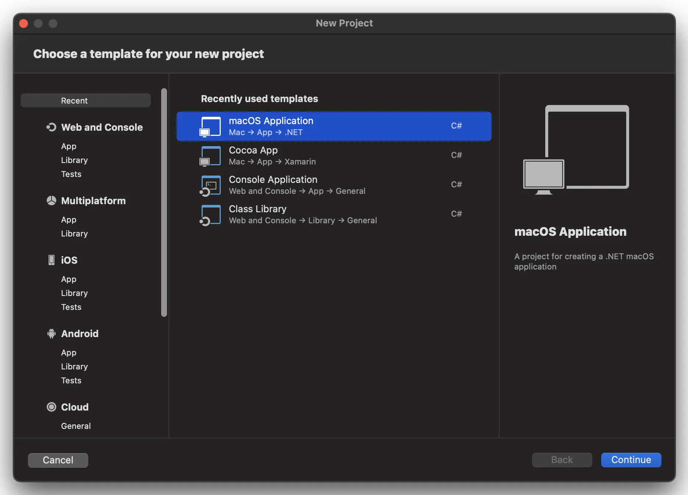
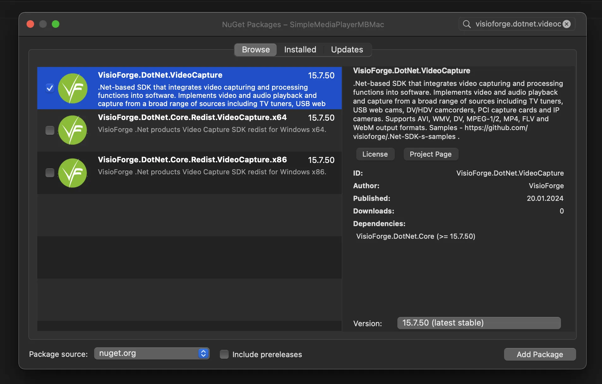
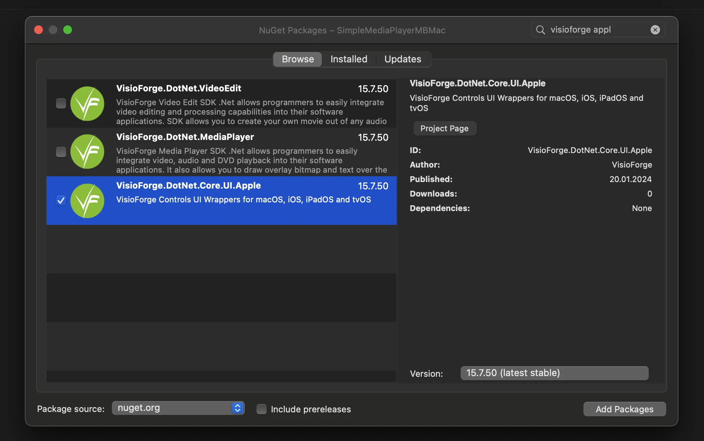
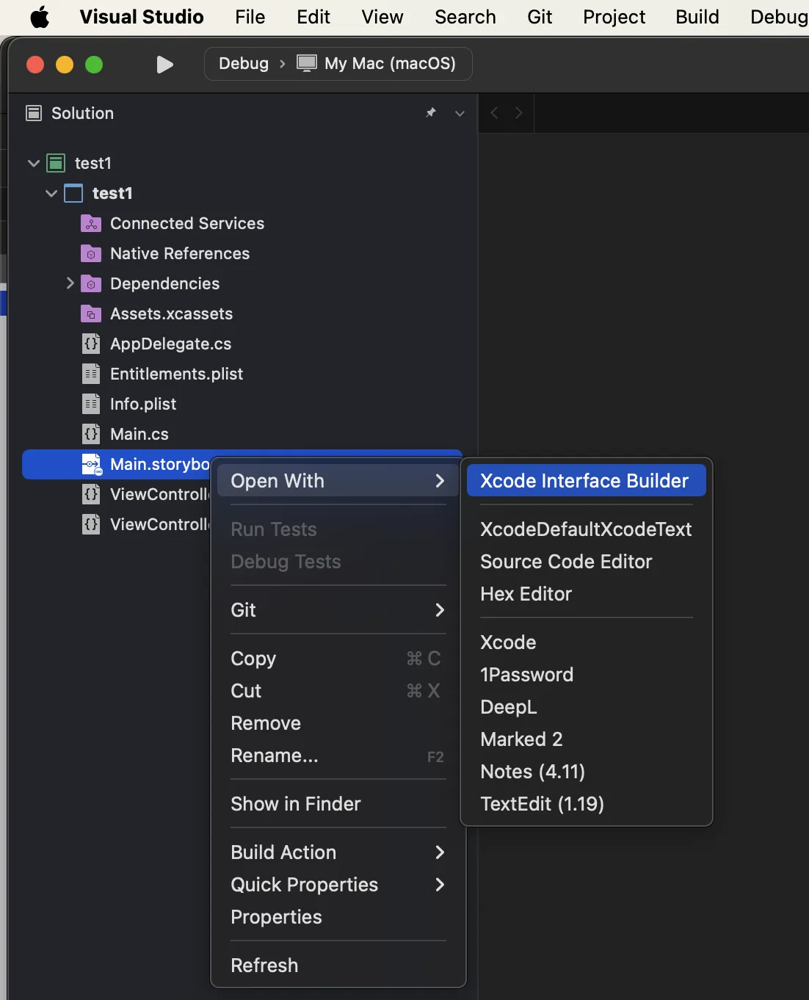
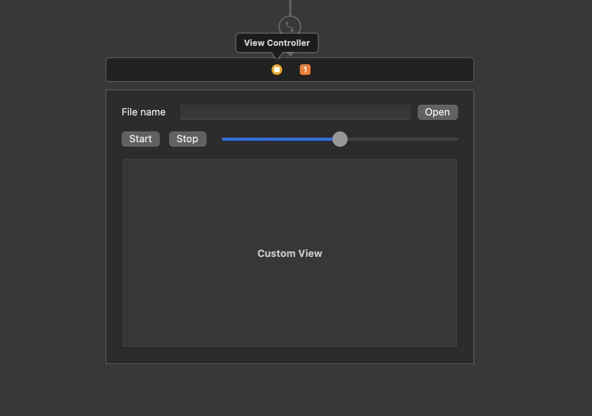

# Guide complet d'intégration des SDK VisioForge .NET avec Visual Studio pour Mac

[Video Capture SDK .Net](https://www.visioforge.com/video-capture-sdk-net){ .md-button .md-button--primary target="_blank" } [Video Edit SDK .Net](https://www.visioforge.com/video-edit-sdk-net){ .md-button .md-button--primary target="_blank" } [Media Blocks SDK .Net](https://www.visioforge.com/media-blocks-sdk-net){ .md-button .md-button--primary target="_blank" } [Media Player SDK .Net](https://www.visioforge.com/media-player-sdk-net){ .md-button .md-button--primary target="_blank" }

!!! warning "Visual Studio pour Mac est abandonné"
    Microsoft a [abandonné Visual Studio pour Mac](https://learn.microsoft.com/en-us/visualstudio/releases/2022/what-happened-to-vs-for-mac) le 31 août 2024. Aucune nouvelle installation n'est possible et l'IDE ne reçoit plus de mises à jour. Pour le développement .NET macOS avec les SDK VisioForge, utilisez plutôt **[JetBrains Rider](./rider.md)** ou **Visual Studio Code avec le C# Dev Kit**. Les noms de paquets NuGet, les contrôles d'interface utilisateur et les extraits C# de cette page s'appliquent à l'identique à ces IDE.

## Introduction aux SDK VisioForge sur macOS

VisioForge propose de puissants SDK multimédias pour les développeurs .NET travaillant sur les plateformes macOS et iOS. Ce guide détaillé vous accompagne tout au long du processus d'intégration de ces SDK dans vos projets Visual Studio pour Mac. Bien que ce tutoriel se concentre principalement sur le développement d'applications macOS, les mêmes principes s'appliquent aux applications iOS avec des adaptations minimales.

En suivant ce guide, vous apprendrez à configurer correctement votre environnement de développement, à installer les paquets nécessaires, à configurer les composants d'interface utilisateur et à préparer votre application pour le déploiement. Ces connaissances constitueront une base solide pour créer des applications multimédias sophistiquées à l'aide de la technologie VisioForge.

## Prérequis pour le développement

Avant de commencer le processus d'intégration, assurez-vous de disposer de :

- Visual Studio pour Mac (dernière version recommandée)
- Le SDK .NET installé (version minimale 6.0)
- Des connaissances de base en C# et en développement .NET
- Un accès administrateur à votre système macOS
- Une connexion Internet active pour télécharger les paquets NuGet
- Facultatif : XCode pour l'édition des storyboards

Avoir ces prérequis en place garantira un processus d'installation fluide et évitera les problèmes de configuration courants.

## Création d'un nouveau projet macOS

Commençons par créer un nouveau projet macOS dans Visual Studio pour Mac. Il servira de base à notre intégration du SDK VisioForge.

### Création de la structure du projet

1. Lancez Visual Studio pour Mac.
2. Sélectionnez **File > New Solution** dans la barre de menus.
3. Dans la boîte de dialogue de sélection de modèle, accédez à **.NET > App**.
4. Choisissez **macOS Application** comme modèle de projet.
5. Configurez les paramètres de votre projet, notamment :
   - Le nom du projet (choisissez un nom descriptif)
   - L'identifiant d'organisation (généralement au format domaine inversé)
   - Le framework cible (.NET 6.0 ou ultérieur recommandé)
   - Le nom de la solution (peut correspondre à celui du projet)
6. Cliquez sur **Create** pour générer le modèle de projet.

Ceci crée une application macOS de base avec la structure de projet standard requise pour l'intégration du SDK VisioForge.



## Installation des paquets SDK VisioForge

Après avoir créé votre projet, l'étape suivante consiste à installer les paquets SDK VisioForge nécessaires via NuGet. Ces paquets contiennent les fonctionnalités essentielles et les composants d'interface utilisateur requis pour les opérations multimédias.

### Ajout du paquet principal du SDK

Chaque gamme de produits VisioForge dispose d'un paquet principal dédié qui contient les fonctionnalités essentielles. Vous devrez choisir le paquet approprié selon vos exigences de développement.

1. Faites un clic droit sur votre projet dans l'Explorateur de solutions.
2. Sélectionnez **Manage NuGet Packages** dans le menu contextuel.
3. Cliquez sur l'onglet **Browse** dans le gestionnaire de paquets NuGet.
4. Dans la zone de recherche, tapez « VisioForge » pour trouver tous les paquets disponibles.
5. Sélectionnez l'un des paquets suivants selon vos besoins :

Paquets NuGet disponibles :

- [VisioForge.DotNet.VideoCapture](https://www.nuget.org/packages/VisioForge.DotNet.VideoCapture) — pour la capture vidéo, la webcam et l'enregistrement d'écran
- [VisioForge.DotNet.VideoEdit](https://www.nuget.org/packages/VisioForge.DotNet.VideoEdit) — pour l'édition vidéo, le traitement et la conversion
- [VisioForge.DotNet.MediaPlayer](https://www.nuget.org/packages/VisioForge.DotNet.MediaPlayer) — pour la lecture multimédia et le streaming
- [VisioForge.DotNet.MediaBlocks](https://www.nuget.org/packages/VisioForge.DotNet.MediaBlocks) — pour les workflows de traitement multimédia avancés

6. Cliquez sur **Add Package** pour installer le paquet sélectionné.
7. Acceptez les contrats de licence qui apparaissent.

Le processus d'installation résoudra automatiquement les dépendances et ajoutera les références à votre projet.



### Contrôles d'interface utilisateur Apple

Pour les applications macOS et iOS, les contrôles d'interface utilisateur spécifiques à Apple (`VideoView`, `GLView`) sont **livrés à l'intérieur du paquet principal `VisioForge.DotNet.Core`** — il n'existe pas de paquet NuGet `UI.Apple` séparé. Une fois `VisioForge.DotNet.Core` ajouté ci-dessus, référencez les contrôles via l'espace de noms `VisioForge.Core.UI.Apple` :

```csharp
using VisioForge.Core.UI.Apple;
```



## Intégration des capacités d'aperçu vidéo

La plupart des applications multimédias nécessitent une fonctionnalité d'aperçu vidéo. Les SDK VisioForge fournissent des contrôles spécialisés à cet effet qui s'intègrent parfaitement aux applications macOS.

### Ajout du contrôle VideoView

Le contrôle VideoView est le composant principal pour afficher du contenu vidéo dans votre application. Voici comment l'ajouter à votre interface :

1. Ouvrez le fichier de storyboard principal de votre application en double-cliquant dessus dans l'Explorateur de solutions.
2. Visual Studio pour Mac ouvrira XCode Interface Builder pour l'édition du storyboard.
3. Depuis la bibliothèque d'objets, trouvez le contrôle **Custom View**.
4. Glissez le contrôle Custom View sur votre fenêtre à l'endroit où la vidéo doit apparaître.
5. Définissez les contraintes appropriées pour garantir une taille et un positionnement corrects.
6. À l'aide de l'inspecteur d'identité, attribuez un nom descriptif à votre Custom View (par exemple « videoViewHost »).
7. Enregistrez vos modifications et revenez à Visual Studio pour Mac.

Cette Custom View servira de conteneur au contrôle VideoView de VisioForge, qui sera ajouté par programmation.





### Initialisation du VideoView en code

Après avoir ajouté le conteneur Custom View, vous devez initialiser le contrôle VideoView par programmation :

1. Ouvrez votre fichier ViewController.cs.
2. Ajoutez les directives using nécessaires en haut du fichier :

```csharp
using VisioForge.Core.UI.Apple;
using CoreGraphics;
```

3. Ajoutez un champ privé à votre classe ViewController pour stocker la référence au VideoView :

```csharp
private VideoView _videoView;
```

4. Modifiez la méthode ViewDidLoad pour initialiser et ajouter le VideoView :

```csharp
public override void ViewDidLoad()
{
    base.ViewDidLoad();

    // Créer et ajouter le VideoView
    _videoView = new VideoView(new CGRect(0, 0, videoViewHost.Bounds.Width, videoViewHost.Bounds.Height));
    this.videoViewHost.AddSubview(_videoView);

    // Configurer les propriétés du VideoView
    _videoView.AutoresizingMask = Foundation.NSViewResizingMask.WidthSizable | Foundation.NSViewResizingMask.HeightSizable;

    // Code d'initialisation supplémentaire
    InitializeMediaComponents();
}

private async void InitializeMediaComponents()
{
    // Initialisez ici les composants de votre SDK VisioForge. Sur macOS, utilisez toujours les
    // moteurs X multiplateformes — les moteurs classiques VideoCaptureCore / MediaPlayerCore /
    // VideoEditCore sont réservés à Windows.
    await VisioForgeX.InitSDKAsync();

    // Par exemple, pour la lecture :
    // var player = new MediaPlayerCoreX(_videoView);
    // var settings = await UniversalSourceSettings.CreateAsync(new Uri("https://example.com/video.mp4"));
    // await player.OpenAsync(settings);
    // await player.PlayAsync();
}
```

Ce code crée une instance de `VideoView`, l'ajuste à la taille de votre vue conteneur et l'ajoute comme sous-vue. La propriété `AutoresizingMask` garantit que la vue vidéo se redimensionne correctement lorsque la taille de la fenêtre change.

## Ajout des paquets de redistribution requis

Les SDK VisioForge s'appuient sur diverses bibliothèques et composants natifs qui doivent être inclus dans le bundle de votre application. Ces dépendances varient en fonction du SDK spécifique que vous utilisez et de votre plateforme cible.

Consultez la [documentation de déploiement](../deployment-x/index.md) pour des informations détaillées sur les paquets de redistribution nécessaires à votre scénario spécifique.

## Résolution des problèmes courants

Si vous rencontrez des problèmes lors de l'installation ou de l'intégration, envisagez ces solutions courantes :

1. **Dépendances manquantes** : assurez-vous que tous les paquets de redistribution requis sont installés
2. **Erreurs de build** : vérifiez que votre projet cible une version .NET compatible
3. **Plantages à l'exécution** : recherchez d'éventuels problèmes d'initialisation spécifiques à la plateforme
4. **Affichage vidéo noir** : vérifiez que le VideoView est correctement initialisé et ajouté à la hiérarchie de vues
5. **Problèmes de performance** : envisagez d'activer l'accélération matérielle là où elle est disponible

Pour des conseils de dépannage plus spécifiques, consultez la documentation VisioForge ou contactez leur équipe de support.

## Étapes suivantes et ressources

Maintenant que vous avez intégré avec succès les SDK VisioForge dans votre projet Visual Studio pour Mac, vous pouvez explorer des fonctionnalités et capacités plus avancées :

- Créer des workflows de traitement vidéo personnalisés
- Mettre en œuvre des fonctionnalités d'enregistrement et de capture
- Développer des fonctionnalités sophistiquées d'édition multimédia
- Créer des applications de streaming multimédia

### Ressources supplémentaires

- Consultez notre [dépôt GitHub](https://github.com/visioforge/.Net-SDK-s-samples) pour des exemples de code et des projets d'illustration
- Rejoignez le [forum des développeurs](https://support.visioforge.com/) pour échanger avec d'autres développeurs
- Abonnez-vous à notre newsletter pour recevoir les mises à jour sur les nouvelles fonctionnalités et les bonnes pratiques

En suivant ce guide, vous avez établi une base solide pour développer de puissantes applications multimédias sous macOS et iOS à l'aide des SDK VisioForge et de Visual Studio pour Mac.
