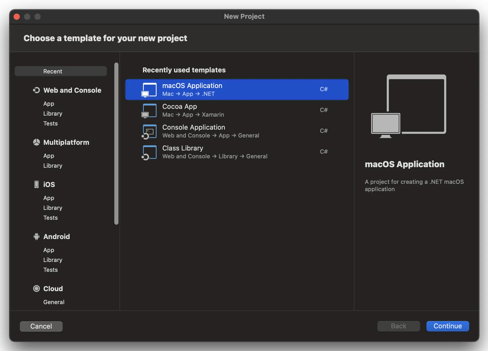
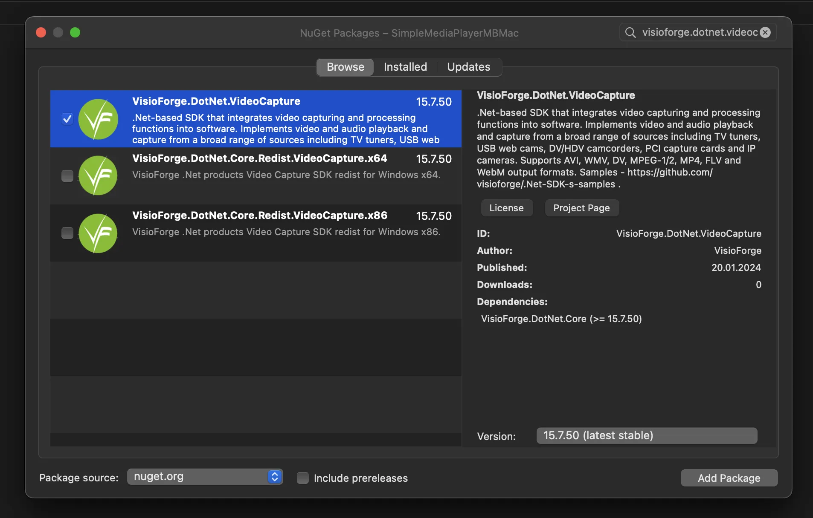
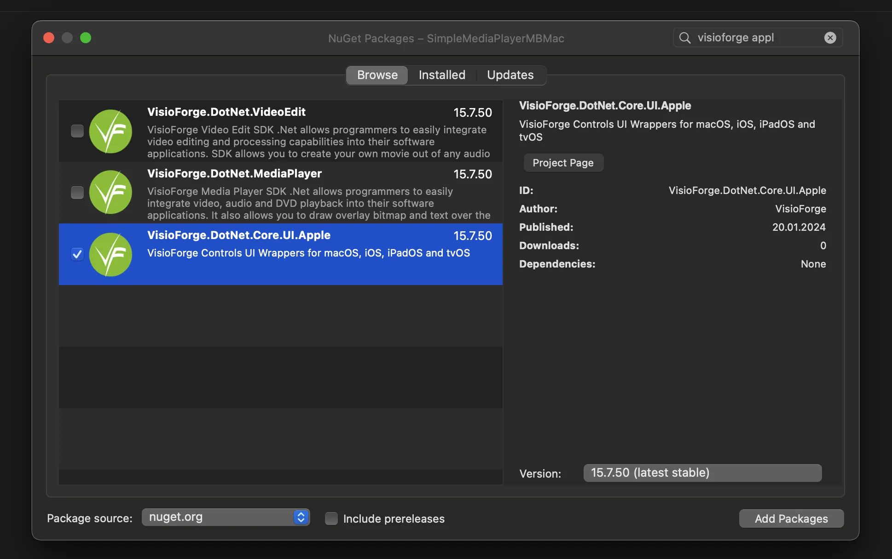
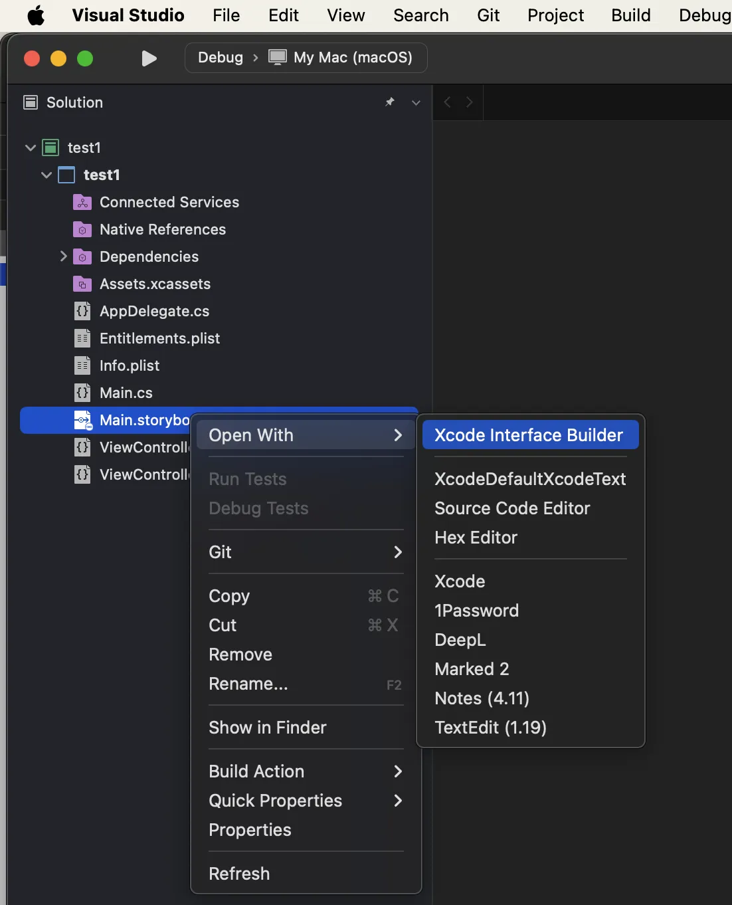
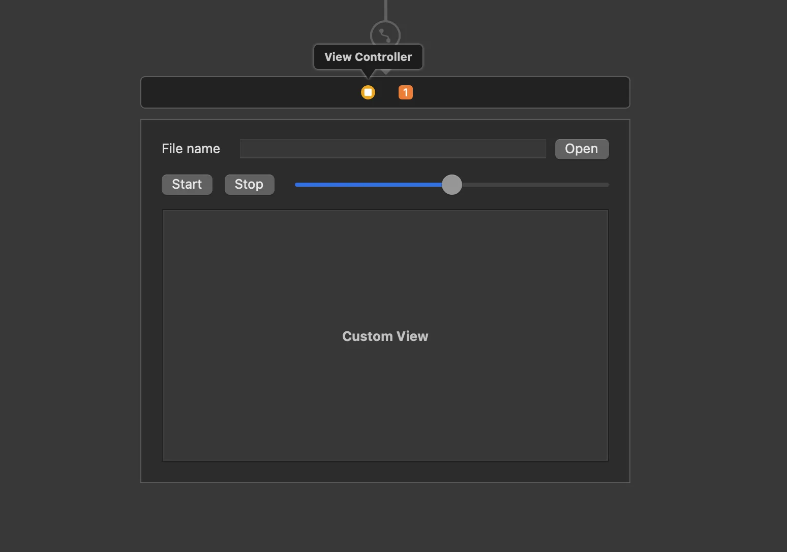

# Complete Guide to Integrating VisioForge .NET SDKs with Visual Studio for Mac

[Video Capture SDK .Net](https://www.visioforge.com/video-capture-sdk-net){ .md-button .md-button--primary target="_blank" } [Video Edit SDK .Net](https://www.visioforge.com/video-edit-sdk-net){ .md-button .md-button--primary target="_blank" } [Media Blocks SDK .Net](https://www.visioforge.com/media-blocks-sdk-net){ .md-button .md-button--primary target="_blank" } [Media Player SDK .Net](https://www.visioforge.com/media-player-sdk-net){ .md-button .md-button--primary target="_blank" }

## Introduction to VisioForge SDKs on macOS

VisioForge provides powerful multimedia SDKs for .NET developers working on macOS and iOS platforms. This detailed guide will walk you through the entire process of integrating these SDKs into your Visual Studio for Mac projects. While this tutorial primarily focuses on macOS application development, the same principles apply to iOS applications with minimal adaptations.

By following this guide, you'll learn how to properly set up your development environment, install the necessary packages, configure UI components, and prepare your application for deployment. This knowledge will serve as a solid foundation for building sophisticated multimedia applications using VisioForge technology.

## Prerequisites for Development

Before starting the integration process, ensure you have:

- Visual Studio for Mac (latest version recommended)
- .NET SDK installed (minimum version 6.0)
- Basic knowledge of C# and .NET development
- Administrative access to your macOS system
- Active internet connection for NuGet package downloads
- Optional: XCode for storyboard editing

Having these prerequisites in place will ensure a smooth installation process and prevent common setup issues.

## Setting Up a New macOS Project

Let's begin by creating a new macOS project in Visual Studio for Mac. This will serve as the foundation for our VisioForge SDK integration.

### Creating the Project Structure

1. Launch Visual Studio for Mac.
2. Select **File > New Solution** from the menu bar.
3. In the template selection dialog, navigate to **.NET > App**.
4. Choose **macOS Application** as your project template.
5. Configure your project settings, including:
   - Project name (choose something descriptive)
   - Organization identifier (typically in reverse domain format)
   - Target framework (.NET 6.0 or later recommended)
   - Solution name (can match your project name)
6. Click **Create** to generate your project template.

This creates a basic macOS application with the standard project structure required for VisioForge SDK integration.



## Installing VisioForge SDK Packages

After creating your project, the next step is to install the necessary VisioForge SDK packages via NuGet. These packages contain the core functionality and UI components required for multimedia operations.

### Adding the Main SDK Package

Each VisioForge product line has a dedicated main package that contains the core functionality. You'll need to choose the appropriate package based on your development requirements.

1. Right-click on your project in the Solution Explorer.
2. Select **Manage NuGet Packages** from the context menu.
3. Click on the **Browse** tab in the NuGet Package Manager.
4. In the search box, type "VisioForge" to find all available packages.
5. Select one of the following packages based on your requirements:

Available NuGet packages:

- [VisioForge.DotNet.VideoCapture](https://www.nuget.org/packages/VisioForge.DotNet.VideoCapture) - For video capture, webcam, and screen recording functionality
- [VisioForge.DotNet.VideoEdit](https://www.nuget.org/packages/VisioForge.DotNet.VideoEdit) - For video editing, processing, and conversion
- [VisioForge.DotNet.MediaPlayer](https://www.nuget.org/packages/VisioForge.DotNet.MediaPlayer) - For media playback and streaming
- [VisioForge.DotNet.MediaBlocks](https://www.nuget.org/packages/VisioForge.DotNet.MediaBlocks) - For advanced media processing workflows

6. Click **Add Package** to install your selected package.
7. Accept any license agreements that appear.

The installation process will automatically resolve dependencies and add references to your project.



### Adding the Apple UI Package

For macOS and iOS applications, you'll need the Apple-specific UI components that allow VisioForge SDKs to integrate with native UI elements.

1. In the NuGet Package Manager, search for "VisioForge.DotNet.UI.Apple".
2. Select the package from the results list.
3. Click **Add Package** to install.

This package includes specialized controls designed specifically for Apple platforms, ensuring proper visual integration and performance optimization.



## Integrating Video Preview Capabilities

Most multimedia applications require video preview functionality. VisioForge SDKs provide specialized controls for this purpose that integrate seamlessly with macOS applications.

### Adding the VideoView Control

The VideoView control is the primary component for displaying video content in your application. Here's how to add it to your interface:

1. Open your application's main storyboard file by double-clicking it in the Solution Explorer.
2. Visual Studio for Mac will open XCode Interface Builder for storyboard editing.
3. From the Object Library, find the **Custom View** control.
4. Drag the Custom View control onto your window where you want the video to appear.
5. Set appropriate constraints to ensure proper sizing and positioning.
6. Using the Identity Inspector, set a descriptive name for your Custom View (e.g., "videoViewHost").
7. Save your changes and return to Visual Studio for Mac.

This Custom View will serve as a container for the VisioForge VideoView control, which will be added programmatically.





### Initializing the VideoView in Code

After adding the container Custom View, you need to initialize the VideoView control programmatically:

1. Open your ViewController.cs file.
2. Add the necessary using directives at the top of the file:

```csharp
using VisioForge.Core.UI.Apple;
using CoreGraphics;
```

3. Add a private field to your ViewController class to hold the VideoView reference:

```csharp
private VideoViewGL _videoView;
```

4. Modify the ViewDidLoad method to initialize and add the VideoView:

```csharp
public override void ViewDidLoad()
{
    base.ViewDidLoad();

    // Create and add VideoView
    _videoView = new VideoViewGL(new CGRect(0, 0, videoViewHost.Bounds.Width, videoViewHost.Bounds.Height));
    this.videoViewHost.AddSubview(_videoView);
    
    // Configure VideoView properties
    _videoView.AutoresizingMask = Foundation.NSViewResizingMask.WidthSizable | Foundation.NSViewResizingMask.HeightSizable;
    _videoView.BackgroundColor = NSColor.Black;
    
    // Additional initialization code
    InitializeMediaComponents();
}

private void InitializeMediaComponents()
{
    // Initialize your VisioForge SDK components here
    // For example, for MediaPlayer:
    // var player = new MediaPlayer();
    // player.VideoView = _videoView;
    // Additional configuration...
}
```

This code creates a new VideoViewGL instance (optimized for hardware acceleration), sizes it to match your container view, and adds it as a subview. The AutoresizingMask property ensures that the video view resizes properly when the window size changes.

## Adding Required Redistribution Packages

VisioForge SDKs rely on various native libraries and components that must be included in your application bundle. These dependencies vary based on the specific SDK you're using and your target platform.

Check the [deployment documentation](../deployment-x/index.md) for detailed information on which redistribution packages are required for your specific scenario.

## Troubleshooting Common Issues

If you encounter issues during installation or integration, consider these common solutions:

1. **Missing dependencies**: Ensure all required redistribution packages are installed
2. **Build errors**: Verify that your project targets a compatible .NET version
3. **Runtime crashes**: Check for platform-specific initialization issues
4. **Black video display**: Verify that the VideoView is properly initialized and added to the view hierarchy
5. **Performance issues**: Consider enabling hardware acceleration where available

For more specific troubleshooting guidance, refer to the VisioForge documentation or contact their support team.

## Next Steps and Resources

Now that you've successfully integrated VisioForge SDKs into your Visual Studio for Mac project, you can explore more advanced features and capabilities:

- Create custom video processing workflows
- Implement recording and capture functionality
- Develop sophisticated media editing features
- Build streaming media applications

### Additional Resources

- Visit our [GitHub repository](https://github.com/visioforge/.Net-SDK-s-samples) for code samples and example projects
- Join the [developer forum](https://support.visioforge.com/) to connect with other developers
- Subscribe to our newsletter for updates on new features and best practices

By following this guide, you've established a solid foundation for developing powerful multimedia applications on macOS and iOS using VisioForge SDKs and Visual Studio for Mac.
