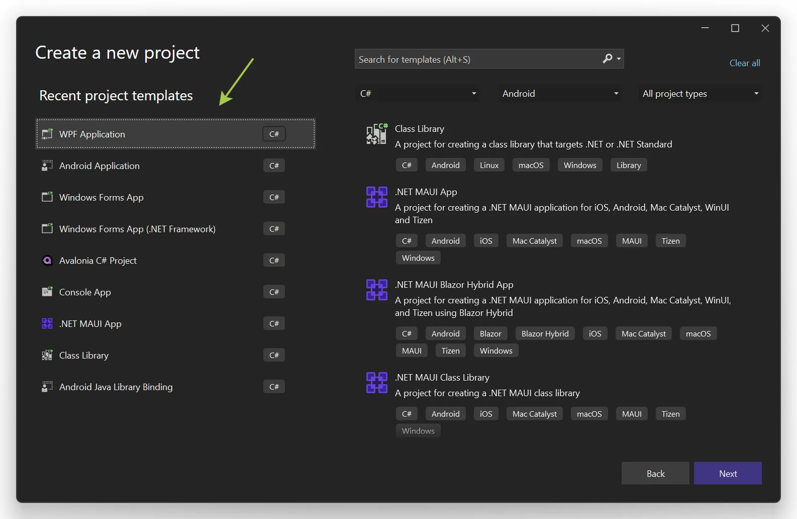
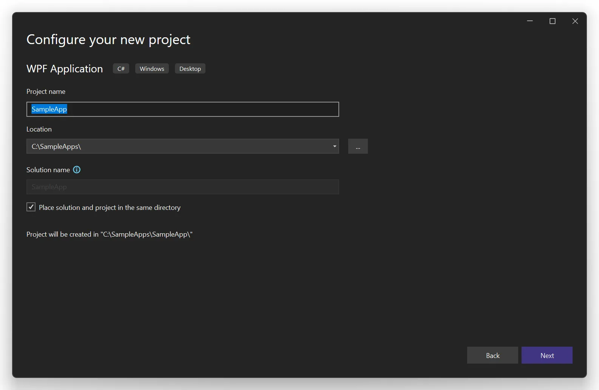
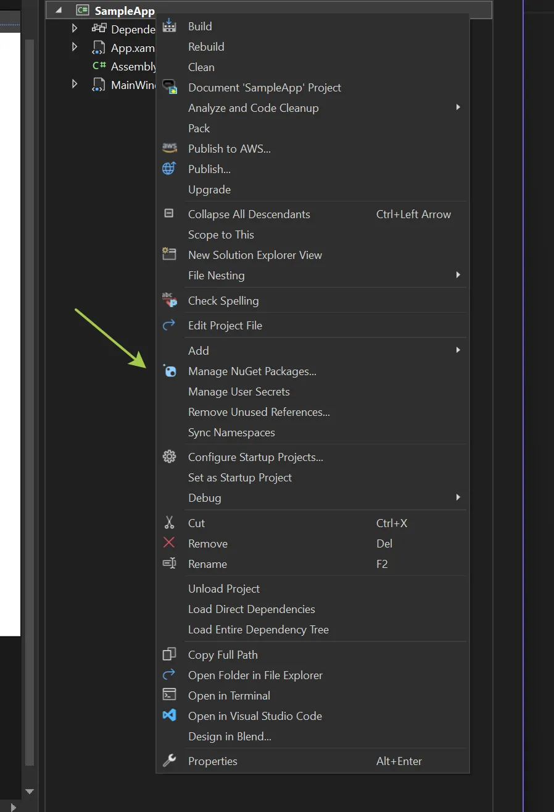
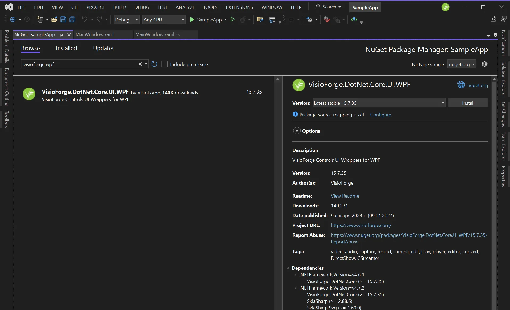
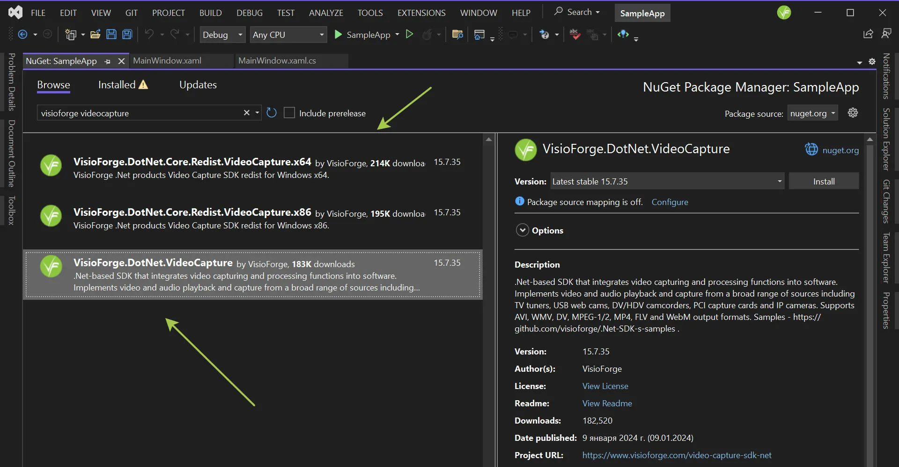
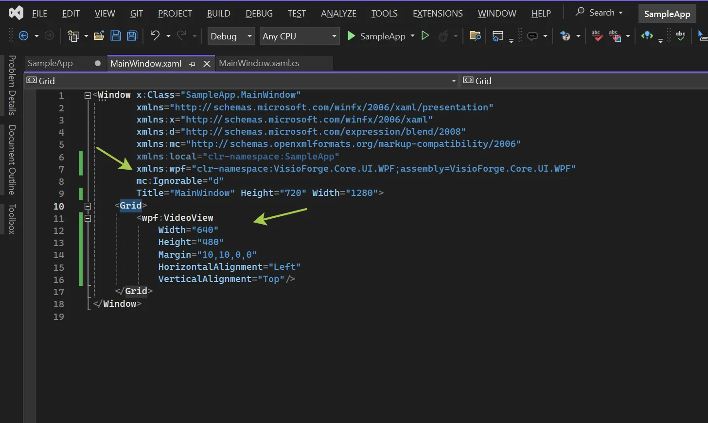
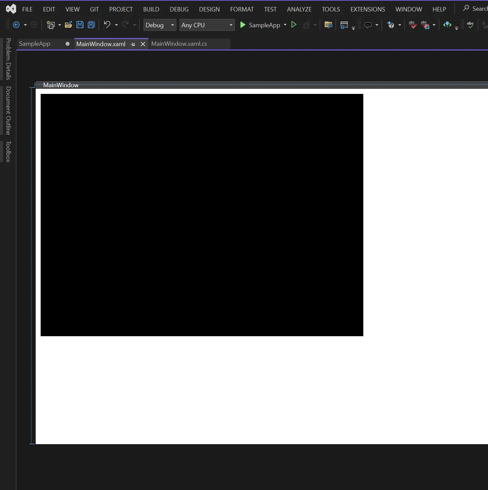
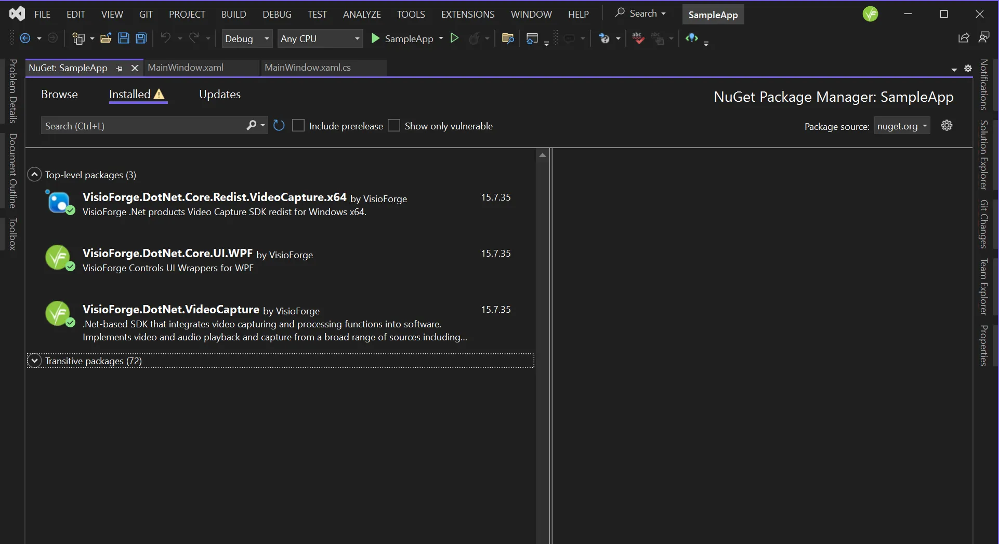

# Guide complet d'intégration des SDK .NET avec Visual Studio

[Video Capture SDK .Net](https://www.visioforge.com/video-capture-sdk-net){ .md-button .md-button--primary target="_blank" } [Video Edit SDK .Net](https://www.visioforge.com/video-edit-sdk-net){ .md-button .md-button--primary target="_blank" } [Media Blocks SDK .Net](https://www.visioforge.com/media-blocks-sdk-net){ .md-button .md-button--primary target="_blank" } [Media Player SDK .Net](https://www.visioforge.com/media-player-sdk-net){ .md-button .md-button--primary target="_blank" }

## Introduction aux SDK VisioForge .NET

VisioForge propose une suite puissante de SDK multimédias pour les développeurs .NET, qui permet de créer des applications riches en fonctionnalités avec des capacités avancées de capture vidéo, d'édition, de lecture et de traitement multimédia. Ce guide complet vous accompagne tout au long du processus d'intégration de ces SDK dans vos projets Visual Studio, pour une expérience de développement fluide.

Pour les développeurs professionnels travaillant sur des applications multimédias, une intégration correcte de ces SDK est cruciale pour des performances et des fonctionnalités optimales. Notre approche recommandée consiste à utiliser les paquets NuGet, qui simplifient la gestion des dépendances et garantissent l'accès aux dernières fonctionnalités et corrections de bugs.

## Aperçu des méthodes d'installation

Il existe deux méthodes principales pour installer les SDK VisioForge .NET :

1. **Installation par paquet NuGet** (recommandée) : approche moderne et rationalisée qui gère automatiquement les dépendances et simplifie les mises à jour.
2. **Installation manuelle** : approche traditionnelle pour des scénarios spécialisés, généralement non recommandée pour la plupart des projets.

Nous couvrirons les deux méthodes en détail, mais nous encourageons fortement l'approche NuGet pour la plupart des scénarios de développement.

## Installation par paquet NuGet (méthode recommandée)

NuGet est le gestionnaire de paquets pour .NET ; il offre un moyen centralisé d'intégrer des bibliothèques à vos projets sans la complexité de la gestion manuelle des fichiers. Voici un guide détaillé pour intégrer les SDK VisioForge via NuGet.

### Étape 1 : créer ou ouvrir votre projet .NET

Tout d'abord, vous aurez besoin d'un projet WinForms, WPF ou autre projet .NET. Nous recommandons d'utiliser le format de projet moderne de type SDK pour une compatibilité optimale.

#### Création d'un nouveau projet

1. Lancez Visual Studio (2019 ou 2022 recommandé)
2. Sélectionnez « Create a new project »
3. Filtrez les modèles par « C# » et soit « WPF », soit « Windows Forms »
4. Choisissez « WPF Application » ou « Windows Forms Application » avec le framework .NET Core/5/6+
5. Veillez à sélectionner le format de projet moderne de type SDK (c'est le format par défaut dans les versions récentes de Visual Studio)



#### Configuration du projet

Après avoir créé un nouveau projet, vous devrez configurer les paramètres de base :

1. Saisissez le nom de votre projet (utilisez un nom descriptif pertinent pour votre application)
2. Choisissez un emplacement approprié et un nom de solution
3. Sélectionnez votre framework cible (.NET 6 ou plus récent recommandé pour de meilleures performances et fonctionnalités)
4. Cliquez sur « Create » pour générer la structure du projet



### Étape 2 : accéder au gestionnaire de paquets NuGet

Une fois votre projet ouvert dans Visual Studio :

1. Faites un clic droit sur votre projet dans l'Explorateur de solutions
2. Sélectionnez « Manage NuGet Packages... » dans le menu contextuel
3. Le gestionnaire de paquets NuGet s'ouvrira dans le volet central

Cette interface propose des fonctions de recherche et de navigation pour trouver et installer facilement les composants VisioForge dont vous avez besoin.



### Étape 3 : installer le paquet d'interface utilisateur pour votre framework

Les SDK VisioForge proposent des composants d'interface utilisateur spécialisés pour différents frameworks .NET. Vous devrez sélectionner le paquet d'interface utilisateur approprié en fonction de votre type de projet.

1. Dans le gestionnaire de paquets NuGet, passez à l'onglet « Browse »
2. Recherchez « VisioForge.DotNet.Core.UI »
3. Sélectionnez le paquet d'interface utilisateur approprié pour votre type de projet parmi les résultats de la recherche



#### Paquets d'interface utilisateur disponibles

VisioForge prend en charge un large éventail de frameworks d'interface utilisateur. Choisissez celui qui correspond à votre projet :

- **[VisioForge.DotNet.Core.UI.WinUI](https://www.nuget.org/packages/VisioForge.DotNet.Core.UI.WinUI)** : pour les applications d'interface utilisateur Windows modernes
- **[VisioForge.DotNet.Core.UI.MAUI](https://www.nuget.org/packages/VisioForge.DotNet.Core.UI.MAUI)** : pour les applications multiplateformes utilisant .NET MAUI
- **[VisioForge.DotNet.Core.UI.Avalonia](https://www.nuget.org/packages/VisioForge.DotNet.Core.UI.Avalonia)** : pour les applications de bureau multiplateformes utilisant Avalonia UI

Ces paquets d'interface utilisateur fournissent les contrôles et composants nécessaires, spécialement conçus pour le rendu vidéo et l'interaction au sein de votre framework choisi.

### Étape 4 : installer le paquet SDK principal

Après avoir installé le paquet d'interface utilisateur, vous devrez ajouter le paquet SDK principal correspondant à vos besoins multimédias spécifiques :

1. Revenez à l'onglet « Browse » du gestionnaire de paquets NuGet
2. Recherchez le SDK VisioForge spécifique dont vous avez besoin (par exemple « VisioForge.DotNet.VideoCapture »)
3. Cliquez sur « Install » sur le paquet approprié



#### Paquets SDK principaux disponibles

Choisissez le SDK qui correspond aux exigences de votre application :

- **[VisioForge.DotNet.VideoCapture](https://www.nuget.org/packages/VisioForge.DotNet.VideoCapture)** : pour les applications devant capturer la vidéo depuis des caméras, enregistrer l'écran ou utiliser d'autres sources
- **[VisioForge.DotNet.VideoEdit](https://www.nuget.org/packages/VisioForge.DotNet.VideoEdit)** : pour les applications d'édition, de traitement et de conversion vidéo
- **[VisioForge.DotNet.MediaPlayer](https://www.nuget.org/packages/VisioForge.DotNet.MediaPlayer)** : pour créer des lecteurs multimédias avec des contrôles de lecture avancés
- **[VisioForge.DotNet.MediaBlocks](https://www.nuget.org/packages/VisioForge.DotNet.MediaBlocks)** : pour construire des pipelines complexes de traitement multimédia

Chaque paquet inclut une documentation complète, et vous pouvez installer plusieurs paquets si votre application nécessite des capacités multimédias variées.

### Étape 5 : implémenter le contrôle VideoView (optionnel)

Le contrôle VideoView est essentiel pour les applications qui doivent afficher du contenu vidéo. Vous pouvez l'ajouter à votre interface utilisateur via XAML (pour WPF) ou via le concepteur (pour WinForms).

#### Pour les applications WPF

Ajoutez l'espace de noms requis à votre fichier XAML :

```xml
xmlns:wpf="clr-namespace:VisioForge.Core.UI.WPF;assembly=VisioForge.Core"
```

Ajoutez ensuite le contrôle VideoView à votre disposition :

```xml
<wpf:VideoView 
    Width="640" 
    Height="480" 
    Margin="10,10,0,0" 
    HorizontalAlignment="Left" 
    VerticalAlignment="Top"/>
```



Le contrôle VideoView apparaîtra dans votre concepteur :



#### Pour les applications WinForms

1. Ouvrez le formulaire en mode concepteur
2. Localisez les contrôles VisioForge dans la boîte à outils (s'ils n'apparaissent pas, faites un clic droit sur la boîte à outils et sélectionnez « Choose Items... »)
3. Glissez-déposez le contrôle VideoView sur votre formulaire
4. Ajustez les propriétés de taille et de position selon les besoins

### Étape 6 : installer les paquets de redistribution requis

Selon votre implémentation spécifique, vous pourrez avoir besoin de paquets de redistribution supplémentaires :

1. Revenez au gestionnaire de paquets NuGet
2. Recherchez « VisioForge.DotNet.Core.Redist » pour voir les paquets de redistribution disponibles
3. Installez ceux qui sont pertinents pour votre plateforme et votre SDK



Les paquets de redistribution requis varient selon :

- Le système d'exploitation cible (Windows, macOS, Linux)
- Les besoins en accélération matérielle
- Les codecs et formats spécifiques que votre application utilisera
- La configuration du moteur backend

Consultez la page de documentation Déploiement pour le produit sélectionné afin de déterminer les paquets de redistribution nécessaires à votre application.

## Installation manuelle (méthode alternative)

Bien que nous ne recommandions généralement pas l'installation manuelle en raison de sa complexité et des risques de configuration, certains scénarios spécifiques peuvent l'exiger. Suivez ces étapes si NuGet n'est pas une option pour votre projet :

1. Téléchargez le [programme d'installation complet du SDK](https://files.visioforge.com/trials/visioforge_sdks_installer_dotnet_setup.exe) depuis notre site web
2. Exécutez le programme d'installation avec des privilèges administrateur et suivez les instructions à l'écran
3. Créez votre projet WinForms ou WPF dans Visual Studio
4. Ajoutez les références aux bibliothèques SDK installées :
   - Faites un clic droit sur « References » dans l'Explorateur de solutions
   - Sélectionnez « Add Reference »
   - Naviguez vers l'emplacement d'installation du SDK
   - Sélectionnez les fichiers DLL requis
5. Configurez la boîte à outils Visual Studio :
   - Faites un clic droit sur la boîte à outils et sélectionnez « Add Tab »
   - Nommez le nouvel onglet « VisioForge »
   - Faites un clic droit sur l'onglet et sélectionnez « Choose Items... »
   - Parcourez jusqu'au répertoire d'installation du SDK
   - Sélectionnez `VisioForge.Core.dll`
6. Glissez-déposez le contrôle VideoView sur votre formulaire ou fenêtre

Cette approche manuelle nécessite une configuration supplémentaire pour le déploiement et les mises à jour doivent être gérées manuellement.

## Configuration avancée et bonnes pratiques

Pour les applications de production, prenez en compte ces détails d'implémentation supplémentaires :

- **Gestion des licences** : mettez en œuvre une validation correcte de la licence au démarrage de l'application
- **Gestion des erreurs** : ajoutez une gestion complète des erreurs autour de l'initialisation et de l'utilisation du SDK
- **Optimisation des performances** : configurez l'accélération matérielle et le threading en fonction de vos appareils cibles
- **Gestion des ressources** : implémentez une libération correcte des ressources du SDK pour éviter les fuites mémoire

## Résolution des problèmes courants

Si vous rencontrez des problèmes lors de l'installation ou de l'implémentation :

- Vérifiez que votre projet cible une version .NET prise en charge
- Assurez-vous que tous les paquets redistribuables requis sont installés
- Vérifiez la compatibilité des versions des paquets NuGet
- Consultez la documentation du SDK pour connaître les exigences spécifiques à la plateforme

## Conclusion et étapes suivantes

Avec les SDK VisioForge .NET correctement installés dans votre projet Visual Studio, vous êtes maintenant prêt à tirer parti de leurs puissantes capacités multimédias. La méthode d'installation par NuGet garantit la présence des bonnes dépendances et simplifie les mises à jour ultérieures.

Pour approfondir vos connaissances et maximiser le potentiel de ces SDK :

- Explorez nos [exemples de code complets sur GitHub](https://github.com/visioforge/.Net-SDK-s-samples)
- Consultez la documentation spécifique à chaque produit pour les fonctionnalités avancées
- Rejoignez nos forums de la communauté des développeurs pour obtenir du support et partager les bonnes pratiques

En suivant ce guide, vous avez établi une base solide pour développer des applications multimédias sophistiquées avec VisioForge et Visual Studio.
