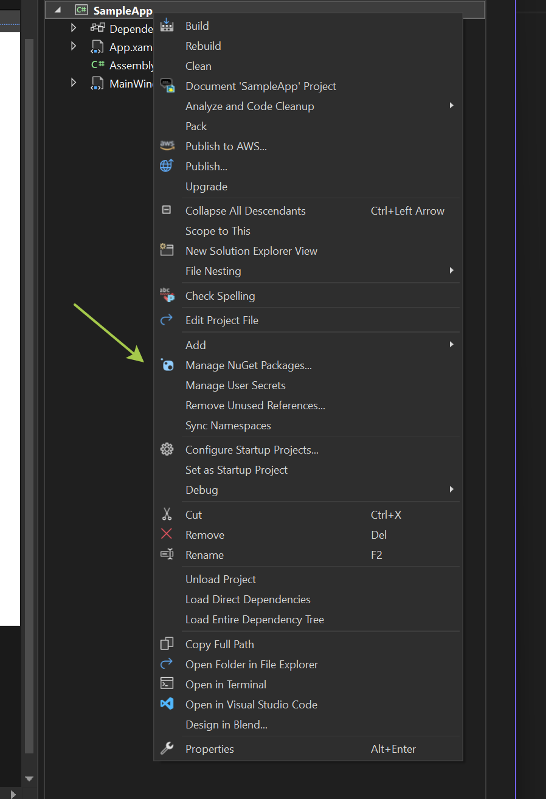

# Comprehensive Guide to Integrating .NET SDKs with Visual Studio

[!badge size="xl" target="blank" variant="info" text="Video Capture SDK .Net"](https://www.visioforge.com/video-capture-sdk-net) [!badge size="xl" target="blank" variant="info" text="Video Edit SDK .Net"](https://www.visioforge.com/video-edit-sdk-net) [!badge size="xl" target="blank" variant="info" text="Media Blocks SDK .Net"](https://www.visioforge.com/media-blocks-sdk-net) [!badge size="xl" target="blank" variant="info" text="Media Player SDK .Net"](https://www.visioforge.com/media-player-sdk-net)

## Introduction to VisioForge .NET SDKs

VisioForge offers a powerful suite of multimedia SDKs for .NET developers, enabling you to build feature-rich applications with advanced video capture, editing, playback, and media processing capabilities. This comprehensive guide will walk you through the process of integrating these SDKs into your Visual Studio projects, ensuring a smooth development experience.

For professional developers working on multimedia applications, properly integrating these SDKs is crucial for optimal performance and functionality. Our recommended approach is to use NuGet packages, which simplifies dependency management and ensures you're always using the latest features and bug fixes.

## Installation Methods Overview

There are two primary methods to install VisioForge .NET SDKs:

1. **NuGet Package Installation** (Recommended): The modern, streamlined approach that handles dependencies automatically and simplifies updates.
2. **Manual Installation**: A traditional approach for specialized scenarios, though generally not recommended for most projects.

We'll cover both methods in detail, but strongly encourage the NuGet approach for most development scenarios.

## NuGet Package Installation (Recommended Method)

NuGet is the package manager for .NET, providing a centralized way to incorporate libraries into your projects without the hassle of manual file management. Here's a detailed walkthrough of integrating VisioForge SDKs using NuGet.

### Step 1: Create or Open Your .NET Project

First, you'll need a WinForms, WPF, or other .NET project. We recommend using the modern SDK-style project format for optimal compatibility.

#### Creating a New Project

1. Launch Visual Studio (2019 or 2022 recommended)
2. Select "Create a new project"
3. Filter templates by "C#" and either "WPF" or "Windows Forms"
4. Choose "WPF Application" or "Windows Forms Application" with the .NET Core/5/6+ framework
5. Ensure you select the modern SDK-style project format (this is the default in newer Visual Studio versions)


#### Configuring the Project

After creating a new project, you'll need to configure basic settings:

1. Enter your project name (use a descriptive name relevant to your application)
2. Choose an appropriate location and solution name
3. Select your target framework (.NET 6 or newer recommended for best performance and features)
4. Click "Create" to generate the project structure


### Step 2: Access NuGet Package Manager

Once your project is open in Visual Studio:

1. Right-click on your project in Solution Explorer
2. Select "Manage NuGet Packages..." from the context menu
3. The NuGet Package Manager will open in the center pane

This interface provides search functionality and package browsing to easily find and install the VisioForge components you need.



### Step 3: Install the UI Package for Your Framework

VisioForge SDKs offer specialized UI components for different .NET frameworks. You'll need to select the appropriate UI package based on your project type.

1. In the NuGet Package Manager, switch to the "Browse" tab
2. Search for "VisioForge.DotNet.Core.UI"
3. Select the appropriate UI package for your project type from the search results


#### Available UI Packages

VisioForge supports a wide range of UI frameworks. Choose the one that matches your project:

- **[VisioForge.DotNet.Core.UI.WinUI](https://www.nuget.org/packages/VisioForge.DotNet.Core.UI.WinUI)**: For modern Windows UI applications
- **[VisioForge.DotNet.Core.UI.MAUI](https://www.nuget.org/packages/VisioForge.DotNet.Core.UI.MAUI)**: For cross-platform applications using .NET MAUI
- **[VisioForge.DotNet.Core.UI.Avalonia](https://www.nuget.org/packages/VisioForge.DotNet.Core.UI.Avalonia)**: For cross-platform desktop applications using Avalonia UI

These UI packages provide the necessary controls and components specifically designed for video rendering and interaction within your chosen framework.

### Step 4: Install the Core SDK Package

After installing the UI package, you'll need to add the main SDK package for your specific multimedia needs:

1. Return to the NuGet Package Manager "Browse" tab
2. Search for the specific VisioForge SDK you need (e.g., "VisioForge.DotNet.VideoCapture")
3. Click "Install" on the appropriate package


#### Available Core SDK Packages

Choose the SDK that aligns with your application's requirements:

- **[VisioForge.DotNet.VideoCapture](https://www.nuget.org/packages/VisioForge.DotNet.VideoCapture)**: For applications that need to capture video from cameras, screen recording, or other sources
- **[VisioForge.DotNet.VideoEdit](https://www.nuget.org/packages/VisioForge.DotNet.VideoEdit)**: For video editing, processing, and conversion applications
- **[VisioForge.DotNet.MediaPlayer](https://www.nuget.org/packages/VisioForge.DotNet.MediaPlayer)**: For creating media players with advanced playback controls
- **[VisioForge.DotNet.MediaBlocks](https://www.nuget.org/packages/VisioForge.DotNet.MediaBlocks)**: For building complex media processing pipelines

Each package includes comprehensive documentation, and you can install multiple packages if your application requires different multimedia capabilities.

### Step 5: Implementing the VideoView Control (Optional)

The VideoView control is crucial for applications that need to display video content. You can add it to your UI using XAML (for WPF) or through the designer (for WinForms).

#### For WPF Applications

Add the required namespace to your XAML file:

```xml
xmlns:wpf="clr-namespace:VisioForge.Core.UI.WPF;assembly=VisioForge.Core"
```

Then add the VideoView control to your layout:

```xml
<wpf:VideoView 
    Width="640" 
    Height="480" 
    Margin="10,10,0,0" 
    HorizontalAlignment="Left" 
    VerticalAlignment="Top"/>
```


The VideoView control will appear in your designer:


#### For WinForms Applications

1. Open the form in designer mode
2. Locate the VisioForge controls in the toolbox (if they don't appear, right-click the toolbox and select "Choose Items...")
3. Drag and drop the VideoView control onto your form
4. Adjust the size and position properties as needed

### Step 6: Install Required Redistribution Packages

Depending on your specific implementation, you may need additional redistribution packages:

1. Return to the NuGet Package Manager
2. Search for "VisioForge.DotNet.Redist" to see available redistribution packages
3. Install the ones relevant to your platform and SDK choice


The required redistribution packages vary based on:

- Target operating system (Windows, macOS, Linux)
- Hardware acceleration requirements
- Specific codecs and formats your application will use
- Backend engine configuration

Consult the specific Deployment documentation page for your selected product to determine which redistribution packages are necessary for your application.

## Manual Installation (Alternative Method)

While we generally don't recommend manual installation due to its complexity and potential for configuration issues, there are specific scenarios where it might be necessary. Follow these steps if NuGet isn't an option for your project:

1. Download the [complete SDK installer](https://files.visioforge.com/trials/visioforge_sdks_installer_dotnet_setup.exe) from our website
2. Run the installer with administrator privileges and follow the on-screen instructions
3. Create your WinForms or WPF project in Visual Studio
4. Add references to the installed SDK libraries:
   - Right-click "References" in Solution Explorer
   - Select "Add Reference"
   - Navigate to the installed SDK location
   - Select the required DLL files
5. Configure the Visual Studio Toolbox:
   - Right-click the Toolbox and select "Add Tab"
   - Name the new tab "VisioForge"
   - Right-click the tab and select "Choose Items..."
   - Browse to the SDK installation directory
   - Select `VisioForge.Core.dll`
6. Drag and drop the VideoView control onto your form or window

This manual approach requires additional configuration for deployment and updates must be managed manually.

## Advanced Configuration and Best Practices

For production applications, consider these additional implementation details:

- **License Management**: Implement proper license validation at application startup
- **Error Handling**: Add comprehensive error handling around SDK initialization and operation
- **Performance Optimization**: Configure hardware acceleration and threading based on your target devices
- **Resource Management**: Implement proper disposal of SDK resources to prevent memory leaks

## Troubleshooting Common Issues

If you encounter problems during installation or implementation:

- Verify your project targets a supported .NET version
- Ensure all required redistributable packages are installed
- Check for NuGet package version compatibility
- Review the SDK documentation for platform-specific requirements

## Conclusion and Next Steps

With the VisioForge .NET SDKs properly installed in your Visual Studio project, you're now ready to leverage their powerful multimedia capabilities. The NuGet installation method ensures you have the correct dependencies and simplifies future updates.

To deepen your understanding and maximize the potential of these SDKs:

- Explore our [comprehensive code samples on GitHub](https://github.com/visioforge/.Net-SDK-s-samples)
- Review the product-specific documentation for advanced features
- Join our developer community forums for support and best practices

By following this guide, you've established a solid foundation for developing sophisticated multimedia applications with VisioForge and Visual Studio.
