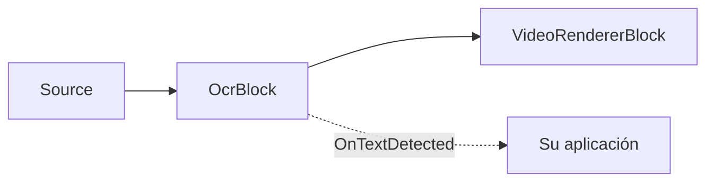
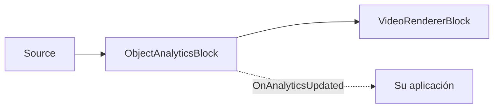

# Bloques IA: OCR, reconocimiento de matrículas y analítica de objetos

El Media Blocks SDK .Net incluye bloques de IA de aprendizaje profundo construidos sobre [ONNX Runtime](https://onnxruntime.ai/)
y los modelos PP-OCR de [PaddleOCR](https://github.com/PaddlePaddle/PaddleOCR). Se ejecutan en la CPU o, cuando
está disponible, en la GPU — DirectML en Windows, CoreML en Apple y CUDA en NVIDIA — y son totalmente
multiplataforma (Windows, Linux, macOS, Android).

Estos bloques residen en el paquete `VisioForge.Core.AI` (`VisioForge.DotNet.Core.AI`) junto con el
[`YOLOObjectDetectorBlock`](../index.md).

## OcrBlock — reconocimiento de texto

`OcrBlock` reconoce texto en cualquier fuente de video o imagen. Internamente ejecuta el pipeline PP-OCR
multietapa — detección de texto (DBNet) → clasificación opcional de ángulo 0°/180° → reconocimiento de líneas de texto
(CRNN/SVTR + decodificación CTC) — en cada fotograma procesado, emite las regiones reconocidas y, opcionalmente,
las dibuja sobre el video.



### Uso

```csharp
using VisioForge.Core.MediaBlocks;
using VisioForge.Core.MediaBlocks.AI;
using VisioForge.Core.Types.X.AI;

var ocrSettings = new OcrSettings(
    detectionModelPath: "ch_PP-OCRv5_mobile_det.onnx",
    recognitionModelPath: "latin_PP-OCRv5_rec_mobile_infer.onnx",
    characterDictionaryPath: "ppocrv5_latin_dict.txt",
    classificationModelPath: "ch_ppocr_mobile_v2.0_cls_infer.onnx")
{
    Provider = OnnxExecutionProvider.Auto, // CPU / CUDA / DirectML / CoreML
    FramesToSkip = 3,                      // ejecutar OCR en uno de cada 4 fotogramas en video en vivo
    DrawResults = true,                    // dibujar cuadros + texto sobre el fotograma
};

var ocr = new OcrBlock(ocrSettings);
ocr.OnTextDetected += (sender, e) =>
{
    foreach (var region in e.Regions)
    {
        Console.WriteLine($"{region.Text} ({region.Confidence:P0}) at {region.BoundingBox}");
    }
};

pipeline.Connect(source.Output, ocr.Input);
pipeline.Connect(ocr.Output, videoRenderer.Input);
```

Cada `OcrTextRegion` contiene el `Text` reconocido, una `Confidence` media (0..1), un
`BoundingBox` alineado con los ejes y el `Polygon` de detección (4 puntos, en píxeles del fotograma de origen).

### Ajustes clave

| Propiedad | Predeterminado | Descripción |
| --- | --- | --- |
| `DetectionModelPath` | — | Modelo ONNX de detección de texto (DBNet). Obligatorio. |
| `RecognitionModelPath` | — | Modelo ONNX de reconocimiento de texto (CRNN/SVTR). Obligatorio. |
| `CharacterDictionaryPath` | — | Diccionario de caracteres del reconocedor; debe coincidir con el idioma del modelo de reconocimiento. Obligatorio. |
| `ClassificationModelPath` | `null` | Clasificador de ángulo 0°/180° opcional. |
| `UseAngleClassifier` | `true` | Aplicar el clasificador de ángulo (requiere `ClassificationModelPath`). |
| `Provider` | `Auto` | Proveedor de ejecución ONNX. |
| `FramesToSkip` | `0` | Fotogramas omitidos entre ejecuciones de OCR. Use un valor distinto de cero para video en vivo. |
| `MaxSideLength` | `1024` | La entrada del detector se limita a esta longitud del lado mayor. |
| `BoxThreshold` / `BoxScoreThreshold` / `UnclipRatio` | `0.3` / `0.5` / `1.6` | Ajuste del detector. |
| `TextScoreThreshold` | `0.5` | Puntuación media mínima de reconocimiento para que se reporte una línea. |
| `DrawResults` | `true` | Dibujar cuadros + texto sobre el fotograma. |

## LicensePlateRecognizerBlock — ANPR / LPR

`LicensePlateRecognizerBlock` lee las matrículas de los vehículos. Ejecuta el mismo pipeline PP-OCR sobre el
fotograma completo y filtra el texto reconocido para quedarse con los candidatos a matrícula según patrón, longitud, confianza
y forma — por lo que **no necesita un modelo de detección de matrículas independiente y sujeto a licencia**.

```csharp
using VisioForge.Core.MediaBlocks.AI;
using VisioForge.Core.Types.X.AI;

var anprSettings = new LicensePlateRecognizerSettings(ocrSettings)
{
    PlatePattern = "^[A-Z0-9]{4,10}$", // regex .NET sobre el candidato normalizado
    MinCharacters = 4,
    MaxCharacters = 10,
    MinConfidence = 0.5f,
    MinAspectRatio = 1.5f,             // las matrículas son más anchas que altas
    DrawResults = true,
};

var anpr = new LicensePlateRecognizerBlock(anprSettings);
anpr.OnPlateRecognized += (sender, e) =>
{
    foreach (var plate in e.Plates)
    {
        Console.WriteLine($"Plate: {plate.Text} ({plate.Confidence:P0})");
    }
};

pipeline.Connect(source.Output, anpr.Input);
pipeline.Connect(anpr.Output, videoRenderer.Input);
```

Para mayor precisión en escenas concurridas, ejecute un detector de matrículas dedicado (por ejemplo, un
[`YOLOObjectDetectorBlock`](../index.md) con un modelo de matrículas bajo licencia Apache/MIT) en la fase previa y suministre
las matrículas recortadas.

## Modelos y licencias

Estos bloques ejecutan modelos ONNX de terceros. Los ejemplos incluyen los modelos **PP-OCRv5 mobile** bajo Apache-2.0
(detección, clasificación de ángulo, reconocimiento latino) y un diccionario latino; los modelos se
distribuyen junto a los ejecutables de ejemplo, no dentro del paquete NuGet. PP-OCR admite más de 100
idiomas — descargue el modelo de reconocimiento y el diccionario correspondientes para otros idiomas.

!!! note "Licencias de los modelos"
    La licencia de un modelo la determina su origen (código de entrenamiento + pesos publicados), no el formato
    ONNX. Verifique la licencia de cualquier modelo — código, pesos y conjunto de datos — antes de distribuirlo. Evite
    modelos con licencia AGPL/GPL (por ejemplo, Ultralytics YOLO) en un producto de código cerrado. Los modelos
    PP-OCR incluidos son Apache-2.0.

## ObjectAnalyticsBlock — seguimiento multiobjeto y línea de cruce (tripwire)

`ObjectAnalyticsBlock` realiza un seguimiento multiobjeto estable (ByteTrack), cruce de líneas de detección dirigidas
(tripwire) y ocupación de zonas poligonales sobre cualquier detector de objetos ONNX compatible (YOLOX, RT-DETR,
YOLOv8). Dibuja superposiciones (cuadros, etiquetas, IDs de seguimiento, trazas, líneas, zonas, contadores) y
emite un evento `OnAnalyticsUpdated` con los objetos rastreados, los eventos de cruce y las instantáneas de zona.



### Uso

```csharp
using SkiaSharp;
using VisioForge.Core.MediaBlocks;
using VisioForge.Core.MediaBlocks.AI;
using VisioForge.Core.Types.Events;
using VisioForge.Core.Types.X.AI;

// Ajustes del detector — reutilice cualquier modelo YOLO compatible.
var detector = new YoloDetectorSettings("yolox_nano.onnx")
{
    Model = ObjectDetectorModel.YOLOX,
    ConfidenceThreshold = 0.25f,
    DrawDetections = false, // El renderizador de analítica dibuja en su lugar.
};

var settings = new ObjectAnalyticsSettings(detector);

// Añadir una línea de cruce (tripwire) dirigida (Start -> End).
settings.Lines.Add(new LineZoneSettings
{
    Id = "door",
    Start = new SKPoint(200, 200),
    End = new SKPoint(400, 200),
    Anchor = DetectionAnchor.BottomCenter, // contacto de los pies
});

// Añadir una zona poligonal.
settings.Zones.Add(new PolygonZoneSettings
{
    Id = "area",
    Points = new[] { new SKPoint(100, 100), new SKPoint(300, 100),
                     new SKPoint(300, 300), new SKPoint(100, 300) },
});

var analytics = new ObjectAnalyticsBlock(settings);
analytics.OnAnalyticsUpdated += (s, e) =>
{
    foreach (var obj in e.Objects)
        Console.WriteLine($"ID #{obj.TrackerId}: {obj.Label} {obj.Confidence:P0}");

    foreach (var c in e.LineCrossings)
        Console.WriteLine($"{c.LineId}: {c.Label}#{c.TrackerId} {c.Direction}");
};
```

El bloque ejecuta la inferencia de forma síncrona en el hilo de streaming del pipeline. Use `FramesToSkip` para reducir
la frecuencia de inferencia. En los fotogramas omitidos solo se dibujan la geometría estática y los contadores — sin
cuadros de objetos obsoletos ni trazas.

La API de analítica en C# puro (`ByteTracker`, `LineZone`, `PolygonZone`, `DetectionFilter`) también está
disponible directamente para usarse sin un pipeline de MediaBlocks.

## Demos

- **YOLO Object Detection Demo** (`_DEMOS/Media Blocks SDK/WPF/CSharp/YOLO Object Detection Demo`) — incluye tanto el modo de detección de objetos como el de analítica de objetos
- **OCR Text Recognition Demo** (`_DEMOS/Media Blocks SDK/WPF/CSharp/OCR Text Recognition Demo`)
- **License Plate Recognition Demo** (`_DEMOS/Media Blocks SDK/WPF/CSharp/License Plate Recognition Demo`)
